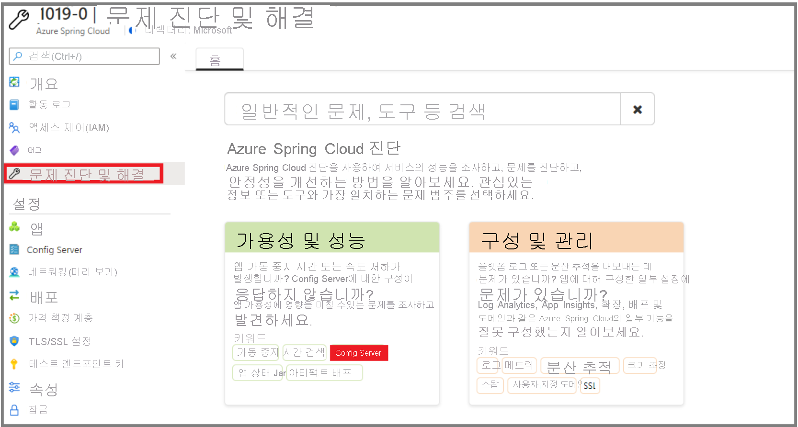

# <a name="quickstart-set-up-azure-spring-cloud-configuration-server"></a>빠른 시작: Azure Spring Cloud 구성 서버 설정

Azure Spring Cloud 구성 서버는 분산 시스템을 위한 중앙 집중식 구성 서비스입니다. 현재 로컬 스토리지, Git 및 Subversion을 지원하는 플러그형 리포지토리 계층을 사용합니다. 이 빠른 시작에서는 Git 리포지토리에서 데이터를 가져오도록 구성 서버를 설정합니다.

::: zone pivot="programming-language-csharp"

## <a name="prerequisites"></a>사전 요구 사항

* 이 시리즈의 이전 빠른 시작을 완료합니다. [Azure Spring Cloud 서비스를 프로비저닝](spring-cloud-quickstart-provision-service-instance.md)합니다.

## <a name="azure-spring-cloud-config-server-procedures"></a>Azure Spring Cloud 구성 서버 절차

다음 명령을 실행하여 프로젝트의 git 리포지토리 위치로 구성 서버를 설정합니다. `<service instance name>`을 앞에서 만든 서비스 이름으로 바꿉니다. 이전 빠른 시작에서 설정한 서비스 인스턴스 이름의 기본값은 이 명령에서 작동하지 않습니다.

```azurecli
az spring-cloud config-server git set -n <service instance name> --uri https://github.com/Azure-Samples/Azure-Spring-Cloud-Samples --search-paths steeltoe-sample/config
```

이 명령은 샘플 앱 리포지토리의 [steeltoe-sample/config](https://github.com/Azure-Samples/Azure-Spring-Cloud-Samples/tree/master/steeltoe-sample/config) 폴더에서 구성 데이터를 찾도록 구성 서버에 지시합니다. 구성 데이터를 가져올 앱의 이름이 `planet-weather-provider`이므로 사용할 파일은 [planet-weather-provider.yml](https://github.com/Azure-Samples/Azure-Spring-Cloud-Samples/blob/master/steeltoe-sample/config/planet-weather-provider.yml)입니다.

::: zone-end

::: zone pivot="programming-language-java"
Azure Spring Cloud 구성 서버는 분산 시스템을 위한 중앙 집중식 구성 서비스입니다. 현재 로컬 스토리지, Git 및 Subversion을 지원하는 플러그형 리포지토리 계층을 사용합니다.  마이크로서비스 앱을 Azure Spring Cloud에 배포하도록 구성 서버를 설정합니다.

## <a name="prerequisites"></a>사전 요구 사항

* [JDK 8 설치](/java/azure/jdk/?preserve-view=true&view=azure-java-stable)
* [Azure 구독에 가입](https://azure.microsoft.com/free/)
* (선택 사항) [Azure CLI 버전 2.0.67 이상을 설치](/cli/azure/install-azure-cli?preserve-view=true&view=azure-cli-latest)하고 `az extension add --name spring-cloud` 명령을 사용하여 Azure Spring Cloud 확장을 설치합니다.
* (선택 사항) [Azure Toolkit for IntelliJ를 설치](https://plugins.jetbrains.com/plugin/8053-azure-toolkit-for-intellij/)하고 [로그인](/azure/developer/java/toolkit-for-intellij/create-hello-world-web-app#installation-and-sign-in)합니다.

## <a name="azure-spring-cloud-config-server-procedures"></a>Azure Spring Cloud 구성 서버 절차

#### <a name="portal"></a>[포털](#tab/Azure-portal)

다음 절차에서는 Azure Portal을 사용하여 [Piggymetrics 샘플](spring-cloud-quickstart-sample-app-introduction.md)을 배포하는 구성 서버를 설정합니다.

1. 서비스 **개요** 페이지로 이동하여 **구성 서버** 를 선택합니다.

2. **기본 리포지토리** 섹션에서 **URI** 를 "https://github.com/Azure-Samples/piggymetrics-config"로 설정합니다.

3. **적용** 을 선택하여 변경 내용을 저장합니다.

    

#### <a name="cli"></a>[CLI](#tab/Azure-CLI)

다음 절차에서는 Azure CLI를 사용하여 [Piggymetrics 샘플](spring-cloud-quickstart-sample-app-introduction.md)을 배포하도록 구성 서버를 설정합니다.

프로젝트의 git 리포지토리 위치로 구성 서버를 설정합니다.

```azurecli
az spring-cloud config-server git set -n <service instance name> --uri https://github.com/Azure-Samples/piggymetrics-config
```
---
::: zone-end

## <a name="troubleshooting-of-azure-spring-cloud-config-server"></a>Azure Spring Cloud 구성 서버 문제 해결

다음 절차에서는 구성 서버 설정 문제를 해결하는 방법을 설명합니다.

1. Azure Portal에서 서비스 **개요** 페이지로 이동하여 **로그** 를 선택합니다. 
1. **쿼리** 를 선택하고 **"오류" 또는 "예외" 용어"가 포함된 애플리케이션 로그 표시** 를 선택합니다. 
1. **실행** 을 클릭합니다. 
1. 로그에서 **java.lang.illegalStateException** 오류가 발견되면 Spring Cloud Service가 구성 서버에서 속성을 찾을 수 없음을 나타냅니다.

    [  ](media/spring-cloud-quickstart-setup-config-server/setup-config-server-query.png)

1. 서비스 **개요** 페이지로 이동합니다.
1. **문제 진단 및 해결** 을 선택합니다. 
1. **Config Server** 감지기를 선택합니다.

    [  ](media/spring-cloud-quickstart-setup-config-server/setup-config-server-diagnose.png)

3. **Config Serve 상태 확인** 을 클릭합니다.

    [  ](media/spring-cloud-quickstart-setup-config-server/setup-config-server-genie.png)

4. **Config Server 상태** 를 클릭하여 감지기에서 자세한 정보를 확인합니다.

    [  ](media/spring-cloud-quickstart-setup-config-server/setup-config-server-health-status.png)

## <a name="next-steps"></a>다음 단계

이 빠른 시작에서는 구독에 남아있는 경우 요금이 계속 청구되는 Azure 리소스를 만들었습니다. 다음 빠른 시작을 계속 진행하지 않으려는 경우 [리소스 정리](spring-cloud-quickstart-logs-metrics-tracing.md#clean-up-resources)를 참조하세요. 그렇지 않으면 다음 빠른 시작으로 이동하세요.

> [!div class="nextstepaction"]
> [앱 빌드 및 배포](spring-cloud-quickstart-deploy-apps.md)