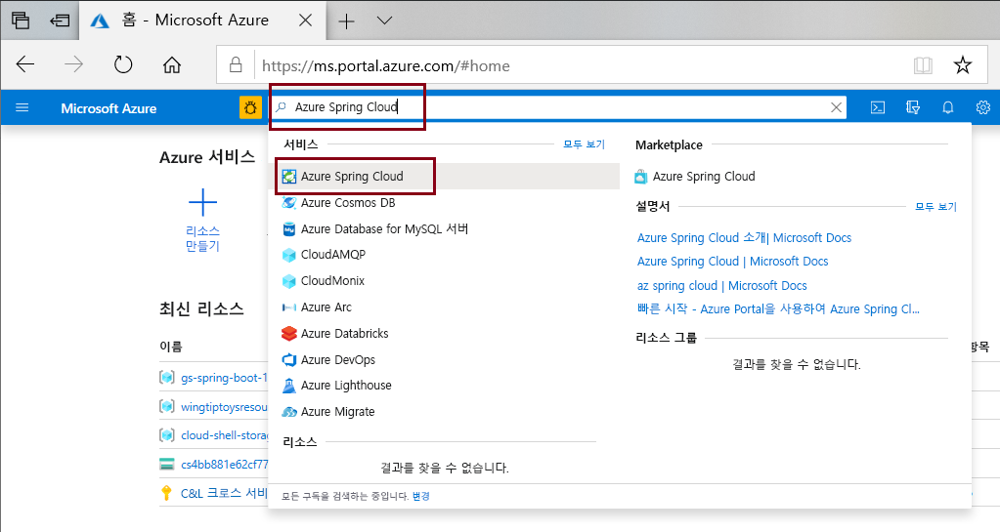
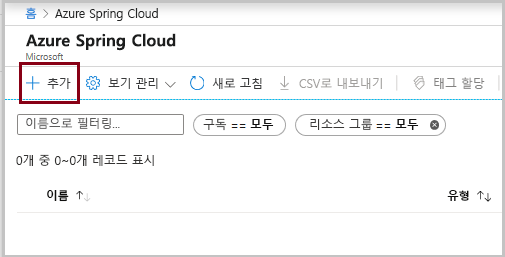
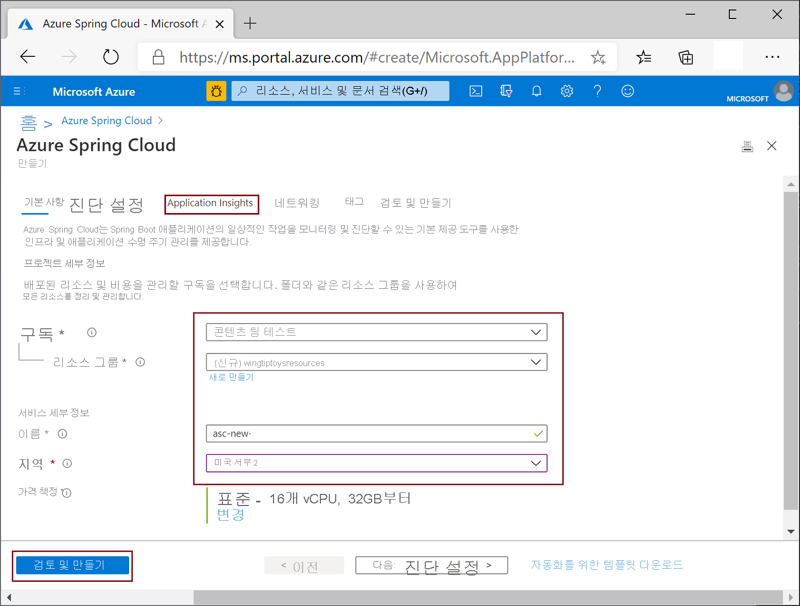

# <a name="quickstart-deploy-your-first-azure-spring-cloud-application"></a>빠른 시작: 첫 번째 Azure Spring Cloud 애플리케이션 배포

::: zone pivot="programming-language-csharp"
이 빠른 시작에서는 Azure에서 실행되는 간단한 Azure Spring Cloud 마이크로서비스 애플리케이션을 배포하는 방법을 설명합니다.

>[!NOTE]
> Azure Spring Cloud에 대한 Steeltoe 지원은 현재 공개 미리 보기로 제공됩니다. 퍼블릭 미리 보기 제품을 통해 고객은 공식 릴리스 전에 새로운 기능을 시험해 볼 수 있습니다.  퍼블릭 미리 보기 기능 및 서비스는 프로덕션 용도로 사용되지 않습니다.  미리 보기 동안 제공되는 지원에 대한 자세한 내용은 [FAQ](https://azure.microsoft.com/support/faq/)를 참조하거나 [지원 요청](https://docs.microsoft.com/azure/azure-portal/supportability/how-to-create-azure-support-request)을 제출하세요.

이 빠른 시작을 통해 다음을 수행하는 방법을 알아봅니다.

> [!div class="checklist"]
> * 기본 Steeltoe .NET Core 프로젝트 생성
> * Azure Spring Cloud 서비스 인스턴스 프로비저닝
> * 퍼블릭 엔드포인트를 사용하여 앱 빌드 및 배포
> * 실시간으로 로그 스트리밍

이 빠른 시작에서 사용되는 애플리케이션 코드는 .NET Core 웹 API 프로젝트 템플릿을 사용하여 빌드된 간단한 앱입니다. 이 예제가 완료되면 애플리케이션에서 온라인으로 액세스할 수 있고 Azure Portal 및 Azure CLI를 통해 관리할 수 있습니다.

## <a name="prerequisites"></a>사전 요구 사항

* 활성 구독이 있는 Azure 계정. [체험 계정을 만듭니다](https://azure.microsoft.com/free/?WT.mc_id=A261C142F).
* [.NET Core 3.1 SDK](https://dotnet.microsoft.com/download/dotnet-core/3.1). Azure Spring Cloud 서비스는 .NET Core 3.1 이상 버전을 지원합니다.
* [Azure CLI 버전 2.0.67 이상](https://docs.microsoft.com/cli/azure/install-azure-cli?view=azure-cli-latest&preserve-view=true)
* [Git](https://git-scm.com/)

## <a name="install-azure-cli-extension"></a>Azure CLI 확장 설치

Azure CLI 버전이 2.0.67 이상인지 확인합니다.

```azurecli
az --version
```

다음 명령을 사용하여 Azure CLI용 Azure Spring Cloud 확장을 설치합니다.

```azurecli
az extension add --name spring-cloud
```

## <a name="log-in-to-azure"></a>Azure에 로그인

1. Azure CLI에 로그인합니다.

    ```azurecli
    az login
    ```

1. 둘 이상의 구독이 있는 경우 이 빠른 시작에 사용하려는 구독을 선택합니다.

   ```azurecli
   az account list -o table
   ```

   ```azurecli
   az account set --subscription <Name or ID of a subscription from the last step>
   ```

## <a name="generate-a-steeltoe-net-core-project"></a>Steeltoe .NET Core 프로젝트 생성

Visual Studio에서 API 프로젝트 템플릿을 사용하여 "hello-world"라는 ASP.NET Core 웹 애플리케이션을 만듭니다. 나중에 테스트 엔드포인트가 되는 WeatherForecastController가 자동으로 생성됩니다.

1. 프로젝트 소스 코드에 대한 폴더를 만들고 프로젝트를 생성합니다.
 
   ```console
   mkdir source-code
   ```

   ```console
   cd source-code
   ```

   ```dotnetcli
   dotnet new webapi -n hello-world --framework netcoreapp3.1
   ```

1. 프로젝트 디렉터리로 이동합니다.

   ```console
   cd hello-world
   ```

1. *appSettings.json*  파일을 편집하여 다음 설정을 추가합니다.

   ```json
   "spring": {
     "application": {
       "name": "hello-world"
     }
   },
   "eureka": {
     "client": {
       "shouldFetchRegistry": true,
       "shouldRegisterWithEureka": true
     }
   }
   ```

1. *appsettings.json*에서 `Microsoft` 범주의 로그 수준도 `Warning`에서 `Information`으로 변경합니다. 이렇게 변경하면 이후 단계에서 스트리밍 로그를 볼 때 로그가 생성됩니다.

   이제 *appsettings.json* 파일은 다음 예제와 비슷합니다.

   ```json
   {
     "Logging": {
       "LogLevel": {
         "Default": "Information",
         "Microsoft": "Information",
         "Microsoft.Hosting.Lifetime": "Information"
       }
     },
     "AllowedHosts": "*",
     "spring": {
       "application": {
         "name": "hello-world"
       }
     },
     "eureka": {
       "client": {
         "shouldFetchRegistry": true,
         "shouldRegisterWithEureka": true
       }
     }
   }
   ```
   
1. 종속성 및 `Zip` 작업을 *.csproj* 파일에 추가합니다.

   ```xml
   <ItemGroup>
     <PackageReference Include="Steeltoe.Discovery.ClientCore" Version="2.4.4" />
     <PackageReference Include="Microsoft.Azure.SpringCloud.Client" Version="1.0.0-preview.1" />
   </ItemGroup>
   <Target Name="Publish-Zip" AfterTargets="Publish">
       <ZipDirectory SourceDirectory="$(PublishDir)" DestinationFile="$(MSBuildProjectDirectory)/deploy.zip" Overwrite="true" />
   </Target>
   ```

   이 패키지는 Steeltoe 서비스 검색 및 Azure Spring Cloud 클라이언트 라이브러리를 위한 것입니다. `Zip` 작업은 Azure로 배포하기 위한 것입니다. `dotnet publish` 명령을 실행하면 이진 파일이 *publish* 폴더에 생성되고, 이 작업은 *publish* 폴더를 Azure에 업로드하는 *.zip* 파일로 압축합니다.

3. *Program.cs* 파일에서 Azure Spring Cloud 클라이언트 라이브러리를 사용하는 `using` 지시문과 코드를 추가합니다.

   ```csharp
   using Microsoft.Azure.SpringCloud.Client;
   ```

   ```csharp
   public static IHostBuilder CreateHostBuilder(string[] args) =>
               Host.CreateDefaultBuilder(args)
                   .ConfigureWebHostDefaults(webBuilder =>
                   {
                       webBuilder.UseStartup<Startup>();
                   })
                   .UseAzureSpringCloudService();
   ```

4. *Startup.cs* 파일에서 Steeltoe 서비스 검색을 사용하는 `using` 지시문과 코드를 `ConfigureServices` 및 `Configure` 메서드의 끝에 추가합니다.

   ```csharp
   using Steeltoe.Discovery.Client;
   ```

   ```csharp
   public void ConfigureServices(IServiceCollection services)
   {
       // Template code not shown.

       services.AddDiscoveryClient(Configuration);
   }
   ```

   ```csharp
   public void Configure(IApplicationBuilder app, IWebHostEnvironment env)
   {
       // Template code not shown.

       app.UseDiscoveryClient();
   }
   ```

1. 프로젝트를 빌드하여 컴파일 오류가 없는지 확인합니다.

   ```dotnetcli
   dotnet build
   ```
 
## <a name="provision-a-service-instance"></a>서비스 인스턴스 프로비저닝

다음 절차에서는 Azure Portal을 사용하여 Azure Spring Cloud의 인스턴스를 만듭니다.

1. [Azure Portal](https://ms.portal.azure.com/)을 엽니다. 

1. 상단 검색 상자에서 *Azure Spring Cloud*를 검색합니다.

1. 결과에서 *Azure Spring Cloud*를 선택합니다.

   

1. Azure Spring Cloud 페이지에서 **+ 추가**를 선택합니다.

   

1. Azure Spring Cloud **만들기** 페이지에 있는 양식을 채웁니다.  다음 지침을 고려하세요.

   * **구독**: 이 리소스 대한 요금이 청구될 구독을 선택합니다.
   * **리소스 그룹**: 새 리소스 그룹을 만듭니다. 여기에 입력하는 이름은 이후 단계에서 **\<resource group name\>** 으로 사용됩니다.
   * **서비스 세부 정보/이름**: **\<service instance name\>** 을 지정합니다.  이름은 4-32자 사이여야 하며, 소문자, 숫자 및 하이픈(-) 문자만 포함할 수 있습니다.  서비스 이름의 첫 글자는 문자여야 하며 마지막 문자는 문자 또는 숫자여야 합니다.
   * **지역**: 서비스 인스턴스에 대한 지역을 선택합니다.

   

6. **검토 및 만들기**를 선택합니다.

## <a name="build-and-deploy-the-app"></a>앱 빌드 및 배포

다음 절차에서는 이전에 만든 프로젝트를 빌드하고 배포합니다.

1. 명령 프롬프트가 프로젝트 폴더에 아직 있는지 확인합니다.

1. 다음 명령을 실행하여 프로젝트를 빌드하고, 이진 파일을 게시하고, 이진 파일을 프로젝트 폴더의 *.zip* 파일에 저장합니다.

   ```dotnetcorecli
   dotnet publish -c release -o ./publish
   ```

1. 할당된 퍼블릭 엔드포인트를 사용하여 Azure Spring Cloud 인스턴스에서 앱을 만듭니다. *appsettings.json*에서 지정한 것과 동일한 "hello-world"라는 애플리케이션 이름을 사용합니다.

   ```console
   az spring-cloud app create -n hello-world -s <service instance name> -g <resource group name> --is-public
   ```

1. *.zip* 파일을 앱에 배포합니다.

   ```azurecli
   az spring-cloud app deploy -n hello-world -s <service instance name> -g <resource group name> --runtime-version NetCore_31 --main-entry hello-world.dll --artifact-path ./deploy.zip
   ```

   `--main-entry` 옵션은 애플리케이션의 진입점이 포함된 *.dll* 파일을 식별합니다. 서비스에서 *.zip* 파일이 업로드되면 모든 파일과 폴더를 추출하고, `--main-entry`에서 지정한 *.dll* 파일의 진입점을 실행하려고 시도합니다.

   애플리케이션 배포를 완료하는 데 몇 분이 걸립니다. 배포되었는지 확인하려면 Azure Portal의 **앱** 블레이드로 이동합니다.

## <a name="test-the-app"></a>앱 테스트

배포가 완료되면 다음 URL에서 앱에 액세스합니다.

```http
https://<service instance name>-hello-world.azuremicroservices.io/weatherforecast
```

앱에서 다음 예제와 비슷한 JSON 데이터를 반환합니다.

```json
[{"date":"2020-09-08T21:01:50.0198835+00:00","temperatureC":14,"temperatureF":57,"summary":"Bracing"},{"date":"2020-09-09T21:01:50.0200697+00:00","temperatureC":-14,"temperatureF":7,"summary":"Bracing"},{"date":"2020-09-10T21:01:50.0200715+00:00","temperatureC":27,"temperatureF":80,"summary":"Freezing"},{"date":"2020-09-11T21:01:50.0200717+00:00","temperatureC":18,"temperatureF":64,"summary":"Chilly"},{"date":"2020-09-12T21:01:50.0200719+00:00","temperatureC":16,"temperatureF":60,"summary":"Chilly"}]
```

## <a name="stream-logs-in-real-time"></a>실시간으로 로그 스트리밍

다음 명령을 사용하여 앱에서 실시간 로그를 가져옵니다.

```azurecli
az spring-cloud app logs -n hello-world -s <service instance name> -g <resource group name> --lines 100 -f
```

로그가 결과에 표시됩니다.

```output
[Azure Spring Cloud] The following environment variables are loaded:
2020-09-08 20:58:42,432 INFO supervisord started with pid 1
2020-09-08 20:58:43,435 INFO spawned: 'event-gather_00' with pid 9
2020-09-08 20:58:43,436 INFO spawned: 'dotnet-app_00' with pid 10
2020-09-08 20:58:43 [Warning] No managed processes are running. Wait for 30 seconds...
2020-09-08 20:58:44,843 INFO success: event-gather_00 entered RUNNING state, process has stayed up for > than 1 seconds (startsecs)
2020-09-08 20:58:44,843 INFO success: dotnet-app_00 entered RUNNING state, process has stayed up for > than 1 seconds (startsecs)
←[40m←[32minfo←[39m←[22m←[49m: Steeltoe.Discovery.Eureka.DiscoveryClient[0]
      Starting HeartBeat
info: Microsoft.Hosting.Lifetime[0]
      Now listening on: http://[::]:1025
info: Microsoft.Hosting.Lifetime[0]
      Application started. Press Ctrl+C to shut down.
info: Microsoft.Hosting.Lifetime[0]
      Hosting environment: Production
info: Microsoft.Hosting.Lifetime[0]
      Content root path: /netcorepublish/6e4db42a-b160-4b83-a771-c91adec18c60
2020-09-08 21:00:13 [Information] [10] Start listening...
info: Microsoft.AspNetCore.Hosting.Diagnostics[1]
      Request starting HTTP/1.1 GET http://asc-svc-hello-world.azuremicroservices.io/weatherforecast
info: Microsoft.AspNetCore.Routing.EndpointMiddleware[0]
      Executing endpoint 'hello_world.Controllers.WeatherForecastController.Get (hello-world)'
info: Microsoft.AspNetCore.Mvc.Infrastructure.ControllerActionInvoker[3]
      Route matched with {action = "Get", controller = "WeatherForecast"}. Executing controller action with signature System.Collections.Generic.IEnumerable`1[hello_world.WeatherForecast] Get() on controller hello_world.Controllers.WeatherForecastController (hello-world).
info: Microsoft.AspNetCore.Mvc.Infrastructure.ObjectResultExecutor[1]
      Executing ObjectResult, writing value of type 'hello_world.WeatherForecast[]'.
info: Microsoft.AspNetCore.Mvc.Infrastructure.ControllerActionInvoker[2]
      Executed action hello_world.Controllers.WeatherForecastController.Get (hello-world) in 1.8902ms
info: Microsoft.AspNetCore.Routing.EndpointMiddleware[1]
      Executed endpoint 'hello_world.Controllers.WeatherForecastController.Get (hello-world)'
info: Microsoft.AspNetCore.Hosting.Diagnostics[2]
      Request finished in 4.2591ms 200 application/json; charset=utf-8
```

> [!TIP]
> `az spring-cloud app logs -h`를 사용하여 더 많은 매개 변수 및 로그 스트림 기능을 탐색합니다.

고급 로그 분석 기능의 경우 [Azure Portal](https://portal.azure.com/) 메뉴에서 **로그** 탭을 방문하세요. 여기에서 로그의 대기 시간은 몇 분입니다.
[  ](media/spring-cloud-quickstart-java/logs-analytics.png#lightbox)
::: zone-end

::: zone pivot="programming-language-java"
이 빠른 시작에서는 Azure에서 실행되는 간단한 Azure Spring Cloud 마이크로서비스 애플리케이션을 배포하는 방법을 설명합니다. 

이 자습서에서 사용되는 애플리케이션 코드는 Spring Initializr로 빌드된 간단한 앱입니다. 이 예제를 완료하면 애플리케이션에 온라인으로 액세스할 수 있고 Azure Portal을 통해 관리할 수 있습니다.

이 빠른 시작에서는 다음을 수행하는 방법을 설명합니다.

> [!div class="checklist"]
> * 기본 Spring Cloud 프로젝트 생성
> * 서비스 인스턴스 프로비저닝
> * 퍼블릭 엔드포인트를 사용하여 앱 빌드 및 배포
> * 실시간으로 로그 스트리밍

## <a name="prerequisites"></a>사전 요구 사항

이 빠른 시작을 완료하려면 다음이 필요합니다.

* [JDK 8 설치](https://docs.microsoft.com/java/azure/jdk/?view=azure-java-stable&preserve-view=true)
* [Azure 구독에 가입](https://azure.microsoft.com/free/)
* (선택 사항) [Azure CLI 버전 2.0.67 이상을 설치](https://docs.microsoft.com/cli/azure/install-azure-cli?view=azure-cli-latest&preserve-view=true)하고 다음 명령을 사용하여 Azure Spring Cloud 확장을 설치합니다. `az extension add --name spring-cloud`
* (선택 사항) [Azure Toolkit for IntelliJ를 설치](https://plugins.jetbrains.com/plugin/8053-azure-toolkit-for-intellij/)하고 [로그인](https://docs.microsoft.com/azure/developer/java/toolkit-for-intellij/create-hello-world-web-app#installation-and-sign-in)합니다.

## <a name="generate-a-spring-cloud-project"></a>Spring Cloud 프로젝트 생성

[Spring Initializr](https://start.spring.io/#!type=maven-project&language=java&platformVersion=2.3.3.RELEASE&packaging=jar&jvmVersion=1.8&groupId=com.example&artifactId=hellospring&name=hellospring&description=Demo%20project%20for%20Spring%20Boot&packageName=com.example.hellospring&dependencies=web,cloud-eureka,actuator,cloud-starter-sleuth,cloud-starter-zipkin)를 시작하여 Azure Spring Cloud의 권장 종속성이 있는 샘플 프로젝트를 생성합니다. 다음 그림은 이 샘플 프로젝트에 대해 설정된 Initializr를 보여 줍니다.
```url
https://start.spring.io/#!type=maven-project&language=java&platformVersion=2.3.3.RELEASE&packaging=jar&jvmVersion=1.8&groupId=com.example&artifactId=hellospring&name=hellospring&description=Demo%20project%20for%20Spring%20Boot&packageName=com.example.hellospring&dependencies=web,cloud-eureka,actuator,cloud-starter-sleuth,cloud-starter-zipkin
```

  

1. 모든 종속성이 설정된 경우 **생성**을 클릭합니다. 패키지를 다운로드하고 압축을 푼 다음, 다음과 같이 `src/main/java/com/example/hellospring/HelloController.java`를 추가하여 간단한 웹 애플리케이션에 대한 웹 컨트롤러를 만듭니다.

    ```java
    package com.example.hellospring;
    
    import org.springframework.web.bind.annotation.RestController;
    import org.springframework.web.bind.annotation.RequestMapping;
    
    @RestController
    public class HelloController {
    
        @RequestMapping("/")
        public String index() {
            return "Greetings from Azure Spring Cloud!";
        }
    
    }
    ```
## <a name="provision-an-instance-of-azure-spring-cloud"></a>Azure Spring Cloud의 인스턴스 프로비저닝

다음 절차에서는 Azure Portal을 사용하여 Azure Spring Cloud의 인스턴스를 만듭니다.

1. 새 탭에서 [Azure Portal](https://ms.portal.azure.com/)을 엽니다. 

2. 상단 검색 상자에서 *Azure Spring Cloud*를 검색합니다.

3. 결과에서 *Azure Spring Cloud*를 선택합니다.

    

4. Azure Spring Cloud 페이지에서 **+ 추가**를 클릭합니다.

    

5. Azure Spring Cloud **만들기** 페이지에 있는 양식을 채웁니다.  다음 지침을 고려하세요.
    - **구독**: 이 리소스 대한 요금이 청구될 구독을 선택합니다.
    - **리소스 그룹**: 새 리소스에 대한 리소스 그룹을 새로 만드는 것이 가장 좋습니다. 이는 **\<resource group name\>** 으로 이후 단계에서 사용됩니다.
    - **서비스 세부 정보/이름**: **\<service instance name\>** 을 지정합니다.  이름은 4-32자 사이여야 하며, 소문자, 숫자 및 하이픈(-) 문자만 포함할 수 있습니다.  서비스 이름의 첫 글자는 문자여야 하며 마지막 문자는 문자 또는 숫자여야 합니다.
    - **위치**: 서비스 인스턴스에 대한 지역을 선택합니다.

    

6. **검토 + 만들기**를 클릭합니다.

## <a name="build-and-deploy-the-app"></a>앱 빌드 및 배포
    
#### <a name="cli"></a>[CLI](#tab/Azure-CLI)
다음 절차에서는 Azure CLI를 사용하여 애플리케이션을 작성하고 배포합니다. 프로젝트의 루트에서 다음 명령을 실행합니다.

1. Maven을 사용하여 프로젝트를 빌드합니다.

    ```console
    mvn clean package -DskipTests
    ```

1. (아직 설치하지 않은 경우) Azure CLI용 Azure Spring Cloud 확장을 설치합니다.

    ```azurecli
    az extension add --name spring-cloud
    ```
    
1. 퍼블릭 엔드포인트가 할당된 앱을 만듭니다.

    ```azurecli
    az spring-cloud app create -n hellospring -s <service instance name> -g <resource group name> --is-public
    ```

1. 앱에 대한 Jar 파일을 배포합니다.

    ```azurecli
    az spring-cloud app deploy -n hellospring -s <service instance name> -g <resource group name> --jar-path target\hellospring-0.0.1-SNAPSHOT.jar
    ```
    
1. 애플리케이션 배포를 완료하는 데 몇 분이 걸립니다. 배포되었는지 확인하려면 Azure Portal의 **앱** 블레이드로 이동합니다. 애플리케이션의 상태가 표시되어야 합니다.

#### <a name="intellij"></a>[IntelliJ](#tab/IntelliJ)

다음 절차에서는 Azure Spring Cloud의 IntelliJ 플러그 인을 사용하여 IntelliJ IDEA에 샘플 앱을 배포합니다.  

### <a name="import-project"></a>프로젝트 가져오기

1. IntelliJ **시작** 대화 상자를 열고, **프로젝트 가져오기**를 선택하여 가져오기 마법사를 엽니다.
1. `hellospring` 폴더를 선택합니다.

    

### <a name="deploy-the-app"></a>앱 배포
Azure에 배포하려면 Azure 계정으로 로그인하고 구독을 선택해야 합니다.  로그인 세부 정보는 [설치 및 로그인](https://docs.microsoft.com/azure/developer/java/toolkit-for-intellij/create-hello-world-web-app#installation-and-sign-in)을 참조하세요.

1. IntelliJ 프로젝트 탐색기에서 프로젝트를 마우스 오른쪽 단추로 클릭하고 **Azure** -> **Azure Spring Cloud에 배포**를 선택합니다.

    [  ](media/spring-cloud-quickstart-java/intellij-deploy-azure-1.png#lightbox)

1. **이름** 필드에서 앱 이름을 적용합니다. **이름**은 앱 이름이 아니라 구성을 나타냅니다. 사용자는 일반적으로 변경할 필요가 없습니다.
1. **Artifact** 텍스트 상자에서 *hellospring-0.0.1-SNAPSHOT.jar*을 선택합니다.
1. **구독** 텍스트 상자에서 구독을 확인합니다.
1. **Spring Cloud** 텍스트 상자에서 [Azure Spring Cloud 인스턴스 프로비저닝](https://docs.microsoft.com/azure/spring-cloud/spring-cloud-quickstart-provision-service-instance)에서 만든 Azure Spring Cloud의 인스턴스를 선택합니다.
1. **퍼블릭 엔드포인트**를 *사용*으로 설정합니다.
1. **App:** 텍스트 상자에서 **앱 만들기...** 를 선택합니다.
1. *hellospring*을 입력한 다음, **확인**을 클릭합니다.

    [  ](media/spring-cloud-quickstart-java/intellij-deploy-to-azure.png#lightbox)

1. **Azure Spring Cloud 앱 배포** 대화 상자 아래쪽에 있는 **실행** 단추를 클릭하여 배포를 시작합니다. 플러그 인은 `hellospring` 앱에서 `mvn package` 명령을 실행하고 `package` 명령으로 생성된 jar을 배포합니다.
---

배포가 완료되면 `https://<service instance name>-hellospring.azuremicroservices.io/`에서 앱에 액세스할 수 있습니다.

  [  ](media/spring-cloud-quickstart-java/access-app-browser.png#lightbox)

## <a name="streaming-logs-in-real-time"></a>실시간으로 로그 스트리밍

#### <a name="cli"></a>[CLI](#tab/Azure-CLI)

다음 명령을 사용하여 앱에서 실시간 로그를 가져옵니다.

```azurecli
az spring-cloud app logs -n hellospring -s <service instance name> -g <resource group name> --lines 100 -f

```
로그는 결과에 표시됩니다.

[  ](media/spring-cloud-quickstart-java/streaming-logs.png#lightbox)

>[!TIP]
> `az spring-cloud app logs -h`를 사용하여 더 많은 매개 변수 및 로그 스트림 기능을 탐색합니다.

#### <a name="intellij"></a>[IntelliJ](#tab/IntelliJ)

1. **Azure Explorer**를 선택한 다음, **Spring Cloud**를 선택합니다.
1. 실행 중인 앱을 마우스 오른쪽 단추로 클릭합니다.
1. 드롭다운 목록에서 **스트리밍 로그**를 선택합니다.
1. 인스턴스를 선택합니다.

    [  ](media/spring-cloud-quickstart-java/intellij-get-streaming-logs.png)

1. 스트리밍 로그는 출력 창에 표시됩니다.

    [  ](media/spring-cloud-quickstart-java/intellij-streaming-logs-output.png)
---

고급 로그 분석 기능은 [Azure Portal](https://portal.azure.com/) 메뉴에서 **로그** 탭을 방문하세요. 여기에서 로그의 대기 시간은 몇 분입니다.

[  ](media/spring-cloud-quickstart-java/logs-analytics.png#lightbox)
::: zone-end

## <a name="clean-up-resources"></a>리소스 정리

이전 단계에서는 구독에 남아 있는 동안 요금이 계속 청구되는 Azure 리소스를 만들었습니다. 나중에 이러한 리소스가 필요하지 않을 경우 리소스 그룹을 포털에서 삭제하거나 Azure CLI에서 다음 명령을 실행하여 삭제합니다.

```azurecli
az group delete --name <your resource group name; for example: hellospring-1558400876966-rg> --yes
```

## <a name="next-steps"></a>다음 단계

이 빠른 시작에서는 다음과 같은 방법을 배웠습니다.

> [!div class="checklist"]
> * 기본 Azure Spring Cloud 프로젝트 생성
> * 서비스 인스턴스 프로비저닝
> * 퍼블릭 엔드포인트를 사용하여 앱 빌드 및 배포
> * 실시간으로 로그 스트리밍

더 많은 Azure Spring 기능을 사용하는 방법을 알아보려면 샘플 애플리케이션을 Azure Spring Cloud에 배포하는 빠른 시작 시리즈로 계속 진행하세요.

> [!div class="nextstepaction"]
> [마이크로서비스 빌드 및 실행](spring-cloud-quickstart-sample-app-introduction.md)

GitHub에서 더 많은 샘플을 사용할 수 있습니다. [Azure Spring Cloud 샘플](https://github.com/Azure-Samples/Azure-Spring-Cloud-Samples).
