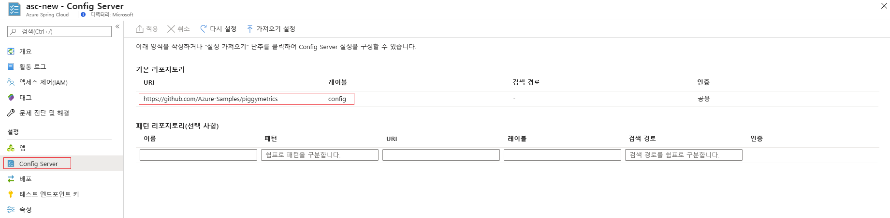

# <a name="set-up-a-spring-cloud-config-server-instance-for-your-service"></a>서비스용 Spring Cloud Config 서버 인스턴스 설정

이 문서는 ✔️ Java ✔️ C **에 적용 됩니다.** #

이 문서에서는 Spring Cloud Config 서버 인스턴스를 Azure Spring Cloud 서비스에 연결하는 방법을 보여 줍니다.

Spring Cloud Config는 분산 시스템에서 구체화된 구성에 대한 서버 및 클라이언트 쪽 지원을 제공합니다. Config 서버 인스턴스를 사용하면 모든 환경에서 애플리케이션에 대한 외부 속성을 관리할 수 있는 중앙 위치가 있습니다. 자세한 내용은 [Spring Cloud Config 서버 참고 자료](https://spring.io/projects/spring-cloud-config)를 참조하세요.

## <a name="prerequisites"></a>필수 구성 요소
* Azure 구독 Azure 구독이 아직 없는 경우 시작하기 전에 [체험 계정](https://azure.microsoft.com/free/?WT.mc_id=A261C142F)을 만듭니다. 
* 이미 프로비저닝되어 실행되는 Azure Spring Cloud 서비스. Azure Spring Cloud 서비스를 설정하고 시작하려면 [빠른 시작: Azure CLI를 사용하여 Java Spring 애플리케이션 시작](spring-cloud-quickstart.md)을 참조하세요.

## <a name="restriction"></a>제한

Git 백 엔드에서 Config 서버를 사용하는 경우 몇 가지 제한 사항이 있습니다. Config 서버 및 서비스 검색에 액세스하기 위해 일부 속성이 애플리케이션 환경에 자동으로 삽입됩니다. 또한 Config 서버 파일에서 이러한 속성을 구성하면 충돌 및 예기치 않은 동작이 발생할 수 있습니다. 속성은 다음과 같습니다. 

```yaml
eureka.client.service-url.defaultZone
eureka.client.tls.keystore
server.port
spring.cloud.config.tls.keystore
spring.application.name
spring.jmx.enabled
```

> [!CAUTION]
> 위의 속성을 Config 서버 애플리케이션 파일에 배치하지 _않는_ 것이 좋습니다.

## <a name="create-your-config-server-files"></a>Config 서버 파일 만들기

Azure Spring Cloud는 Config 서버 파일을 저장하기 위해 Azure DevOps, GitHub, GitLab 및 Bitbucket을 지원합니다. 리포지토리가 준비되면 다음 지침에 따라 구성 파일을 만들어 이 리포지토리에 저장합니다.

또한 일부 구성 가능한 속성은 특정 유형에서만 사용할 수 있습니다. 다음 하위 섹션에는 각 리포지토리 유형의 속성이 나와 있습니다.

### <a name="public-repository"></a>퍼블릭 리포지토리

퍼블릭 리포지토리를 사용하는 경우 구성 가능한 속성이 더욱 제한됩니다.

퍼블릭 Git 리포지토리를 설정하는 데 사용되는 모든 구성 가능한 속성은 다음 표에 나와 있습니다.

> [!NOTE]
> 현재 지원되는 유일한 명명 규칙은 하이픈(-)을 사용하여 단어를 구분하는 것입니다. 예를 들어 *default-label*은 사용할 수 있지만, *defaultLabel*은 사용할 수 없습니다.

| 속성        | 필수 | 기능                                                      |
| :-------------- | -------- | ------------------------------------------------------------ |
| `uri`           | 예    | Config 서버 백 엔드로 사용되는 Git 리포지토리의 URI는 *http://* , *https://* , *git@* 또는 *ssh://* 로 시작합니다. |
| `default-label` | 예     | Git 리포지토리의 기본 레이블은 리포지토리의 *분기 이름*, *태그 이름* 또는 *commit-id*여야 합니다. |
| `search-paths`  | 예     | Git 리포지토리의 하위 디렉터리를 검색하는 데 사용되는 문자열 배열입니다. |

------

### <a name="private-repository-with-ssh-authentication"></a>SSH 인증을 사용하는 프라이빗 리포지토리

SSH를 사용하는 프라이빗 Git 리포지토리를 설정하는 데 사용되는 모든 구성 가능한 속성은 다음 표에 나와 있습니다.

> [!NOTE]
> 현재 지원되는 유일한 명명 규칙은 하이픈(-)을 사용하여 단어를 구분하는 것입니다. 예를 들어 *default-label*은 사용할 수 있지만, *defaultLabel*은 사용할 수 없습니다.

| 속성                   | 필수 | 기능                                                      |
| :------------------------- | -------- | ------------------------------------------------------------ |
| `uri`                      | 예    | Config 서버 백 엔드로 사용되는 Git 리포지토리의 URI는 *http://* , *https://* , *git@* 또는 *ssh://* 로 시작해야 합니다. |
| `default-label`            | 예     | Git 리포지토리의 기본 레이블은 리포지토리의 *분기 이름*, *태그 이름* 또는 *commit-id*여야 합니다. |
| `search-paths`             | 예     | Git 리포지토리의 하위 디렉터리를 검색하는 데 사용되는 문자열 배열입니다. |
| `private-key`              | 예     | Git 리포지토리에 액세스하기 위한 SSH 프라이빗 키이며, URI가 *git@* 또는 *ssh://* 로 시작하는 경우에 _필요합니다_. |
| `host-key`                 | 예     | Git 리포지토리 서버의 호스트 키이며, `host-key-algorithm`에 포함된 알고리즘 접두사를 포함하지 않아야 합니다. |
| `host-key-algorithm`       | 예     | 호스트 키 알고리즘은 *ssh-dss*, *ssh-rsa*, *ecdsa-sha2-nistp256*, *ecdsa-sha2-nistp384* 또는 *ecdsa-sha2-nistp521*이어야 합니다. `host-key`가 있는 경우에만 *필요합니다*. |
| `strict-host-key-checking` | 예     | 프라이빗 `host-key`를 활용하는 경우 Config 서버 인스턴스가 시작되지 않는지 여부를 나타냅니다. *true*(기본값) 또는 *false*여야 합니다. |

-----

### <a name="private-repository-with-basic-authentication"></a>기본 인증을 사용하는 프라이빗 리포지토리

기본 인증을 사용하는 프라이빗 Git 리포지토리를 설정하는 데 사용되는 모든 구성 가능한 속성은 아래에 나와 있습니다.

> [!NOTE]
> 현재 지원되는 유일한 명명 규칙은 하이픈(-)을 사용하여 단어를 구분하는 것입니다. 예를 들어 *default-label*은 사용할 수 있지만, *defaultLabel*은 사용할 수 없습니다.

| 속성        | 필수 | 기능                                                      |
| :-------------- | -------- | ------------------------------------------------------------ |
| `uri`           | 예    | Config 서버 백 엔드로 사용되는 Git 리포지토리의 URI는 *http://* , *https://* , *git@* 또는 *ssh://* 로 시작해야 합니다. |
| `default-label` | 예     | Git 리포지토리의 기본 레이블은 리포지토리의 *분기 이름*, *태그 이름* 또는 *commit-id*여야 합니다. |
| `search-paths`  | 예     | Git 리포지토리의 하위 디렉터리를 검색하는 데 사용되는 문자열 배열입니다. |
| `username`      | 예     | Git 리포지토리 서버에 액세스하는 데 사용되는 사용자 이름이며, Git 리포지토리 서버에서 `Http Basic Authentication`을 지원하는 경우에 _필요합니다_. |
| `password`      | 예     | Git 리포지토리 서버에 액세스하는 데 사용되는 암호이며, Git 리포지토리 서버에서 `Http Basic Authentication`을 지원하는 경우에 _필요합니다_. |

> [!NOTE]
> 많은 `Git` 리포지토리 서버에서는 암호 대신 토큰을 HTTP 기본 인증에 사용하도록 지원합니다. GitHub와 같은 일부 리포지토리는 토큰을 무기한으로 유지할 수 있도록 허용합니다. 그러나 Azure DevOps를 비롯한 일부 Git 리포지토리 서버는 몇 시간 안에 토큰을 강제로 만료시킵니다. 토큰이 만료되는 리포지토리는 Azure Spring Cloud에서 토큰 기반 인증을 사용하면 안 됩니다.

### <a name="git-repositories-with-pattern"></a>패턴을 사용하는 Git 리포지토리

패턴을 사용하는 Git 리포지토리를 설정하는 데 사용되는 모든 구성 가능한 속성은 아래에 나와 있습니다.

> [!NOTE]
> 현재 지원되는 유일한 명명 규칙은 하이픈(-)을 사용하여 단어를 구분하는 것입니다. 예를 들어 *default-label*은 사용할 수 있지만, *defaultLabel*은 사용할 수 없습니다.

| 속성                           | 필수         | 기능                                                      |
| :--------------------------------- | ---------------- | ------------------------------------------------------------ |
| `repos`                            | 예             | 지정된 이름이 있는 Git 리포지토리의 설정으로 구성된 맵입니다. |
| `repos."uri"`                      | `repos`가 있는 경우 예 | Config 서버 백 엔드로 사용되는 Git 리포지토리의 URI는 *http://* , *https://* , *git@* 또는 *ssh://* 로 시작해야 합니다. |
| `repos."name"`                     | `repos`가 있는 경우 예 | Git 리포지토리를 식별하는 이름이며, `repos`가 있는 경우에만 _필요합니다_. 예를 들어 *team-A*, *team-B*입니다. |
| `repos."pattern"`                  | 예             | 애플리케이션 이름을 매칭하는 데 사용되는 문자열 배열입니다. 각 패턴의 경우 와일드 카드가 포함된 `{application}/{profile}` 형식을 사용합니다. |
| `repos."default-label"`            | 예             | Git 리포지토리의 기본 레이블은 리포지토리의 *분기 이름*, *태그 이름* 또는 *commit-id*여야 합니다. |
| `repos."search-paths`"             | 예             | Git 리포지토리의 하위 디렉터리를 검색하는 데 사용되는 문자열 배열입니다. |
| `repos."username"`                 | 예             | Git 리포지토리 서버에 액세스하는 데 사용되는 사용자 이름이며, Git 리포지토리 서버에서 `Http Basic Authentication`을 지원하는 경우에 _필요합니다_. |
| `repos."password"`                 | 예             | Git 리포지토리 서버에 액세스하는 데 사용되는 암호이며, Git 리포지토리 서버에서 `Http Basic Authentication`을 지원하는 경우에 _필요합니다_. |
| `repos."private-key"`              | 예             | Git 리포지토리에 액세스하기 위한 SSH 프라이빗 키이며, URI가 *git@* 또는 *ssh://* 로 시작하는 경우에 _필요합니다_. |
| `repos."host-key"`                 | 예             | Git 리포지토리 서버의 호스트 키이며, `host-key-algorithm`에 포함된 알고리즘 접두사를 포함하지 않아야 합니다. |
| `repos."host-key-algorithm"`       | 예             | 호스트 키 알고리즘은 *ssh-dss*, *ssh-rsa*, *ecdsa-sha2-nistp256*, *ecdsa-sha2-nistp384* 또는 *ecdsa-sha2-nistp521*이어야 합니다. `host-key`가 있는 경우에만 *필요합니다*. |
| `repos."strict-host-key-checking"` | 예             | 프라이빗 `host-key`를 활용하는 경우 Config 서버 인스턴스가 시작되지 않는지 여부를 나타냅니다. *true*(기본값) 또는 *false*여야 합니다. |

## <a name="attach-your-config-server-repository-to-azure-spring-cloud"></a>Azure Spring Cloud에 Config 서버 리포지토리 연결

이제 구성 파일이 리포지토리에 저장되었으므로 Azure Spring Cloud를 연결해야 합니다.

1. [Azure Portal](https://portal.azure.com)에 로그인합니다.

1. Azure Spring Cloud **개요** 페이지로 이동합니다.

1. 구성할 서비스를 선택합니다.

1. 서비스 페이지에 있는 왼쪽 창의 **설정** 아래에서 **Config 서버** 탭을 선택합니다.



### <a name="enter-repository-information-directly-to-the-azure-portal"></a>Azure Portal에 리포지토리 정보 직접 입력

#### <a name="default-repository"></a>기본 리포지토리

* **퍼블릭 리포지토리**: **기본 리포지토리** 섹션의 **Uri** 상자에서 리포지토리 URI를 붙여넣습니다.  **레이블**을 **config**로 설정합니다. **인증** 설정이 **퍼블릭**인지 확인한 다음, **적용**을 선택하여 완료합니다. 

* **프라이빗 리포지토리**: Azure Spring Cloud는 기본 암호/토큰 기반 인증 및 SSH를 지원합니다.

    * **기본 인증**: **기본 리포지토리** 섹션의 **Uri** 상자에서 리포지토리 URI를 붙여넣은 다음, **인증**("연필" 아이콘) 단추를 선택합니다. **인증 편집** 창의 **인증 유형** 드롭다운 목록에서 **HTTP Basic**을 선택한 다음, 사용자 이름과 암호/토큰을 입력하여 Azure Spring Cloud에 대한 액세스 권한을 부여합니다. **확인**을 선택한 다음, **적용**을 클릭하여 Config 서버 인스턴스 설정을 완료합니다.

    
    
    > [!CAUTION]
    > 일부 리포지토리 서버(예: GitHub)에서는 암호와 같은 *personal-token* 또는 *access-token*을 **기본 인증**에 사용합니다. 이러한 종류의 토큰은 만료되지 않으므로 Azure Spring Cloud에서 암호로 사용할 수 있습니다. 그러나 다른 Git 리포지토리 서버(예: Bitbucket 및 Azure DevOps)의 경우 *access-token*은 1~2시간 후에 만료됩니다. 즉, Azure Spring Cloud에서 이러한 리포지토리 서버를 사용하는 경우에는 이 옵션을 사용할 수 없습니다.

    * **SSH**: **기본 리포지토리** 섹션의 **Uri** 상자에서 리포지토리 URI를 붙여넣은 다음, **인증**("연필" 아이콘) 단추를 선택합니다. **인증 편집** 창의 **인증 유형** 드롭다운 목록에서 **SSH**를 선택한 다음, **프라이빗 키**를 입력합니다. 필요에 따라 **호스트 키** 및 **호스트 키 알고리즘**을 지정합니다. Config 서버 리포지토리에 공개 키를 포함해야 합니다. **확인**을 선택한 다음, **적용**을 클릭하여 Config 서버 인스턴스 설정을 완료합니다.

    

#### <a name="pattern-repository"></a>패턴 리포지토리

선택 사항인 **패턴 리포지토리**를 사용하여 서비스를 구성하려면 **기본 리포지토리**와 같은 방법으로 **URI** 및 **인증**을 지정합니다. 패턴에 대한 **이름**을 포함한 다음, **적용**을 선택하여 인스턴스에 연결해야 합니다. 

### <a name="enter-repository-information-into-a-yaml-file"></a>YAML 파일에 리포지토리 정보 입력

리포지토리 설정을 사용하여 YAML 파일을 작성한 경우 파일을 로컬 머신에서 Azure Spring Cloud로 직접 가져올 수 있습니다. 기본 인증을 사용하는 프라이빗 리포지토리의 간단한 YAML 파일은 다음과 같습니다.

```yaml
spring:
    cloud:
        config:
            server:
                git:
                    uri: https://github.com/azure-spring-cloud-samples/config-server-repository.git
                    username: <username>
                    password: <password/token>

```

**설정 가져오기** 단추를 선택한 다음, 프로젝트 디렉터리에서 YAML 파일을 선택합니다. **가져오기**를 선택합니다. 그러면 **알림**에서 `async` 작업이 팝업됩니다. 1-2분 후 성공 여부가 보고됩니다.


YAML 파일의 정보가 Azure Portal에 표시됩니다. **적용**을 선택하여 완료합니다. 

## <a name="using-azure-repos-for-azure-spring-cloud-configuration"></a>Azure 스프링 클라우드 구성에 Azure Repos 사용

Azure 스프링 클라우드는 공용, SSH로 보호 또는 HTTP 기본 인증을 사용 하 여 보호 되는 Git 리포지토리에 액세스할 수 있습니다. Azure Repos를 사용 하 여 쉽게 만들고 관리할 수 있으므로 해당 마지막 옵션을 사용 합니다.

### <a name="get-repo-url-and-credentials"></a>리포지토리 url 및 자격 증명 가져오기
1. 프로젝트에 대 한 Azure Repos 포털에서 "복제" 단추를 클릭 합니다.

    

1. 텍스트 상자에서 클론 URL을 복사 합니다. 이 URL은 일반적으로 다음과 같은 형식입니다.

    ```Text
    https://<organization name>@dev.azure.com/<organization name>/<project name>/_git/<repository name>
    ```

    을 포함 하 여 전후 모든 항목 `https://` `dev.azure.com` 을 제거 `@` 합니다. 결과 URL의 형식은 다음과 같아야 합니다.

    ```Text
    https://dev.azure.com/<organization name>/<project name>/_git/<repository name>
    ```

    다음 섹션에서 사용 하기 위해이 URL을 저장 합니다.

1. "Git 자격 증명 생성"을 클릭 합니다. 사용자 이름 및 암호가 표시 됩니다. 다음 섹션에서 사용 하기 위해 저장 합니다.


### <a name="configure-azure-spring-cloud-to-access-the-git-repository"></a>Git 리포지토리에 액세스하도록 Azure Spring Cloud 구성

1. [Azure Portal](https://portal.azure.com)에 로그인합니다.

1. Azure Spring Cloud **개요** 페이지로 이동합니다.

1. 구성할 서비스를 선택합니다.

1. 서비스 페이지의 왼쪽 창에 있는 **설정**에서 **구성 서버** 탭을 선택 합니다. 이전에 만든 리포지토리를 구성 합니다.
   - 이전 섹션에서 저장 한 리포지토리 URL 추가
   - 설정을 클릭 하 고 다음을 선택 합니다. `Authentication``HTTP Basic`
   - __사용자 이름은__ 이전 섹션에서 저장 한 사용자 이름입니다.
   - __암호__ 는 이전 섹션에서 저장 한 암호입니다.
   - "적용"을 클릭 하 고 작업이 성공할 때까지 기다립니다.

   

## <a name="delete-your-app-configuration"></a>앱 구성 삭제

구성 파일이 저장되면 **구성** 탭에 **앱 구성 삭제** 단추가 표시됩니다. 이 단추를 선택하면 기존 설정이 완전히 지워집니다. GitHub에서 Azure DevOps로 이동하는 것처럼 Config 서버 인스턴스를 다른 원본에 연결하려면 이 단추를 선택해야 합니다.


## <a name="next-steps"></a>다음 단계

이 문서에서는 Spring Cloud Config Server 인스턴스를 사용하도록 설정하고 구성하는 방법을 알아보았습니다. 애플리케이션을 관리하는 방법에 대한 자세한 내용은 [Azure Spring Cloud의 애플리케이션 크기 조정](spring-cloud-tutorial-scale-manual.md)을 참조하세요.
