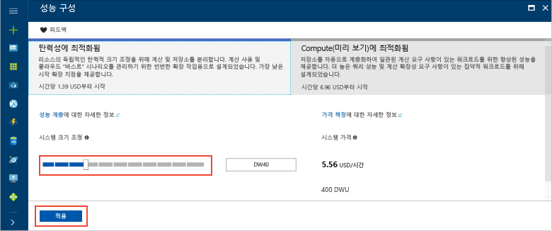
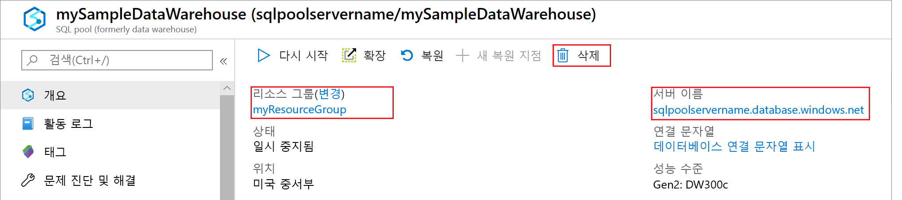

# <a name="tutorial-load-data-to-azure-sql-data-warehouse"></a>자습서: Azure SQL Data Warehouse에 데이터 로드

이 자습서에서는 PolyBase를 사용하여 WideWorldImportersDW 데이터 웨어하우스를 Azure Blob Storage에서 Azure SQL Data Warehouse로 로드합니다. 이 자습서에서는 [Azure Portal](https://portal.azure.com) 및 SSMS([SQL Server Management Studio](/sql/ssms/download-sql-server-management-studio-ssms))를 사용합니다. 

> [!div class="checklist"]
> * Azure Portal에서 데이터 웨어하우스 만들기
> * Azure Portal에서 서버 수준 방화벽 규칙 설정
> * SSMS로 데이터 웨어하우스에 연결
> * 데이터 로드용으로 지정된 사용자 만들기
> * Azure Blob을 데이터 원본으로 사용하는 외부 테이블 만들기
> * CTAS T-SQL 문을 사용하여 데이터 웨어하우스로 데이터 로드
> * 로드될 때 데이터의 진행 상태 확인
> * Date 차원 및 Sales 팩트 테이블에서 연도 데이터 생성
> * 새로 로드한 데이터에 대한 통계 만들기

Azure 구독이 아직 없는 경우 시작하기 전에 [체험](https://azure.microsoft.com/free/) 계정을 만듭니다.

## <a name="before-you-begin"></a>시작하기 전에

이 자습서를 시작하기 전에 최신 버전의 SSMS([SQL Server Management Studio](/sql/ssms/download-sql-server-management-studio-ssms))를 다운로드하여 설치합니다.


## <a name="log-in-to-the-azure-portal"></a>Azure Portal에 로그인

[Azure Portal](https://portal.azure.com/)에 로그인합니다.

## <a name="create-a-blank-sql-data-warehouse"></a>빈 SQL Data Warehouse 만들기

Azure SQL Database가 정의된 [계산 리소스](memory-and-concurrency-limits.md)를 사용하여 만들어집니다. 데이터베이스는 [Azure 리소스 그룹](../azure-resource-manager/resource-group-overview.md) 및 [Azure SQL 논리 서버](../sql-database/sql-database-features.md)에서 만들어집니다. 

빈 SQL Data Database를 만들려면 다음 단계를 수행합니다. 

1. Azure Portal의 왼쪽 위 모서리에서 **리소스 만들기**를 클릭합니다.

2. **새로 만들기** 페이지에서 **데이터베이스**를 선택하고 **새로 만들기**페이지의 **추천**에서 **SQL Data Warehouse**를 선택합니다.

    

3. 다음 정보로 SQL Data Warehouse 양식을 작성합니다.   

   | 설정 | 제안 값 | 설명 | 
   | ------- | --------------- | ----------- | 
   | **데이터베이스 이름** | SampleDW | 유효한 데이터베이스 이름은 [데이터베이스 식별자](/sql/relational-databases/databases/database-identifiers)를 참조하세요. | 
   | **구독** | 사용자의 구독  | 구독에 대한 자세한 내용은 [구독](https://account.windowsazure.com/Subscriptions)을 참조하세요. |
   | **리소스 그룹** | SampleRG | 유효한 리소스 그룹 이름은 [명명 규칙 및 제한 사항](https://docs.microsoft.com/azure/architecture/best-practices/naming-conventions)을 참조하세요. |
   | **원본 선택** | 빈 데이터베이스 | 빈 데이터베이스를 만들려면 지정합니다. 데이터 웨어하우스는 데이터베이스의 한 종류입니다.|

    

4. **서버**를 클릭하여 새 데이터베이스에 새 서버를 만들고 구성합니다. 다음 정보로 **새 서버 양식**을 작성합니다. 

    | 설정 | 제안 값 | Description | 
    | ------- | --------------- | ----------- |
    | **서버 이름** | 전역적으로 고유한 이름 | 유효한 서버 이름은 [명명 규칙 및 제한 사항](https://docs.microsoft.com/azure/architecture/best-practices/naming-conventions)을 참조하세요. | 
    | **서버 관리자 로그인** | 모든 유효한 이름 | 유효한 로그인 이름은 [데이터베이스 식별자](https://docs.microsoft.com/sql/relational-databases/databases/database-identifiers)를 참조하세요.|
    | **암호** | 유효한 암호 | 암호는 8자 이상이어야 하며 대문자, 소문자, 숫자 및 영숫자가 아닌 문자 범주 중 세 가지 범주의 문자를 포함해야 합니다. |
    | **위치**: | 모든 유효한 위치 | 지역에 대한 자세한 내용은 [Azure 지역](https://azure.microsoft.com/regions/)을 참조하세요. |

    

5. **선택**을 클릭합니다.

6. **성능 계층**을 클릭하여 데이터 웨어하우스가 탄력성 또는 계산 중에서 어떤 측면에 맞춰 최적화될지와 데이터 웨어하우스 단위 수를 지정합니다. 

7. 이 자습서의 경우 **탄력성에 최적화됨** 서비스 계층을 선택합니다. 기본적으로 슬라이더는 **DW400**으로 설정되어 있습니다.  위아래로 이동하면서 작동 방식을 확인하세요. 

    

8. **적용**을 클릭합니다.
9. SQL Data Warehouse 페이지에서 빈 데이터베이스에 대해 **데이터 정렬**을 선택합니다. 이 자습서에서는 기본 포트를 사용합니다. 데이터 정렬에 대한 자세한 내용은 [데이터 정렬](/sql/t-sql/statements/collations)을 참조하세요.

11. 이제 SQL Database 양식을 완료했으므로 **만들기**를 클릭하여 데이터베이스를 프로비전합니다. 프로비전하는 데 몇 분이 걸립니다. 

    

12. 도구 모음에서 **알림**을 클릭하여 배포 프로세스를 모니터링합니다.
    
     

## <a name="create-a-server-level-firewall-rule"></a>서버 수준 방화벽 규칙 만들기

SQL Data Warehouse 서비스는 외부 애플리케이션 및 도구가 서버 또는 서버의 데이터베이스에 연결되지 않도록 방지하는 서버 수준에 방화벽을 만듭니다. 연결을 사용하려면 특정 IP 주소에 대한 연결을 사용하도록 설정하는 방화벽 규칙을 추가할 수 있습니다.  다음 단계에 따라 클라이언트의 IP 주소에 대해 [서버 수준 방화벽 규칙](../sql-database/sql-database-firewall-configure.md)을 만듭니다. 

> [!NOTE]
> SQL Data Warehouse는 포트 1433을 통해 통신합니다. 회사 네트워크 내에서 연결하려는 경우 포트 1433을 통한 아웃바운드 트래픽이 네트워크 방화벽에서 허용되지 않을 수 있습니다. 이 경우 IT 부서에서 포트 1433을 열지 않으면 Azure SQL Database 서버에 연결할 수 없습니다.
>

1. 배포가 완료되면 왼쪽 메뉴에서 **SQL 데이터베이스**를 클릭한 다음, **SQL 데이터베이스** 페이지에서 **SampleDW**를 클릭합니다. 데이터베이스에 대한 개요 페이지가 열리고, 정규화된 서버 이름(예: **sample-svr.database.windows.net**)을 표시하고, 추가 구성 옵션을 제공합니다. 

2. 후속 빠른 시작에서 서버 및 해당 데이터베이스에 연결하는 데 사용하기 위해 이 정규화된 서버 이름을 복사합니다. 서버 설정을 열려면 서버 이름을 클릭합니다.

     

3. 서버 설정을 열려면 서버 이름을 클릭합니다.

     

5. **방화벽 설정 표시**를 클릭합니다. SQL Database 서버에 대한 **방화벽 설정** 페이지가 열립니다. 

     

4.  현재 IP 주소를 새 방화벽 규칙에 추가하려면 도구 모음에서 **클라이언트 IP 추가**를 클릭합니다. 방화벽 규칙은 단일 IP 주소 또는 IP 주소의 범위에 1433 포트를 열 수 있습니다.

5. **저장**을 클릭합니다. 논리 서버의 1433 포트를 여는 현재 IP 주소에 서버 수준 방화벽 규칙이 생성됩니다.

6. **확인**을 클릭한 후 **방화벽 설정** 페이지를 닫습니다.

이제 이 IP 주소를 사용하여 SQL 서버 및 해당 데이터 웨어하우스에 연결할 수 있습니다. SQL Server Management Studio 또는 원하는 다른 도구에서 연결이 제대로 작동합니다. 연결할 때 이전에 만든 serveradmin 계정을 사용합니다.  

> [!IMPORTANT]
> SQL Database 방화벽을 통한 액세스는 기본적으로 모든 Azure 서비스에 대해 사용됩니다. 이 페이지에서 **꺼짐**을 클릭한 다음 **저장**을 클릭하여 모든 Azure 서비스에 대한 방화벽을 사용하지 않도록 설정합니다.

## <a name="get-the-fully-qualified-server-name"></a>정규화된 서버 이름 확인

Azure Portal에서 SQL 서버의 정규화된 서버 이름을 확인합니다. 나중에 서버에 연결할 때 이 정규화된 이름을 사용합니다.

1. [Azure Portal](https://portal.azure.com/)에 로그인합니다.
2. 왼쪽 메뉴에서 **SQL Database**를 선택하고 **SQL Database** 페이지에서 데이터베이스를 클릭합니다. 
3. 데이터베이스의 경우 Azure Portal의 **Essentials** 창에서 **서버 이름**을 찾고 복사합니다. 이 예제에서 정규화된 이름은 mynewserver-20171113.database.windows.net입니다. 

      

## <a name="connect-to-the-server-as-server-admin"></a>서버 관리자 권한으로 서버에 연결

이 섹션에서는 SSMS([SQL Server Management Studio](/sql/ssms/download-sql-server-management-studio-ssms))를 사용하여 Azure SQL 서버에 연결합니다.

1. SQL Server Management Studio를 엽니다.

2. **서버에 연결** 대화 상자에서 다음 정보를 입력합니다.

    | 설정      | 제안 값 | 설명 | 
    | ------------ | --------------- | ----------- | 
    | 서버 유형 | 데이터베이스 엔진 | 이 값은 필수입니다. |
    | 서버 이름 | 정규화된 서버 이름 | 예를 들어 **sample-svr.database.windows.net**은 정규화된 서버 이름입니다. |
    | Authentication | 공개 | SQL 인증은 이 자습서에서 구성되어 있는 유일한 인증 유형입니다. |
    | 로그인 | 서버 관리자 계정 | 서버를 만들 때 지정한 계정입니다. |
    | 암호 | 서버 관리자 계정의 암호 | 서버를 만들 때 지정한 암호입니다. |

    

4. **Connect**를 클릭합니다. SSMS에서 개체 탐색기 창이 열립니다. 

5. 개체 탐색기에서 **데이터베이스**를 확장합니다. 그런 후 **시스템 데이터베이스** 및 **master**를 확장하여 master 데이터베이스의 개체를 표시합니다.  **mySampleDatabase**를 확장하여 새 데이터베이스의 개체를 표시합니다.

     

## <a name="create-a-user-for-loading-data"></a>데이터를 로드하기 위한 사용자 만들기

서버 관리자 계정은 관리 작업을 수행하며 사용자 데이터에 대해 쿼리를 실행하는 데는 적합하지 않습니다. 데이터 로드는 메모리를 많이 사용하는 작업입니다. 메모리 최대값은 사용하는 SQL Data Warehouse 생성, [데이터 웨어하우스 단위](what-is-a-data-warehouse-unit-dwu-cdwu.md) 및 [리소스 클래스](resource-classes-for-workload-management.md)에 따라 정의됩니다. 

데이터 로드 전용 로그인 및 사용자를 만드는 것이 좋습니다. 그런 후 로드 사용자를 [리소스 클래스](resource-classes-for-workload-management.md)에 추가하여 적절한 최대 메모리가 할당되도록 합니다.

현재 서버 관리자로서 연결되어 있으므로 로그인 및 사용자를 만들 수 있습니다. 다음 단계를 사용하여 **LoaderRC60**이라는 로그인 및 사용자를 만듭니다. 그런 다음, 해당 사용자를 **staticrc60** 리소스 클래스에 할당합니다. 

1.  SSMS에서 **master**를 마우스 오른쪽 단추로 클릭하여 드롭다운 메뉴를 표시하고 **새 쿼리**를 선택합니다. 새 쿼리 창이 열립니다.

    

2. 쿼리 창에서 다음 T-SQL 명령을 입력하여 LoaderRC60이라는 로그인 및 사용자를 만들고, 'a123STRONGpassword!'를 사용자 고유의 암호로 바꿉니다. 

    ```sql
    CREATE LOGIN LoaderRC60 WITH PASSWORD = 'a123STRONGpassword!';
    CREATE USER LoaderRC60 FOR LOGIN LoaderRC60;
    ```

3. **실행**을 클릭합니다.

4. **SampleDW**를 마우스 오른쪽 단추로 클릭하고 **새 쿼리**를 선택합니다. 새 쿼리 창이 열립니다.  

    
 
5. 다음 T-SQL 명령을 입력하여 LoaderRC60 로그인에 대해 LoaderRC60이라는 데이터베이스 사용자를 만듭니다. 두 번째 줄은 새 데이터 웨어하우스에 대한 제어 권한을 새 사용자에게 부여합니다.  이러한 권한 부여은 해당 사용자를 데이터베이스의 소유자로 만드는 것과 비슷합니다. 세 번째 줄에서는 새 사용자를 staticrc60 [리소스 클래스](resource-classes-for-workload-management.md)의 구성원으로 추가합니다.

    ```sql
    CREATE USER LoaderRC60 FOR LOGIN LoaderRC60;
    GRANT CONTROL ON DATABASE::[SampleDW] to LoaderRC60;
    EXEC sp_addrolemember 'staticrc60', 'LoaderRC60';
    ```

6. **실행**을 클릭합니다.

## <a name="connect-to-the-server-as-the-loading-user"></a>로드 사용자 권한으로 서버에 연결

데이터를 로드하는 첫 번째 단계는 LoaderRC60으로 로그인하는 것입니다.  

1. 개체 탐색기에서 **연결** 드롭다운 메뉴를 클릭하고 **데이터베이스 엔진**을 선택합니다. **서버에 연결** 대화 상자가 표시됩니다.

    

2. 정규화된 서버 이름을 입력하고, **LoaderRC60**을 로그인으로 입력합니다.  LoaderRC60에 대한 암호를 입력합니다.

3. **Connect**를 클릭합니다.

4. 연결이 준비되면 개체 탐색기에서 2개의 서버 연결이 표시됩니다. 하나는 ServerAdmin 권한으로 연결되고, 다른 하나는 LoaderRC60 권한으로 연결되었습니다.

    

## <a name="create-external-tables-and-objects"></a>외부 테이블 및 개체 만들기

새 데이터 웨어하우스로 데이터를 로드하는 프로세스를 시작할 준비가 되었습니다. 나중에 참조하기 위해 데이터를 Azure Blob Storage로 가져오거나 원본에서 SQL Data Warehouse로 직접 로드하는 방법을 알아보려면 [로드 개요](sql-data-warehouse-overview-load.md)를 참조하세요.

다음 SQL 스크립트를 실행하여 로드하려는 데이터에 대한 정보를 지정합니다. 이 정보에는 데이터가 있는 위치, 데이터 콘텐츠 형식 및 데이터에 대한 테이블 정의가 포함됩니다. 데이터는 공용 Azure Blob에 있습니다.

1. 이전 섹션에서는 LoaderRC60 권한으로 데이터 웨어하우스에 로그인했습니다. SSMS의 LoaderRC60 연결 아래에서 **SampleDW**를 마우스 오른쪽 단추로 클릭하고 **새 쿼리**를 선택합니다.  새 쿼리 창이 표시됩니다. 

    

2. 쿼리 창을 이전 이미지와 비교합니다.  새 쿼리 창이 LoaderRC60 권한으로 실행되고 있으며 SampleDW 데이터베이스에서 쿼리를 수행하고 있는지 확인합니다. 이 쿼리 창을 사용하여 모든 로드 단계를 수행합니다.

3. SampleDW 데이터베이스에 대한 마스터 키를 만듭니다. 데이터베이스마다 한 번씩 마스터 키를 만들기만 하면 됩니다. 

    ```sql
    CREATE MASTER KEY;
    ```

4. 다음 [CREATE EXTERNAL DATA SOURCE](/sql/t-sql/statements/create-external-data-source-transact-sql) 문을 실행하여 Azure Blob의 위치를 정의합니다. 외부 택시 데이터의 위치입니다.  쿼리 창에 추가한 명령을 실행하려면 실행하려는 명령을 강조 표시하고 **실행**을 클릭합니다.

    ```sql
    CREATE EXTERNAL DATA SOURCE WWIStorage
    WITH
    (
        TYPE = Hadoop,
        LOCATION = 'wasbs://wideworldimporters@sqldwholdata.blob.core.windows.net'
    );
    ```

5. 다음 [CREATE EXTERNAL FILE FORMAT](/sql/t-sql/statements/create-external-file-format-transact-sql) T-SQL 문을 실행하여 외부 데이터 파일에 대한 서식 특성 및 옵션을 지정합니다. 이 명령문은 외부 데이터는 텍스트로 저장되고 값은 파이프('|') 문자로 구분됨을 지정합니다.  

    ```sql
    CREATE EXTERNAL FILE FORMAT TextFileFormat 
    WITH 
    (   
        FORMAT_TYPE = DELIMITEDTEXT,
        FORMAT_OPTIONS
        (   
            FIELD_TERMINATOR = '|',
            USE_TYPE_DEFAULT = FALSE 
        )
    );
    ```

6.  다음 [CREATE SCHEMA](/sql/t-sql/statements/create-schema-transact-sql) 문을 실행하여 외부 파일 형식에 대한 스키마를 만듭니다. ext 스키마는 만들려는 외부 테이블을 구성하는 방법을 제공합니다. wwi 스키마는 데이터를 포함할 표준 테이블을 구성합니다. 

    ```sql
    CREATE SCHEMA ext;
    GO
    CREATE SCHEMA wwi;
    ```

7. 외부 테이블을 만듭니다. 테이블 정의는 SQL Data Warehouse에 저장되지만 테이블은 Azure Blob Storage에 저장된 데이터를 참조합니다. 다음 T-SQL 명령을 실행하여 이전에 외부 데이터 원본에서 정의한 Azure Blob을 모두 가리키는 여러 개의 외부 테이블을 만듭니다.

    ```sql
    CREATE EXTERNAL TABLE [ext].[dimension_City](
        [City Key] [int] NOT NULL,
        [WWI City ID] [int] NOT NULL,
        [City] [nvarchar](50) NOT NULL,
        [State Province] [nvarchar](50) NOT NULL,
        [Country] [nvarchar](60) NOT NULL,
        [Continent] [nvarchar](30) NOT NULL,
        [Sales Territory] [nvarchar](50) NOT NULL,
        [Region] [nvarchar](30) NOT NULL,
        [Subregion] [nvarchar](30) NOT NULL,
        [Location] [nvarchar](76) NULL,
        [Latest Recorded Population] [bigint] NOT NULL,
        [Valid From] [datetime2](7) NOT NULL,
        [Valid To] [datetime2](7) NOT NULL,
        [Lineage Key] [int] NOT NULL
    )
    WITH (LOCATION='/v1/dimension_City/',   
        DATA_SOURCE = WWIStorage,  
        FILE_FORMAT = TextFileFormat,
        REJECT_TYPE = VALUE,
        REJECT_VALUE = 0
    );  
    CREATE EXTERNAL TABLE [ext].[dimension_Customer] (
        [Customer Key] [int] NOT NULL,
        [WWI Customer ID] [int] NOT NULL,
        [Customer] [nvarchar](100) NOT NULL,
        [Bill To Customer] [nvarchar](100) NOT NULL,
        [Category] [nvarchar](50) NOT NULL,
        [Buying Group] [nvarchar](50) NOT NULL,
        [Primary Contact] [nvarchar](50) NOT NULL,
        [Postal Code] [nvarchar](10) NOT NULL,
        [Valid From] [datetime2](7) NOT NULL,
        [Valid To] [datetime2](7) NOT NULL,
        [Lineage Key] [int] NOT NULL
    )
    WITH (LOCATION='/v1/dimension_Customer/',   
        DATA_SOURCE = WWIStorage,  
        FILE_FORMAT = TextFileFormat,
        REJECT_TYPE = VALUE,
        REJECT_VALUE = 0
    );  
    CREATE EXTERNAL TABLE [ext].[dimension_Employee] (
        [Employee Key] [int] NOT NULL,
        [WWI Employee ID] [int] NOT NULL,
        [Employee] [nvarchar](50) NOT NULL,
        [Preferred Name] [nvarchar](50) NOT NULL,
        [Is Salesperson] [bit] NOT NULL,
        [Photo] [varbinary](300) NULL,
        [Valid From] [datetime2](7) NOT NULL,
        [Valid To] [datetime2](7) NOT NULL,
        [Lineage Key] [int] NOT NULL
    )
    WITH ( LOCATION='/v1/dimension_Employee/',   
        DATA_SOURCE = WWIStorage,  
        FILE_FORMAT = TextFileFormat,
        REJECT_TYPE = VALUE,
        REJECT_VALUE = 0
    );
    CREATE EXTERNAL TABLE [ext].[dimension_PaymentMethod] (
        [Payment Method Key] [int] NOT NULL,
        [WWI Payment Method ID] [int] NOT NULL,
        [Payment Method] [nvarchar](50) NOT NULL,
        [Valid From] [datetime2](7) NOT NULL,
        [Valid To] [datetime2](7) NOT NULL,
        [Lineage Key] [int] NOT NULL
    )
    WITH ( LOCATION ='/v1/dimension_PaymentMethod/',   
        DATA_SOURCE = WWIStorage,  
        FILE_FORMAT = TextFileFormat,
        REJECT_TYPE = VALUE,
        REJECT_VALUE = 0
    );
    CREATE EXTERNAL TABLE [ext].[dimension_StockItem](
        [Stock Item Key] [int] NOT NULL,
        [WWI Stock Item ID] [int] NOT NULL,
        [Stock Item] [nvarchar](100) NOT NULL,
        [Color] [nvarchar](20) NOT NULL,
        [Selling Package] [nvarchar](50) NOT NULL,
        [Buying Package] [nvarchar](50) NOT NULL,
        [Brand] [nvarchar](50) NOT NULL,
        [Size] [nvarchar](20) NOT NULL,
        [Lead Time Days] [int] NOT NULL,
        [Quantity Per Outer] [int] NOT NULL,
        [Is Chiller Stock] [bit] NOT NULL,
        [Barcode] [nvarchar](50) NULL,
        [Tax Rate] [decimal](18, 3) NOT NULL,
        [Unit Price] [decimal](18, 2) NOT NULL,
        [Recommended Retail Price] [decimal](18, 2) NULL,
        [Typical Weight Per Unit] [decimal](18, 3) NOT NULL,
        [Photo] [varbinary](300) NULL,
        [Valid From] [datetime2](7) NOT NULL,
        [Valid To] [datetime2](7) NOT NULL,
        [Lineage Key] [int] NOT NULL
    )
    WITH ( LOCATION ='/v1/dimension_StockItem/',   
        DATA_SOURCE = WWIStorage,  
        FILE_FORMAT = TextFileFormat,
        REJECT_TYPE = VALUE,
        REJECT_VALUE = 0
    );
    CREATE EXTERNAL TABLE [ext].[dimension_Supplier](
        [Supplier Key] [int] NOT NULL,
        [WWI Supplier ID] [int] NOT NULL,
        [Supplier] [nvarchar](100) NOT NULL,
        [Category] [nvarchar](50) NOT NULL,
        [Primary Contact] [nvarchar](50) NOT NULL,
        [Supplier Reference] [nvarchar](20) NULL,
        [Payment Days] [int] NOT NULL,
        [Postal Code] [nvarchar](10) NOT NULL,
        [Valid From] [datetime2](7) NOT NULL,
        [Valid To] [datetime2](7) NOT NULL,
        [Lineage Key] [int] NOT NULL
    )
    WITH ( LOCATION ='/v1/dimension_Supplier/',   
        DATA_SOURCE = WWIStorage,  
        FILE_FORMAT = TextFileFormat,
        REJECT_TYPE = VALUE,
        REJECT_VALUE = 0
    );
    CREATE EXTERNAL TABLE [ext].[dimension_TransactionType](
        [Transaction Type Key] [int] NOT NULL,
        [WWI Transaction Type ID] [int] NOT NULL,
        [Transaction Type] [nvarchar](50) NOT NULL,
        [Valid From] [datetime2](7) NOT NULL,
        [Valid To] [datetime2](7) NOT NULL,
        [Lineage Key] [int] NOT NULL
    )    
    WITH ( LOCATION ='/v1/dimension_TransactionType/',   
        DATA_SOURCE = WWIStorage,  
        FILE_FORMAT = TextFileFormat,
        REJECT_TYPE = VALUE,
        REJECT_VALUE = 0
    );
    CREATE EXTERNAL TABLE [ext].[fact_Movement] (
        [Movement Key] [bigint] NOT NULL,
        [Date Key] [date] NOT NULL,
        [Stock Item Key] [int] NOT NULL,
        [Customer Key] [int] NULL,
        [Supplier Key] [int] NULL,
        [Transaction Type Key] [int] NOT NULL,
        [WWI Stock Item Transaction ID] [int] NOT NULL,
        [WWI Invoice ID] [int] NULL,
        [WWI Purchase Order ID] [int] NULL,
        [Quantity] [int] NOT NULL,
        [Lineage Key] [int] NOT NULL
    )
    WITH ( LOCATION ='/v1/fact_Movement/',   
        DATA_SOURCE = WWIStorage,  
        FILE_FORMAT = TextFileFormat,
        REJECT_TYPE = VALUE,
        REJECT_VALUE = 0
    );
    CREATE EXTERNAL TABLE [ext].[fact_Order] (
        [Order Key] [bigint] NOT NULL,
        [City Key] [int] NOT NULL,
        [Customer Key] [int] NOT NULL,
        [Stock Item Key] [int] NOT NULL,
        [Order Date Key] [date] NOT NULL,
        [Picked Date Key] [date] NULL,
        [Salesperson Key] [int] NOT NULL,
        [Picker Key] [int] NULL,
        [WWI Order ID] [int] NOT NULL,
        [WWI Backorder ID] [int] NULL,
        [Description] [nvarchar](100) NOT NULL,
        [Package] [nvarchar](50) NOT NULL,
        [Quantity] [int] NOT NULL,
        [Unit Price] [decimal](18, 2) NOT NULL,
        [Tax Rate] [decimal](18, 3) NOT NULL,
        [Total Excluding Tax] [decimal](18, 2) NOT NULL,
        [Tax Amount] [decimal](18, 2) NOT NULL,
        [Total Including Tax] [decimal](18, 2) NOT NULL,
        [Lineage Key] [int] NOT NULL
    )
    WITH ( LOCATION ='/v1/fact_Order/',   
        DATA_SOURCE = WWIStorage,  
        FILE_FORMAT = TextFileFormat,
        REJECT_TYPE = VALUE,
        REJECT_VALUE = 0
    );
    CREATE EXTERNAL TABLE [ext].[fact_Purchase] (
        [Purchase Key] [bigint] NOT NULL,
        [Date Key] [date] NOT NULL,
        [Supplier Key] [int] NOT NULL,
        [Stock Item Key] [int] NOT NULL,
        [WWI Purchase Order ID] [int] NULL,
        [Ordered Outers] [int] NOT NULL,
        [Ordered Quantity] [int] NOT NULL,
        [Received Outers] [int] NOT NULL,
        [Package] [nvarchar](50) NOT NULL,
        [Is Order Finalized] [bit] NOT NULL,
        [Lineage Key] [int] NOT NULL
    )
    WITH ( LOCATION ='/v1/fact_Purchase/',   
        DATA_SOURCE = WWIStorage,  
        FILE_FORMAT = TextFileFormat,
        REJECT_TYPE = VALUE,
        REJECT_VALUE = 0
    );
    CREATE EXTERNAL TABLE [ext].[fact_Sale] (
        [Sale Key] [bigint] NOT NULL,
        [City Key] [int] NOT NULL,
        [Customer Key] [int] NOT NULL,
        [Bill To Customer Key] [int] NOT NULL,
        [Stock Item Key] [int] NOT NULL,
        [Invoice Date Key] [date] NOT NULL,
        [Delivery Date Key] [date] NULL,
        [Salesperson Key] [int] NOT NULL,
        [WWI Invoice ID] [int] NOT NULL,
        [Description] [nvarchar](100) NOT NULL,
        [Package] [nvarchar](50) NOT NULL,
        [Quantity] [int] NOT NULL,
        [Unit Price] [decimal](18, 2) NOT NULL,
        [Tax Rate] [decimal](18, 3) NOT NULL,
        [Total Excluding Tax] [decimal](18, 2) NOT NULL,
        [Tax Amount] [decimal](18, 2) NOT NULL,
        [Profit] [decimal](18, 2) NOT NULL,
        [Total Including Tax] [decimal](18, 2) NOT NULL,
        [Total Dry Items] [int] NOT NULL,
        [Total Chiller Items] [int] NOT NULL,
        [Lineage Key] [int] NOT NULL
    )
    WITH ( LOCATION ='/v1/fact_Sale/',   
        DATA_SOURCE = WWIStorage,  
        FILE_FORMAT = TextFileFormat,
        REJECT_TYPE = VALUE,
        REJECT_VALUE = 0
    );
    CREATE EXTERNAL TABLE [ext].[fact_StockHolding] (
        [Stock Holding Key] [bigint] NOT NULL,
        [Stock Item Key] [int] NOT NULL,
        [Quantity On Hand] [int] NOT NULL,
        [Bin Location] [nvarchar](20) NOT NULL,
        [Last Stocktake Quantity] [int] NOT NULL,
        [Last Cost Price] [decimal](18, 2) NOT NULL,
        [Reorder Level] [int] NOT NULL,
        [Target Stock Level] [int] NOT NULL,
        [Lineage Key] [int] NOT NULL
    )
    WITH ( LOCATION ='/v1/fact_StockHolding/',   
        DATA_SOURCE = WWIStorage,  
        FILE_FORMAT = TextFileFormat,
        REJECT_TYPE = VALUE,
        REJECT_VALUE = 0
    );
    CREATE EXTERNAL TABLE [ext].[fact_Transaction] (
        [Transaction Key] [bigint] NOT NULL,
        [Date Key] [date] NOT NULL,
        [Customer Key] [int] NULL,
        [Bill To Customer Key] [int] NULL,
        [Supplier Key] [int] NULL,
        [Transaction Type Key] [int] NOT NULL,
        [Payment Method Key] [int] NULL,
        [WWI Customer Transaction ID] [int] NULL,
        [WWI Supplier Transaction ID] [int] NULL,
        [WWI Invoice ID] [int] NULL,
        [WWI Purchase Order ID] [int] NULL,
        [Supplier Invoice Number] [nvarchar](20) NULL,
        [Total Excluding Tax] [decimal](18, 2) NOT NULL,
        [Tax Amount] [decimal](18, 2) NOT NULL,
        [Total Including Tax] [decimal](18, 2) NOT NULL,
        [Outstanding Balance] [decimal](18, 2) NOT NULL,
        [Is Finalized] [bit] NOT NULL,
        [Lineage Key] [int] NOT NULL
    )
    WITH ( LOCATION ='/v1/fact_Transaction/',   
        DATA_SOURCE = WWIStorage,  
        FILE_FORMAT = TextFileFormat,
        REJECT_TYPE = VALUE,
        REJECT_VALUE = 0
    );
    ```

8. 개체 탐색기에서 SampleDW를 펼쳐 방금 만든 외부 테이블의 목록을 표시합니다.

    

## <a name="load-the-data-into-your-data-warehouse"></a>데이터 웨어하우스로 데이터 로드

이 섹션에서는 방금 정의한 외부 테이블을 사용하여 샘플 데이터를 Azure Blob에서 SQL Data Warehouse로 로드합니다.  

> [!NOTE]
> 이 자습서에서는 최종 테이블에 직접 데이터를 로드합니다. 프로덕션 환경에서는 일반적으로 CREATE TABLE AS SELECT를 사용하여 준비 테이블에 로드합니다. 데이터가 준비 테이블에 있는 동안에는 필요한 모든 변환을 수행할 수 있습니다. 준비 테이블의 데이터를 프로덕션 테이블에 추가하려면 INSERT...SELECT 문을 사용합니다. 자세한 내용은 [프로덕션 테이블에 데이터 삽입](guidance-for-loading-data.md#inserting-data-into-a-production-table)을 참조하세요.
> 

이 스크립트는 [CREATE TABLE AS SELECT (CTAS)](/sql/t-sql/statements/create-table-as-select-azure-sql-data-warehouse) T-SQL 문을 사용하여 Azure Storage Blob에서 데이터 웨어하우스의 새로운 테이블로 데이터를 로드합니다. CTAS는 select 문의 결과에 따라 새 테이블을 만듭니다. 새 테이블은 select 문의 결과에 부합하는 동일한 열과 데이터 형식을 포함합니다. select 문이 외부 테이블에서 선택할 경우 SQL Data Warehouse는 데이터를 데이터 웨어하우스의 관계형 테이블로 가져옵니다. 

이 스크립트는 wwi.dimension_Date 및 wwi.fact_Sales 테이블로 데이터를 로드하지 않습니다. 이러한 테이블은 테이블에 상당한 수의 행이 있도록 하기 위해 이후 단계에서 생성됩니다.

1. 다음 스크립트를 실행하여 데이터를 데이터 웨어하우스의 새 테이블로 로드합니다.

    ```sql
    CREATE TABLE [wwi].[dimension_City]
    WITH
    ( 
        DISTRIBUTION = REPLICATE,
        CLUSTERED COLUMNSTORE INDEX
    )
    AS
    SELECT * FROM [ext].[dimension_City]
    OPTION (LABEL = 'CTAS : Load [wwi].[dimension_City]')
    ;

    CREATE TABLE [wwi].[dimension_Customer]
    WITH
    ( 
        DISTRIBUTION = REPLICATE,
        CLUSTERED COLUMNSTORE INDEX
    )
    AS
    SELECT * FROM [ext].[dimension_Customer]
    OPTION (LABEL = 'CTAS : Load [wwi].[dimension_Customer]')
    ;

    CREATE TABLE [wwi].[dimension_Employee]
    WITH
    ( 
        DISTRIBUTION = REPLICATE,
        CLUSTERED COLUMNSTORE INDEX
    )
    AS
    SELECT * FROM [ext].[dimension_Employee]
    OPTION (LABEL = 'CTAS : Load [wwi].[dimension_Employee]')
    ;

    CREATE TABLE [wwi].[dimension_PaymentMethod]
    WITH
    ( 
        DISTRIBUTION = REPLICATE,
        CLUSTERED COLUMNSTORE INDEX
    )
    AS
    SELECT * FROM [ext].[dimension_PaymentMethod]
    OPTION (LABEL = 'CTAS : Load [wwi].[dimension_PaymentMethod]')
    ;

    CREATE TABLE [wwi].[dimension_StockItem]
    WITH
    ( 
        DISTRIBUTION = REPLICATE,
        CLUSTERED COLUMNSTORE INDEX
    )
    AS
    SELECT * FROM [ext].[dimension_StockItem]
    OPTION (LABEL = 'CTAS : Load [wwi].[dimension_StockItem]')
    ;

    CREATE TABLE [wwi].[dimension_Supplier]
    WITH
    ( 
        DISTRIBUTION = REPLICATE,
        CLUSTERED COLUMNSTORE INDEX
    )
    AS
    SELECT * FROM [ext].[dimension_Supplier]
    OPTION (LABEL = 'CTAS : Load [wwi].[dimension_Supplier]')
    ;

    CREATE TABLE [wwi].[dimension_TransactionType]
    WITH
    ( 
        DISTRIBUTION = REPLICATE,
        CLUSTERED COLUMNSTORE INDEX
    )
    AS
    SELECT * FROM [ext].[dimension_TransactionType]
    OPTION (LABEL = 'CTAS : Load [wwi].[dimension_TransactionType]')
    ;

    CREATE TABLE [wwi].[fact_Movement]
    WITH
    ( 
        DISTRIBUTION = HASH([Movement Key]),
        CLUSTERED COLUMNSTORE INDEX
    )
    AS
    SELECT * FROM [ext].[fact_Movement]
    OPTION (LABEL = 'CTAS : Load [wwi].[fact_Movement]')
    ;

    CREATE TABLE [wwi].[fact_Order]
    WITH
    ( 
        DISTRIBUTION = HASH([Order Key]),
        CLUSTERED COLUMNSTORE INDEX
    )
    AS
    SELECT * FROM [ext].[fact_Order]
    OPTION (LABEL = 'CTAS : Load [wwi].[fact_Order]')
    ;

    CREATE TABLE [wwi].[fact_Purchase]
    WITH
    ( 
        DISTRIBUTION = HASH([Purchase Key]),
        CLUSTERED COLUMNSTORE INDEX
    )
    AS
    SELECT * FROM [ext].[fact_Purchase]
    OPTION (LABEL = 'CTAS : Load [wwi].[fact_Purchase]')
    ;

    CREATE TABLE [wwi].[seed_Sale]
    WITH
    ( 
        DISTRIBUTION = HASH([WWI Invoice ID]),
        CLUSTERED COLUMNSTORE INDEX
    )
    AS
    SELECT * FROM [ext].[fact_Sale]
    OPTION (LABEL = 'CTAS : Load [wwi].[seed_Sale]')
    ;

    CREATE TABLE [wwi].[fact_StockHolding]
    WITH
    ( 
        DISTRIBUTION = HASH([Stock Holding Key]),
        CLUSTERED COLUMNSTORE INDEX
    )
    AS
    SELECT * FROM [ext].[fact_StockHolding]
    OPTION (LABEL = 'CTAS : Load [wwi].[fact_StockHolding]')
    ;

    CREATE TABLE [wwi].[fact_Transaction]
    WITH
    ( 
        DISTRIBUTION = HASH([Transaction Key]),
        CLUSTERED COLUMNSTORE INDEX
    )
    AS
    SELECT * FROM [ext].[fact_Transaction]
    OPTION (LABEL = 'CTAS : Load [wwi].[fact_Transaction]')
    ;
    ```

2. 로드되는 데이터를 봅니다. 몇 GB의 데이터를 로드하고 고성능 클러스터형 columnstore 인덱스에 압축합니다. SampleDW에서 새 쿼리 창을 열고, 다음 쿼리를 실행하여 로드 상태를 표시합니다. 쿼리를 시작한 후 SQL Data Warehouse에서 몇 가지 주요 작업을 수행하는 동안 커피 또는 스낵을 즐기세요.

    ```sql
    SELECT
        r.command,
        s.request_id,
        r.status,
        count(distinct input_name) as nbr_files,
        sum(s.bytes_processed)/1024/1024/1024 as gb_processed
    FROM 
        sys.dm_pdw_exec_requests r
        INNER JOIN sys.dm_pdw_dms_external_work s
        ON r.request_id = s.request_id
    WHERE
        r.[label] = 'CTAS : Load [wwi].[dimension_City]' OR
        r.[label] = 'CTAS : Load [wwi].[dimension_Customer]' OR
        r.[label] = 'CTAS : Load [wwi].[dimension_Employee]' OR
        r.[label] = 'CTAS : Load [wwi].[dimension_PaymentMethod]' OR
        r.[label] = 'CTAS : Load [wwi].[dimension_StockItem]' OR
        r.[label] = 'CTAS : Load [wwi].[dimension_Supplier]' OR
        r.[label] = 'CTAS : Load [wwi].[dimension_TransactionType]' OR
        r.[label] = 'CTAS : Load [wwi].[fact_Movement]' OR
        r.[label] = 'CTAS : Load [wwi].[fact_Order]' OR
        r.[label] = 'CTAS : Load [wwi].[fact_Purchase]' OR
        r.[label] = 'CTAS : Load [wwi].[fact_StockHolding]' OR
        r.[label] = 'CTAS : Load [wwi].[fact_Transaction]'
    GROUP BY
        r.command,
        s.request_id,
        r.status
    ORDER BY
        nbr_files desc, 
        gb_processed desc;
    ```

3. 모든 시스템 쿼리를 표시합니다.

    ```sql
    SELECT * FROM sys.dm_pdw_exec_requests;
    ```

4. 데이터 웨어하우스에 잘 로드된 데이터를 보세요.

    

## <a name="create-tables-and-procedures-to-generate-the-date-and-sales-tables"></a>테이블 및 프로시저를 만들어 Date 및 Sales 테이블 생성

이 섹션에서는 wwi.dimension_Date 및 wwi.fact_Sales 테이블을 만듭니다. 또한 wwi.dimension_Date 및 wwi.fact_Sales 테이블에서 수백만 개의 행을 생성할 수 있는 저장 프로시저를 만듭니다.

1. dimension_Date 및 fact_Sale 테이블을 만듭니다.  

    ```sql
    CREATE TABLE [wwi].[dimension_Date]
    (
        [Date] [datetime] NOT NULL,
        [Day Number] [int] NOT NULL,
        [Day] [nvarchar](10) NOT NULL,
        [Month] [nvarchar](10) NOT NULL,
        [Short Month] [nvarchar](3) NOT NULL,
        [Calendar Month Number] [int] NOT NULL,
        [Calendar Month Label] [nvarchar](20) NOT NULL,
        [Calendar Year] [int] NOT NULL,
        [Calendar Year Label] [nvarchar](10) NOT NULL,
        [Fiscal Month Number] [int] NOT NULL,
        [Fiscal Month Label] [nvarchar](20) NOT NULL,
        [Fiscal Year] [int] NOT NULL,
        [Fiscal Year Label] [nvarchar](10) NOT NULL,
        [ISO Week Number] [int] NOT NULL
    )
    WITH 
    (
        DISTRIBUTION = REPLICATE,
        CLUSTERED INDEX ([Date])
    );
    CREATE TABLE [wwi].[fact_Sale]
    (
        [Sale Key] [bigint] IDENTITY(1,1) NOT NULL,
        [City Key] [int] NOT NULL,
        [Customer Key] [int] NOT NULL,
        [Bill To Customer Key] [int] NOT NULL,
        [Stock Item Key] [int] NOT NULL,
        [Invoice Date Key] [date] NOT NULL,
        [Delivery Date Key] [date] NULL,
        [Salesperson Key] [int] NOT NULL,
        [WWI Invoice ID] [int] NOT NULL,
        [Description] [nvarchar](100) NOT NULL,
        [Package] [nvarchar](50) NOT NULL,
        [Quantity] [int] NOT NULL,
        [Unit Price] [decimal](18, 2) NOT NULL,
        [Tax Rate] [decimal](18, 3) NOT NULL,
        [Total Excluding Tax] [decimal](18, 2) NOT NULL,
        [Tax Amount] [decimal](18, 2) NOT NULL,
        [Profit] [decimal](18, 2) NOT NULL,
        [Total Including Tax] [decimal](18, 2) NOT NULL,
        [Total Dry Items] [int] NOT NULL,
        [Total Chiller Items] [int] NOT NULL,
        [Lineage Key] [int] NOT NULL
    )
    WITH
    (
        DISTRIBUTION = HASH ( [WWI Invoice ID] ),
        CLUSTERED COLUMNSTORE INDEX
    )
    ```

2. [wwi].[InitialSalesDataPopulation]을 만들어 [wwi].[seed_Sale]의 행 수를 8배로 늘립니다. 

    ```sql
    CREATE PROCEDURE [wwi].[InitialSalesDataPopulation] AS
    BEGIN
        INSERT INTO [wwi].[seed_Sale] (
            [Sale Key], [City Key], [Customer Key], [Bill To Customer Key], [Stock Item Key], [Invoice Date Key], [Delivery Date Key], [Salesperson Key], [WWI Invoice ID], [Description], [Package], [Quantity], [Unit Price], [Tax Rate], [Total Excluding Tax], [Tax Amount], [Profit], [Total Including Tax], [Total Dry Items], [Total Chiller Items], [Lineage Key]
        )
        SELECT
            [Sale Key], [City Key], [Customer Key], [Bill To Customer Key], [Stock Item Key], [Invoice Date Key], [Delivery Date Key], [Salesperson Key], [WWI Invoice ID], [Description], [Package], [Quantity], [Unit Price], [Tax Rate], [Total Excluding Tax], [Tax Amount], [Profit], [Total Including Tax], [Total Dry Items], [Total Chiller Items], [Lineage Key]
        FROM [wwi].[seed_Sale]

        INSERT INTO [wwi].[seed_Sale] (
            [Sale Key], [City Key], [Customer Key], [Bill To Customer Key], [Stock Item Key], [Invoice Date Key], [Delivery Date Key], [Salesperson Key], [WWI Invoice ID], [Description], [Package], [Quantity], [Unit Price], [Tax Rate], [Total Excluding Tax], [Tax Amount], [Profit], [Total Including Tax], [Total Dry Items], [Total Chiller Items], [Lineage Key]
        )
        SELECT
            [Sale Key], [City Key], [Customer Key], [Bill To Customer Key], [Stock Item Key], [Invoice Date Key], [Delivery Date Key], [Salesperson Key], [WWI Invoice ID], [Description], [Package], [Quantity], [Unit Price], [Tax Rate], [Total Excluding Tax], [Tax Amount], [Profit], [Total Including Tax], [Total Dry Items], [Total Chiller Items], [Lineage Key]
        FROM [wwi].[seed_Sale]

        INSERT INTO [wwi].[seed_Sale] (
            [Sale Key], [City Key], [Customer Key], [Bill To Customer Key], [Stock Item Key], [Invoice Date Key], [Delivery Date Key], [Salesperson Key], [WWI Invoice ID], [Description], [Package], [Quantity], [Unit Price], [Tax Rate], [Total Excluding Tax], [Tax Amount], [Profit], [Total Including Tax], [Total Dry Items], [Total Chiller Items], [Lineage Key]
        )
        SELECT
            [Sale Key], [City Key], [Customer Key], [Bill To Customer Key], [Stock Item Key], [Invoice Date Key], [Delivery Date Key], [Salesperson Key], [WWI Invoice ID], [Description], [Package], [Quantity], [Unit Price], [Tax Rate], [Total Excluding Tax], [Tax Amount], [Profit], [Total Including Tax], [Total Dry Items], [Total Chiller Items], [Lineage Key]
        FROM [wwi].[seed_Sale]
    END
    ```

3. 행을 wwi.dimension_Date에 채우는 다음 저장 프로시저를 만듭니다.

    ```sql
    CREATE PROCEDURE [wwi].[PopulateDateDimensionForYear] @Year [int] AS
    BEGIN
        IF OBJECT_ID('tempdb..#month', 'U') IS NOT NULL 
            DROP TABLE #month
        CREATE TABLE #month (
            monthnum int,
            numofdays int
        )
        WITH ( DISTRIBUTION = ROUND_ROBIN, heap )
        INSERT INTO #month
            SELECT 1, 31 UNION SELECT 2, CASE WHEN (@YEAR % 4 = 0 AND @YEAR % 100 <> 0) OR @YEAR % 400 = 0 THEN 29 ELSE 28 END UNION SELECT 3,31 UNION SELECT 4,30 UNION SELECT 5,31 UNION SELECT 6,30 UNION SELECT 7,31 UNION SELECT 8,31 UNION SELECT 9,30 UNION SELECT 10,31 UNION SELECT 11,30 UNION SELECT 12,31

        IF OBJECT_ID('tempdb..#days', 'U') IS NOT NULL 
            DROP TABLE #days
        CREATE TABLE #days (days int)
        WITH (DISTRIBUTION = ROUND_ROBIN, HEAP)

        INSERT INTO #days
            SELECT 1 UNION SELECT 2 UNION SELECT 3 UNION SELECT 4 UNION SELECT 5 UNION SELECT 6 UNION SELECT 7 UNION SELECT 8 UNION SELECT 9 UNION SELECT 10 UNION SELECT 11 UNION SELECT 12 UNION SELECT 13 UNION SELECT 14 UNION SELECT 15 UNION SELECT 16 UNION SELECT 17 UNION SELECT 18 UNION SELECT 19 UNION SELECT 20    UNION SELECT 21 UNION SELECT 22 UNION SELECT 23 UNION SELECT 24 UNION SELECT 25 UNION SELECT 26 UNION SELECT 27 UNION SELECT 28 UNION SELECT 29 UNION SELECT 30 UNION SELECT 31

        INSERT [wwi].[dimension_Date] (
            [Date], [Day Number], [Day], [Month], [Short Month], [Calendar Month Number], [Calendar Month Label], [Calendar Year], [Calendar Year Label], [Fiscal Month Number], [Fiscal Month Label], [Fiscal Year], [Fiscal Year Label], [ISO Week Number] 
        )
        SELECT
            CAST(CAST(monthnum AS VARCHAR(2)) + '/' + CAST([days] AS VARCHAR(3)) + '/' + CAST(@year AS CHAR(4)) AS DATE) AS [Date]
            ,DAY(CAST(CAST(monthnum AS VARCHAR(2)) + '/' + CAST([days] AS VARCHAR(3)) + '/' + CAST(@year AS CHAR(4)) AS DATE)) AS [Day Number]
            ,CAST(DATENAME(day, CAST(CAST(monthnum AS VARCHAR(2)) + '/' + CAST([days] AS VARCHAR(3)) + '/' + CAST(@year AS CHAR(4)) AS DATE)) AS NVARCHAR(10)) AS [Day]
            ,CAST(DATENAME(month, CAST(CAST(monthnum AS VARCHAR(2)) + '/' + CAST([days] AS VARCHAR(3)) + '/' + CAST(@year as char(4)) AS DATE)) AS nvarchar(10)) AS [Month]
            ,CAST(SUBSTRING(DATENAME(month, CAST(CAST(monthnum as varchar(2)) + '/' + CAST([days] as varchar(3)) + '/' + CAST(@year as char(4)) AS DATE)), 1, 3) AS nvarchar(3)) AS [Short Month]
            ,MONTH(CAST(CAST(monthnum as varchar(2)) + '/' + CAST([days] as varchar(3)) + '/' + CAST(@year as char(4)) AS DATE)) AS [Calendar Month Number]
            ,CAST(N'CY' + CAST(YEAR(CAST(CAST(monthnum as varchar(2)) + '/' + CAST([days] as varchar(3)) + '/' + CAST(@year as char(4)) AS DATE)) AS nvarchar(4)) + N'-' + SUBSTRING(DATENAME(month, CAST(CAST(monthnum as varchar(2)) + '/' + CAST([days] as varchar(3)) + '/' + CAST(@year as char(4)) AS DATE)), 1, 3) AS nvarchar(10)) AS [Calendar Month Label]
            ,YEAR(CAST(CAST(monthnum as varchar(2)) + '/' + CAST([days] as varchar(3)) + '/' + CAST(@year as char(4)) AS DATE)) AS [Calendar Year]
            ,CAST(N'CY' + CAST(YEAR(CAST(CAST(monthnum as varchar(2)) + '/' + CAST([days] as varchar(3)) + '/' + CAST(@year as char(4)) AS DATE)) AS nvarchar(4)) AS nvarchar(10)) AS [Calendar Year Label]
            ,CASE WHEN MONTH(CAST(CAST(monthnum as varchar(2)) + '/' + CAST([days] as varchar(3)) + '/' + CAST(@year as char(4)) AS DATE)) IN (11, 12)
            THEN MONTH(CAST(CAST(monthnum as varchar(2)) + '/' + CAST([days] as varchar(3)) + '/' + CAST(@year as char(4)) AS DATE)) - 10
            ELSE MONTH(CAST(CAST(monthnum as varchar(2)) + '/' + CAST([days] as varchar(3)) + '/' + CAST(@year as char(4)) AS DATE)) + 2 END AS [Fiscal Month Number]
            ,CAST(N'FY' + CAST(CASE WHEN MONTH(CAST(CAST(monthnum as varchar(2)) + '/' + CAST([days] as varchar(3)) + '/' + CAST(@year as char(4)) AS DATE)) IN (11, 12)
            THEN YEAR(CAST(CAST(monthnum as varchar(2)) + '/' + CAST([days] as varchar(3)) + '/' + CAST(@year as char(4)) AS DATE)) + 1
            ELSE YEAR(CAST(CAST(monthnum as varchar(2)) + '/' + CAST([days] as varchar(3)) + '/' + CAST(@year as char(4)) AS DATE)) END AS nvarchar(4)) + N'-' + SUBSTRING(DATENAME(month, CAST(CAST(monthnum as varchar(2)) + '/' + CAST([days] as varchar(3)) + '/' + CAST(@year as char(4)) AS DATE)), 1, 3) AS nvarchar(20)) AS [Fiscal Month Label]
            ,CASE WHEN MONTH(CAST(CAST(monthnum as varchar(2)) + '/' + CAST([days] as varchar(3)) + '/' + CAST(@year as char(4)) AS DATE)) IN (11, 12)
            THEN YEAR(CAST(CAST(monthnum as varchar(2)) + '/' + CAST([days] as varchar(3)) + '/' + CAST(@year as char(4)) AS DATE)) + 1
            ELSE YEAR(CAST(CAST(monthnum as varchar(2)) + '/' + CAST([days] as varchar(3)) + '/' + CAST(@year as char(4)) AS DATE)) END AS [Fiscal Year]
            ,CAST(N'FY' + CAST(CASE WHEN MONTH(CAST(CAST(monthnum as varchar(2)) + '/' + CAST([days] as varchar(3)) + '/' + CAST(@year as char(4)) AS DATE)) IN (11, 12)
            THEN YEAR(CAST(CAST(monthnum as varchar(2)) + '/' + CAST([days] as varchar(3)) + '/' + CAST(@year as char(4)) AS DATE)) + 1
            ELSE YEAR(CAST(CAST(monthnum as varchar(2)) + '/' + CAST([days] as varchar(3)) + '/' + CAST(@year as char(4)) AS DATE))END AS nvarchar(4)) AS nvarchar(10)) AS [Fiscal Year Label]
            , DATEPART(ISO_WEEK, CAST(CAST(monthnum as varchar(2)) + '/' + CAST([days] as varchar(3)) + '/' + CAST(@year as char(4)) AS DATE)) AS [ISO Week Number]
    FROM #month m
        CROSS JOIN #days d
    WHERE d.days <= m.numofdays

    DROP table #month;
    DROP table #days;
    END;
    ```
4. wwi.dimension_Date 및 wwi.fact_Sales 테이블을 채우는 다음 프로시저를 만듭니다. 이는 [wwi].[PopulateDateDimensionForYear]를 호출하여 wwi.dimension_Date를 채웁니다.

    ```sql
    CREATE PROCEDURE [wwi].[Configuration_PopulateLargeSaleTable] @EstimatedRowsPerDay [bigint],@Year [int] AS
    BEGIN
        SET NOCOUNT ON;
        SET XACT_ABORT ON;

        EXEC [wwi].[PopulateDateDimensionForYear] @Year;

        DECLARE @OrderCounter bigint = 0;
        DECLARE @NumberOfSalesPerDay bigint = @EstimatedRowsPerDay;
        DECLARE @DateCounter date; 
        DECLARE @StartingSaleKey bigint;
        DECLARE @MaximumSaleKey bigint = (SELECT MAX([Sale Key]) FROM wwi.seed_Sale);
        DECLARE @MaxDate date;
        SET @MaxDate = (SELECT MAX([Invoice Date Key]) FROM wwi.fact_Sale)
        IF ( @MaxDate < CAST(@YEAR AS CHAR(4)) + '1231') AND (@MaxDate > CAST(@YEAR AS CHAR(4)) + '0101')
            SET @DateCounter = @MaxDate
        ELSE
            SET @DateCounter= CAST(@Year as char(4)) + '0101';

        PRINT 'Targeting ' + CAST(@NumberOfSalesPerDay AS varchar(20)) + ' sales per day.';

        DECLARE @OutputCounter varchar(20);
        DECLARE @variance DECIMAL(18,10);
        DECLARE @VariantNumberOfSalesPerDay BIGINT;

        WHILE @DateCounter < CAST(@YEAR AS CHAR(4)) + '1231'
        BEGIN
            SET @OutputCounter = CONVERT(varchar(20), @DateCounter, 112);
            RAISERROR(@OutputCounter, 0, 1);
            SET @variance = (SELECT RAND() * 10)*.01 + .95
            SET @VariantNumberOfSalesPerDay = FLOOR(@NumberOfSalesPerDay * @variance)

            SET @StartingSaleKey = @MaximumSaleKey - @VariantNumberOfSalesPerDay - FLOOR(RAND() * 20000);
            SET @OrderCounter = 0;

            INSERT [wwi].[fact_Sale] (
                [City Key], [Customer Key], [Bill To Customer Key], [Stock Item Key], [Invoice Date Key], [Delivery Date Key], [Salesperson Key], [WWI Invoice ID], [Description], Package, Quantity, [Unit Price], [Tax Rate], [Total Excluding Tax], [Tax Amount], Profit, [Total Including Tax], [Total Dry Items], [Total Chiller Items], [Lineage Key]
            )
            SELECT TOP(@VariantNumberOfSalesPerDay)
                [City Key], [Customer Key], [Bill To Customer Key], [Stock Item Key], @DateCounter, DATEADD(day, 1, @DateCounter), [Salesperson Key], [WWI Invoice ID], [Description], Package, Quantity, [Unit Price], [Tax Rate], [Total Excluding Tax], [Tax Amount], Profit, [Total Including Tax], [Total Dry Items], [Total Chiller Items], [Lineage Key]
            FROM [wwi].[seed_Sale]
            WHERE 
                 --[Sale Key] > @StartingSaleKey and /* IDENTITY DOES NOT WORK THE SAME IN SQLDW AND CAN'T USE THIS METHOD FOR VARIANT */
                [Invoice Date Key] >=cast(@YEAR AS CHAR(4)) + '-01-01'
            ORDER BY [Sale Key];

            SET @DateCounter = DATEADD(day, 1, @DateCounter);
        END;

    END;
    ```

## <a name="generate-millions-of-rows"></a>수백만 개의 행 생성
생성한 저장 프로시저를 사용하여 wwi.fact_Sales 테이블에 수백만 개의 행을 생성하고, wwi.dimension_Date 테이블에 해당 데이터를 생성합니다. 


1. 이 절차를 실행하여 더 많은 행으로 [wwi].[seed_Sale]을 시드합니다.

    ```sql    
    EXEC [wwi].[InitialSalesDataPopulation]
    ```

2. 다음 프로시저를 실행하여 2000년의 각 날짜에 대해 매일 100,000개 행으로 wwi.fact_Sales를 채웁니다.

    ```sql
    EXEC [wwi].[Configuration_PopulateLargeSaleTable] 100000, 2000
    ```
3. 이전 단계의 데이터 생성은 1년 전체에 걸쳐 계속 진행되므로 시간이 걸릴 수 있습니다.  현재 프로세스가 있는 날짜를 확인하려면 새 쿼리를 열고 다음 SQL 명령을 실행합니다.

    ```sql
    SELECT MAX([Invoice Date Key]) FROM wwi.fact_Sale;
    ```

4. 다음 명령을 실행하여 사용된 공간을 확인합니다.

    ```sql
    EXEC sp_spaceused N'wwi.fact_Sale';
    ```

## <a name="populate-the-replicated-table-cache"></a>복제된 테이블 캐시 채우기
SQL Data Warehouse는 각 Compute 노드에 데이터를 캐시하여 테이블을 복제합니다. 테이블에 대해 쿼리가 실행되면 캐시가 채워집니다. 따라서 복제된 테이블의 첫 번째 쿼리에서 캐시를 채우는 데 시간이 추가로 필요할 수 있습니다. 캐시가 채워지면 복제된 테이블에 대한 쿼리가 더 빨리 실행됩니다.

이러한 SQL 쿼리를 실행하여 복제된 테이블 캐시를 Compute 노드에 채웁니다. 

    ```sql
    SELECT TOP 1 * FROM [wwi].[dimension_City];
    SELECT TOP 1 * FROM [wwi].[dimension_Customer];
    SELECT TOP 1 * FROM [wwi].[dimension_Date];
    SELECT TOP 1 * FROM [wwi].[dimension_Employee];
    SELECT TOP 1 * FROM [wwi].[dimension_PaymentMethod];
    SELECT TOP 1 * FROM [wwi].[dimension_StockItem];
    SELECT TOP 1 * FROM [wwi].[dimension_Supplier];
    SELECT TOP 1 * FROM [wwi].[dimension_TransactionType];
    ```

## <a name="create-statistics-on-newly-loaded-data"></a>새로 로드한 데이터에 대한 통계 만들기

높은 쿼리 성능을 얻으려면, 첫 번째 로드 후에 각 테이블의 각 열에 대한 통계를 만들어야 합니다. 데이터에 상당한 변화가 발생한 후에는 통계를 업데이트하는 것이 중요합니다. 

1. 모든 테이블의 모든 열에 대한 통계를 업데이트하는 다음 저장 프로시저를 만듭니다.

    ```sql
    CREATE PROCEDURE    [dbo].[prc_sqldw_create_stats]
    (   @create_type    tinyint -- 1 default 2 Fullscan 3 Sample
    ,   @sample_pct     tinyint
    )
    AS

    IF @create_type IS NULL
    BEGIN
        SET @create_type = 1;
    END;

    IF @create_type NOT IN (1,2,3)
    BEGIN
        THROW 151000,'Invalid value for @stats_type parameter. Valid range 1 (default), 2 (fullscan) or 3 (sample).',1;
    END;

    IF @sample_pct IS NULL
    BEGIN;
        SET @sample_pct = 20;
    END;

    IF OBJECT_ID('tempdb..#stats_ddl') IS NOT NULL
    BEGIN;
        DROP TABLE #stats_ddl;
    END;
    
    CREATE TABLE #stats_ddl
    WITH    (   DISTRIBUTION    = HASH([seq_nmbr])
            ,   LOCATION        = USER_DB
            )
    AS
    WITH T
    AS
    (
    SELECT      t.[name]                        AS [table_name]
    ,           s.[name]                        AS [table_schema_name]
    ,           c.[name]                        AS [column_name]
    ,           c.[column_id]                   AS [column_id]
    ,           t.[object_id]                   AS [object_id]
    ,           ROW_NUMBER()
                OVER(ORDER BY (SELECT NULL))    AS [seq_nmbr]
    FROM        sys.[tables] t
    JOIN        sys.[schemas] s         ON  t.[schema_id]       = s.[schema_id]
    JOIN        sys.[columns] c         ON  t.[object_id]       = c.[object_id]
    LEFT JOIN   sys.[stats_columns] l   ON  l.[object_id]       = c.[object_id]
                                        AND l.[column_id]       = c.[column_id]
                                        AND l.[stats_column_id] = 1
    LEFT JOIN    sys.[external_tables] e    ON    e.[object_id]        = t.[object_id]
    WHERE       l.[object_id] IS NULL
    AND            e.[object_id] IS NULL -- not an external table
    )
    SELECT  [table_schema_name]
    ,       [table_name]
    ,       [column_name]
    ,       [column_id]
    ,       [object_id]
    ,       [seq_nmbr]
    ,       CASE @create_type
            WHEN 1
            THEN    CAST('CREATE STATISTICS '+QUOTENAME('stat_'+table_schema_name+ '_' + table_name + '_'+column_name)+' ON '+QUOTENAME(table_schema_name)+'.'+QUOTENAME(table_name)+'('+QUOTENAME(column_name)+')' AS VARCHAR(8000))
            WHEN 2
            THEN    CAST('CREATE STATISTICS '+QUOTENAME('stat_'+table_schema_name+ '_' + table_name + '_'+column_name)+' ON '+QUOTENAME(table_schema_name)+'.'+QUOTENAME(table_name)+'('+QUOTENAME(column_name)+') WITH FULLSCAN' AS VARCHAR(8000))
            WHEN 3
            THEN    CAST('CREATE STATISTICS '+QUOTENAME('stat_'+table_schema_name+ '_' + table_name + '_'+column_name)+' ON '+QUOTENAME(table_schema_name)+'.'+QUOTENAME(table_name)+'('+QUOTENAME(column_name)+') WITH SAMPLE '+CONVERT(varchar(4),@sample_pct)+' PERCENT' AS VARCHAR(8000))
            END AS create_stat_ddl
    FROM T
    ;

    DECLARE @i INT              = 1
    ,       @t INT              = (SELECT COUNT(*) FROM #stats_ddl)
    ,       @s NVARCHAR(4000)   = N''
    ;

    WHILE @i <= @t
    BEGIN
        SET @s=(SELECT create_stat_ddl FROM #stats_ddl WHERE seq_nmbr = @i);
        PRINT @s
        EXEC sp_executesql @s
        SET @i+=1;
    END

    DROP TABLE #stats_ddl;
    ```

2. 다음 명령을 실행하여 데이터 웨어하우스에 있는 모든 테이블의 모든 열에 대한 통계를 만듭니다.

    ```sql
    EXEC [dbo].[prc_sqldw_create_stats] 1, NULL;
    ```

## <a name="clean-up-resources"></a>리소스 정리

계산 리소스 및 데이터 웨어하우스에 로드한 데이터에 대해 요금이 청구됩니다. 이러한 요금은 별도로 청구됩니다.  

필요에 따라 다음 단계에 따라 리소스를 정리합니다.

1. [Azure Portal](https://portal.azure.com)에 로그인하고 데이터 웨어하우스를 클릭합니다.

    

2. 데이터를 스토리지에 보관하려는 경우 데이터 웨어하우스를 사용하지 않을 때 계산을 일시 중지할 수 있습니다. 계산을 일시 중지하면 데이터 스토리지에 대해서만 요금이 부과되며, 데이터를 사용할 준비가 될 때마다 계산을 재개할 수 있습니다. 계산을 일시 중지하려면 **일시 중지** 단추를 클릭합니다. 데이터 웨어하우스가 일시 중지되면 **시작** 단추가 표시됩니다.  계산을 재개하려면 **시작**을 클릭합니다.

3. 앞으로 요금이 부과되지 않도록 하려면 데이터 웨어하우스를 삭제할 수 있습니다. 계산 또는 스토리지에 대한 요금이 청구되지 않도록 데이터 웨어하우스를 제거하려면 **삭제**를 클릭합니다.

4. 만든 SQL 서버를 제거하려면 이전 이미지에서 **sample-svr.database.windows.net**을 클릭한 다음, **삭제**를 클릭합니다.  서버를 삭제하면 서버에 할당된 모든 데이터베이스가 삭제되므로 주의해야 합니다.

5. 리소스 그룹을 제거하려면 **SampleRG**를 클릭한 다음, **리소스 그룹 삭제**를 클릭합니다.

## <a name="next-steps"></a>다음 단계 
이 자습서에서는 데이터를 로드하기 위해 데이터 웨어하우스를 만들고 사용자를 만드는 방법을 배웠습니다. Azure Storage Blob에 저장된 데이터에 대한 구조를 정의하는 외부 테이블을 만든 다음, PolyBase CREATE TABLE AS SELECT 문을 사용하여 데이터 웨어하우스에 데이터를 로드했습니다. 

다음 작업을 수행했습니다.
> [!div class="checklist"]
> * Azure Portal에서 데이터 웨어하우스 생성
> * Azure Portal에서 서버 수준 방화벽 규칙 설정
> * SSMS로 데이터 웨어하우스에 연결
> * 데이터 로드용으로 지정된 사용자 생성
> * Azure Storage Blob에 데이터에 대한 외부 테이블 생성
> * CTAS T-SQL 문을 사용하여 데이터 웨어하우스로 데이터 로드
> * 로드될 때 데이터의 진행 상태 확인
> * 새로 로드한 데이터에 대한 통계 생성

마이그레이션 개요를 계속 진행하여 기존 데이터베이스를 SQL Data Warehouse로 마이그레이션하는 방법을 알아보세요.

> [!div class="nextstepaction"]
>[기존 데이터베이스를 SQL Data Warehouse로 마이그레이션하는 방법 알아보기](sql-data-warehouse-overview-migrate.md)
