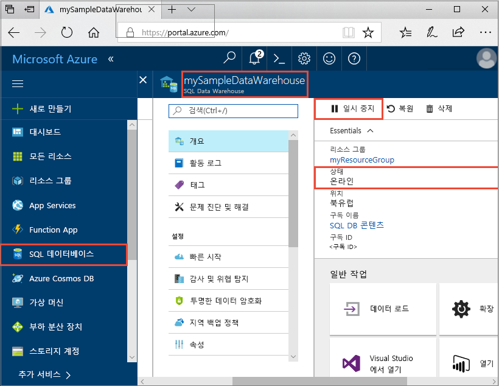
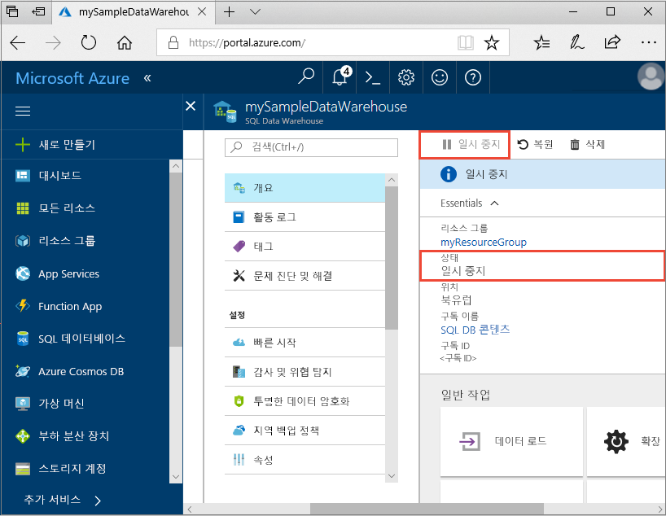
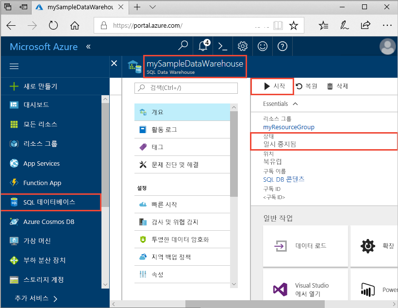
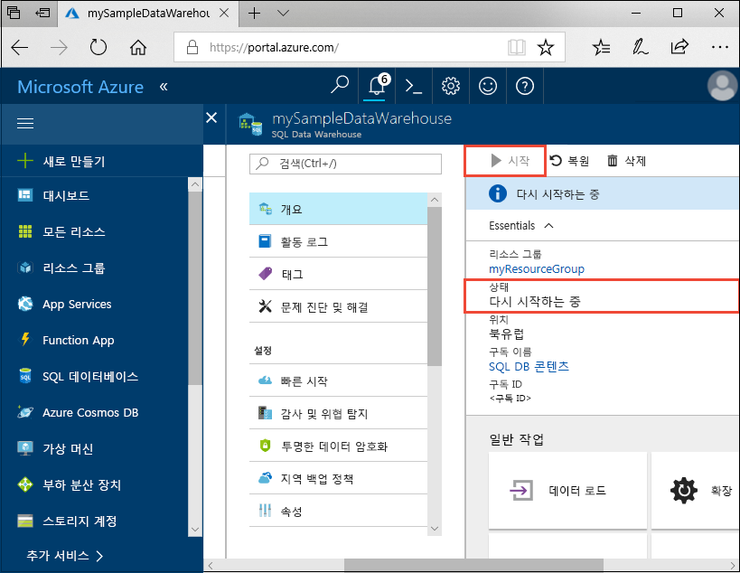

# 빠른 시작: Azure Portal에서 Azure SQL Data Warehouse에 대한 컴퓨팅 일시 중지 및 다시 시작

비용 절감을 위해 Azure Portal을 사용하여 Azure SQL Data Warehouse에서 계산을 일시 중지합니다. 데이터 웨어하우스를 사용할 준비가 되면 [계산을 다시 시작](sql-data-warehouse-manage-compute-overview.md)합니다.

Azure 구독이 아직 없는 경우 시작하기 전에 [체험](https://azure.microsoft.com/free/) 계정을 만듭니다.

## Azure Portal에 로그인

[Azure Portal](https://portal.azure.com/)에 로그인합니다.

## 시작하기 전에

[만들기 및 연결 - 포털](create-data-warehouse-portal.md)을 사용하여 **mySampleDataWarehouse**라는 데이터 웨어하우스를 만듭니다. 

## 계산 일시 중지

비용을 절약하기 위해 필요에 따라 계산 리소스를 일지 중지 및 다시 시작할 수 있습니다. 예를 들어, 밤 시간과 주말에 데이터베이스를 사용하지 않으려면 해당 시간에 일시 중지했다가 주간에 다시 시작할 수 있습니다. 데이터베이스 일시 중지 중에는 계산 리소스 요금이 부과되지 않습니다. 그러나 저장소에 대한 비용은 계속 청구됩니다. 

SQL Data Warehouse를 일시 중지하려면 다음 단계를 따르세요.

1. Azure Portal의 왼쪽 페이지에서 **SQL 데이터베이스**를 클릭합니다.
2. **SQL Database** 페이지에서 **mySampleDataWarehouse**를 선택합니다. 그러면 데이터 웨어하우스를 엽니다. 
3. **mySampleDataWarehouse** 페이지에서 **상태**는 **온라인**이 됩니다.

    

4. 데이터 웨어하우스를 일시 중지하려면 **일시 중지** 단추를 클릭합니다. 
5. 계속할지를 묻는 확인 질문이 나타납니다. **예**를 클릭합니다.
6. 몇 분 정도 기다린 다음, **상태**는 **일시 중지**가 됩니다.

    

7. 일시 중지 작업이 완료되면 상태는 **일시 중지됨**이 되고 옵션 단추는 **시작**이 됩니다.
8. 이제 데이터 웨어하우스에 대한 계산 리소스는 오프라인 상태입니다. 서비스를 다시 시작할 때까지 계산에 대한 요금이 청구되지 않습니다.

    

## 계산 다시 시작

SQL Data Warehouse를 다시 시작하려면 다음 단계를 따르세요.

1. Azure Portal의 왼쪽 페이지에서 **SQL 데이터베이스**를 클릭합니다.
2. **SQL Database** 페이지에서 **mySampleDataWarehouse**를 선택합니다. 그러면 데이터 웨어하우스를 엽니다. 
3. **mySampleDataWarehouse** 페이지에서 **상태**는 **일시 중지됨**이 됩니다.

    

4. 데이터 웨어하우스를 다시 시작하려면 **시작**을 클릭합니다. 
5. 시작할지를 묻는 확인 질문이 나타납니다. **예**를 클릭합니다.
6. **상태**가 **다시 시작 중**이 됩니다.

    

7. 데이터 웨어하우스가 다시 온라인 상태가 되면 **온라인** 상태가 되고 옵션 단추가 **일시 중지**가 됩니다.
8. 데이터 웨어하우스에 대한 계산 리소스는 현재 온라인 상태이고 서비스를 사용할 수 있습니다. 계산에 대한 요금이 다시 청구됩니다.

    

## 리소스 정리

데이터 웨어하우스 단위 및 데이터 웨어하우스에 저장된 데이터에 대해 요금이 청구됩니다. 이러한 계산 및 스토리지 리소스에 대한 요금이 별도로 청구됩니다. 

- 스토리지에 데이터를 유지하려는 경우 계산을 일시 중지합니다.
- 앞으로 요금이 부과되지 않게 하려면 데이터 웨어하우스를 삭제하면 됩니다. 

필요에 따라 다음 단계에 따라 리소스를 정리합니다.

1. [Azure Portal](https://portal.azure.com)에 로그인하고 데이터 웨어하우스를 클릭합니다.

    

1. 계산을 일시 중지하려면 **일시 중지** 단추를 클릭합니다. 데이터 웨어하우스가 일시 중지되면 **시작** 단추가 표시됩니다.  계산을 재개하려면 **시작**을 클릭합니다.

2. 계산 또는 스토리지에 대한 요금이 청구되지 않도록 데이터 웨어하우스를 제거하려면 **삭제**를 클릭합니다.

3. 만든 SQL 서버를 제거하려면 **mynewserver-20171113.database.windows.net**을 클릭하고 **삭제**를 클릭합니다.  서버를 삭제하면 해당 서버에 할당된 모든 데이터베이스가 삭제되므로 주의해서 실행해야 합니다.

4. 리소스 그룹을 제거하려면 **myResourceGroup**을 클릭하고 **리소스 그룹 삭제**를 클릭합니다.

## 다음 단계

이제 데이터 웨어하우스에 대한 계산을 일시 중지하고 다시 시작했습니다. Azure SQL Data Warehouse에 대해 자세히 알아보려면 데이터 로드에 대한 자습서를 계속 진행하세요.

> [!div class="nextstepaction"]
> [SQL 데이터 웨어하우스로 데이터 로드](load-data-from-azure-blob-storage-using-polybase.md)
