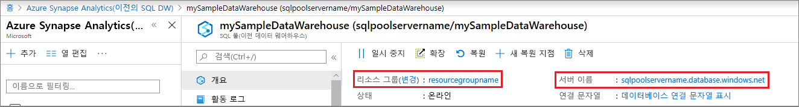

# <a name="quickstart-pause-and-resume-compute-in-azure-sql-data-warehouse-with-powershell"></a>빠른 시작: PowerShell을 사용하여 Azure SQL Data Warehouse에서 계산 일시 중지 및 다시 시작

비용 절감을 위해 PowerShell을 사용하여 Azure SQL Data Warehouse에서 계산을 일시 중지합니다. 데이터 웨어하우스를 사용할 준비가 되면 [계산을 다시 시작](sql-data-warehouse-manage-compute-overview.md)합니다.

Azure 구독이 아직 없는 경우 시작하기 전에 [체험](https://azure.microsoft.com/free/) 계정을 만듭니다.

## <a name="before-you-begin"></a>시작하기 전에

[!INCLUDE [updated-for-az](../../includes/updated-for-az.md)]

이 빠른 시작에서는 일시 중지한 후 다시 시작할 수 있는 SQL Data Warehouse가 이미 있다고 가정합니다. 하나 만들어야 할 경우 [만들기 및 연결 - 포털](create-data-warehouse-portal.md)을 사용하여 **mySampleDataWarehouse**라는 데이터 웨어하우스를 만들 수 있습니다.

## <a name="log-in-to-azure"></a>Azure에 로그인

[Connect-AzAccount](/powershell/module/az.accounts/connect-azaccount) 명령을 사용하여 Azure 구독에 로그인하고 화면의 지시를 따릅니다.

```powershell
Connect-AzAccount
```

사용 중인 구독을 보려면 [Get-AzSubscription](/powershell/module/az.accounts/get-azsubscription)을 실행합니다.

```powershell
Get-AzSubscription
```

기본 구독과는 다른 구독을 사용해야 할 경우 [Set-AzContext](/powershell/module/az.accounts/set-azcontext)를 실행합니다.

```powershell
Set-AzContext -SubscriptionName "MySubscription"
```

## <a name="look-up-data-warehouse-information"></a>데이터 웨어하우스 정보 조회

일시 중지 및 다시 시작하려는 데이터 웨어하우스의 데이터베이스 이름, 서버 이름 및 리소스 그룹을 찾습니다.

다음 단계에 따라 데이터 웨어하우스에 대한 위치 정보를 찾습니다.

1. [Azure Portal](https://portal.azure.com/)에 로그인합니다.
2. Azure Portal의 왼쪽 페이지에서 **SQL Database**를 클릭합니다.
3. **SQL Database** 페이지에서 **mySampleDataWarehouse**를 선택합니다. 데이터 웨어하우스가 열립니다.

    

4. 데이터베이스 이름에 해당하는 데이터 웨어하우스 이름을 적어 둡니다. 또한 서버 이름 및 리소스 그룹도 적어 둡니다.
6. 서버가 foo.database.windows.net인 경우 PowerShell cmdlet에 서버 이름의 첫 번째 부분만 사용합니다. 위 그림에서 전체 서버 이름은 newserver-20171113.database.windows.net입니다. PowerShell cmdlet에서 접미사를 삭제하고 **newserver-20171113**을 서버 이름으로 사용합니다.

## <a name="pause-compute"></a>계산 일시 중지

비용을 절약하기 위해 필요에 따라 계산 리소스를 일지 중지 및 다시 시작할 수 있습니다. 예를 들어, 밤 시간과 주말에 데이터베이스를 사용하지 않으려면 해당 시간에 일시 중지했다가 주간에 다시 시작할 수 있습니다. 데이터베이스를 일시 중지하는 동안 계산 리소스에 대한 요금이 부과되지 않습니다. 그러나 저장소에 대한 비용은 계속 청구됩니다.

데이터베이스를 일시 중지하려면 [Suspend-AzSqlDatabase](/powershell/module/az.sql/suspend-azsqldatabase) cmdlet을 사용합니다. 다음 예제에서는 **newserver-20171113**이라는 서버에 호스트된 **mySampleDataWarehouse**라는 데이터 웨어하우스를 일시 중지합니다. 서버는 이름이 **myResourceGroup**인 Azure 리소스 그룹 내에 있습니다.


```Powershell
Suspend-AzSqlDatabase –ResourceGroupName "myResourceGroup" `
–ServerName "newserver-20171113" –DatabaseName "mySampleDataWarehouse"
```

다음 예에서는 이를 변형하여 데이터베이스를 $database 개체로 검색합니다. 그런 다음, 개체를 [Suspend-AzSqlDatabase](/powershell/module/az.sql/suspend-azsqldatabase)에 파이프합니다. 결과는 resultDatabase 개체에 저장됩니다. 마지막 명령은 결과를 보여 줍니다.

```Powershell
$database = Get-AzSqlDatabase –ResourceGroupName "myResourceGroup" `
–ServerName "newserver-20171113" –DatabaseName "mySampleDataWarehouse"
$resultDatabase = $database | Suspend-AzSqlDatabase
$resultDatabase
```


## <a name="resume-compute"></a>계산 다시 시작

데이터베이스를 시작하려면 [Resume-AzSqlDatabase](/powershell/module/az.sql/resume-azsqldatabase) cmdlet을 사용합니다. 다음 예제에서는 newserver-20171113이라는 서버에 호스트된 mySampleDataWarehouse라는 데이터베이스를 시작합니다. 서버는 이름이 myResourceGroup인 Azure 리소스 그룹 내에 있습니다.

```Powershell
Resume-AzSqlDatabase –ResourceGroupName "myResourceGroup" `
–ServerName "newserver-20171113" -DatabaseName "mySampleDataWarehouse"
```

다음 예에서는 이를 변형하여 데이터베이스를 $database 개체로 검색합니다. 그런 다음, 개체를 [Resume-AzSqlDatabase](/powershell/module/az.sql/resume-azsqldatabase)에 파이프하고 결과를 $resultDatabase에 저장합니다. 마지막 명령은 결과를 보여 줍니다.

```Powershell
$database = Get-AzSqlDatabase –ResourceGroupName "ResourceGroup1" `
–ServerName "Server01" –DatabaseName "Database02"
$resultDatabase = $database | Resume-AzSqlDatabase
$resultDatabase
```

## <a name="check-status-of-your-data-warehouse-operation"></a>데이터 웨어하우스 작업의 상태 확인

데이터 웨어하우스의 상태를 확인하려면 [Get-AzSqlDatabaseActivity](https://docs.microsoft.com/powershell/module/az.sql/Get-AzSqlDatabaseActivity#description) cmdlet을 사용합니다.

```
Get-AzSqlDatabaseActivity -ResourceGroupName "ResourceGroup01" -ServerName "Server01" -DatabaseName "Database02"
```

## <a name="clean-up-resources"></a>리소스 정리

데이터 웨어하우스 단위 및 데이터 웨어하우스에 저장된 데이터에 대해 요금이 청구됩니다. 이러한 계산 및 스토리지 리소스에 대한 요금이 별도로 청구됩니다.

- 스토리지에 데이터를 유지하려는 경우 계산을 일시 중지합니다.
- 앞으로 요금이 부과되지 않게 하려면 데이터 웨어하우스를 삭제하면 됩니다.

필요에 따라 다음 단계에 따라 리소스를 정리합니다.

1. [Azure Portal](https://portal.azure.com)에 로그인하고 데이터 웨어하우스를 클릭합니다.

    

2. 계산을 일시 중지하려면 **일시 중지** 단추를 클릭합니다. 데이터 웨어하우스가 일시 중지되면 **시작** 단추가 표시됩니다.  계산을 재개하려면 **시작**을 클릭합니다.

3. 계산 또는 스토리지에 대한 요금이 청구되지 않도록 데이터 웨어하우스를 제거하려면 **삭제**를 클릭합니다.

4. 만든 SQL 서버를 제거하려면 **mynewserver-20171113.database.windows.net**을 클릭하고 **삭제**를 클릭합니다.  서버를 삭제하면 해당 서버에 할당된 모든 데이터베이스가 삭제되므로 주의해서 실행해야 합니다.

5. 리소스 그룹을 제거하려면 **myResourceGroup**을 클릭하고 **리소스 그룹 삭제**를 클릭합니다.


## <a name="next-steps"></a>다음 단계

이제 데이터 웨어하우스에 대한 계산을 일시 중지하고 다시 시작했습니다. Azure SQL Data Warehouse에 대해 자세히 알아보려면 데이터 로드에 대한 자습서를 계속 진행하세요.

> [!div class="nextstepaction"]
> [SQL 데이터 웨어하우스로 데이터 로드](load-data-from-azure-blob-storage-using-polybase.md)
