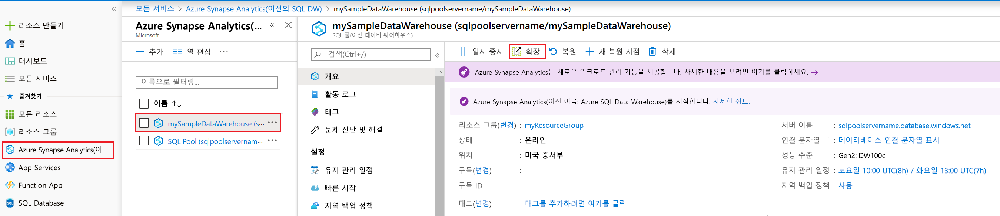
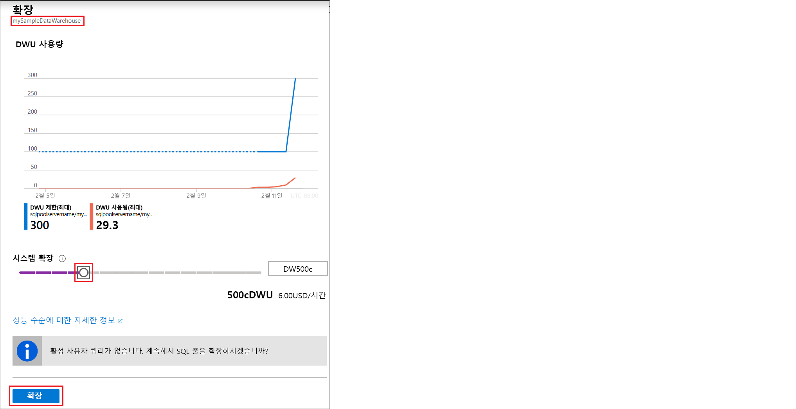

# 빠른 시작: Azure Portal에서 Azure SQL Data Warehouse의 계산 능력 조정

Azure Portal에서 Azure SQL Data Warehouse의 계산 능력을 조정합니다. 더 나은 성능을 위해 [계산 능력을 확장](sql-data-warehouse-manage-compute-overview.md)하거나 비용 절약을 위해 다시 축소할 수 있습니다. 

Azure 구독이 아직 없는 경우 시작하기 전에 [체험](https://azure.microsoft.com/free/) 계정을 만듭니다.

## Azure Portal에 로그인

[Azure 포털](https://portal.azure.com/)에 로그인합니다.

## 시작하기 전에

이미 있는 데이터 웨어하우스의 크기를 조정하거나 [빠른 시작: 만들기 및 연결 - 포털](create-data-warehouse-portal.md)을 사용하여 **mySampleDataWarehouse**라는 데이터 웨어하우스를 만듭니다.  이 빠른 시작은 **mySampleDataWarehouse** 크기를 조정합니다.

## 계산 조정

SQL Data Warehouse에서 데이터 웨어하우스 단위를 조정하여 계산 리소스를 늘리거나 줄일 수 있습니다. [만들기 및 연결 - 포털](create-data-warehouse-portal.md)에서 **mySampleDataWarehouse**를 만들고 400 DWU로 초기화했습니다. 다음 단계에서는 **mySampleDataWarehouse**에 대해 DWU를 조정합니다.

데이터 웨어하우스 단위를 변경하려면

1. Azure Portal의 왼쪽 페이지에서 **SQL 데이터 웨어하우스**를 클릭합니다.
2. **SQL 데이터 웨어하우스** 페이지에서 **mySampleDataWarehouse**를 선택합니다. 데이터 웨어하우스가 열립니다.
3. **크기 조정**을 클릭합니다.

    

2. 크기 조정 패널에서 슬라이더를 왼쪽 또는 오른쪽으로 이동해 DWU 설정을 변경합니다.

    

3. **저장**을 클릭합니다. 확인 메시지가 표시됩니다. **예**를 클릭하여 확인하거나 **아니요**를 클릭하여 취소합니다.

    

## 다음 단계
지금까지 데이터 웨어하우스에 대한 계산 성능을 조정하는 방법을 배웠습니다. Azure SQL Data Warehouse에 대해 자세히 알아보려면 데이터 로드에 대한 자습서를 계속 진행하세요.

> [!div class="nextstepaction"]
>[SQL 데이터 웨어하우스로 데이터 로드](load-data-from-azure-blob-storage-using-polybase.md)
