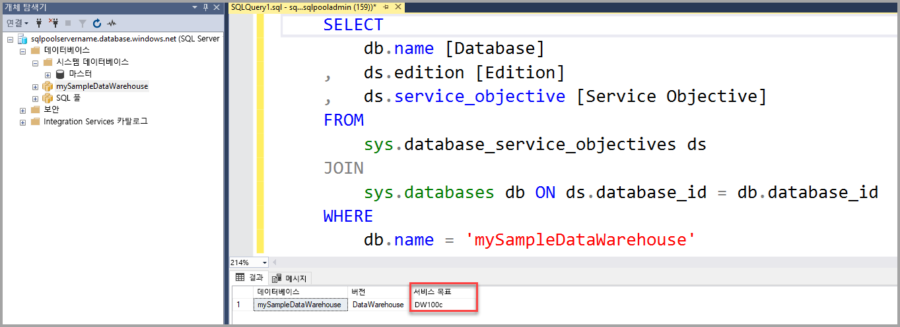

# <a name="quickstart-scale-compute-in-azure-sql-data-warehouse-using-t-sql"></a>빠른 시작: T-SQL을 사용하여 Azure SQL Data Warehouse에서 계산 능력 조정

T-SQL 및 SSMS(SQL Server Management Studio)를 사용하여 Azure SQL Data Warehouse에서 계산 능력을 조정합니다. 더 나은 성능을 위해 [계산 능력을 확장](sql-data-warehouse-manage-compute-overview.md)하거나 비용 절약을 위해 다시 축소할 수 있습니다. 

Azure 구독이 아직 없는 경우 시작하기 전에 [체험](https://azure.microsoft.com/free/) 계정을 만듭니다.

## <a name="before-you-begin"></a>시작하기 전에

최신 버전의 [SSMS(SQL Server Management Studio)](/sql/ssms/download-sql-server-management-studio-ssms.md)를 다운로드하여 설치합니다.

여기서는 [빠른 시작: 만들기 및 연결 - 포털](create-data-warehouse-portal.md)을 완료했다고 가정합니다. 만들기 및 연결 빠른 시작을 완료한 후에는 연결하고, **mySampleDataWarehouse**라는 데이터 웨어하우스를 만들고, 클라이언트가 서버에 액세스하도록 허용하는 방화벽 규칙을 만들고, 설치하는 방법을 알 수 있게 됩니다.
 
## <a name="create-a-data-warehouse"></a>데이터 웨어하우스 만들기

[빠른 시작: 만들기 및 연결 - 포털](create-data-warehouse-portal.md)을 사용하여 **mySampleDataWarehouse**라는 데이터 웨어하우스를 만듭니다. 이 빠른 시작을 완료하여 방화벽 규칙이 있는지와 SQL Server Management Studio 내에서 데이터 웨어하우스에 연결할 수 있는지 확인합니다.

## <a name="connect-to-the-server-as-server-admin"></a>서버 관리자 권한으로 서버에 연결

이 섹션에서는 SSMS([SQL Server Management Studio](/sql/ssms/download-sql-server-management-studio-ssms.md))를 사용하여 Azure SQL 서버에 연결합니다.

1. SQL Server Management Studio를 엽니다.

2. **서버에 연결** 대화 상자에서 다음 정보를 입력합니다.

   | 설정       | 제안 값 | 설명 | 
   | ------------ | ------------------ | ------------------------------------------------- | 
   | 서버 유형 | 데이터베이스 엔진 | 이 값은 필수입니다. |
   | 서버 이름 | 정규화된 서버 이름 | **mynewserver-20171113.database.windows.net**을 예로 들 수 있습니다. |
   | 인증 | SQL Server 인증 | SQL 인증은 이 자습서에서 구성되어 있는 유일한 인증 유형입니다. |
   | 로그인 | 서버 관리자 계정 | 서버를 만들 때 지정한 계정입니다. |
   | 암호 | 서버 관리자 계정의 암호 | 서버를 만들 때 지정한 암호입니다. |

    

4. **Connect**를 클릭합니다. SSMS에서 개체 탐색기 창이 열립니다. 

5. 개체 탐색기에서 **데이터베이스**를 확장합니다. 그런 다음 **mySampleDatabase**를 확장하여 새 데이터베이스의 개체를 표시합니다.

     

## <a name="view-service-objective"></a>서비스 목표 보기
서비스 목표 설정에는 데이터 웨어하우스에 대한 데이터 웨어하우스 단위 수가 포함됩니다. 

데이터 웨어하우스에 대한 현재 데이터 웨어하우스 단위를 보려면

1. **mynewserver-20171113.database.windows.net**에 대한 연결에서 **시스템 데이터베이스**를 확장합니다.
2. **master**를 마우스 오른쪽 단추로 클릭하고 **새 쿼리**를 선택합니다. 새 쿼리 창이 열립니다.
3. sys.database_service_objectives 동적 관리 뷰에서 다음 쿼리를 실행합니다. 

    ```sql
    SELECT
        db.name [Database]
    ,   ds.edition [Edition]
    ,   ds.service_objective [Service Objective]
    FROM
        sys.database_service_objectives ds
    JOIN
        sys.databases db ON ds.database_id = db.database_id
    WHERE 
        db.name = 'mySampleDataWarehouse'
    ```

4. 다음 결과에서 **mySampleDataWarehouse**의 서비스 목표는 DW400으로 표시됩니다. 

    


## <a name="scale-compute"></a>계산 조정
SQL Data Warehouse에서 데이터 웨어하우스 단위를 조정하여 계산 리소스를 늘리거나 줄일 수 있습니다. [만들기 및 연결 - 포털](create-data-warehouse-portal.md)에서 **mySampleDataWarehouse**를 만들고 400 DWU로 초기화했습니다. 다음 단계에서는 **mySampleDataWarehouse**에 대해 DWU를 조정합니다.

데이터 웨어하우스 단위를 변경하려면

1. **master**를 마우스 오른쪽 단추로 클릭하고 **새 쿼리**를 선택합니다.
2. [ALTER DATABASE](/sql/t-sql/statements/alter-database-azure-sql-database) T-SQL 문을 사용하여 서비스 목표를 수정합니다. 다음 쿼리를 실행하여 서비스 목표를 DW300으로 변경합니다. 

```Sql
ALTER DATABASE mySampleDataWarehouse
MODIFY (SERVICE_OBJECTIVE = 'DW300')
;
```

## <a name="check-data-warehouse-state"></a>데이터 웨어하우스 상태 확인

데이터 웨어하우스를 일시 중지하면 T-SQL로 연결할 수 없습니다. 데이터 웨어하우스의 현재 상태를 보려면 PowerShell cmdlet을 사용합니다. 한 예로 [데이터 웨어하우스 상태 확인 - Powershell](quickstart-scale-compute-powershell.md#check-data-warehouse-state)을 참조하세요. 

## <a name="check-operation-status"></a>작업 상태 확인

SQL Data Warehouse의 다양한 관리 작업에 대한 정보를 반환하려면 [sys.dm_operation_status](/sql/relational-databases/system-dynamic-management-views/sys-dm-operation-status-azure-sql-database) DMV에 대해 다음 쿼리를 실행합니다. 예를 들어, 해당 작업과 IN_PROGRESS 또는 COMPLETED 중 하나인 작업 상태가 반환됩니다.

```sql
SELECT *
FROM
    sys.dm_operation_status
WHERE
    resource_type_desc = 'Database'
AND 
    major_resource_id = 'MySQLDW'
```


## <a name="next-steps"></a>다음 단계
지금까지 데이터 웨어하우스에 대한 계산 성능을 조정하는 방법을 배웠습니다. Azure SQL Data Warehouse에 대해 자세히 알아보려면 데이터 로드에 대한 자습서를 계속 진행하세요.

> [!div class="nextstepaction"]
>[SQL 데이터 웨어하우스로 데이터 로드](load-data-from-azure-blob-storage-using-polybase.md)
