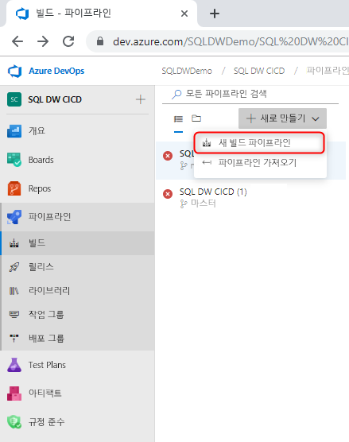
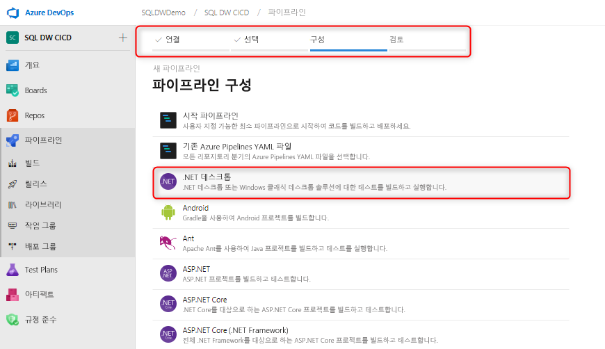
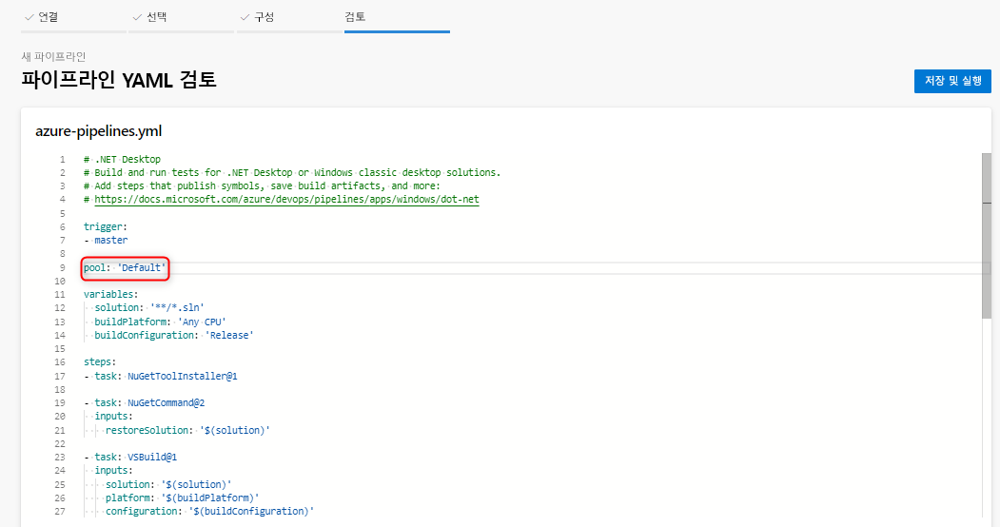
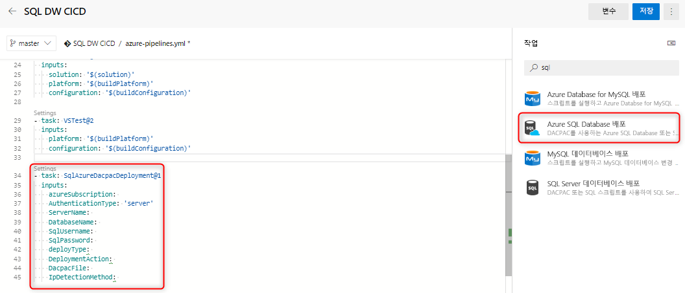
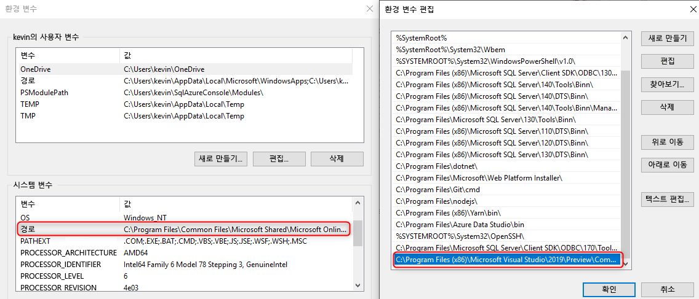

# Azure SQL Data Warehouse에 대한 지속적인 통합 및 배포

이 간단한 자습서에서는 SSDT(SQL Server Data Tools) 데이터베이스 프로젝트를 Azure DevOps와 통합하고, Azure Pipelines를 활용하여 지속적인 통합 및 배포를 설정하는 방법에 대해 간략히 설명합니다. 이 자습서는 SQL Data Warehouse를 사용하여 지속적인 통합 및 배포 파이프라인을 빌드하는 두 번째 단계입니다. 

## 시작하기 전에

- [원본 제어 통합 자습서](https://docs.microsoft.com/azure/sql-data-warehouse/sql-data-warehouse-source-control-integration) 살펴보기

- SQL Data Warehouse(미리 보기)에 SSDT 미리 보기 비트(16.3 미리 보기 2 이상)가 설치된 [자체 호스팅 에이전트](https://docs.microsoft.com/azure/devops/pipelines/agents/agents?view=azure-devops#install) 만들기

- Azure DevOps 설정 및 연결

  > [!NOTE]
  > SSDT는 현재 미리 보기 상태로 있어 자체 호스팅 에이전트를 활용해야 합니다. Microsoft 호스팅 에이전트는 몇 개월 내에 업데이트됩니다.

## Visual Studio 빌드와의 지속적인 통합

1. Azure Pipelines로 이동하여 새 빌드 파이프라인을 만듭니다.

      

2. 소스 코드 리포지토리(Azure Repos Git)를 선택하고, .NET 데스크톱 앱 템플릿을 선택합니다.

       

3. 적절한 에이전트 풀을 사용하도록 YAML 파일을 편집합니다. YAML 파일은 다음과 같습니다.

      

이 시점에서 원본 제어 리포지토리 마스터 분기에 대한 체크 인에서 데이터베이스 프로젝트의 성공적인 Visual Studio 빌드를 자동으로 트리거하는 간단한 환경이 있습니다. 로컬 데이터베이스 프로젝트를 변경하고 마스터 분기에서 변경 내용을 체크 인하여 자동화가 엔드투엔드 방식으로 작동하는지 확인합니다.

## Azure SQL Database 배포 작업을 사용한 지속적인 배포

1. [Azure SQL Database 배포 작업](https://docs.microsoft.com/azure/devops/pipelines/tasks/deploy/sql-azure-dacpac-deployment?view=azure-devops)을 사용하여 새 작업을 추가하고, 대상 데이터 웨어하우스에 연결하는 데 필요한 필드를 채웁니다. 이 작업이 실행되면 이전 빌드 프로세스에서 생성된 DACPAC가 대상 데이터 웨어하우스에 배포됩니다.

      

2. 자체 호스팅 에이전트를 사용하는 경우 SQL Data Warehouse에 올바른 SqlPackage.exe를 사용하도록 환경 변수를 설정해야 합니다. 경로는 다음과 같습니다.

      

   C:\Program Files (x86)\Microsoft Visual Studio\2019\Preview\Common7\IDE\Extensions\Microsoft\SQLDB\DAC\150  

   파이프라인을 실행하고 유효성을 검사합니다. 로컬에서 변경하고 자동 빌드 및 배포를 생성해야 하는 원본 제어에 대한 변경 내용을 체크 인할 수 있습니다.

## 다음 단계

- [Azure SQL Data Warehouse 아키텍처](/azure/sql-data-warehouse/massively-parallel-processing-mpp-architecture) 살펴보기
- 빠르게 [SQL Data Warehouse 만들기][create a SQL Data Warehouse]
- [샘플 데이터 로드][load sample data]
- [비디오](/azure/sql-data-warehouse/sql-data-warehouse-videos) 살펴보기

<!--Image references-->

[1]: ./media/sql-data-warehouse-overview-what-is/dwarchitecture.png

<!--Article references-->
[Create a support ticket]: ./sql-data-warehouse-get-started-create-support-ticket.md
[load sample data]: ./sql-data-warehouse-load-sample-databases.md
[create a SQL Data Warehouse]: ./sql-data-warehouse-get-started-provision.md
[Migration documentation]: ./sql-data-warehouse-overview-migrate.md
[SQL Data Warehouse solution partners]: ./sql-data-warehouse-partner-business-intelligence.md
[Integrated tools overview]: ./sql-data-warehouse-overview-integrate.md
[Backup and restore overview]: ./sql-data-warehouse-restore-database-overview.md
[Azure glossary]: ../azure-glossary-cloud-terminology.md

<!--MSDN references-->

<!--Other Web references-->
[Blogs]: https://azure.microsoft.com/blog/tag/azure-sql-data-warehouse/
[Customer Advisory Team blogs]: https://blogs.msdn.microsoft.com/sqlcat/tag/sql-dw/
[Feature requests]: https://feedback.azure.com/forums/307516-sql-data-warehouse
[MSDN forum]: https://social.msdn.microsoft.com/Forums/azure/home?forum=AzureSQLDataWarehouse
[Stack Overflow forum]: https://stackoverflow.com/questions/tagged/azure-sqldw
[Twitter]: https://twitter.com/hashtag/SQLDW
[Videos]: https://azure.microsoft.com/documentation/videos/index/?services=sql-data-warehouse
[SLA for SQL Data Warehouse]: https://azure.microsoft.com/support/legal/sla/sql-data-warehouse/v1_0/
[Volume Licensing]: https://www.microsoftvolumelicensing.com/DocumentSearch.aspx?Mode=3&DocumentTypeId=37
[Service Level Agreements]: https://azure.microsoft.com/support/legal/sla/
