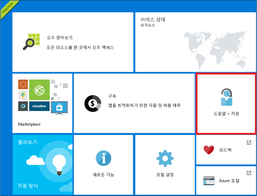
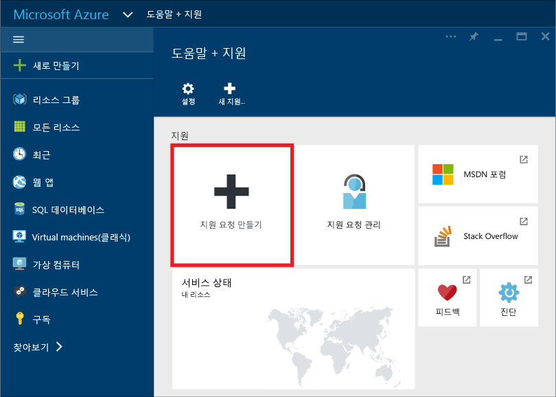
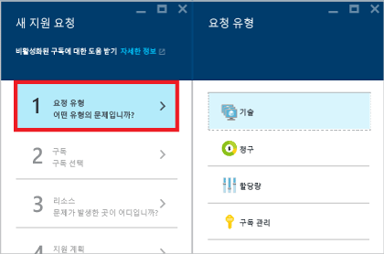
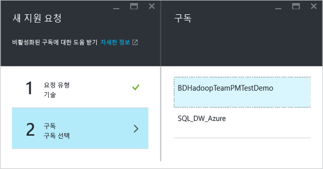
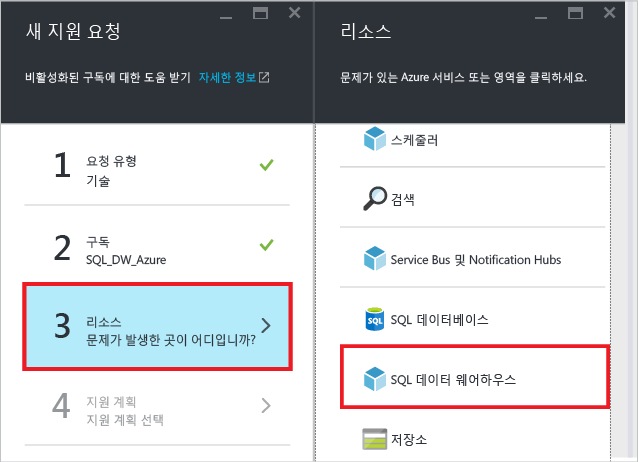
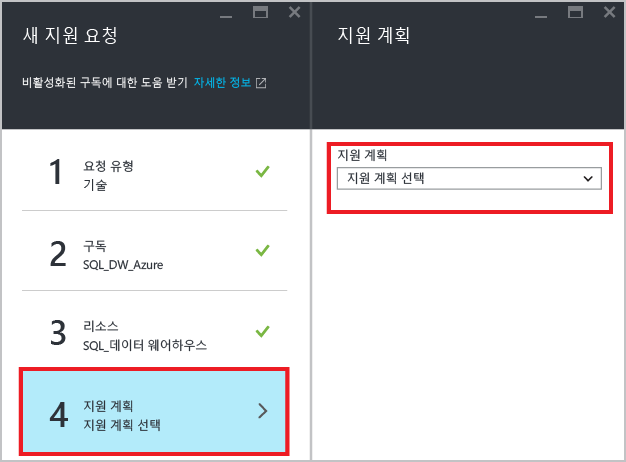
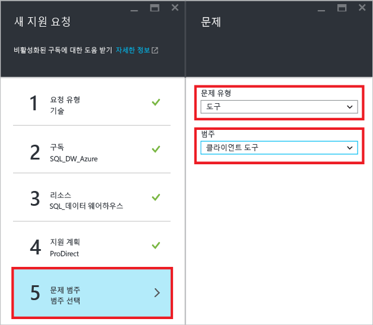
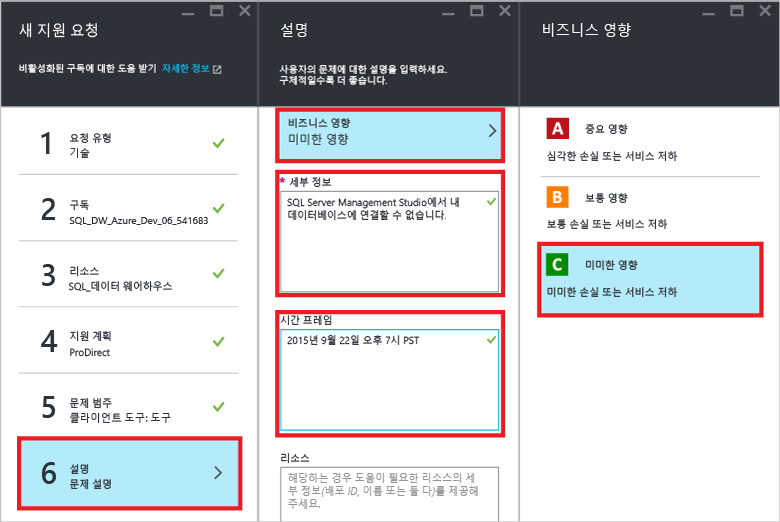
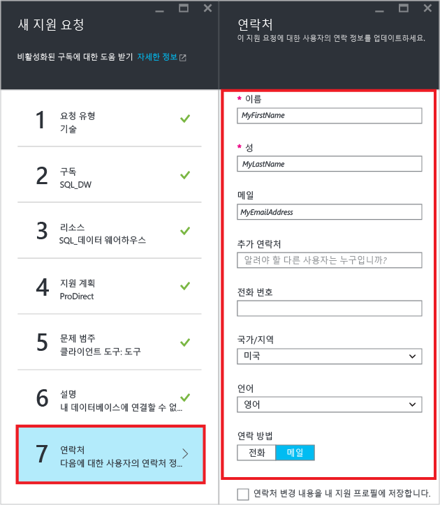
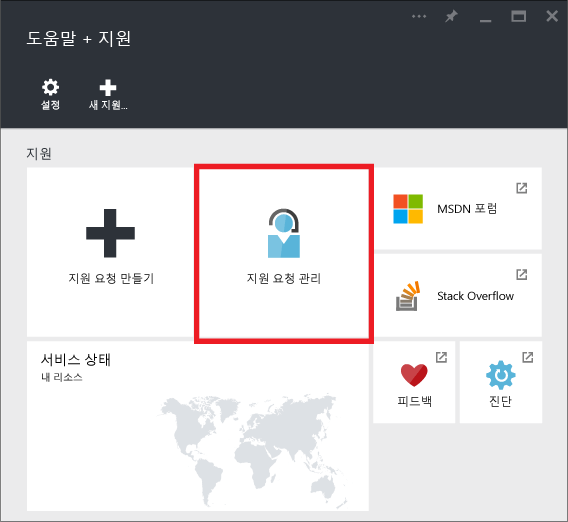

<properties
   pageTitle="SQL 데이터 웨어하우스에 대한 지원 티켓을 만드는 방법 | Microsoft Azure"
   description="Azure SQL 데이터 웨어하우스에서 지원 티켓을 만드는 방법"
   services="sql-data-warehouse"
   documentationCenter="NA"
   authors="sonyam"
   manager="barbkess"
   editor=""/>

<tags
   ms.service="sql-data-warehouse"
   ms.devlang="NA"
   ms.topic="get-started-article"
   ms.tgt_pltfrm="NA"
   ms.workload="data-services"
   ms.date="09/01/2016"
   ms.author="sonyama;barbkess"/>

# SQL 데이터 웨어하우스에 대한 지원 티켓을 만드는 방법
 
SQL 데이터 웨어하우스에 어떤 문제가 있는 경우 엔지니어링 팀이 도움을 줄 수 있도록 지원 티켓을 만드세요.

## 지원 티켓 만들기

1. [Azure 포털][]을 엽니다.

2. 홈 화면에서 **도움말 + 지원** 타일을 클릭합니다.

    

3. 도움말 + 지원 블레이드에서 **지원 요청 만들기**를 클릭합니다.

    
    
    

4. **요청 유형**을 선택합니다.

    
    
    >[AZURE.NOTE]  기본적으로 각 SQL server(예: myserver.database.windows.net)에는 **DTU 할당량**인 45,000이 있습니다. 이 할당량은 안전을 위한 제한일 뿐입니다. 지원 티켓을 만들고 *할당량*을 요청 형식으로 선택하여 할당량을 늘릴 수 있습니다. DTU 요구 사항을 계산하려면 7.5를 필요한 총 [DWU][]로 곱합니다. 예를 들어 하나의 SQL Server에서 두 개의 DW6000을 호스트하려면 DTU 할당량인 90,000을 요청해야 합니다. 포털의 SQL Server 블레이드에서 현재 DTU 사용량을 볼 수 있습니다. 일시 중지되거나 일시 중지되지 않은 데이터베이스는 모두 DTU 할당량에 포함됩니다.

5. 보고하려는 문제가 있는 데이터베이스를 호스팅하는 **구독**을 선택합니다.

    

6. 리소스로 **SQL 데이터 웨어하우스**를 선택합니다.

    

7. [Azure 지원 계획][]을 선택합니다.

    - **대금 청구, 할당량 및 구독 관리** 지원은 모든 지원 수준에서 제공됩니다.
    - **고장 수리** 지원은 [개발자][], [표준][], [전문가 지원][] 또는 [프리미어][] 지원을 통해 제공됩니다. 고장 수리 문제는 고객이 Azure를 사용하는 동안 고객에게 발생한 문제 중 Microsoft로 인해 문제가 발생했다는 합리적인 이유가 존재하는 문제를 의미합니다.
    - **개발자 멘토링** 및 **자문 서비스**는 [전문가 지원][] 및 [프리미어][] 지원 수준에서 제공됩니다.
    
    프리미어 지원 계획이 있는 경우 [Microsoft 프리미어 온라인 포털][]에서 SQL 데이터 웨어하우스 관련 문제를 보고할 수도 있습니다. 범위, 응답 시간, 가격 책정 등을 포함한 다양한 지원 계획에 대한 자세한 정보는 [Azure 지원 계획][Azure support plan]을 참조하세요. Azure 지원에 대한 질문과 대답은 [Azure 지원 FAQ][]를 참조하세요.

    

8. **문제 유형** 및 **범주**를 선택합니다.

    

9. 문제를 설명하고 비즈니스에 미치는 영향 수준을 선택합니다.

    

10. 이 지원 티켓에 대한 **연락처 정보**는 미리 채워집니다. 필요한 경우 업데이트하세요.

    

11. **만들기**를 클릭하여 지원 요청을 제출합니다.

## 지원 티켓 모니터링

지원 요청을 제출하면 Azure 지원팀이 연락합니다. 사용자 요청 상태 및 세부 정보를 확인하려면 대시보드에서 **지원 요청 관리**를 클릭합니다.

## 기타 리소스

또한 [스택 오버플로][] 또는 [Azure SQL 데이터 웨어하우스 MSDN 포럼][]에서 SQL 데이터 웨어하우스 커뮤니티에 연결할 수 있습니다.

<!--Image references--> 

<!--Article references--> 
[DWU]: ./sql-data-warehouse-overview-what-is.md#data-warehouse-units

<!--MSDN references--> 

<!--Other web references--> 
[Azure 포털]: https://portal.azure.com/
[Azure support plan]: https://azure.microsoft.com/support/plans/?WT.mc_id=Support_Plan_510979/
[Azure 지원 계획]: https://azure.microsoft.com/support/plans/?WT.mc_id=Support_Plan_510979/
[개발자]: https://azure.microsoft.com/support/plans/developer/
[표준]: https://azure.microsoft.com/support/plans/standard/
[전문가 지원]: https://azure.microsoft.com/support/plans/prodirect/
[프리미어]: https://azure.microsoft.com/support/plans/premier/
[Azure 지원 FAQ]: https://azure.microsoft.com/support/faq/
[Microsoft 프리미어 온라인 포털]: https://premier.microsoft.com/
[스택 오버플로]: https://stackoverflow.com/questions/tagged/azure-sqldw/
[Azure SQL 데이터 웨어하우스 MSDN 포럼]: https://social.msdn.microsoft.com/Forums/home?forum=AzureSQLDataWarehouse/

<!-----HONumber=AcomDC_0907_2016-->