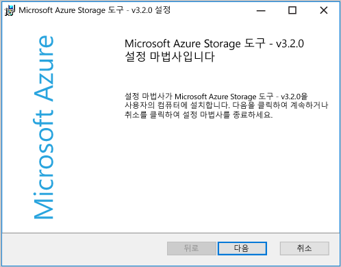
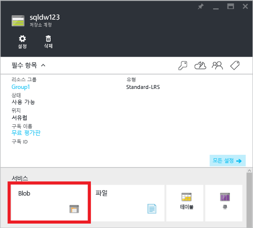
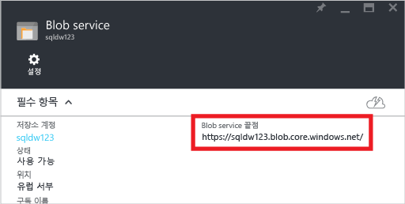
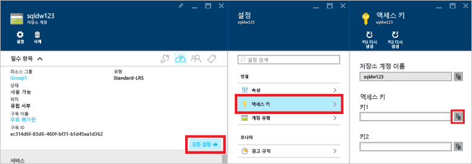
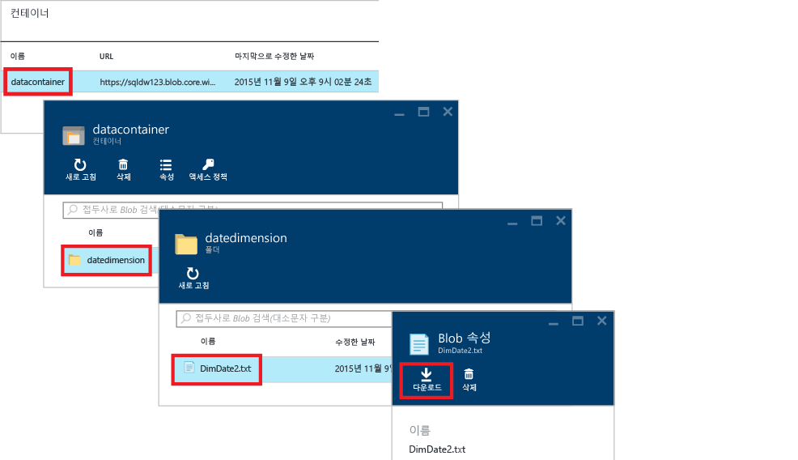

<properties
   pageTitle="SQL 데이터 웨어하우스의 PolyBase 자습서 | Microsoft Azure"
   description="PolyBase 정의 및 데이터 웨어하우징 시나리오에 대해 사용하는 방법에 대해 알아봅니다."
   services="sql-data-warehouse"
   documentationCenter="NA"
   authors="ckarst"
   manager="barbkess"
   editor=""/>

<tags
   ms.service="sql-data-warehouse"
   ms.devlang="NA"
   ms.topic="get-started-article"
   ms.tgt_pltfrm="NA"
   ms.workload="data-services"
   ms.date="06/30/2016"
   ms.author="cakarst;barbkess;sonyama"/>


# SQL 데이터 웨어하우스에서 PolyBase를 사용하여 데이터 로드

> [AZURE.SELECTOR]
- [데이터 팩터리](sql-data-warehouse-get-started-load-with-azure-data-factory.md)
- [PolyBase](sql-data-warehouse-get-started-load-with-polybase.md)
- [BCP](sql-data-warehouse-load-with-bcp.md)

이 자습서는 AzCopy 및 PolyBase를 사용하여 SQL 데이터 웨어하우스로 데이터를 로드하는 방법을 보여줍니다. 자습서를 마치면 다음과 같은 방법을 알게 됩니다.

- AzCopy를 사용하여 Azure Blob 저장소에 데이터 복사
- 데이터를 정의하는 데이터베이스 개체 만들기
- 데이터를 로드하는 T-SQL 쿼리 실행

>[AZURE.VIDEO loading-data-with-polybase-in-azure-sql-data-warehouse]

## 필수 조건

이 자습서를 단계별로 실행하려면 다음을 수행해야 합니다.

- SQL 데이터 웨어하우스 데이터베이스
- 표준 로컬 중복 저장소(표준-LRS), 표준 지역 중복 저장소(표준-GRS) 또는 표준 읽기 액세스 지역 중복 저장소(표준-RAGRS) 유형의 Azure 저장소 계정
- AzCopy 명령줄 유틸리티. Microsoft Azure 저장소 도구와 함께 설치되는 [AzCopy 최신 버전][]을 다운로드하여 설치합니다.

    


## 1단계: Azure Blob 저장소에 샘플 데이터 추가

데이터를 로드하려면, Azure Blob 저장소에 샘플 데이터를 넣어야 합니다. 이 단계에서는 Azure Blob 저장소를 샘플 데이터로 채웁니다. 나중에 PolyBase를 사용하여 SQL 데이터 웨어하우스 데이터베이스로 이 샘플 데이터를 로드하게 됩니다.

### A. 샘플 텍스트 파일 준비

샘플 텍스트 파일을 준비하려면:

1. 메모장을 열고 새 파일로 다음 데이터 줄을 복사합니다. 이것을 로컬 temp 디렉터리에 %temp%\\DimDate2.txt로 저장합니다.

```
20150301,1,3
20150501,2,4
20151001,4,2
20150201,1,3
20151201,4,2
20150801,3,1
20150601,2,4
20151101,4,2
20150401,2,4
20150701,3,1
20150901,3,1
20150101,1,3
```

### B. Blob 서비스 끝점 찾기

Blob 서비스 끝점을 찾으려면:

1. Azure 포털에서 **찾아보기** > **저장소 계정**을 선택합니다.
2. 사용하려는 저장소 계정을 클릭합니다.
3. 저장소 계정 블레이드에서 BLOB을 클릭합니다.

    

1. 나중을 위해 Blob 서비스 끝점 URL을 저장합니다.

    

### C. Azure 저장소 키 찾기

Azure 저장소 키를 찾으려면:

1. Azure 포털에서 **찾아보기** > **저장소 계정**을 선택합니다.
2. 사용하려는 저장소 계정을 클릭합니다.
3. **모든 설정** > **선택키**를 선택합니다.
4. 복사 상자를 클릭하여 선택키 중 하나를 클립보드에 복사합니다.

    

### D. 샘플 파일을 Azure Blob 저장소에 복사

데이터를 Azure Blob 저장소에 복사하려면:

1. 명령 프롬프트를 열고 디렉터리를 AzCopy 설치 디렉터리로 변경합니다. 이 명령은 64비트 Windows 클라이언트의 기본 설치 디렉터리로 변경합니다.

    ```
    cd /d "%ProgramFiles(x86)%\Microsoft SDKs\Azure\AzCopy"
    ```

1. 다음 명령을 실행하여 파일을 업로드합니다. <Blob 서비스 끝점 URL>에 Blob 서비스 끝점 URL을 지정하고 <azure\_storage\_account\_key>에 Azure 저장소 계정 키를 지정합니다.

    ```
    .\AzCopy.exe /Source:C:\Temp\ /Dest:<blob service endpoint URL> /datacontainer/datedimension/ /DestKey:<azure_storage_account_key> /Pattern:DimDate2.txt
    ```

[AzCopy 명령줄 유틸리티 시작][]을 참조하세요.

### E. Blob 저장소 컨테이너 탐색

Blob 저장소에 업로드한 파일을 보려면:

1. Blob 서비스 블레이드로 돌아갑니다.
2. 컨테이너에서 **datacontainer**를 두 번 클릭합니다.
3. 데이터가 있는 경로로 이동하려는 경우 **datedimension** 폴더를 클릭하면 업로드한 **DimDate2.txt** 파일이 표시됩니다.
4. 속성을 보려면 **DimDate2.txt**를 클릭합니다.
5. Blob 속성 블레이드에서 파일을 다운로드하거나 삭제할 수 있습니다.

    


## 2단계: 샘플 데이터에 대한 외부 테이블 만들기

이 섹션에서는 샘플 데이터를 정의하는 외부 테이블을 만듭니다.

PolyBase는 외부 테이블을 사용하여 Azure Blob 저장소의 데이터에 액세스합니다. 데이터가 SQL 데이터 웨어하우스 내에 저장되지 않기 때문에, PolyBase는 데이터베이스-범위 자격 증명을 사용하여 외부 데이터에 대한 인증을 처리합니다.

이 단계의 예제는 다음 Transact-SQL 문을 사용하여 외부 테이블을 만듭니다.

- [마스터 키 만들기(Transact-SQL)][]\: 데이터베이스 범위 자격 증명의 암호를 암호화합니다.
- [데이터베이스 범위 자격 증명 만들기(Transact-SQL)][]\: Azure 저장소 계정에 대한 인증 정보를 지정합니다.
- [외부 데이터 원본 만들기(Transact-SQL)][]\: Azure Blob 저장소의 위치를 지정합니다.
- [외부 파일 형식 만들기(Transact-SQL)][]\: 데이터의 형식을 지정합니다.
- [외부 테이블 만들기(Transact-SQL)][]\: 테이블 정의 및 데이터의 위치를 지정합니다.

SQL 데이터 웨어하우스 데이터베이스에 대해 이 쿼리를 실행합니다. Azure Blob 저장소의 샘플 데이터 DimDate2.txt를 가리키는 dbo 스키마에 DimDate2External이라는 이름의 외부 테이블이 생성됩니다.


```sql
-- A: Create a master key.
-- Only necessary if one does not already exist.
-- Required to encrypt the credential secret in the next step.

CREATE MASTER KEY;


-- B: Create a database scoped credential
-- IDENTITY: Provide any string, it is not used for authentication to Azure storage.
-- SECRET: Provide your Azure storage account key.


CREATE DATABASE SCOPED CREDENTIAL AzureStorageCredential
WITH
    IDENTITY = 'user',
    SECRET = '<azure_storage_account_key>'
;


-- C: Create an external data source
-- TYPE: HADOOP - PolyBase uses Hadoop APIs to access data in Azure blob storage.
-- LOCATION: Provide Azure storage account name and blob container name.
-- CREDENTIAL: Provide the credential created in the previous step.

CREATE EXTERNAL DATA SOURCE AzureStorage
WITH (
    TYPE = HADOOP,
    LOCATION = 'wasbs://<blob_container_name>@<azure_storage_account_name>.blob.core.windows.net',
    CREDENTIAL = AzureStorageCredential
);


-- D: Create an external file format
-- FORMAT_TYPE: Type of file format in Azure storage (supported: DELIMITEDTEXT, RCFILE, ORC, PARQUET).
-- FORMAT_OPTIONS: Specify field terminator, string delimiter, date format etc. for delimited text files.
-- Specify DATA_COMPRESSION method if data is compressed.

CREATE EXTERNAL FILE FORMAT TextFile
WITH (
    FORMAT_TYPE = DelimitedText,
    FORMAT_OPTIONS (FIELD_TERMINATOR = ',')
);


-- E: Create the external table
-- Specify column names and data types. This needs to match the data in the sample file.
-- LOCATION: Specify path to file or directory that contains the data (relative to the blob container).
-- To point to all files under the blob container, use LOCATION='.'

CREATE EXTERNAL TABLE dbo.DimDate2External (
    DateId INT NOT NULL,
    CalendarQuarter TINYINT NOT NULL,
    FiscalQuarter TINYINT NOT NULL
)
WITH (
    LOCATION='/datedimension/',
    DATA_SOURCE=AzureStorage,
    FILE_FORMAT=TextFile
);


-- Run a query on the external table

SELECT count(*) FROM dbo.DimDate2External;

```


Visual Studio의 SQL Server 개체 탐색기에 외부 파일 형식, 외부 데이터 원본, DimDate2External 테이블이 표시됩니다.


## 3단계: SQL 데이터 웨어하우스에 데이터 로드

외부 테이블이 생성되면, 새 테이블에 데이터를 로드하거나 기존 테이블에 데이터를 삽입할 수 있습니다.

- 새 테이블로 데이터를 로드하려면 [CREATE TABLE AS SELECT(Transact-SQL)][] 문을 실행합니다. 새 테이블에는 쿼리에 명명된 열이 포함됩니다. 열의 데이터 형식은 외부 테이블 정의에 있는 데이터 형식과 일치합니다.
- 기존 테이블에 데이터를 로드하려면 [INSERT...SELECT (Transact-SQL)][] 문을 사용합니다.

```sql
-- Load the data from Azure blob storage to SQL Data Warehouse

CREATE TABLE dbo.DimDate2
WITH
(   
    CLUSTERED COLUMNSTORE INDEX,
    DISTRIBUTION = ROUND_ROBIN
)
AS
SELECT * FROM [dbo].[DimDate2External];
```

## 4단계: 새로 로드한 데이터에 대한 통계 만들기

SQL 데이터 웨어하우스는 통계 자동 만들기 또는 자동 업데이트를 수행하지 않습니다. 따라서 높은 쿼리 성능을 달성하려면, 처음 로드한 후에 각 테이블의 각 열에 대한 통계를 만드는 것이 중요합니다. 데이터에 상당한 변화가 발생한 후에는 통계를 업데이트하는 것이 중요합니다.

이 예제는 새 DimDate2 테이블에 단일 열 통계를 만듭니다.

```sql
CREATE STATISTICS [DateId] on [DimDate2] ([DateId]);
CREATE STATISTICS [CalendarQuarter] on [DimDate2] ([CalendarQuarter]);
CREATE STATISTICS [FiscalQuarter] on [DimDate2] ([FiscalQuarter]);
```

자세한 내용은 [통계][]를 참조하세요.


## 다음 단계
PolyBase를 사용하는 솔루션을 개발하면서 알아야 하는 추가적인 내용은 [PolyBase 가이드][]를 참조하세요.

<!--Image references-->


<!--Article references-->
[PolyBase in SQL Data Warehouse Tutorial]: ./sql-data-warehouse-get-started-load-with-polybase.md
[Load data with bcp]: ./sql-data-warehouse-load-with-bcp.md
[통계]: ./sql-data-warehouse-tables-statistics.md
[PolyBase 가이드]: ./sql-data-warehouse-load-polybase-guide.md
[AzCopy 명령줄 유틸리티 시작]: ../storage/storage-use-azcopy.md
[AzCopy 최신 버전]: ../storage/storage-use-azcopy.md

<!--External references-->
[supported source/sink]: https://msdn.microsoft.com/library/dn894007.aspx
[copy activity]: https://msdn.microsoft.com/library/dn835035.aspx
[SQL Server destination adapter]: https://msdn.microsoft.com/library/ms141095.aspx
[SSIS]: https://msdn.microsoft.com/library/ms141026.aspx


[외부 데이터 원본 만들기(Transact-SQL)]: https://msdn.microsoft.com/library/dn935022.aspx
[외부 파일 형식 만들기(Transact-SQL)]: https://msdn.microsoft.com/library/dn935026.aspx
[외부 테이블 만들기(Transact-SQL)]: https://msdn.microsoft.com/library/dn935021.aspx

[DROP EXTERNAL DATA SOURCE (Transact-SQL)]: https://msdn.microsoft.com/library/mt146367.aspx
[DROP EXTERNAL FILE FORMAT (Transact-SQL)]: https://msdn.microsoft.com/library/mt146379.aspx
[DROP EXTERNAL TABLE (Transact-SQL)]: https://msdn.microsoft.com/library/mt130698.aspx

[CREATE TABLE AS SELECT(Transact-SQL)]: https://msdn.microsoft.com/library/mt204041.aspx
[INSERT...SELECT (Transact-SQL)]: https://msdn.microsoft.com/library/ms174335.aspx
[마스터 키 만들기(Transact-SQL)]: https://msdn.microsoft.com/library/ms174382.aspx
[CREATE CREDENTIAL (Transact-SQL)]: https://msdn.microsoft.com/library/ms189522.aspx
[데이터베이스 범위 자격 증명 만들기(Transact-SQL)]: https://msdn.microsoft.com/library/mt270260.aspx
[DROP CREDENTIAL (Transact-SQL)]: https://msdn.microsoft.com/library/ms189450.aspx

<!-----HONumber=AcomDC_0907_2016-->