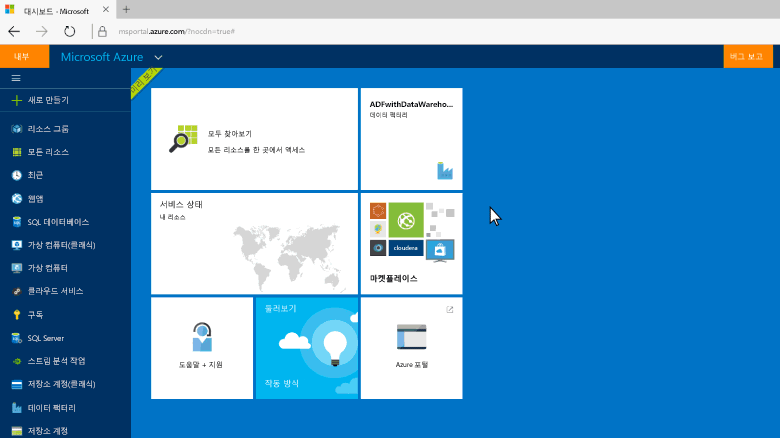
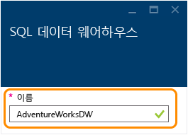
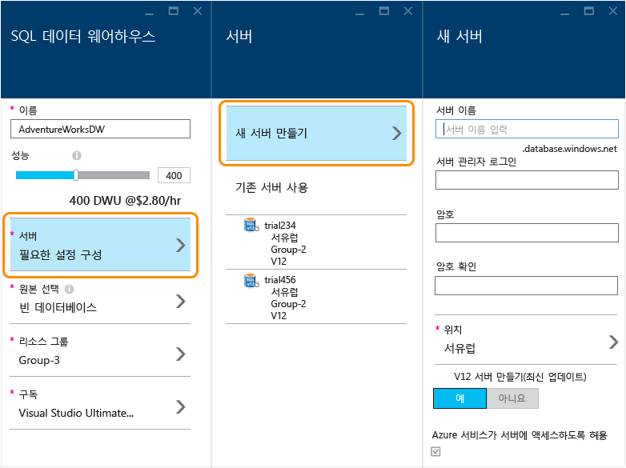
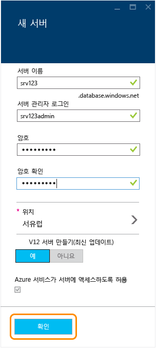
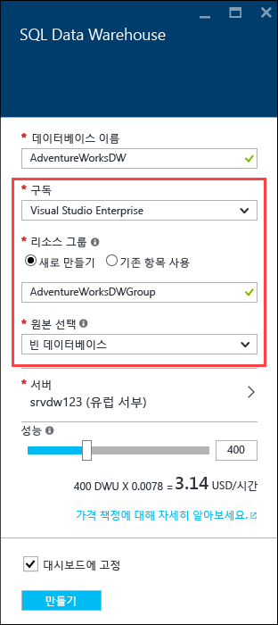
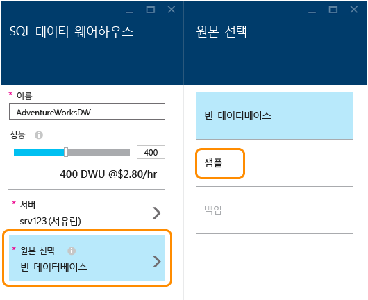
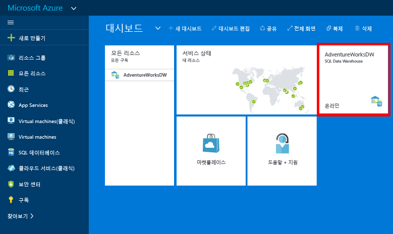
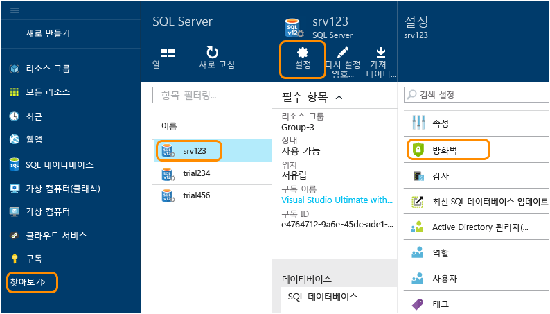
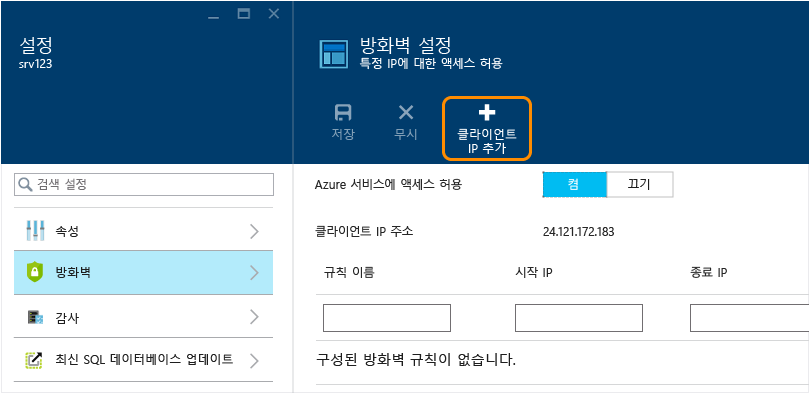
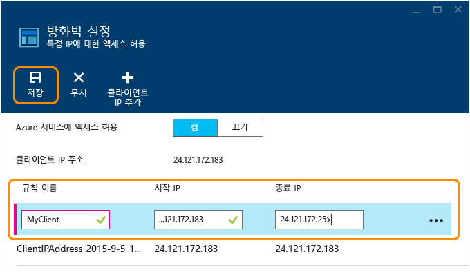

<properties
	pageTitle="Azure Preview 포털에서 SQL 데이터 웨어하우스 데이터베이스 만들기 | Microsoft Azure"
	description="Azure Preview 포털에서 SQL 데이터 웨어하우스를 만드는 방법 알아보기"
	services="sql-data-warehouse"
	documentationCenter="NA"
	authors="barbkess"
	manager="jhubbard"
	editor=""
	tags="azure-sql-data-warehouse"/>
<tags
   ms.service="sql-data-warehouse"
   ms.devlang="NA"
   ms.topic="get-started-article"
   ms.tgt_pltfrm="NA"
   ms.workload="data-services"
   ms.date="11/19/2015"
   ms.author="lodipalm;barbkess"/>

# SQL 데이터 웨어하우스 만들기

> [AZURE.SELECTOR]
- [Azure preview portal](sql-data-warehouse-get-started-provision.md)
- [TSQL](sql-data-warehouse-get-started-create-database-tsql.md)
- [PowerShell](sql-data-warehouse-get-started-provision-powershell.md)

이 자습서에서는 Azure Preview 포털에서 Azure SQL 데이터 웨어하우스 데이터베이스를 몇 분 이내에 만드는 방법을 보여줍니다.

이 자습서에서는 다음 작업을 수행합니다.

- 데이터베이스를 호스팅하는 서버를 만듭니다.
- AdventureWorksDW 예제 데이터베이스를 포함하는 데이터베이스를 만듭니다.

[AZURE.INCLUDE [free-trial-note](../../includes/free-trial-note.md)]

## 1단계: 로그인 및 시작

1. [Azure Preview 포털](https://portal.azure.com)에 로그인합니다.

2. **새로 만들기** > **데이터 + 저장소** > **SQL 데이터 웨어하우스**를 클릭합니다.

    

1. SQL 데이터 웨어하우스 블레이드에 데이터베이스에 대한 이름을 입력합니다. 이 예에서는 우리가 AdventureWorksDW 데이터베이스의 이름을 지정합니다.

    

## 2단계: 서버 구성 및 만들기

SQL 데이터베이스 및 SQL 데이터 웨어하우스에에서 각 데이터베이스는 서버에 할당되고 각 서버는 지리적 위치에 할당됩니다. 이 서버를 논리적 SQL server라고 합니다.

> [AZURE.NOTE]논리적 SQL server: >> + 지리적으로 같은 위치 내에서 여러 데이터베이스를 구성하는 일관된 방법을 제공합니다. > + 온-프레미스 서버처럼 실제 하드웨어는 아닙니다. 서비스 소프트웨어의 일부입니다. 이러한 이유로 *논리적 서버*라고 합니다. > + 성능에 영향을 주지 않으면서 여러 데이터베이스를 호스팅할 수 있습니다. > + 이름에 소문자 *s*를 사용합니다. SQL **s**erver는 Azure 논리적 서버인 반면 SQL **S**erver는 Microsoft의 온-프레미스 데이터베이스 제품입니다.

1. **서버** > **새 서버 만들기**를 클릭합니다. 서버에 대한 요금은 부과되지 않습니다. 사용할 V12 논리 SQL server가 이미 있는 경우 기존 서버를 선택하고 다음 단계로 이동합니다. 

    

3. **새 서버** 정보를 입력합니다.
    
	- **서버 이름**. 논리적 서버에 대한 이름을 입력합니다. 각 지리적 위치에 대해 고유합니다.
	- **서버 관리자 이름**. 서버 관리자 계정에 대한 사용자 이름을 입력합니다.
	- **암호**. 서버 관리자 암호를 입력합니다. 
	- **위치**. 서버에 대한 지리적 위치를 선택합니다. 데이터 전송 시간을 줄이려면 이 데이터베이스가 액세스할 다른 데이터 리소스와 지리적으로 가까운 서버를 찾는 것이 좋습니다.
	- **V12 서버 만들기**. 예는 SQL 데이터 웨어하우스에 대한 유일한 옵션입니다. 
	- **Azure 서비스가 서버에 액세스하도록 허용**. SQL 데이터 웨어하우스에 대해 항상 선택되어 있습니다.

    >[AZURE.NOTE]서버 이름, 서버 관리자 이름 및 암호를 어딘가에 저장해야 합니다. 서버에 로그온하려면 다음 정보가 필요합니다.

1. **확인**을 클릭하여 논리 SQL server 구성 설정을 저장하고 SQL 데이터 웨어하우스 블레이드로 돌아갑니다.

    

## 3단계: 데이터베이스 구성 및 만들기

이제 논리 SQL server를 선택했으므로 데이터베이스를 만들 준비가 된 것입니다.
 
2. **SQL 데이터 웨어하우스** 블레이드에서 나머지 필드를 작성합니다. 

    
    
    - **성능**: 400 DWU로 시작하는 것이 좋습니다. 데이터베이스가 생성될 때와 생성된 후 슬라이더를 왼쪽 또는 오른쪽으로 이동하여 데이터베이스에 맞게 성능 수준을 조정할 수 있습니다. 

        > [AZURE.NOTE]SQL 데이터 웨어하우스는 데이터 웨어하우스 단위(DWU)에서 성능을 측정합니다. DWU를 증가시킴에 따라 SQL 데이터 웨어하우스는 데이터베이스 작업에 사용할 수 있는 컴퓨팅 리소스를 증가시킵니다. 워크로드를 실행하면서 DWU가 워크로드 성능과 어떤 관계가 있는지 확인할 수 있습니다.
        > 
        > 데이터베이스가 생성된 후 성능 수준을 빠르고 쉽게 변경할 수 있습니다. 예를 들어 데이터베이스를 사용하지 않는 경우 슬라이더를 왼쪽으로 이동하여 비용을 줄입니다. 또는 더 많은 리소스가 필요한 경우 성능을 향상시킵니다. 비용이 0이려면 데이터베이스를 일시 중지할 수 있습니다. 이 기능은 SQL 데이터 웨어하우스의 확장 가능한 기능입니다.

    - **원본 선택**. **원본 선택** > **샘플**을 클릭합니다. 현재는 한 개의 예제 데이터베이스만 사용 가능하므로 샘플을 선택하면 Azure에서 **샘플 선택** 옵션이 AdventureWorksDW로 자동으로 채워집니다.
  
        

    - **리소스 그룹**. 기본값을 유지할 수 있습니다. 리소스 그룹은 컨테이너로, Azure 리소스의 컬렉션을 관리할 수 있도록 디자인되었습니다. [리소스 그룹](../azure-portal/resource-group-portal.md)에 대해 알아봅니다.
    
    - **구독**. 이 데이터베이스에 대해 요금을 청구할 구독을 선택합니다.

1. **만들기**를 클릭하여 SQL 데이터 웨어하우스 데이터베이스를 만듭니다.

1. 몇 분 정도 지나면 데이터베이스가 준비됩니다. 완료하면 [Azure Preview 포털](https://portal.azure.com)로 돌아가야 합니다. SQL 데이터 웨어하우스 데이터베이스가 대시보드에 추가된 것을 알 수 있습니다.

    

## 4단계: 클라이언트 IP에 대한 서버 방화벽 액세스 구성

현재 사용자의 IP 주소에서 서버에 연결하려면 클라이언트 IP 주소를 방화벽 규칙에 추가해야 합니다. 다음 단계는 이 작업을 수행하는 방법을 보여줍니다.

1. **찾아보기** > **SQL 서버** > 서버 선택 > **설정** > **방화벽**을 클릭합니다.

    

4. **클라이언트 IP 추가**를 클릭하여 Azure에서 클라이언트 IP 주소에 규칙을 생성하도록 합니다. **저장**을 클릭합니다.

	

1. IP 주소 범위로 방화벽 규칙을 만듭니다. 지금 또는 나중에 수행할 수 있습니다.

	>[AZURE.IMPORTANT]IP 주소가 수시로 변경될 수 있으면 새 방화벽 규칙을 만들 때까지 서버에 액세스하지 못할 수 있습니다. 일관된 액세스를 보장하려면 IP 주소의 범위를 추가하는 것이 좋습니다. 더 자세한 내용은 [방화벽 설정 구성 방법](../sql-database/sql-database-configure-firewall-settings.md)을 참조하세요.

    규칙을 만들려면 이름 및 IP 주소 범위를 입력하고 **저장**을 클릭합니다.

    

이제 방화벽을 구성했으므로 바탕 화면에서 방금 만든 Azure SQL 데이터 웨어하우스 데이터베이스에 연결할 수 있습니다.

## 다음 단계

이제 SQL 데이터 웨어하우스의 샘플 데이터베이스를 만들었으므로 데이터베이스에 [연결](./sql-data-warehouse-get-started-connect.md)할 수 있습니다.

<!---HONumber=AcomDC_1125_2015-->