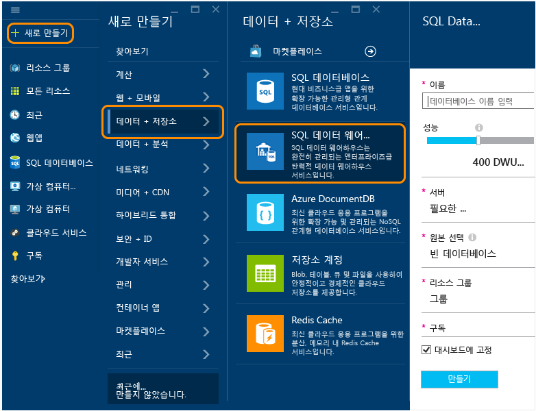

<properties
	pageTitle="Azure Preview 포털에서 SQL 데이터 웨어하우스 데이터베이스 만들기 | Microsoft Azure"
	description="Azure Preview 포털에서 SQL 데이터 웨어하우스를 만드는 방법 알아보기"
	services="sql-data-warehouse"
	documentationCenter="NA"
	authors="lodipalm"
	manager="barbkess"
	editor=""
	tags="azure-sql-data-warehouse"/>
<tags
   ms.service="sql-data-warehouse"
   ms.devlang="NA"
   ms.topic="article"
   ms.tgt_pltfrm="NA"
   ms.workload="data-services"
   ms.date="09/29/2015"
   ms.author="lodipalm;barbkess"/>

# Azure Preview 포털에서 SQL 데이터 웨어하우스 만들기#

이 자습서에서는 Azure Preview 포털에서 Azure SQL 데이터 웨어하우스를 몇 분 이내에 간편하게 만드는 방법을 보여줍니다.

이 연습에서는 다음을 수행합니다.

- 새 SQL 데이터 웨어하우스 데이터베이스를 만듭니다.
- 데이터베이스에 대한 서버 만들기
- AdventureWorksDW를 새 데이터베이스에 로드합니다.

[AZURE.INCLUDE [free-trial-note](../../includes/free-trial-note.md)]

## SQL 데이터 웨어하우스에 로그인 및 찾기

1. [Preview 포털](https://portal.azure.com)에 로그인합니다.

2. 허브 메뉴에서 **새로 만들기** > **데이터 + 저장소** > **SQL 데이터 웨어하우스**를 클릭합니다.

	

## 성능 및 다른 기본 설정 구성

**SQL 데이터 웨어하우스** 창에서 다음 필드를 작성합니다. **서버** 및 **소스**는 다음 섹션에서 구성합니다.

1. **데이터베이스 이름**: SQL 데이터 웨어하우스 데이터베이스에 대한 이름을 입력합니다.

2. **성능**: 프로비전하는 동안 인스턴스가 시작할 성능을 조정할 수 있습니다. SQL 데이터 웨어하우스가 제공하는 더 많은 MPP 이점을 볼 수 있으므로 400 DWU로 시작하는 것이 좋습니다.
     
    

    > [AZURE.NOTE] 데이터 웨어하우스 단위(DWU)에서 성능을 측정합니다. DWU를 증가시킴에 따라 SQL 데이터 웨어하우스는 데이터 웨어하우스 데이터베이스 작업에 사용할 수 있는 컴퓨팅 리소스를 증가시킵니다.

	> [AZURE.NOTE] 데이터베이스가 생성된 후 성능 수준을 빠르고 쉽게 변경할 수 있습니다. 예를 들어 데이터베이스를 사용하지 않는 경우 슬라이더를 왼쪽으로 이동하여 비용을 줄입니다. 또는 더 많은 리소스가 필요한 경우 성능을 향상시킵니다. 이 기능은 SQL 데이터 웨어하우스의 확장 가능한 기능입니다.
	

2. **리소스 그룹**. 기본값을 유지합니다. 리소스 그룹은 컨테이너로, Azure 리소스의 컬렉션을 관리할 수 있도록 디자인되었습니다. [리소스 그룹](../azure-portal/resource-group-portal.md)에 대해 알아봅니다.
3. **구독**: 이 데이터베이스에 대해 요금을 청구할 구독을 선택합니다.

## 논리 서버 구성

3. **서버** > **새 서버 만들기**를 클릭합니다. 이때 데이터베이스가 관련된 논리 서버가 생성됩니다. 사용할 V12 서버가 이미 있는 경우 기존 서버를 선택하고 다음 섹션으로 이동합니다.

    

    >[AZURE.NOTE] SQL 데이터 웨어하우스 및 SQL 데이터베이스에서 서버는 클라우드 기반 데이터베이스를 구성하는 일관된 방법을 제공합니다. Azure에서 서버는 단일 데이터 센터에 연결되지만 SQL Server의 온-프레미스 인스턴스에 대한 것처럼 실제 하드웨어가 아니라 서비스 소프트웨어의 일부입니다. 이 때문에 서버를 논리 서버라고 합니다. 참고로 실제 환경과 달리 데이터베이스와 데이터 웨어하우스를 동일한 서버에서 실행 중인 워크로드는 서로의 성능에 영향을 미치지 않습니다.

1. **새 서버** 창에서 요청된 정보를 입력합니다.

    서버 이름, 관리자 이름 및 암호를 어딘가에 저장해야 합니다. 서버에 로그온하려면 이 정보가 필요합니다.
	- **서버 이름**. 논리 서버에 대한 이름을 입력합니다.
	- **서버 관리자 이름**. 서버 관리자 계정에 대한 사용자 이름을 입력합니다.
	- **암호**. 서버 관리자 암호를 입력합니다.
	- **위치**. 사용자 또는 다른 Azure 리소스 가까이에 있는 지리적 위치를 선택합니다. 이렇게 하면 논리 서버에 속하는 모든 데이터베이스와 리소스가 실제로 동일한 영역에 위치하게 됩니다.

    

1. **확인**을 클릭하여 서버 구성 설정을 저장합니다.

## 샘플 데이터베이스 로드

1. **소스** > **샘플**을 선택하여 새 데이터베이스를 예제 데이터베이스 AdventureWorksDW로 초기화합니다. 

    

## 데이터베이스 만들기 마침

1. **만들기**를 클릭하여 SQL 데이터 웨어하우스 데이터베이스를 만듭니다. 

1. 이제 몇 분만 기다리면 됩니다. 완료되면 샘플 데이터베이스가 홈 페이지에 나타납니다.

    

## 다음 단계

이제 SQL 데이터 웨어하우스에 대한 샘플 데이터베이스를 만들었으므로, 다음 연습에서는 SQL 데이터 웨어하우스를 사용하는 방법에 대해 더 자세히 알아봅니다.

- [연결 및 쿼리](./sql-data-warehouse-get-started-connect-query.md).

	> [AZURE.NOTE] 이 문서를 보다 개선하려고 합니다. "이 문서가 도움이 되었나요?"란 질문에 "아니요"를 선택한 경우 누락된 사항이나 문서 개선 방법에 대한 제안 사항을 간략하게 입력해 주세요. 미리 감사드립니다.

<!----HONumber=Oct15_HO1-->