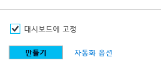
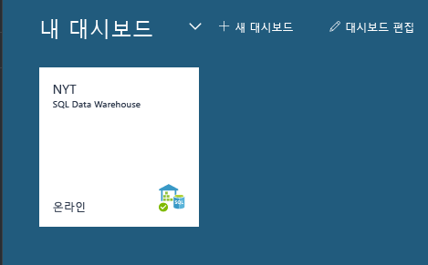
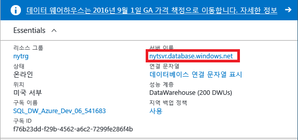
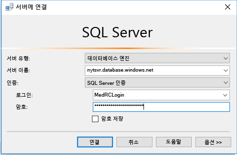
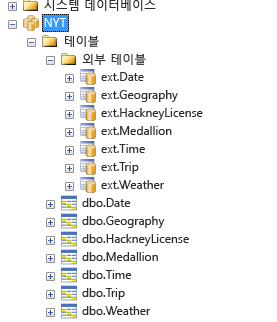
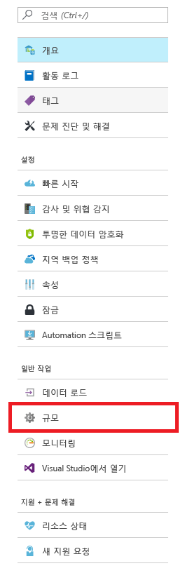
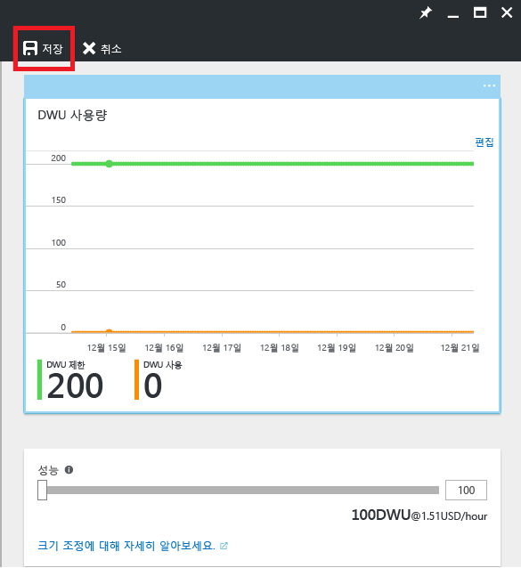

# <a name="get-started-with-sql-data-warehouse"></a>SQL Data Warehouse 시작

Azure SQL Data Warehouse 시작 자습서 이 자습서에서는 크기 조정, 일시 정지 및 튜닝에 대한 몇 가지 기본 사항뿐만 아니라 SQL Data Warehouse에 데이터를 프로비전하고 로드하기 위한 기본 사항에 대해서도 설명합니다. 

**예상 완료 시간:** 75분

## <a name="prerequisites"></a>필수 조건


### <a name="sign-up-for-microsoft-azure"></a>Microsoft Azure에 등록
Microsoft Azure 계정이 없는 아직 경우 이 서비스를 사용하려면 Microsoft Azure에 등록해야 합니다. 계정이 이미 있는 경우 이 단계를 건너뛸 수 있습니다. 

1. 계정 페이지([https://azure.microsoft.com/account/](https://azure.microsoft.com/account/))로 이동합니다.
2. 무료 Azure 계정을 만들거나 계정을 구입합니다.
3. 지침을 따릅니다.

### <a name="install-appropriate-sql-client-driver-and-tools"></a>적절한 SQL 클라이언트 드라이버 및 도구 설치

대부분의 SQL 클라이언트 도구는 JDBC, ODBC 또는 ADO.net을 사용하여 Azure SQL Data Warehouse에 연결할 수 있습니다. 제품의 복잡성과 많은 수의 SQL Data Warehouse에서 지원하는 T-SQL 기능으로 인해 모든 클라이언트 응용 프로그램이 SQL Data Warehouse와 완벽하게 호환되는 것은 아닙니다.

Windows 운영 체제를 실행하는 경우 [Visual Studio] 또는 [SQL Server Management Studio]를 사용하는 것이 좋습니다.


[!INCLUDE [Create a new logical server](../../includes/sql-data-warehouse-create-logical-server.md)] 

[!INCLUDE [SQL Database create server](../../includes/sql-database-create-new-server-firewall-portal.md)]

## <a name="create-an-azure-sql-data-warehouse"></a>Azure SQL 데이터 웨어하우스 만들기

> [!NOTE]
> SQL 데이터 웨어하우스를 만들면 새로운 유료 서비스가 발생할 수 있습니다.  자세한 내용은 [SQL Data Warehouse 가격](https://azure.microsoft.com/pricing/details/sql-data-warehouse/)을 참조하세요.
>


### <a name="create-a-sql-data-warehouse"></a>SQL 데이터 웨어하우스 만들기
1. [Azure 포털](https://portal.azure.com)에 로그인합니다.
2. **새로 만들기** > **데이터베이스** > **SQL Data Warehouse**를 차례로 클릭합니다.

    
    

3. 배포 세부 정보 작성

    **데이터베이스 이름**: 원하는 모든 항목을 선택합니다. SQL DW(SQL Data Warehouse) 인스턴스가 여러 개 있는 경우 지역, 환경 등과 같은 자세한 정보를 포함하는 것이 좋습니다(예: *mydw-westus-1-test*).

    **구독:** 사용자의 Azure 구독입니다.

    **리소스 그룹**: 새 그룹을 만들거나 다른 서비스에서 Azure SQL Data Warehouse를 사용하려는 경우 기존 그룹을 사용합니다.
    > [!NOTE]
    > 리소스 그룹 내의 서비스는 동일한 수명주기를 가져야 합니다. 리소스 그룹은 범위 지정 액세스 제어 및 템플릿 배포와 같은 리소스 관리에 유용합니다. Azure 리소스 그룹 및 모범 사례에 대한 자세한 내용은 [여기](https://docs.microsoft.com/azure/azure-resource-manager/resource-group-overview#resource-groups)를 참조하세요.
    >

    **원본**: 빈 데이터베이스

    **서버**: [필수 조건]에서 만든 서버를 선택합니다.

    **데이터 정렬**: 기본 데이터 정렬(SQL_Latin1_General_CP1_CI_AS)을 그대로 둡니다.

    **성능 선택**: 표준 400DWU를 유지하는 것이 좋습니다.

4. **대시보드에 고정**
    을 선택합니다.

5. Azure SQL Data Warehouse가 배포될 때까지 기다립니다. 일반적으로 이 프로세스는 몇 분 정도 걸립니다. 인스턴스 배포가 완료되면 포털에서 알려줍니다. 

## <a name="connect-to-azure-sql-data-warehouse-through-sql-server-logical-server"></a>SQL Server(논리 서버)를 통해 Azure SQL Data Warehouse에 연결

이 자습서에서는 SQL Server Management Studio를 사용하여 SQL Data Warehouse에 연결합니다. 지원되는 커넥터인 ADO.NET, JDBC, ODBC 및 PHP를 통해 다른 도구를 사용하면 SQL Data Warehouse에 연결할 수 있습니다. Microsoft에서 지원하지 않는 도구의 경우 기능이 제한될 수 있습니다.


### <a name="get-connection-information"></a>연결 정보 가져오기

SQL Data Warehouse에 연결하려면 [필수 조건]에서 만든 SQL Server(논리 서버)를 통해 연결해야 합니다.

1. 대시보드에서 SQL Data Warehouse를 선택하거나 리소스에서 SQL Data Warehouse를 검색합니다.

    

2. 논리 서버의 전체 이름을 찾습니다.

    

3. SSMS를 열고 개체 탐색기를 사용하여 [필수 조건]에서 만든 자격 증명을 사용하여 이 서버에 연결합니다.

    

모든 것이 제대로 수행되었으면 이제 SQL Server(논리 서버) 인스턴스에 연결되어 있어야 합니다. 서버 자격 증명을 사용하여 해당 서버의 모든 데이터베이스에 데이터베이스 소유자로서 인증할 수 있습니다. 그러나 각 데이터베이스마다 별도의 로그인과 사용자를 만드는 것이 좋습니다. [SQL Data Warehouse 사용자 만들기](./sql-data-warehouse-get-started-tutorial.md#create-a-user-for-sql-data-warehouse)에서 사용자 만들기에 대해 살펴보겠습니다. 

## <a name="create-a-user-for-sql-data-warehouse"></a>SQL Data Warehouse 사용자 만들기

### <a name="why-create-a-separate-user"></a>별도의 사용자를 만드는 이유는 무엇입니까?

이전 단계의 서버 자격 증명을 통한 SQL Server(논리 서버) 연결을 사용하여 SQL Data Warehouse에 대한 새 사용자를 만듭니다. SQL DW에 대해 별도의 사용자/로그인을 만들어야 하는 두 가지 주된 이유가 있습니다.

1.  조직의 사용자는 인증을 위해 다른 계정을 사용해야 합니다. 이러한 방식으로 응용 프로그램에 부여되는 권한을 제한하고 악의적인 활동의 위험을 줄일 수 있습니다.

2. 기본적으로 현재 연결되어 있는 서버 관리자 로그인은 더 작은 리소스 클래스를 사용합니다. 리소스 클래스는 쿼리에 지정된 메모리 할당 및 CPU 사이클을 제어하는 데 도움을 줍니다. **smallrc**의 사용자에게 더 작은 양의 메모리를 제공하여 더 높은 동시성을 활용할 수 있습니다. 반면 **xlargerc**에 할당된 사용자에게는 많은 양의 메모리를 제공하여 더 적은 쿼리를 동시에 실행할 수 있습니다. 압축을 가장 효율적으로 최적화하는 방식으로 데이터를 로드하려면 사용자가 로드하는 데이터가 더 큰 리소스 클래스의 일부인지 확인해야 합니다. 리소스 클래스에 대한 자세한 내용은 [여기](./sql-data-warehouse-develop-concurrency.md#resource-classes)를 참조하세요.

### <a name="creating-a-user-of-a-larger-resource-class"></a>더 큰 리소스 클래스의 사용자 만들기

1. 서버의 **master** 데이터베이스에 쿼리

    

    

2. 서버 로그인과 사용자를 만듭니다.

    ```sql
    CREATE LOGIN XLRCLOGIN WITH PASSWORD = 'a123reallySTRONGpassword!';
    CREATE USER LoadingUser FOR LOGIN XLRCLOGIN;
    ```

3. SQL DataWarehouse 데이터베이스를 쿼리하여 서버 로그인에 기반한 새 데이터베이스 사용자 만들기 
    ```sql
    CREATE USER LoadingUser FOR LOGIN XLRCLOGIN;
    ```

4. 사용자에게 DB 제어 권한을 부여합니다.
    ```sql
    GRANT CONTROL ON DATABASE::[NYT] to LoadingUser;
    ```
    > [!NOTE]
    > 데이터베이스 이름에 하이픈(-)이 있으면 대괄호로 묶어야 합니다. 
    >

5. **xlargerc** 리소스 클래스 역할에 데이터베이스 사용자를 추가합니다
    ```sql
    EXEC sp_addrolemember 'xlargerc', 'LoadingUser';
    ```

6. 새 자격 증명으로 데이터베이스에 로그인합니다.

    


## <a name="loading-data"></a>데이터 로드

### <a name="defining-external-data"></a>외부 데이터 정의
1. 마스터 키를 만들고 외부 데이터 원본을 정의합니다.

    ```sql
    CREATE MASTER KEY;

    CREATE EXTERNAL DATA SOURCE NYTPublic
    WITH
    (
    TYPE = Hadoop
    , LOCATION = 'wasbs://2013@nytpublic.blob.core.windows.net/'
    );
    ```


2. 외부 파일 형식을 정의합니다.

    ```CREATE EXTERNAL FILE FORMAT``` 명령은 로드 중인 외부 데이터의 형식을 지정하는 데 사용됩니다. 뉴욕 공공 택시 데이터의 경우 Azure Blob Storage에 데이터를 저장하기 위해 두 가지 형식을 사용했습니다.

    ```sql
    CREATE EXTERNAL FILE FORMAT uncompressedcsv
    WITH
    ( FORMAT_TYPE = DELIMITEDTEXT
    , FORMAT_OPTIONS ( FIELD_TERMINATOR = ','
    , STRING_DELIMITER = ''
    , DATE_FORMAT = ''
    , USE_TYPE_DEFAULT = False
    )
    );

    CREATE EXTERNAL FILE FORMAT compressedcsv
    WITH
    ( FORMAT_TYPE = DELIMITEDTEXT
    , FORMAT_OPTIONS ( FIELD_TERMINATOR = '|'
    , STRING_DELIMITER = ''
    , DATE_FORMAT = ''
    , USE_TYPE_DEFAULT = False
    )
    , DATA_COMPRESSION = 'org.apache.hadoop.io.compress.GzipCodec'
    );
    ```

3.  외부 파일 형식에 대한 스키마를 만듭니다.

    ```sql
    CREATE SCHEMA ext;
    GO
    ```

4. 외부 테이블을 만듭니다. 이러한 테이블은 HDFS 또는 Azure Blob 저장소에 저장된 데이터를 참조합니다. 

    ```sql
    CREATE EXTERNAL TABLE [ext].[Date] 
    (
    [DateID] int NOT NULL,
    [Date] datetime NULL,
    [DateBKey] char(10) COLLATE SQL_Latin1_General_CP1_CI_AS NULL,
    [DayOfMonth] varchar(2) COLLATE SQL_Latin1_General_CP1_CI_AS NULL,
    [DaySuffix] varchar(4) COLLATE SQL_Latin1_General_CP1_CI_AS NULL,
    [DayName] varchar(9) COLLATE SQL_Latin1_General_CP1_CI_AS NULL,
    [DayOfWeek] char(1) COLLATE SQL_Latin1_General_CP1_CI_AS NULL,
    [DayOfWeekInMonth] varchar(2) COLLATE SQL_Latin1_General_CP1_CI_AS NULL,
    [DayOfWeekInYear] varchar(2) COLLATE SQL_Latin1_General_CP1_CI_AS NULL,
    [DayOfQuarter] varchar(3) COLLATE SQL_Latin1_General_CP1_CI_AS NULL,
    [DayOfYear] varchar(3) COLLATE SQL_Latin1_General_CP1_CI_AS NULL,
    [WeekOfMonth] varchar(1) COLLATE SQL_Latin1_General_CP1_CI_AS NULL,
    [WeekOfQuarter] varchar(2) COLLATE SQL_Latin1_General_CP1_CI_AS NULL,
    [WeekOfYear] varchar(2) COLLATE SQL_Latin1_General_CP1_CI_AS NULL,
    [Month] varchar(2) COLLATE SQL_Latin1_General_CP1_CI_AS NULL,
    [MonthName] varchar(9) COLLATE SQL_Latin1_General_CP1_CI_AS NULL,
    [MonthOfQuarter] varchar(2) COLLATE SQL_Latin1_General_CP1_CI_AS NULL,
    [Quarter] char(1) COLLATE SQL_Latin1_General_CP1_CI_AS NULL,
    [QuarterName] varchar(9) COLLATE SQL_Latin1_General_CP1_CI_AS NULL,
    [Year] char(4) COLLATE SQL_Latin1_General_CP1_CI_AS NULL,
    [YearName] char(7) COLLATE SQL_Latin1_General_CP1_CI_AS NULL,
    [MonthYear] char(10) COLLATE SQL_Latin1_General_CP1_CI_AS NULL,
    [MMYYYY] char(6) COLLATE SQL_Latin1_General_CP1_CI_AS NULL,
    [FirstDayOfMonth] date NULL,
    [LastDayOfMonth] date NULL,
    [FirstDayOfQuarter] date NULL,
    [LastDayOfQuarter] date NULL,
    [FirstDayOfYear] date NULL,
    [LastDayOfYear] date NULL,
    [IsHolidayUSA] bit NULL,
    [IsWeekday] bit NULL,
    [HolidayUSA] varchar(50) COLLATE SQL_Latin1_General_CP1_CI_AS NULL
    )
    WITH
    (
    LOCATION = 'Date'
    , DATA_SOURCE = NYTPublic
    , FILE_FORMAT = uncompressedcsv
    , REJECT_TYPE = value
    , REJECT_VALUE = 0
    )
    CREATE EXTERNAL TABLE [ext].[Geography]
    (
    [GeographyID] int NOT NULL,
    [ZipCodeBKey] varchar(10) COLLATE SQL_Latin1_General_CP1_CI_AS NOT NULL,
    [County] varchar(50) COLLATE SQL_Latin1_General_CP1_CI_AS NULL,
    [City] varchar(50) COLLATE SQL_Latin1_General_CP1_CI_AS NULL,
    [State] varchar(50) COLLATE SQL_Latin1_General_CP1_CI_AS NULL,
    [Country] varchar(50) COLLATE SQL_Latin1_General_CP1_CI_AS NULL,
    [ZipCode] varchar(50) COLLATE SQL_Latin1_General_CP1_CI_AS NULL
    )
    WITH
    (
    LOCATION = 'Geography'
    , DATA_SOURCE = NYTPublic
    , FILE_FORMAT = uncompressedcsv
    , REJECT_TYPE = value
    , REJECT_VALUE = 0 
    )
    ;
    CREATE EXTERNAL TABLE [ext].[HackneyLicense]
    (
    [HackneyLicenseID] int NOT NULL,
    [HackneyLicenseBKey] varchar(50) COLLATE SQL_Latin1_General_CP1_CI_AS NOT NULL,
    [HackneyLicenseCode] varchar(50) COLLATE SQL_Latin1_General_CP1_CI_AS NULL
    )
    WITH
    (
    LOCATION = 'HackneyLicense'
    , DATA_SOURCE = NYTPublic
    , FILE_FORMAT = uncompressedcsv
    , REJECT_TYPE = value
    , REJECT_VALUE = 0
    )
    ;
    CREATE EXTERNAL TABLE [ext].[Medallion]
    (
    [MedallionID] int NOT NULL,
    [MedallionBKey] varchar(50) COLLATE SQL_Latin1_General_CP1_CI_AS NOT NULL,
    [MedallionCode] varchar(50) COLLATE SQL_Latin1_General_CP1_CI_AS NULL
    )
    WITH
    (
    LOCATION = 'Medallion'
    , DATA_SOURCE = NYTPublic
    , FILE_FORMAT = uncompressedcsv
    , REJECT_TYPE = value
    , REJECT_VALUE = 0
    )
    ;
    CREATE EXTERNAL TABLE [ext].[Time]
    (
    [TimeID] int NOT NULL,
    [TimeBKey] varchar(8) COLLATE SQL_Latin1_General_CP1_CI_AS NOT NULL,
    [HourNumber] tinyint NOT NULL,
    [MinuteNumber] tinyint NOT NULL,
    [SecondNumber] tinyint NOT NULL,
    [TimeInSecond] int NOT NULL,
    [HourlyBucket] varchar(15) COLLATE SQL_Latin1_General_CP1_CI_AS NOT NULL,
    [DayTimeBucketGroupKey] int NOT NULL,
    [DayTimeBucket] varchar(100) COLLATE SQL_Latin1_General_CP1_CI_AS NOT NULL
    )
    WITH
    (
    LOCATION = 'Time'
    , DATA_SOURCE = NYTPublic
    , FILE_FORMAT = uncompressedcsv
    , REJECT_TYPE = value
    , REJECT_VALUE = 0
    )
    ;
    CREATE EXTERNAL TABLE [ext].[Trip]
    (
    [DateID] int NOT NULL,
    [MedallionID] int NOT NULL,
    [HackneyLicenseID] int NOT NULL,
    [PickupTimeID] int NOT NULL,
    [DropoffTimeID] int NOT NULL,
    [PickupGeographyID] int NULL,
    [DropoffGeographyID] int NULL,
    [PickupLatitude] float NULL,
    [PickupLongitude] float NULL,
    [PickupLatLong] varchar(50) COLLATE SQL_Latin1_General_CP1_CI_AS NULL,
    [DropoffLatitude] float NULL,
    [DropoffLongitude] float NULL,
    [DropoffLatLong] varchar(50) COLLATE SQL_Latin1_General_CP1_CI_AS NULL,
    [PassengerCount] int NULL,
    [TripDurationSeconds] int NULL,
    [TripDistanceMiles] float NULL,
    [PaymentType] varchar(50) COLLATE SQL_Latin1_General_CP1_CI_AS NULL,
    [FareAmount] money NULL,
    [SurchargeAmount] money NULL,
    [TaxAmount] money NULL,
    [TipAmount] money NULL,
    [TollsAmount] money NULL,
    [TotalAmount] money NULL
    )
    WITH
    (
    LOCATION = 'Trip2013'
    , DATA_SOURCE = NYTPublic
    , FILE_FORMAT = compressedcsv
    , REJECT_TYPE = value
    , REJECT_VALUE = 0
    )
    ;
    CREATE EXTERNAL TABLE [ext].[Weather]
    (
    [DateID] int NOT NULL,
    [GeographyID] int NOT NULL,
    [PrecipitationInches] float NOT NULL,
    [AvgTemperatureFahrenheit] float NOT NULL
    )
    WITH
    (
    LOCATION = 'Weather2013'
    , DATA_SOURCE = NYTPublic
    , FILE_FORMAT = uncompressedcsv
    , REJECT_TYPE = value
    , REJECT_VALUE = 0
    )
    ;
    ```

### <a name="create-table-as-select-ctas"></a>CTAS(Create Table as Select)

5. 외부 테이블의 데이터를 SQL Data Warehouse 인스턴스로 로드합니다. 
    ```sql
    CREATE TABLE [dbo].[Date]
    WITH
    ( DISTRIBUTION = ROUND_ROBIN
    , CLUSTERED COLUMNSTORE INDEX
    )
    AS
    SELECT *
    FROM [ext].[Date]
    OPTION (LABEL = 'CTAS : Load [dbo].[Date]')
    ;
    CREATE TABLE [dbo].[Geography]
    WITH
    ( DISTRIBUTION = ROUND_ROBIN
    , CLUSTERED COLUMNSTORE INDEX
    )
    AS
    SELECT *
    FROM [ext].[Geography]
    OPTION (LABEL = 'CTAS : Load [dbo].[Geography]')
    ;
    CREATE TABLE [dbo].[HackneyLicense]
    WITH
    ( DISTRIBUTION = ROUND_ROBIN
    , CLUSTERED COLUMNSTORE INDEX
    )
    AS
    SELECT *
    FROM [ext].[HackneyLicense]
    OPTION (LABEL = 'CTAS : Load [dbo].[HackneyLicense]')
    ;
    CREATE TABLE [dbo].[Medallion]
    WITH
    ( DISTRIBUTION = ROUND_ROBIN
    , CLUSTERED COLUMNSTORE INDEX
    )
    AS
    SELECT *
    FROM [ext].[Medallion]
    OPTION (LABEL = 'CTAS : Load [dbo].[Medallion]')
    ;
    CREATE TABLE [dbo].[Time]
    WITH
    ( DISTRIBUTION = ROUND_ROBIN
    , CLUSTERED COLUMNSTORE INDEX
    )
    AS
    SELECT *
    FROM [ext].[Time]
    OPTION (LABEL = 'CTAS : Load [dbo].[Time]')
    ;
    CREATE TABLE [dbo].[Weather]
    WITH
    ( DISTRIBUTION = ROUND_ROBIN
    , CLUSTERED COLUMNSTORE INDEX
    )
    AS
    SELECT *
    FROM [ext].[Weather]
    OPTION (LABEL = 'CTAS : Load [dbo].[Weather]')
    ;
    CREATE TABLE [dbo].[Trip]
    WITH
    ( DISTRIBUTION = ROUND_ROBIN
    , CLUSTERED COLUMNSTORE INDEX
    )
    AS
    SELECT *
    FROM [ext].[Trip]
    OPTION (LABEL = 'CTAS : Load [dbo].[Trip]')
    ;
    ```

    > [!NOTE]
    > 몇 GB의 데이터를 로드하고 고성능 Cluster Columnstore Index에 압축합니다. 다음 DMV 쿼리를 실행한 후 Azure SQL Data Warehouse에서 몇 가지 주요 작업을 수행하는 동안 커피 또는 스낵을 즐기세요.
    >

6. 새 쿼리를 만들고 이 DMV(동적 관리 뷰)로 데이터가 들어오는 것을 지켜봅니다.

    ```sql
    SELECT
    r.command,
    s.request_id,
    r.status,
    count(distinct input_name) as nbr_files,
    sum(s.bytes_processed)/1024/1024 as gb_processed
    FROM
    sys.dm_pdw_exec_requests r
    inner join sys.dm_pdw_dms_external_work s
    on r.request_id = s.request_id
    WHERE
    r.[label] = 'CTAS : Load [dbo].[Date]' OR
    r.[label] = 'CTAS : Load [dbo].[Geography]' OR
    r.[label] = 'CTAS : Load [dbo].[HackneyLicense]' OR
    r.[label] = 'CTAS : Load [dbo].[Medallion]' OR
    r.[label] = 'CTAS : Load [dbo].[Time]' OR
    r.[label] = 'CTAS : Load [dbo].[Weather]' OR
    r.[label] = 'CTAS : Load [dbo].[Trip]'
    GROUP BY
    r.command,
    s.request_id,
    r.status
    ORDER BY
    nbr_files desc, gb_processed desc;
    ```

7. 모든 시스템 쿼리를 표시합니다.

    ```sql
    SELECT * FROM sys.dm_pdw_exec_requests;
    ```

8. Azure SQL Data Warehouse에 로드된 데이터를 즐깁니다.

    


## <a name="querying-data"></a>데이터 쿼리 

### <a name="scan-query-with-scaling"></a>크기 조정을 사용하여 쿼리 스캔

크기 조정이 쿼리 속도에 미치는 영향에 대해 알아보겠습니다.

시작하기 전에 작업을 100DWU로 축소하여 하나의 계산 노드에서 자체적으로 수행할 수 있는 방법에 대한 아이디어를 얻을 수 있도록 하겠습니다.

1. 포털로 이동하여 SQL Data Warehouse 인스턴스를 선택합니다.

2. SQL Data Warehouse 블레이드에서 [크기 조정]을 선택합니다. 

    

3. 성능 막대를 100DWU로 낮추고 [저장]을 누릅니다.

    

4. 크기 조정 작업이 끝날 때까지 기다립니다.

    > [!NOTE]
    > 크기 조정 작업은 현재 실행 중인 쿼리를 **중단**하고 새로운 쿼리가 실행되지 않도록 합니다.
    >
    
5. 모든 열에 대해 상위&1;백만 개 항목을 선택하여 여행 데이터에서 스캔 작업을 수행합니다. 신속하게 넘어가려면 더 적은 수의 열을 선택합니다.

    ```sql
    SELECT TOP(1000000) * FROM dbo.[Trip]
    ```

이 작업을 실행하는 데 걸린 시간을 기록해 둡니다.

6. 인스턴스를 400DWU로 확장합니다. 각각의 100DWU는 Azure SQL Data Warehouse에 또 다른 계산 노드를 추가한다는 것을 기억하세요.

7. 쿼리를 다시 실행합니다. 상당한 차이에 주목해야 합니다. 

> [!NOTE]
> Azure SQL Data Warehouse는 MPP(Massively Parallel Processing) 플랫폼입니다. 다양한 노드 간에 작업을 병렬 처리할 수 있는 쿼리 및 연산은 Azure SQL Data Warehouse의 진정한 능력을 보여 줍니다.
>

### <a name="join-query-with-statistics"></a>통계를 사용하여 쿼리 조인

1. Date 테이블과 Trip 테이블을 조인하는 쿼리를 실행합니다.

    ```sql
    SELECT TOP (1000000) dt.[DayOfWeek]
    ,tr.[MedallionID]
    ,tr.[HackneyLicenseID]
    ,tr.[PickupTimeID]
    ,tr.[DropoffTimeID]
    ,tr.[PickupGeographyID]
    ,tr.[DropoffGeographyID]
    ,tr.[PickupLatitude]
    ,tr.[PickupLongitude]
    ,tr.[PickupLatLong]
    ,tr.[DropoffLatitude]
    ,tr.[DropoffLongitude]
    ,tr.[DropoffLatLong]
    ,tr.[PassengerCount]
    ,tr.[TripDurationSeconds]
    ,tr.[TripDistanceMiles]
    ,tr.[PaymentType]
    ,tr.[FareAmount]
    ,tr.[SurchargeAmount]
    ,tr.[TaxAmount]
    ,tr.[TipAmount]
    ,tr.[TollsAmount]
    ,tr.[TotalAmount]
    FROM [dbo].[Trip] as tr
    join
    dbo.[Date] as dt
    on tr.DateID = dt.DateID
    ```

    예상할 수 있듯이, 특히 이 쿼리와 같은 조인 시나리오에서 노드 간에 데이터를 섞으면 쿼리가 훨씬 더 오래 걸립니다.

2. 다음을 실행하여 조인하는 열에 대한 통계를 만들 때 이 쿼리와 어떻게 다른지 알아보겠습니다.

    ```sql
    CREATE STATISTICS [dbo.Date DateID stats] ON dbo.Date (DateID);
    CREATE STATISTICS [dbo.Trip DateID stats] ON dbo.Trip (DateID);
    ```

    > [!NOTE]
    > SQL DW에서는 통계를 자동으로 관리하지 않습니다. 통계는 쿼리 성능에 중요하며, 통계를 만들고 업데이트하는 것이 좋습니다.
    > 
    > **조인에 포함된 열, WHERE 절에 사용된 열 및 GROUP BY에 있는 열에서 통계를 유지하면 가장 많은 이득을 획득할 수 있습니다.**
    >

3. 필수 조건에서 쿼리를 다시 실행하고 성능 차이를 관찰합니다. 쿼리 성능의 차이는 확장하는 만큼 급격한 것은 아니지만 눈에 띄는 속도 향상에 주목해야 합니다. 

## <a name="next-steps"></a>다음 단계

이제 쿼리하고 탐색할 준비가 되었습니다. 모범 사례 또는 팁을 확인합니다.

하루 종일 탐색하는 경우 인스턴스를 일시 중지합니다. 프로덕션 환경에서는 비즈니스 요구에 맞게 일시 중지 및 크기 조정하여 상당한 비용을 절감할 수 있습니다.


## <a name="useful-readings"></a>유용한 정보

[동시성 및 워크로드 관리]

[Azure SQL 데이터 웨어하우스에 대한 모범 사례]

[쿼리 모니터링]

[대규모 관계형 데이터 웨어하우스를 구축하기 위한 상위 10가지 모범 사례](영문)

[Azure SQL Data Warehouse로 데이터 마이그레이션](영문)


[동시성 및 워크로드 관리]: sql-data-warehouse-develop-concurrency.md#change-a-user-resource-class-example
[Azure SQL 데이터 웨어하우스에 대한 모범 사례]: sql-data-warehouse-best-practices.md#hash-distribute-large-tables
[쿼리 모니터링]: sql-data-warehouse-manage-monitor.md
[대규모 관계형 데이터 웨어하우스를 구축하기 위한 상위 10가지 모범 사례]: https://blogs.msdn.microsoft.com/sqlcat/2013/09/16/top-10-best-practices-for-building-a-large-scale-relational-data-warehouse/(영문)
[Azure SQL Data Warehouse로 데이터 마이그레이션]: https://blogs.msdn.microsoft.com/sqlcat/2016/08/18/migrating-data-to-azure-sql-data-warehouse-in-practice/(영문)


[!INCLUDE [Additional Resources](../../includes/sql-data-warehouse-article-footer.md)]

<!-- Internal Links -->
[필수 조건]: sql-data-warehouse-get-started-tutorial.md#prerequisites

<!--Other Web references-->
[Visual Studio]: https://www.visualstudio.com/
[SQL Server Management Studio]: https://msdn.microsoft.com/en-us/library/mt238290.aspx


<!--HONumber=Jan17_HO3-->


