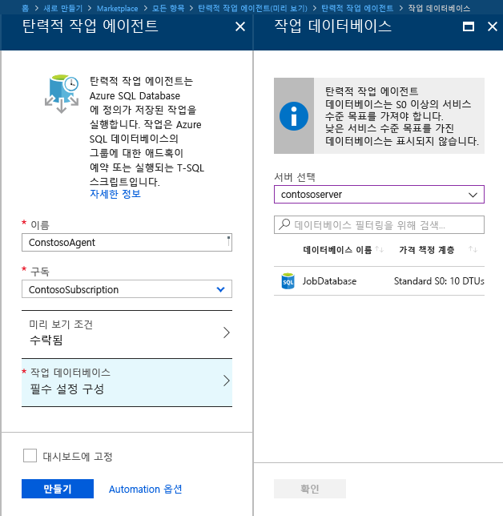
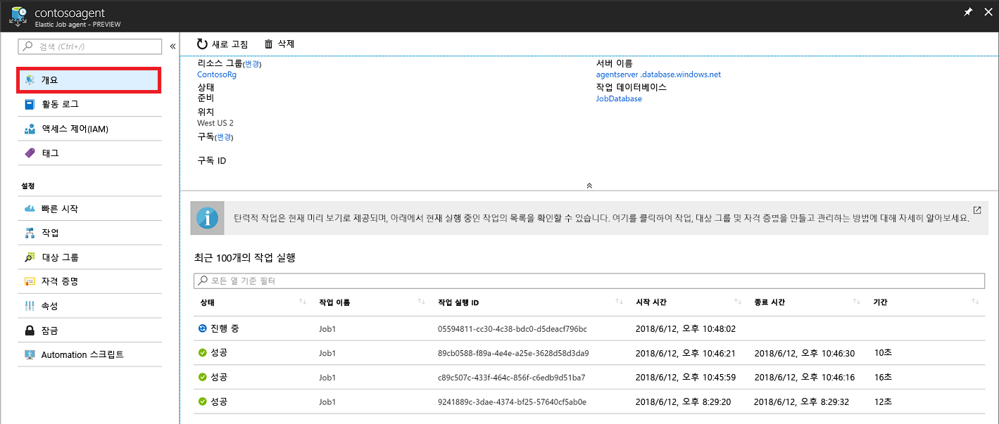
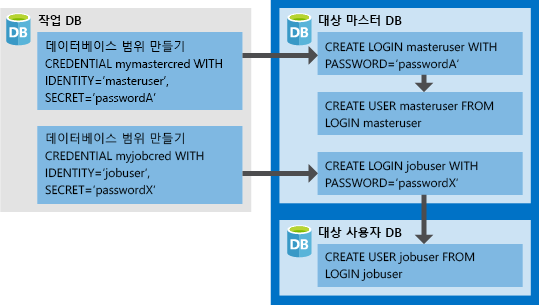

# <a name="create-configure-and-manage-elastic-jobs"></a>탄력적 작업 만들기, 구성 및 관리

이 문서에서는 탄력적 작업을 만들고, 구성하고, 관리하는 방법을 배웁니다. 탄력적 작업을 사용한 적이 없으면 [Azure SQL Database의 작업 자동화 개념에 대해 자세히 알아봅니다](sql-database-job-automation-overview.md).

## <a name="create-and-configure-the-agent"></a>에이전트 만들기 및 구성

1. 빈 S0 이상의 SQL 데이터베이스를 만들거나 식별합니다. 이 데이터베이스는 탄력적 작업 에이전트를 만드는 동안 *작업 데이터베이스*로 사용됩니다.
2. [포털](https://portal.azure.com/#create/Microsoft.SQLElasticJobAgent)에서 또는 [PowerShell](elastic-jobs-powershell.md#create-the-elastic-job-agent)로 탄력적 작업 에이전트 만듭니다.

   

## <a name="create-run-and-manage-jobs"></a>작업 만들기, 실행 및 관리

1. [PowerShell](elastic-jobs-powershell.md#create-job-credentials-so-that-jobs-can-execute-scripts-on-its-targets) 또는 [T-SQL](elastic-jobs-tsql.md#create-a-credential-for-job-execution)을 사용하여 *작업 데이터베이스*에서 작업 실행에 대한 자격 증명을 만듭니다.
2. [PowerShell](elastic-jobs-powershell.md#define-the-target-databases-you-want-to-run-the-job-against) 또는 [T-SQL](elastic-jobs-tsql.md#create-a-target-group-servers)을 사용하여 대상 그룹(작업을 실행하려는 데이터베이스)을 정의합니다.
3. 작업을 실행할 각 데이터베이스에서 작업 에이전트 자격 증명을 만듭니다[(그룹의 각 데이터베이스에서 사용자(또는 역할)를 추가합니다)](sql-database-control-access.md). 예를 들어 [PowerShell 자습서](elastic-jobs-powershell.md#create-job-credentials-so-that-jobs-can-execute-scripts-on-its-targets)를 참조합니다.
4. [PowerShell](elastic-jobs-powershell.md#create-a-job) 또는 [T-SQL](elastic-jobs-tsql.md#deploy-new-schema-to-many-databases)을 사용하여 작업을 만듭니다.
5. [PowerShell](elastic-jobs-powershell.md#create-a-job-step) 또는 [T-SQL](elastic-jobs-tsql.md#deploy-new-schema-to-many-databases)을 사용하여 작업 단계를 추가합니다.
6. [PowerShell](elastic-jobs-powershell.md#run-the-job) 또는 [T-SQL](elastic-jobs-tsql.md#begin-ad-hoc-execution-of-a-job)을 사용하여 작업을 실행합니다.
7. 포털, [PowerShell](elastic-jobs-powershell.md#monitor-status-of-job-executions) 또는 [T-SQL](elastic-jobs-tsql.md#monitor-job-execution-status)을 사용하여 작업 실행 상태를 모니터링합니다.

   

## <a name="credentials-for-running-jobs"></a>실행 중인 작업에 대한 자격 증명

실행 시 대상 그룹에서 지정한 데이터베이스에 연결하려면 작업은 [데이터베이스 범위 자격 증명](/sql/t-sql/statements/create-database-scoped-credential-transact-sql)을 사용합니다. 대상 그룹에 서버 또는 풀이 포함되어 있는 경우 이러한 데이터베이스 범위 자격 증명은 사용 가능한 데이터베이스를 열거하는 master 데이터베이스에 연결하는 데 사용됩니다.

작업을 실행하기 위해 적절한 자격 증명을 설정하면 다소 혼동을 줄 수 있으므로 다음 사항을 염두에 두어야 합니다.

- 데이터베이스 범위 자격 증명은 *작업 데이터베이스*에서 만들어져야 합니다.
- **모든 대상 데이터베이스는 작업이 성공적으로 완료되게 하려면 [충분한 사용 권한](https://docs.microsoft.com/sql/relational-databases/security/permissions-database-engine)으로 로그인해야 합니다**(아래 다이어그램의 `jobuser`).
- 자격 증명은 작업 간에 다시 사용할 수 있고, 자격 증명 암호는 암호화되어 작업 개체에 읽기 전용 액세스 권한이 있는 사용자로부터 보호됩니다.

다음 이미지는 적절한 작업 자격 증명을 이해하고 설정하는 데 도움이 되도록 설계되었습니다. **모든 데이터베이스에서 사용자를 만들려면(모든 *대상 사용자 dbs*) 작업이 실행돼야 합니다**.



## <a name="security-best-practices"></a>보안 모범 사례

탄력적 작업으로 작업하는 것에 대한 몇 가지 모범 사례 고려 사항입니다.

- API 사용을 신뢰할 수 있는 개인으로 제한합니다.
- 자격 증명은 작업 단계를 수행하는 데 필요한 최소한의 권한만 있어야 합니다. 자세한 내용은 [SQL Server 권한 부여 및 사용 권한](https://docs.microsoft.com/dotnet/framework/data/adonet/sql/authorization-and-permissions-in-sql-server)을 참조하세요.
- 서버 및/또는 풀 대상 그룹 구성원을 사용할 경우 작업 실행 전에 서버 및/또는 풀의 데이터베이스 목록을 확장하는 데 사용되는 데이터베이스를 보려면/나열하려면 master 데이터베이스에 대한 권한이 있는 별도 자격 증명을 만들 것을 강력히 제안합니다.

## <a name="agent-performance-capacity-and-limitations"></a>에이전트 성능, 용량 및 제한 사항

탄력적 작업은 장기 실행 작업이 완료되기를 기다리는 동안 최소한의 계산 리소스를 사용합니다.

작업(동시 작업자 수)에 대한 원하는 실행 시간 및 데이터베이스의 대상 그룹 크기에 따라 에이전트는 *작업 데이터베이스*의 다른 양의 성능 및 계산을 요구합니다(대상 및 작업 수가 많아질수록 필요한 계산 양도 더 많아집니다).

현재 미리 보기의 동시 작업은 100개로 제한됩니다.

### <a name="prevent-jobs-from-reducing-target-database-performance"></a>작업이 대상 데이터베이스 성능을 감소시키는 것을 방지

SQL 탄력적인 풀에서 데이터베이스에 대해 작업을 실행할 때 리소스에 작업 부하를 주지 않도록 하려면 작업이 동시에 실행될 수 있는 데이터베이스의 수를 제한하도록 작업을 구성할 수 있습니다.

작업에서 설정 하 여 실행 하는 동시 데이터베이스 수를 설정 합니다 `sp_add_jobstep` 저장 프로시저의 `@max_parallelism` T-SQL에서 매개 변수 또는 `Add-AzSqlElasticJobStep -MaxParallelism` PowerShell에서.

## <a name="best-practices-for-creating-jobs"></a>작업을 만들기 위한 모범 사례

### <a name="idempotent-scripts"></a>Idempotent 스크립트
작업의 T-SQL 스크립트는 [idempotent](https://en.wikipedia.org/wiki/Idempotence)여야 합니다. **Idempotent**는 스크립트가 성공한 경우를 나타내고 다시 실행하면 동일한 결과가 발생합니다. 일시적인 네트워크 문제로 인해 스크립트가 실패할 수 있습니다. 이 경우 작업에서 중지하기 전에 스크립트 실행을 미리 설정된 횟수 만큼 자동으로 다시 시도합니다. idempotent 스크립트는 성공적으로 두 번(이상) 실행된 경우에도 동일한 결과를 포함합니다.

간단한 방법은 만들기 전에 개체의 존재 여부를 테스트하는 것입니다.


```sql
IF NOT EXIST (some_object)
    -- Create the object
    -- If it exists, drop the object before recreating it.
```

마찬가지로 스크립트는 논리적으로 테스트하고 발견된 모든 조건을 고려하여 성공적으로 실행할 수 있어야 합니다.


## <a name="next-steps"></a>다음 단계

- [PowerShell을 사용하여 탄력적 작업 만들기 및 관리](elastic-jobs-powershell.md)
- [T-SQL(Transact-SQL)을 사용하여 탄력적 작업 만들기 및 관리](elastic-jobs-tsql.md)
