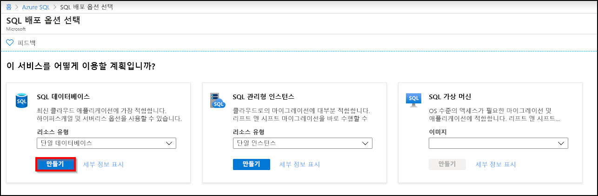
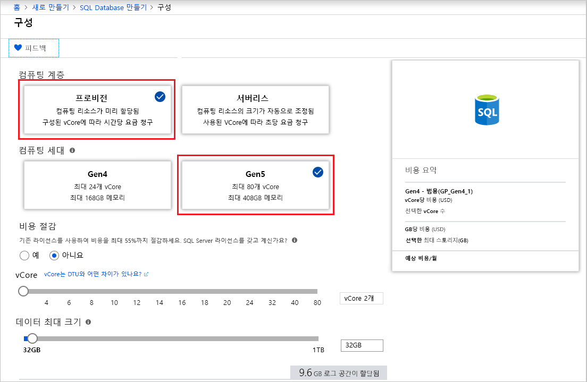
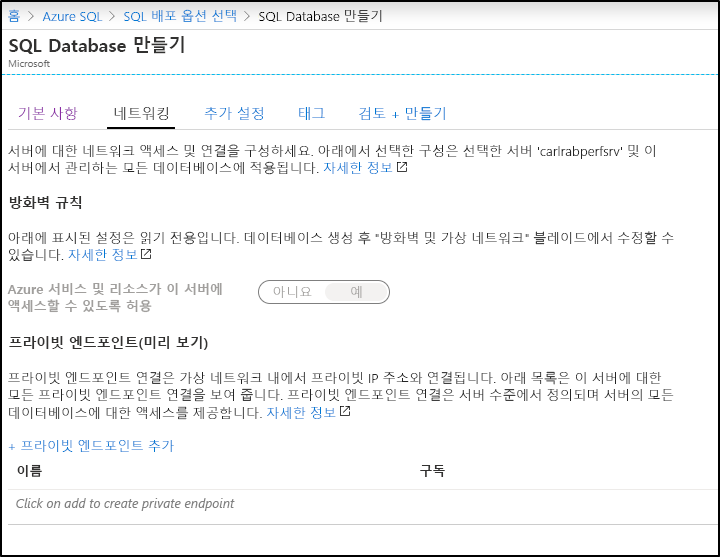

이 단계에서는 Azure SQL Database 단일 데이터베이스를 만듭니다. 

> [!IMPORTANT]
> 이 문서를 완료하기 위해 사용 중인 컴퓨터의 공용 IP 주소를 사용하도록 방화벽 규칙을 설정해야 합니다.
>
> 자세한 내용은 [데이터베이스 수준 방화벽 규칙 만들기](/sql/relational-databases/system-stored-procedures/sp-set-database-firewall-rule-azure-sql-database)를 참조하세요. 사용 중인 컴퓨터용 서버 수준 방화벽 규칙에 사용되는 IP 주소를 확인하려면 [서버 수준 방화벽 만들기](../sql-database-server-level-firewall-rule.md)를 참조하세요.  

# <a name="portaltabazure-portal"></a>[포털](#tab/azure-portal)

Azure Portal를 사용하여 리소스 그룹 및 단일 데이터베이스를 만듭니다.

1. [Azure Portal](https://portal.azure.com)의 왼쪽 메뉴에서 **Azure SQL**을 선택합니다. **Azure SQL**이 목록에 없는 경우 **모든 서비스**를 선택한 다음, 검색 상자에 *Azure SQL*을 입력합니다. (선택 사항) **Azure SQL** 옆의 별표를 선택하여 즐겨찾기로 선택하고 왼쪽 탐색에 항목으로 추가합니다. 
2. **+ 추가**를 선택하여 **SQL 배포 옵션 선택** 페이지를 엽니다. **데이터베이스** 타일에서 **세부 정보 표시**를 선택하여 다른 데이터베이스에 대한 추가 정보를 볼 수 있습니다.
3. **만들기**를 선택합니다.

   

4. **기본 사항** 탭의 **프로젝트 세부 정보** 섹션에서 다음 값을 입력하거나 선택합니다.

   - **구독**: 표시되지 않는 경우 올바른 구독을 드롭다운하고 선택합니다.
   - **리소스 그룹**: **새로 만들기**를 선택하고, `myResourceGroup`을 입력하고, **확인**을 선택합니다.

     

5. **데이터베이스 세부 정보** 섹션에서 다음 값을 입력하거나 선택합니다.

   - **데이터베이스 이름**: `mySampleDatabase`를 입력합니다.
   - **서버**: **새로 만들기**를 선택하고 다음 값을 입력한 다음, **선택**을 클릭합니다.
       - **서버 이름**: `mysqlserver`에 숫자를 붙여서 고유한 이름을 입력합니다.
       - **서버 관리자 로그인**: `azureuser`.
       - **암호**: 암호 요구 사항을 충족하는 복잡한 암호를 입력합니다.
       - **위치**: 드롭다운 목록에서 위치를 선택합니다(예: `West US`).

         

      > [!IMPORTANT]
      > 빠른 시작을 위해 서버 및 데이터베이스에 로그인할 수 있도록 서버 관리자 로그인 및 암호를 적어 둡니다. 로그인 또는 암호를 잊은 경우 **SQL 서버** 페이지에서 로그인 이름을 얻거나 암호를 다시 설정할 수 있습니다. **SQL 서버** 페이지를 열려면 데이터베이스를 만든 후 데이터베이스 **개요** 페이지에서 서버 이름을 선택합니다.

   - **SQL 탄력적 풀을 사용하시겠습니까?** : **아니요** 옵션을 선택합니다.
   - **컴퓨팅 및 스토리지**: **데이터베이스 구성**을 선택합니다. 

     

   - **프로비저닝**을 선택합니다.

     

   - **vCore** 및 **데이터 최대 크기**에 대한 설정을 검토합니다. 원하는 대로 변경합니다. 
     - 필요에 따라 **구성 변경**을 선택하여 하드웨어 생성을 변경할 수도 있습니다.
   - **적용**을 선택합니다.

6. **네트워킹** 탭을 선택하고 [**Azure 서비스 및 리소스가 이 서버에 액세스할 수 있도록 허용**](../sql-database-networkaccess-overview.md)하거나 [프라이빗 엔드포인트](../../private-link/private-endpoint-overview.md)를 추가할지 결정합니다.

   

7. **추가 설정** 탭을 선택합니다. 
8. **데이터 원본** 섹션의 **기존 데이터 사용** 아래에서 `Sample`을 선택합니다.

   

   > [!IMPORTANT]
   > 이 데이터를 사용하는 Azure SQL Database 빠른 시작을 쉽게 따라 할 수 있도록 **샘플(AdventureWorksLT)** 데이터를 선택해야 합니다.

9. 나머지 값은 기본값으로 두고 양식 맨 아래에서 **검토 + 만들기**를 선택합니다.
10. 최종 설정을 검토하고 **만들기**를 선택합니다.

11. **SQL Database** 양식에서 **만들기**를 선택하여 리소스 그룹, 서버 및 데이터베이스를 배포하고 프로비전합니다.

# <a name="powershelltabazure-powershell"></a>[PowerShell](#tab/azure-powershell)

[!INCLUDE [updated-for-az](../../../includes/updated-for-az.md)]

PowerShell을 사용하여 리소스 그룹 및 단일 데이터베이스를 만듭니다.

   ```powershell-interactive
   # Set variables for your server and database
   $subscriptionId = '<SubscriptionID>'
   $resourceGroupName = "myResourceGroup-$(Get-Random)"
   $location = "West US"
   $adminLogin = "azureuser"
   $password = "PWD27!"+(New-Guid).Guid
   $serverName = "mysqlserver-$(Get-Random)"
   $databaseName = "mySampleDatabase"

   # The ip address range that you want to allow to access your server 
   # (leaving at 0.0.0.0 will prevent outside-of-azure connections to your DB)
   $startIp = "0.0.0.0"
   $endIp = "0.0.0.0"

   # Show randomized variables
   Write-host "Resource group name is" $resourceGroupName 
   Write-host "Password is" $password  
   Write-host "Server name is" $serverName 

   # Connect to Azure
   Connect-AzAccount

   # Set subscription ID
   Set-AzContext -SubscriptionId $subscriptionId 

   # Create a resource group
   Write-host "Creating resource group..."
   $resourceGroup = New-AzResourceGroup -Name $resourceGroupName -Location $location -Tag @{Owner="SQLDB-Samples"}
   $resourceGroup

   # Create a server with a system wide unique server name
   Write-host "Creating primary logical server..."
   $server = New-AzSqlServer -ResourceGroupName $resourceGroupName `
      -ServerName $serverName `
      -Location $location `
      -SqlAdministratorCredentials $(New-Object -TypeName System.Management.Automation.PSCredential `
      -ArgumentList $adminLogin, $(ConvertTo-SecureString -String $password -AsPlainText -Force))
   $server

   # Create a server firewall rule that allows access from the specified IP range
   Write-host "Configuring firewall for primary logical server..."
   $serverFirewallRule = New-AzSqlServerFirewallRule -ResourceGroupName $resourceGroupName `
      -ServerName $serverName `
      -FirewallRuleName "AllowedIPs" -StartIpAddress $startIp -EndIpAddress $endIp
   $serverFirewallRule

   # Create General Purpose Gen4 database with 1 vCore
   Write-host "Creating a gen5 2 vCore database..."
   $database = New-AzSqlDatabase  -ResourceGroupName $resourceGroupName `
      -ServerName $serverName `
      -DatabaseName $databaseName `
      -Edition GeneralPurpose `
      -VCore 2 `
      -ComputeGeneration Gen5 `
      -MinimumCapacity 2 `
      -SampleName "AdventureWorksLT"
   $database
   ```

이 문서의 이 부분에서는 다음 PowerShell cmdlet을 사용합니다.

| 명령 | 메모 |
|---|---|
| [New-AzResourceGroup](/powershell/module/az.resources/new-azresourcegroup) | 모든 리소스가 저장되는 리소스 그룹을 만듭니다. |
| [New-AzSqlServer](/powershell/module/az.sql/new-azsqlserver) | 단일 데이터베이스 및 탄력적 풀을 호스트하는 SQL Database 서버를 만듭니다. |
| [New-AzSqlServerFirewallRule](/powershell/module/az.sql/new-azsqlserverfirewallrule) | 논리 서버에 대한 방화벽 규칙을 만듭니다. | 
| [New-AzSqlDatabase](/powershell/module/az.sql/new-azsqldatabase) | 새 Azure SQL Database 단일 데이터베이스를 만듭니다. | 

# <a name="azure-clitabazure-cli"></a>[Azure CLI](#tab/azure-cli)

AZ CLI를 사용하여 리소스 그룹 및 단일 데이터베이스를 만듭니다.

   ```azurecli-interactive
   #!/bin/bash
   # Set variables
   subscriptionID=<SubscriptionID>
   resourceGroupName=myResourceGroup-$RANDOM
   location=SouthCentralUS
   adminLogin=azureuser
   password="PWD27!"+`openssl rand -base64 18`
   serverName=mysqlserver-$RANDOM
   databaseName=mySampleDatabase
   drLocation=NorthEurope
   drServerName=mysqlsecondary-$RANDOM
   failoverGroupName=failovergrouptutorial-$RANDOM

   # The ip address range that you want to allow to access your DB. 
   # Leaving at 0.0.0.0 will prevent outside-of-azure connections to your DB
   startip=0.0.0.0
   endip=0.0.0.0
  
   # Connect to Azure
   az login

   # Set the subscription context for the Azure account
   az account set -s $subscriptionID

   # Create a resource group
   echo "Creating resource group..."
   az group create \
      --name $resourceGroupName \
      --location $location \
      --tags Owner[=SQLDB-Samples]

   # Create a logical server in the resource group
   echo "Creating primary logical server..."
   az sql server create \
      --name $serverName \
      --resource-group $resourceGroupName \
      --location $location  \
      --admin-user $adminLogin \
      --admin-password $password

   # Configure a firewall rule for the server
   echo "Configuring firewall..."
   az sql server firewall-rule create \
      --resource-group $resourceGroupName \
      --server $serverName \
      -n AllowYourIp \
      --start-ip-address $startip \
      --end-ip-address $endip

   # Create a gen5 1vCore database in the server 
   echo "Creating a gen5 2 vCore database..."
   az sql db create \
      --resource-group $resourceGroupName \
      --server $serverName \
      --name $databaseName \
      --sample-name AdventureWorksLT \
      --edition GeneralPurpose \
      --family Gen5 \
      --capacity 2
   ```

이 스크립트는 다음 명령을 사용합니다. 테이블에 있는 각 명령은 명령에 해당하는 문서에 연결됩니다.

| 명령 | 메모 |
|---|---|
| [az account set](/cli/azure/account?view=azure-cli-latest#az-account-set) | 현재 활성 구독이 되도록 구독을 설정합니다. | 
| [az group create](/cli/azure/group#az-group-create) | 모든 리소스가 저장되는 리소스 그룹을 만듭니다. |
| [az sql server create](/cli/azure/sql/server#az-sql-server-create) | 단일 데이터베이스 및 탄력적 풀을 호스트하는 SQL Database 서버를 만듭니다. |
| [az sql server firewall-rule create](/cli/azure/sql/server/firewall-rule) | 서버의 방화벽 규칙을 만듭니다. | 
| [az sql db create](/cli/azure/sql/db?view=azure-cli-latest) | 데이터베이스를 만듭니다. | 


---
