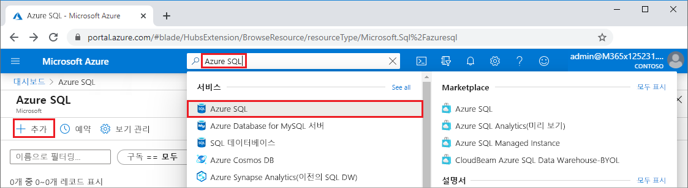
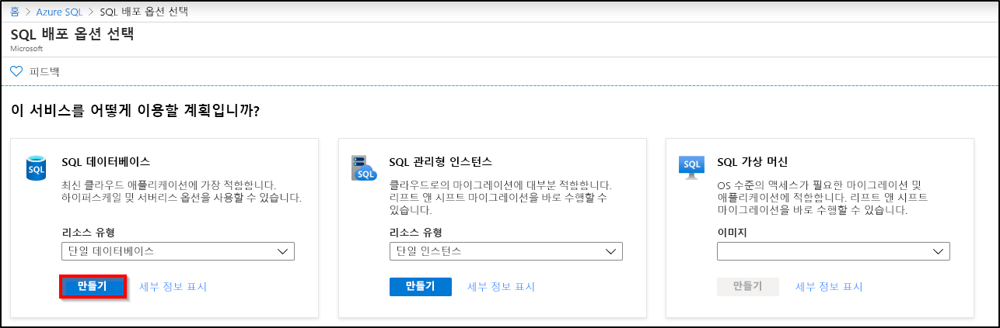
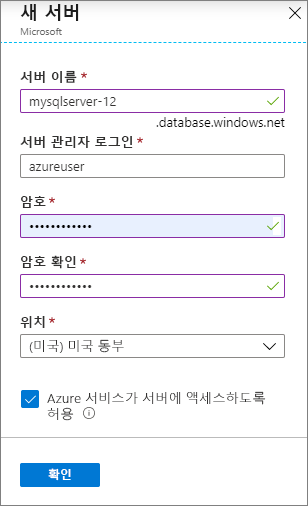
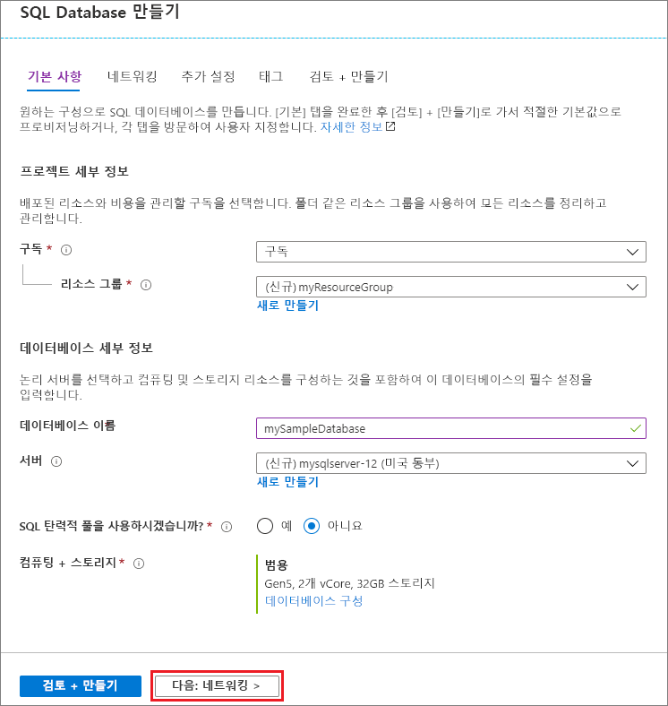
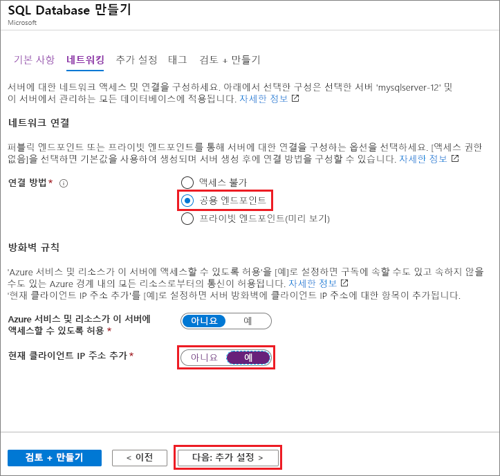
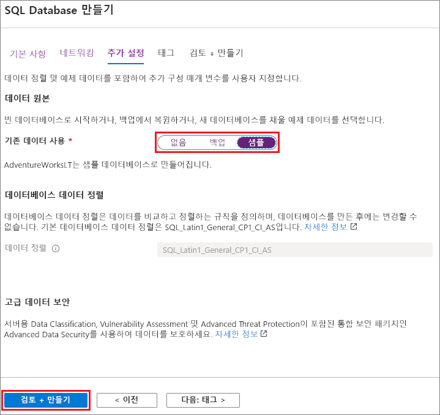
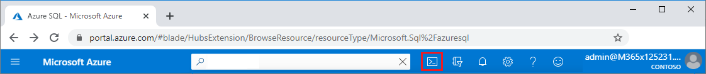

이 단계에서는 AdventureWorksLT 샘플 데이터를 사용하는 Azure SQL Database 서버와 단일 데이터베이스를 만듭니다. Azure Portal 메뉴와 화면을 사용하거나 Azure Cloud Shell에서 Azure CLI 또는 PowerShell 스크립트를 사용하여 데이터베이스를 만들 수 있습니다.

모든 방법에는 서버에 액세스하는 데 사용하는 컴퓨터의 공용 IP 주소를 허용하도록 서버 수준 방화벽 규칙을 설정하는 작업이 포함됩니다. 서버 방화벽 규칙을 만드는 방법에 대한 자세한 내용은 [서버 수준 방화벽 만들기](../sql-database-server-level-firewall-rule.md)를 참조하세요. 데이터베이스 수준 방화벽 규칙을 설정할 수도 있습니다. [데이터베이스 수준 방화벽 규칙 만들기](/sql/relational-databases/system-stored-procedures/sp-set-database-firewall-rule-azure-sql-database)를 참조하세요. 

# <a name="portal"></a>[포털](#tab/azure-portal)

Azure Portal에서 리소스 그룹, SQL 서버 및 단일 데이터베이스를 만들려면 다음을 수행합니다.

1. [포털](https://portal.azure.com)에 로그인합니다.
1. 검색 창에서 **Azure SQL**을 검색하여 선택합니다.
1. **Azure SQL** 페이지에서 **추가**를 선택합니다. 
   
   
   
1. **SQL 배포 옵션 선택** 페이지의 **리소스 종류** 아래에서 **단일 데이터베이스**를 사용하여 **SQL 데이터베이스** 타일을 선택합니다. **자세한 정보 표시**를 선택하여 다른 데이터베이스에 대한 자세한 정보를 볼 수 있습니다.
1. **만들기**를 선택합니다.
   
   
   
1. 아직 선택하지 않은 경우 **SQL 데이터베이스 만들기** 양식의 **기본** 탭에 있는 **프로젝트 세부 정보** 아래에서 올바른 Azure **구독**을 선택합니다.
1. **리소스 그룹** 아래에서 **새로 만들기**를 선택하고, *myResourceGroup*을 입력하고, **확인**을 선택합니다.
1. **데이터베이스 세부 정보** 아래에서 **데이터베이스 이름**에 대해 *mySampleDatabase*를 입력합니다.
1. **서버**에 대해 **새로 만들기**를 선택하고 다음과 같이 **새 서버** 양식을 작성합니다.
   - **서버 이름**: *mysqlserver* 및 고유하게 유지하기 위한 일부 문자를 입력합니다.
   - **서버 관리자 로그인**: *azureuser*를 입력합니다.
   - **암호**: 요구 사항을 충족하는 암호를 입력하고, **암호 확인** 필드에서 다시 입력합니다.
   - **위치**: 드롭다운에서 위치(예: **(미국) 미국 동부**)를 선택합니다.
   
   **확인**을 선택합니다.
   
   
   
   서버 및 데이터베이스에 로그인할 수 있도록 서버 관리자 로그인 및 암호를 적어둡니다. 로그인 또는 암호를 잊은 경우 데이터베이스를 만든 후 **SQL 서버** 페이지에서 로그인 이름을 가져오거나 암호를 다시 설정할 수 있습니다. **SQL 서버** 페이지를 열려면 데이터베이스 **개요** 페이지에서 서버 이름을 선택합니다.
   
1. **컴퓨팅 + 스토리지** 아래에서 기본값을 다시 구성하려면 **데이터베이스 구성**을 선택합니다.
   
   **구성** 페이지에서 필요에 따라 다음을 수행할 수 있습니다.
   - **컴퓨팅 계층**을 **프로비저닝됨**에서 **서버리스**로 변경합니다.
   - **vCore** 및 **데이터 최대 크기**에 대한 설정을 검토하고 변경합니다.
   - **구성 변경**을 선택하여 하드웨어 생성을 변경합니다.
   
   변경한 후 **적용**을 선택합니다.
   
1. 완료되면 **다음: 네트워킹**을 선택합니다.
   
   
   
1. **네트워킹** 탭의 **연결 방법** 아래에서 **퍼블릭 엔드포인트**를 선택합니다. 
1. **방화벽 규칙** 아래에서 **현재 클라이언트 IP 주소 추가**를 **예**로 설정합니다.
1. 완료되면 **다음: 추가 설정**을 선택합니다.
   
   
   
   방화벽 설정에 대한 자세한 내용은 [Azure 서비스 및 리소스에서 이 서버에 액세스할 수 있도록 허용](../sql-database-networkaccess-overview.md) 및 [프라이빗 엔드포인트 추가](../../private-link/private-endpoint-overview.md)를 참조하세요.
   
1. **추가 설정** 탭의 **데이터 원본** 섹션에서 **기존 데이터 사용**에 대해 **샘플**을 선택합니다.
1. 페이지 아래쪽에서 **검토 + 만들기**를 선택합니다.
   
   
   
1. 설정을 검토한 후 **만들기**를 선택합니다.

# <a name="azure-cli"></a>[Azure CLI](#tab/azure-cli)

Azure CLI(Azure 명령줄 인터페이스)를 사용하여 Azure 리소스 그룹, SQL 서버 및 단일 데이터베이스를 만들 수 있습니다. Azure Cloud Shell을 사용하지 않으려면 컴퓨터에 [Azure CLI를 설치](/cli/azure/install-azure-cli)합니다.

Azure Cloud Shell에서 다음 코드 샘플을 실행하려면 코드 샘플 제목 표시줄에서 **사용해 보세요**를 선택합니다. Cloud Shell이 열리면 코드 샘플 제목 표시줄에서 **복사**를 선택하고, 코드 샘플을 Cloud Shell 창에 붙여넣습니다. 코드에서 `<Subscription ID>`를 Azure 구독 ID로 바꾸고, `$startip` 및 `$endip`에 대해 `0.0.0.0`을 사용 중인 컴퓨터의 공용 IP 주소로 바꿉니다.

화면의 지시에 따라 Azure에 로그인하고 코드를 실행합니다. 

위쪽 표시줄에서 Cloud Shell 아이콘을 선택하여 Azure Portal에서 Azure Cloud Shell을 사용할 수도 있습니다. 
   
   
   
포털에서 Cloud Shell을 처음 사용하는 경우 **시작** 대화 상자에서 **Bash**를 선택합니다. 이후 세션에서는 Bash 환경에서 Azure CLI를 사용하거나 Cloud Shell 컨트롤 모음에서 **Bash**를 선택할 수 있습니다. 

다음 Azure CLI 코드에서는 서버에 액세스하기 위한 Azure 리소스 그룹, SQL 서버, 단일 데이터베이스 및 방화벽 규칙을 만듭니다. 생성된 리소스 그룹과 서버 이름을 기록하여 나중에 이러한 리소스를 관리할 수 있도록 합니다.

```azurecli-interactive
#!/bin/bash

# Sign in to Azure and set execution context (if necessary)
az login
az account set --subscription <Subscription ID>

# Set the resource group name and location for your server
resourceGroupName=myResourceGroup-$RANDOM
location=westus2

# Set an admin login and password for your database
adminlogin=azureuser
password=Azure1234567

# Set a logical server name that is unique to Azure DNS (<server_name>.database.windows.net)
servername=server-$RANDOM

# Set the ip address range that can access your database
startip=0.0.0.0
endip=0.0.0.0

# Create a resource group
az group create \
    --name $resourceGroupName \
    --location $location

# Create a logical server in the resource group
az sql server create \
    --name $servername \
    --resource-group $resourceGroupName \
    --location $location  \
    --admin-user $adminlogin \
    --admin-password $password

# Configure a firewall rule for the server
az sql server firewall-rule create \
    --resource-group $resourceGroupName \
    --server $servername \
    -n AllowYourIp \
    --start-ip-address $startip \
    --end-ip-address $endip

# Create a gen5 2 vCore database in the server
az sql db create \
    --resource-group $resourceGroupName \
    --server $servername \
    --name mySampleDatabase \
    --sample-name AdventureWorksLT \
    --edition GeneralPurpose \
    --family Gen5 \
    --capacity 2 \
```

위의 코드에서 사용하는 Azure CLI 명령은 다음과 같습니다.

| 명령 | Description |
|---|---|
| [az account set](/cli/azure/account?view=azure-cli-latest#az-account-set) | 현재 활성 구독이 되도록 구독을 설정합니다. | 
| [az group create](/cli/azure/group#az-group-create) | 모든 리소스가 저장되는 리소스 그룹을 만듭니다. |
| [az sql server create](/cli/azure/sql/server#az-sql-server-create) | 단일 데이터베이스 및 탄력적 풀을 호스트하는 SQL Database 서버를 만듭니다. |
| [az sql server firewall-rule create](/cli/azure/sql/server/firewall-rule##az-sql-server-firewall-rule-create) | 서버의 방화벽 규칙을 만듭니다. | 
| [az sql db create](/cli/azure/sql/db#az-sql-db-create?view=azure-cli-latest) | 데이터베이스를 만듭니다. | 

Azure SQL Database Azure CLI 샘플에 대한 자세한 내용은 [Azure CLI 샘플](../sql-database-cli-samples.md)을 참조하세요.

# <a name="powershell"></a>[PowerShell](#tab/azure-powershell)

Windows PowerShell을 사용하여 Azure 리소스 그룹, SQL 서버 및 단일 데이터베이스를 만들 수 있습니다. Azure Cloud Shell을 사용하지 않으려면 [Azure PowerShell 모듈을 설치](/powershell/azure/install-az-ps)합니다.

[!INCLUDE [updated-for-az](../../../includes/updated-for-az.md)]

Azure Cloud Shell에서 다음 코드 샘플을 실행하려면 코드 제목 표시줄에서 **사용해 보세요**를 선택합니다. Cloud Shell이 열리면 코드 샘플 제목 표시줄에서 **복사**를 선택하고, 코드 샘플을 Cloud Shell 창에 붙여넣습니다. 코드에서 `<Subscription ID>`를 Azure 구독 ID로 바꾸고, `$startIp` 및 `$endIp`에 대해 `0.0.0.0`을 사용 중인 컴퓨터의 공용 IP 주소로 바꿉니다. 

화면의 지시에 따라 Azure에 로그인하고 코드를 실행합니다. 

위쪽 표시줄에서 Cloud Shell 아이콘을 선택하여 Azure Portal에서 Azure Cloud Shell을 사용할 수도 있습니다. 
   
   
   
포털에서 Cloud Shell을 처음 사용하는 경우 **시작** 대화 상자에서 **PowerShell**을 선택합니다. 이후 세션에서 PowerShell을 사용하거나 Cloud Shell 컨트롤 모음에서 선택할 수 있습니다. 

다음 PowerShell 코드에서는 서버에 액세스하기 위한 Azure 리소스 그룹, SQL 서버, 단일 데이터베이스 및 방화벽 규칙을 만듭니다. 생성된 리소스 그룹과 서버 이름을 기록하여 나중에 이러한 리소스를 관리할 수 있도록 합니다.

   ```powershell-interactive
   # Set variables for your server and database
   $subscriptionId = '<SubscriptionID>'
   $resourceGroupName = "myResourceGroup-$(Get-Random)"
   $location = "West US"
   $adminLogin = "azureuser"
   $password = "Azure1234567"
   $serverName = "mysqlserver-$(Get-Random)"
   $databaseName = "mySampleDatabase"

   # The ip address range that you want to allow to access your server 
   $startIp = "0.0.0.0"
   $endIp = "0.0.0.0"

   # Show randomized variables
   Write-host "Resource group name is" $resourceGroupName 
   Write-host "Server name is" $serverName 

   # Connect to Azure
   Connect-AzAccount

   # Set subscription ID
   Set-AzContext -SubscriptionId $subscriptionId 

   # Create a resource group
   Write-host "Creating resource group..."
   $resourceGroup = New-AzResourceGroup -Name $resourceGroupName -Location $location -Tag @{Owner="SQLDB-Samples"}
   $resourceGroup

   # Create a server with a system wide unique server name
   Write-host "Creating primary logical server..."
   $server = New-AzSqlServer -ResourceGroupName $resourceGroupName `
      -ServerName $serverName `
      -Location $location `
      -SqlAdministratorCredentials $(New-Object -TypeName System.Management.Automation.PSCredential `
      -ArgumentList $adminLogin, $(ConvertTo-SecureString -String $password -AsPlainText -Force))
   $server

   # Create a server firewall rule that allows access from the specified IP range
   Write-host "Configuring firewall for primary logical server..."
   $serverFirewallRule = New-AzSqlServerFirewallRule -ResourceGroupName $resourceGroupName `
      -ServerName $serverName `
      -FirewallRuleName "AllowedIPs" -StartIpAddress $startIp -EndIpAddress $endIp
   $serverFirewallRule

   # Create General Purpose Gen4 database with 1 vCore
   Write-host "Creating a gen5 2 vCore database..."
   $database = New-AzSqlDatabase  -ResourceGroupName $resourceGroupName `
      -ServerName $serverName `
      -DatabaseName $databaseName `
      -Edition GeneralPurpose `
      -VCore 2 `
      -ComputeGeneration Gen5 `
      -MinimumCapacity 2 `
      -SampleName "AdventureWorksLT"
   $database
   ```

위의 코드에서 사용하는 PowerShell cmdlet은 다음과 같습니다.

| 명령 | 메모 |
|---|---|
| [New-AzResourceGroup](/powershell/module/az.resources/new-azresourcegroup) | 모든 리소스가 저장되는 리소스 그룹을 만듭니다. |
| [New-AzSqlServer](/powershell/module/az.sql/new-azsqlserver) | 단일 데이터베이스 및 탄력적 풀을 호스트하는 SQL Database 서버를 만듭니다. |
| [New-AzSqlServerFirewallRule](/powershell/module/az.sql/new-azsqlserverfirewallrule) | 논리 서버에 대한 방화벽 규칙을 만듭니다. | 
| [New-AzSqlDatabase](/powershell/module/az.sql/new-azsqldatabase) | Azure SQL Database 단일 데이터베이스를 만듭니다. | 

Azure SQL Database PowerShell 샘플에 대한 자세한 내용은 [Azure PowerShell 샘플](../sql-database-powershell-samples.md)을 참조하세요.

---
