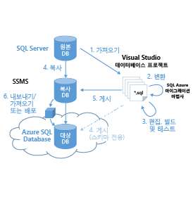

<properties 
   pageTitle="Azure SQL 데이터베이스로 데이터베이스 마이그레이션" 
   description="Microsoft Azure SQL 데이터베이스, 데이터베이스 배포, 데이터베이스 마이그레이션, 데이터베이스 가져오기, 데이터베이스 내보내기, 마이그레이션 마법사" 
   services="sql-database" 
   documentationCenter="" 
   authors="pehteh" 
   manager="jeffreyg" 
   editor="monicar"/>

<tags
   ms.service="sql-database"
   ms.devlang="NA"
   ms.topic="article"
   ms.tgt_pltfrm="NA"
   ms.workload="data-management" 
   ms.date="07/17/2015"
   ms.author="pehteh"/>

# Azure SQL 데이터베이스로 데이터베이스 마이그레이션

Azure SQL 데이터베이스 V12는 SQL Server 2014와의 엔진 호환성이 거의 완벽에 가깝습니다. 따라서 대부분의 데이터베이스를 SQL Server에서 Azure SQL 데이터베이스로 마이그레이션하는 작업이 대폭 간소화됩니다. 대부분의 데이터베이스에서 마이그레이션은 스키마에 변화가 있거나 응용 프로그램의 엔지니어링을 다시 하는 과정이 적거나 없는 경우 간단한 이동을 위한 몇 가지 작업만 필요합니다. 그리고 데이터베이스를 변경할 필요가 있을 경우 이러한 변경의 범위도 더 작습니다.

설계상 SQL Server의 서버 범위 기능은 SQL 데이터베이스에서 지원하지 않습니다. 따라서 이러한 기능을 사용하는 데이터베이스와 응용 프로그램은 마이그레이션하기 전에 엔지니어링을 일부 다시 수행해야 합니다. SQL 데이터베이스 V12는 SQL Server와의 호환성이 향상되었지만 마이그레이션은 여전히 신중하게 계획하고 실행해야 합니다. 특히 더 크고 복잡한 데이터베이스라면 더 신경 써야 합니다.

## 개요
SQL Server 데이터베이스를 Azure로 마이그레이션하는 데는 몇 가지 다른 방법이 있으며, 각 방법에 따라 하나 이상의 도구가 사용됩니다. 일부 방법은 빠르고 쉽지만 준비하는 데 오래 걸리는 방법도 있습니다. 크고 복잡한 데이터베이스를 마이그레이션할 때는 몇 시간까지 걸릴 수 있다는 점에 유의하세요.

### 옵션 1
***SSMS(SQL Server Management Studio)를 사용하여 호환 가능한 데이터베이스 마이그레이션***

데이터베이스는 SSMS를 사용하여 Azure SQL 데이터베이스에 배포됩니다. 데이터베이스는 직접 배포할 수도 있고 BACPAC로 내보낸 다음 새 Azure SQL 데이터베이스를 만들기 위해 가져올 수 있습니다. 원본 데이터베이스가 Azure SQL 데이터베이스와 완전히 호환되는 경우 이 메서드를 사용합니다.

### 옵션 2
***SAMWSQL Azure 마이그레이션 마법사를 사용하여 거의 호환되는 데이터베이스 마이그레이션***

데이터베이스는 SAMW를 사용하여 스키마 또는 스키마와 BCP 형식의 데이터를 포함하는 마이그레이션 스크립트를 생성하도록 처리됩니다. 데이터베이스 스키마를 업그레이드해야 하며 마법사를 사용하여 변경 내용을 처리할 수 있을 때 이 메서드를 사용합니다.

### 옵션 3
***VS(Visual Studio)와 SAMW를 사용하여 오프라인으로 데이터베이스 스키마를 업데이트하고 SSMS를 사용하여 배포***

원본 데이터베이스는 오프라인으로 처리하기 위해 Visual Studio 데이터베이스 프로젝트로 가져옵니다. SAMW는 일련의 변환 및 수정을 적용하기 위해 프로젝트에서 모든 스크립트를 실행합니다. 프로젝트가 SQL 데이터베이스 V12를 대상으로 빌드되고 남은 오류가 있다면 보고됩니다. 이러한 오류는 Visual Studio의 SQL 서버 데이터 도구(SSDT)를 사용하여 수동으로 해결합니다. 프로젝트를 성공적으로 빌드되면 원본 데이터베이스의 복사본으로 다시 게시됩니다. 업데이트된 이 데이터베이스를 옵션 1을 사용하여 Azure SQL 데이터베이스로 배포합니다. 스키마만 마이그레이션해야 할 경우 Visual Studio에서 Azure SQL 데이터베이스로 직접 스키마를 게시할 수 있습니다. 데이터베이스 스키마가 마이그레이션 마법사 하나로 처리될 수 있는 것보다 많은 변경 내용이 필요한 경우 이 메서드를 사용합니다.

## 사용할 옵션 결정
- 데이터베이스를 변경하지 않고 마이그레이션할 수 있는 경우 옵션 1을 사용하는 것이 빠르고 쉽습니다. 확실하지 않은 부분이 있다면 옵션 1에 설명된 대로 데이터베이스에서 스키마 전용 BACPAC를 내보내는 것으로 시작합니다. 오류 없이 내보내기에 성공하면 옵션 1을 사용하여 해당 데이터와 데이터베이스를 마이그레이션할 수 있습니다.  
- 옵션 1의 내보내기 중 오류가 발생한 경우 SAMW(SQL Azure 마이그레이션 마법사)를 사용하여 옵션 2에 설명된 대로 데이터베이스를 스키마 전용 모드로 처리합니다. 마이그레이션 마법사가 아무런 오류도 보고하지 않은 경우 옵션 2를 사용합니다. 
- SAMW에서 스키마에 추가 작업이 필요하다고 보고하는 경우, 간단한 수정만 필요한 경우가 아니라면 옵션 3을 사용하여 Visual Studio와 마이그레이션 마법사를 조합해 사용하여 데이터베이스 스키마를 오프라인으로 수정하고 스키마 변경을 수동으로 적용하는 것이 최선의 선택입니다. 그런 다음 원본 데이터베이스의 복사본을 원래 자리에 업데이트하고 옵션 1을 사용하여 Azure로 마이그레이션합니다.

## 마이그레이션 도구
사용되는 도구에는 SSMS(SQL Server Management Studio), Visual Studio의 SQL Server 도구(VS, SSDT), SAMW(SQL Azure 마이그레이션 마법사), Azure 포털이 포함됩니다.

> 이전 버전의 도구는 SQL 데이터베이스 v12와 호환되지 않으므로 클라이언트 도구를 최신 버전으로 설치해야 합니다.

### SSMS(SQL Server Management Studio)
SSMS를 사용하여 호환되는 데이터베이스를 Azure SQL 데이터베이스로 직접 배포하거나 데이터베이스의 논리적 백업을 BACPAC로 내보낼 수 있습니다. 그런 다음 SSMS를 사용하여 가져와 새로운 Azure SQL 데이터베이스를 만들 수 있습니다.

[SSMS의 최신 버전을 다운로드](https://msdn.microsoft.com/library/mt238290.aspx)하거나 SQL Server 2013 이상에서 CU6을 사용해야 합니다.

### SAMW(SQL Azure 마이그레이션 마법사)
SAMW는 기존 데이터베이스의 스키마를 분석하여 Azure SQL 데이터베이스와 호환되는지 확인할 수 있으며, 대부분의 경우 스키마와 데이터를 포함하는 Transact-SQL 스크립트를 생성하고 배포하는 데 사용할 수 있습니다. 마법사는 변환하는 동안 변환할 수 없는 스키마 내용을 발견할 경우 오류를 보고합니다. 이 문제가 발생하는 경우 생성된 스크립트를 배포하기 전에 추가로 편집해야 합니다. SAMW는 Visual Studio의 SQL Server 도구(아래 참조)를 통한 유효성 검사에서 배제된 함수 또는 저장 프로시저의 본문을 처리하므로 Visual Studio만으로 유효성을 검사할 때는 보고되지 않은 문제도 발견할 수 있습니다. SAMW를 Visual Studio의 SQL Server 도구와 조합하여 사용하면 복잡한 스키마를 마이그레이션하는 데 필요한 작업의 양을 상당히 줄일 수 있습니다.

CodePlex에서 최신 버전의 [SQL Azure 마이그레이션 마법사](http://sqlazuremw.codeplex.com/)를 사용하십시오.

### Visual Studio의 SQL Server 도구(VS, SSDT)
Visual Studio의 SQL Server 도구를 사용하여 스키마의 각 개체에 대한 Transact-SQL 파일 집합을 구성하는 데이터베이스 프로젝트를 만들고 관리할 수 있습니다. 프로젝트는 데이터베이스 또는 스크립트 파일에서 가져올 수 있습니다. 프로젝트가 생성되면 Azure SQL 데이터베이스 v12로 가져온 다음 빌드하여 스키마 호환성을 확인할 수 있습니다. 오류를 클릭하면 해당하는 Transact-SQL 파일이 열리므로 편집하여 오류를 수정할 수 있습니다. 모든 오류가 해결되면 프로젝트를 게시할 수 있습니다. 프로젝트는 SQL 데이터베이스로 직접 게시하여 빈 데이터베이스를 만들거나 다시 원본(복사본) SQL Server 데이터베이스로 게시하여 스키마를 업데이트할 수 있습니다. 이렇게 하면 위에서 설명한 대로 SSMS를 사용하여 데이터베이스를 배포할 수 있습니다.

Visual Studio 2013 업데이트 4 이상이 포함된 [최신 Visual Studio용 SQL Server Data Tools](https://msdn.microsoft.com/library/mt204009.aspx)를 사용하세요.

## 비교
| 옵션 1 | 옵션 2 | 옵션 3 |
| ------------ | ------------ | ------------ |
| Azure SQL 데이터베이스에 호환되는 데이터베이스 배포 | 변경 내용으로 마이그레이션 스크립트를 생성하고 Azure SQL 데이터베이스에서 실행 | 데이터베이스를 바로 업데이트하여 Azure SQL 데이터베이스로 배포 |
||  |  |
| SSMS 사용 | SAMW 사용 | SAMW, VS, SSMS 사용 |
|스키마 호환이 필요한 간단한 프로세스입니다. 스키마는 변경되지 않고 마이그레이션됩니다. | SAMW에서 호환성을 보장하기 위해 필요한 변경 내용이 포함된 Transact-SQL 스크립트를 생성합니다. 일부 지원되지 않는 기능은 스키마에서 제외됩니다. 대부분 오류 플래그가 지정된 것입니다. | 스키마는 Visual Studio에서 데이터베이스 프로젝트로 가져오며 SAMW를 사용하여 변환됩니다(선택 사항). Visual Studio의 SSDT 도구를 사용하여 추가 업데이트가 수행되고 최종 스키마가 원래 자리의 데이터베이스를 업데이트하는 데 사용됩니다. |
| BACPAC를 내보내는 경우 스키마만 마이그레이션하도록 선택할 수 있습니다. | 스키마만 스크립팅하거나 스키마와 데이터를 함께 스크립팅하도록 마법사를 구성할 수 있습니다. | Visual Studio에서 Azure에만 직접 스키마를 게시할 수 있습니다. 필요한 변경 내용이 적용된 데이터베이스가 제자리에 업데이트되어 스키마와 데이터를 배포/내보낼 수 있게 됩니다. |
| 항상 전체 데이터베이스를 배포하거나 내보냅니다. | 마이그레이션에서 특정 개체를 제외하도록 선택할 수 있습니다. | 마이그레이션에 포함된 개체를 완전하게 제어합니다. |
| 오류가 있는 경우 출력 변경을 위한 프로비전이 없습니다. 원본 스키마가 호환되어야 합니다. | 단일 모놀리식으로 생성된 스크립트는 필요한 경우 편집하기에 불편할 수 있습니다. 스크립트는 SSMS 또는 SSDT를 포함한 Visual Studio에서 열고 편집할 수 있습니다. 스크립트를 Azure SQL 데이터베이스에 배포하기 전에 모든 오류를 해결해야 합니다.| 사용 가능한 Visual Studio의 SSDT의 전체 기능. 스키마는 오프라인으로 변경됩니다. |
| Azure에서 응용 프로그램 유효성 검사가 수행됩니다. 스키마 변경 없이 마이그레이션되는 경우 최소화해야 합니다. | 마이그레이션 후 Azure에서 응용 프로그램 유효성 검사가 수행됩니다. 생성된 스크립트는 초기 응용 프로그램 유효성 검사를 위해 온-프레미스에 설치할 수도 있습니다. | 데이터베이스를 Azure에 배포하기 전에 SQL Server에서 응용 프로그램 유효성 검사를 수행할 수 있습니다. |
| Microsoft에서 지원하는 도구입니다. | CodePlex에서 다운로드할 수 있는 커뮤니티 지원 도구입니다. | Microsoft에서 지원하는 도구와 함께 CodePlex에서 다운로드한 커뮤니티 지원 도구를 선택적으로 사용합니다. |
| 간단히 하나 또는 두 단계의 프로세스로 쉽게 구성할 수 있습니다. | 스키마 변환, 생성 및 클라우드로의 배포는 사용이 편리한 하나의 마법사로 조작됩니다. | 더 복잡한 여러 단계의 프로세스(스키마만 배포하는 경우에 더 간단)입니다. |

 

<!---HONumber=July15_HO5-->