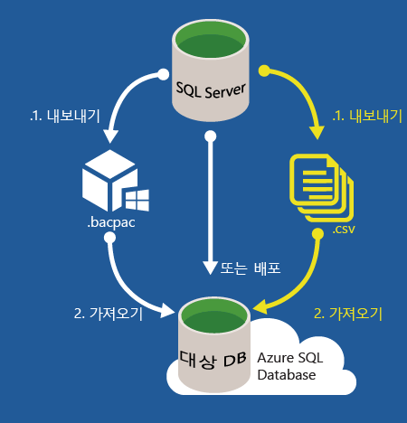

<properties
   pageTitle="SQL Server 데이터베이스를 Azure SQL 데이터베이스로 마이그레이션"
   description="Microsoft Azure SQL 데이터베이스, 데이터베이스 배포, 데이터베이스 마이그레이션, 데이터베이스 가져오기, 데이터베이스 내보내기, 마이그레이션 마법사"
   services="sql-database"
   documentationCenter=""
   authors="carlrabeler"
   manager="jeffreyg"
   editor=""/>

<tags
   ms.service="sql-database"
   ms.devlang="NA"
   ms.topic="article"
   ms.tgt_pltfrm="NA"
   ms.workload="data-management"
   ms.date="10/12/2015"
   ms.author="carlrab"/>

# SQL Server 데이터베이스를 Azure SQL 데이터베이스로 마이그레이션

데이터베이스 및 응용 프로그램 설계와 허용되는 가동 중지 시간에 따라 온-프레미스 데이터베이스를 Azure SQL 데이터베이스로 이동하는 작업의 복잡성이 달라집니다. 호환되는 데이터베이스에서 Azure SQL 데이터베이스로 마이그레이션하는 작업은 간단한 스키마 변경(필요한 경우) 또는 응용 프로그램 리엔지니어링이 거의 필요하지 않은 간단한 스키마 및 데이터 이동 작업입니다. [Azure SQL 데이터베이스 V12](../sql-database-v12-whats-new.md)는 SQL Server 2014 및 SQL Server 2016과 엔진 호환성이 거의 완벽에 가깝습니다. 대부분의 SQL Server 2016 TRANSACT-SQL 문은 Microsoft Azure SQL 데이터베이스에서 완전히 지원됩니다. 여기에는 SQL Server 데이터 형식, 연산자 및 문자열, 산술, 논리, 커서 함수 및 대부분의 응용 프로그램이 사용하는 다른 TRANSACT-SQL 요소가 포함됩니다. 부분적으로 또는 완전히 지원되지 않는 함수는 일반적으로 SQL 데이터베이스에서 데이터베이스를 관리하는 방법의 차이와 관련이 있거나(예: 파일, 고가용성 및 보안 기능) Service Broker와 같은 특수한 용도의 기능입니다. SQL 데이터베이스는 master 데이터베이스에 대한 종속성에서 많은 기능을 격리하므로 많은 서버 수준 작업이 부적절하고 지원되지 않습니다. SQL Server에서 사용되지 않는 기능은 일반적으로 SQL 데이터베이스에서 지원되지 않습니다. [부분적으로 지원되거나 지원되지 않는 기능](../sql-database-transact-sql-information.md)에 의존하는 데이터베이스 및 응용 프로그램을 마이그레이션하려면 일부 엔지니어링을 다시 해야 합니다.

SQL Server 데이터베이스를 Azure SQL 데이터베이스로 마이그레이션하는 워크플로는 다음과 같습니다.

 1. [데이터베이스가 호환되는지 확인](#determine-if-your-database-is-compatible)
 2. [호환되지 않을 경우 데이터베이스 호환성 문제 해결](#fix-database-compatibility-issues)
 3. [호환되는 데이터베이스 마이그레이션](#options-to-migrate-a-compatible-database-to-azure-sql-database)

>[AZURE.NOTE]Microsoft Access, Sybase, MySQL Oracle, DB2와 같은 다른 유형의 데이터베이스를 Azure SQL 데이터베이스로 마이그레이션해야 할 경우 [SSMA(SQL Server Migration Assistant)](http://blogs.msdn.com/b/ssma/)를 참조하세요.

## 데이터베이스가 호환되는지 확인
원본 데이터베이스가 호환되는지 여부를 확인하는 방법은 기본적으로 두 가지입니다. 데이터 계층 응용 프로그램 내보내기: 이 방법은 Management Studio의 마법사를 사용하여 데이터베이스를 분석하고, 데이터베이스 호환성 문제가 있으면 콘솔에 문제를 표시합니다. - SQLPackage: 이 방법은 SQLPackage.exe [sqlpackage.exe](https://msdn.microsoft.com/library/hh550080.aspx) 명령줄 유틸리티를 사용하여 데이터베이스를 분석하고 보고서를 생성합니다. SQLPackage는 Visual Studio 및 SQL Server와 함께 제공됩니다.

> [AZURE.NOTE]세 번째 방법은 추적 파일을 추가 소스 정보로 사용하여 데이터베이스 수준과 응용 프로그램 수준에서 호환성을 테스트하는 것입니다. 이 [SQL Azure 마이그레이션 마법사](http://sqlazuremw.codeplex.com/)는 Codeplex의 무료 도구입니다. 하지만 이 도구는 현재 Azure SQL Database V12에서 문제가 아니지만 Azure SQL Database V11에서 문제였던 호환성 오류를 찾을 수 있습니다.

데이터베이스 비호환성이 감지될 경우 데이터베이스를 Azure SQL 데이터베이스로 마이그레이션하기 전에 이러한 비호환성을 해결해야 합니다. 데이터베이스 호환성 문제를 해결하는 방법에 대한 지침은 [데이터베이스 호환성 문제 해결](#fix-database-compatibility-issues)을 참조하세요.

> [AZURE.IMPORTANT]이러한 옵션은 다른 수준의 SQL Server 데이터베이스(즉, 레벨 90, 100, 110) 사이에서 모든 호환성 문제를 찾지 않습니다. 기존 데이터베이스(레벨 80, 90, 100, 110)에서 마이그레이션하는 경우 우선 업그레이드 프로세스를 실행하고(최소한 개발 환경에서) SQL Server 2014 이상을 설치한 다음 Azure SQL 데이터베이스로 마이그레이션해야 합니다.

## sqlpackage.exe를 사용하여 데이터베이스 호환성 확인

1. 명령 프롬프트를 열고 최신 버전의 sqlpackage.exe가 포함된 디렉터리를 변경합니다. 이 유틸리티는 Visual Studio 및 SQL Server에 기본적으로 제공됩니다. 최신 버전의 SQL Server 데이터 도구를 [다운로드](https://msdn.microsoft.com/library/mt204009.aspx)하여 이 유틸리티를 가져올 수도 있습니다.
2. 사용자 환경에 대해 다음 인수를 사용하여 다음 sqlpackage.exe 명령을 실행하세요.

	'sqlpackage.exe /Action:Export /ssn:< server_name > /sdn:< database_name > /tf:< target_file > /p:TableData=< schema_name.table_name > > < output_file > 2>&1'

	| 인수 | 설명 |
	|---|---|
	| < server_name > | 원본 서버 이름 |
	| < database_name > | 원본 데이터베이스 이름 |
	| < target_file > | 파일 이름 및 BACPAC 파일의 위치 |
	| < schema_name.table_name > | 데이터가 대상 파일에 대해 출력되는 테이블 |
	| < output_file > | 오류가 발생할 경우 오류가 있는 출력 파일의 파일 이름 및 위치 |

	/p:TableName 인수를 사용하는 이유는 모든 테이블의 데이터를 내보내지 않고 Azure SQL DB V12로 내보내기에 대한 데이터 호환성만 테스트하기 때문입니다. 하지만 sqlpackage.exe의 내보내기 인수는 테이블 없는 추출을 지원하지 않으므로 하나의 작은 테이블을 지정해야 합니다. < output_file >에 오류 보고서가 포함됩니다. "> 2 > & 1" 문자열은 지정된 출력 파일에 명령을 실행한 결과로 생성되는 표준 출력 및 표준 오류를 모두 파이프합니다.

	

3. 출력 파일을 열고 호환성 오류(있는 경우)를 검토합니다. 데이터베이스 호환성 문제를 해결하는 방법에 대한 지침은 [데이터베이스 호환성 문제 해결](#fix-database-compatibility-issues)을 참조하세요.

	

## 내보내기 데이터 계층 응용 프로그램을 사용하여 데이터베이스 호환성 확인

1. 버전 13.0.600.65 이상의 SQL Server Management Studio가 있는지 확인합니다. 새로운 버전의 Management Studio는 매월 업데이트되어 Azure 클래식 포털의 업데이트와 동기화 상태를 유지합니다.

 	 >[AZURE.IMPORTANT] [최신](https://msdn.microsoft.com/library/mt238290.aspx) 버전의 SQL Server Management Studio를 다운로드합니다. 항상 최신 버전의 Management Studio를 사용하는 것이 좋습니다.

2. Management Studio를 열고 개체 탐색기에서 원본 데이터베이스에 연결합니다.
3. 개체 탐색기에서 원본 데이터베이스를 마우스 오른쪽 단추로 클릭하고 **작업**을 가리킨 다음 **데이터 계층 응용 프로그램 내보내기...**를 클릭합니다.

	

4. 내보내기 마법사에서 **다음**을 클릭한 다음 **설정** 탭에서 BACPAC 파일을 로컬 디스크 위치 또는 Azure BLOB에 저장하는 내보내기를 구성합니다. BACPAC 파일은 데이터베이스 호환성 문제가 없는 경우에만 저장됩니다. 호환성 문제가 있는 경우 콘솔에 표시됩니다.

	

5. **고급 탭**을 클릭하고 **모두 선택** 확인란을 선택 취소하여 데이터 내보내기를 건너뜁니다. 이 시점의 목표는 단순히 호환성을 테스트하는 것입니다.

	

6. **다음**을 클릭한 후 **마침**을 클릭합니다. 마법사가 스키마의 유효성을 확인한 다음 데이터베이스 호환성 문제가 나타납니다(있는 경우).

	

7. 오류가 표시되지 않을 경우 데이터베이스가 호환되며 마이그레이션할 준비가 된 것입니다. 오류가 있을 경우 해결해야 합니다. 오류를 보려면 **스키마 유효성 검사**에 대해 **오류**를 클릭합니다. 이러한 오류를 해결하는 방법은 [데이터베이스 호환성 문제 해결](#fix-database-compatibility-issues)을 참조하세요.

	

8.	*.BACPAC 파일이 성공적으로 생성되면 데이터베이스가 SQL 데이터베이스와 호환되며, 이제 마이그레이션 준비가 완료되었습니다.

## 호환되는 데이터베이스를 Azure SQL 데이터베이스로 마이그레이션하는 옵션

호환되는 데이터베이스가 있는지 확인한 후에는 마이그레이션 방법을 선택해야 합니다. 먼저, 마이그레이션하는 동안 데이터베이스를 중지할 수 있는지 확인해야 합니다. 중지할 수 없다면 아래에 설명된 것처럼 SQL Server 트랜잭션 복제를 사용합니다. 약간의 가동 중지 시간이 허용되거나 나중에 트랜잭션 복제를 사용하여 마이그레이션할 프로덕션 데이터베이스의 테스트 마이그레이션을 수행하는 경우 다음 세가지 방법 중 하나를 고려합니다.

### 가동을 중지하고 호환 데이터베이스 마이그레이션   
다음 목록에서는 마이그레이션이 진행되는 동안 가동을 중지하고 호환 데이터베이스를 Azure SQL 데이터베이스로 마이그레이션한 후 사용자 및 응용 프로그램이 Azure SQL 데이터베이스에 마이그레이션된 데이터베이스를 가리키도록 하는 옵션을 설명 합니다. 이러한 방법은 데이터베이스가 특정 시점에 존재하는 것처럼 데이터베이스를 마이그레이션합니다.

> [AZURE.WARNING]이러한 방법 중 하나를 사용하여 데이터베이스를 마이그레이션하려면 마이그레이션하는 동안 트랜잭션 일관성이 유지되도록 활성 트랜잭션이 발생하지 않는지 확인합니다. 클라이언트 연결을 비활성화하는 방법부터 [데이터베이스 스냅숏](https://msdn.microsoft.com/library/ms175876.aspx)을 만드는 방법까지 다양한 방법으로 데이터베이스를 정지할 수 있습니다.

- 중소규모 데이터베이스의 경우 [호환 가능한](#determine-if-your-database-is-compatible) SQL Server 2005 이후의 데이터베이스를 마이그레이션하려면 SQL Server Management Studio에서 [Microsoft Azure 데이터베이스에 배포 마법사](#use-the-deploy-database-to-microsoft-azure-database-wizard)를 실행하기만 하면 됩니다. 연결 문제(연결 없음, 낮은 대역폭, 시간 초과 문제)가 있는 경우 [BACPAC를 사용](#use-a-bacpac-to-migrate-a-database-to-azure-sql-database)하여 SQL Server 데이터베이스를 Azure SQL 데이터베이스로 마이그레이션할 수 있습니다.
- 중간-대규모 데이터베이스의 경우나 연결 문제가 있는 경우에는 [BACPAC를 사용](#use-a-bacpac-to-migrate-a-database-to-azure-sql-database)하여 SQL Server 데이터베이스를 Azure SQL 데이터베이스로 마이그레이션합니다. 이 방법에서는 SQL Server Management Studio를 사용하여 데이터와 스키마를 [BACPAC](https://msdn.microsoft.com/library/ee210546.aspx#Anchor_4) 파일(로컬 또는 Azure BLOB에 저장)로 내보낸 다음 BACPAC 파일을 Azure SQL 인스턴스로 가져옵니다. 또한 BACPAC를 Azure BLOB에 저장하는 경우 [Azure 클래식 포털](sql-database-import.md) 내에서나 [PowerShell을 사용](sql-database-import-powershell.md)하여 BACPAC 파일을 가져올 수 있습니다.
- 더 큰 데이터베이스의 경우 스키마와 데이터를 개별적으로 마이그레이션하여 최상의 성능을 얻습니다. 이 방법을 사용하여 [데이터 없는 BACPAC 파일](#use-a-bacpac-to-migrate-a-database-to-azure-sql-database)을 만들어서 BACPAC 파일을 Azure SQL 데이터베이스로 가져옵니다. 스키마를 Azure SQL 데이터베이스로 가져온 후 [BCP](https://msdn.microsoft.com/library/ms162802.aspx)를 사용하여 데이터를 플랫 파일로 추출한 다음 이러한 파일을 Azure SQL 데이터베이스로 가져옵니다.

	 

### 가동 중지 없이 호환 데이터베이스 마이그레이션

마이그레이션하는 동안 SQL Server 데이터베이스의 운영을 중지할 수 없는 경우 마이그레이션 솔루션으로 SQL Server 트랜잭션 복제를 사용할 수 있습니다. 트랜잭션 복제를 사용하면 마이그레이션을 시작하는 순간부터 끝나는 시점 사이에 발생하는 모든 데이터 또는 스키마 변경 사항이 Azure SQL 데이터베이스에 표시됩니다. 마이그레이션이 완료되면 응용 프로그램이 온-프레미스 데이터베이스가 아닌 Azure SQL 데이터베이스를 가리키도록 응용 프로그램의 연결 문자열을 변경하기만 하면 됩니다. 온-프레미스 데이터베이스에 남아 있는 모든 변경 사항이 트랜잭션 복제를 통해 Azure DB로 이동되고 모든 응용 프로그램이 Azure DB를 가리키면 이제 Azure SQL 데이터베이스를 프로덕션 시스템으로 남겨 두고 안전하게 복제를 제거할 수 있습니다.

 

트랜잭션 복제는 SQL Server 6.5부터 SQL Server에 내장 및 통합된 기술입니다. 대부분의 DBA가 경험한 적이 있는 매우 성숙하고 검증된 기술입니다. 이제 [SQL Server 2016 미리 보기](http://www.microsoft.com/server-cloud/products/sql-server-2016/)를 사용하여 Azure SQL 데이터베이스를 온-프레미스 게시의 [트랜잭션 복제 구독자](https://msdn.microsoft.com/library/mt589530.aspx)로 구성할 수 있습니다. Management Studio에서 설정하는 방법은 온-프레미스 서버에서 트랜잭션 복제 구독자를 설정하는 방법과 정확하게 일치합니다. 이 시나리오에 대한 지원은 다음 SQL Server 버전에서 지원됩니다.

 - SQL Server 2016 CTP3(미리 보기) 이상 
 - SQL Server 2014 SP1 CU3 이상
 - SQL Server 2014 RTM CU10 이상
 - SQL Server 2012 SP2 CU8 이상
 - SQL Server 2013 SP3(출시 예정)

또한 트랜잭션 복제를 사용하여 온-프레미스 데이터베이스의 하위 집합을 마이그레이션할 수 있습니다. 사용자가 Azure SQL 데이터베이스로 복제하는 게시물을 복제되는 데이터베이스의 테이블 하위 집합으로 제한할 수 있습니다. 뿐만 아니라 복제되는 각 테이블에 대해 데이터를 행의 하위 집합 및/또는 열의 하위 집합으로 제한할 수 있습니다.

## Microsoft Azure 데이터베이스에 배포 마법사 사용

SQL Server Management Studio의 Microsoft Azure 데이터베이스에 배포 마법사는 [호환되는](#determine-if-your-database-is-compatible) SQL Server 2005 이상의 데이터베이스를 Azure SQL 논리 서버 인스턴스로 마이그레이션합니다.

> [AZURE.NOTE]아래 단계는 사용자가 이미 Azure SQL 논리 인스턴스를 [프로비전](../sql-database-get-started.md)하고 연결 정보를 알고 있는 경우를 가정합니다.

1. 버전 13.0.600.65 이상의 SQL Server Management Studio가 있는지 확인합니다. 새로운 버전의 Management Studio는 매월 업데이트되어 Azure 클래식 포털의 업데이트와 동기화 상태를 유지합니다.

	 >[AZURE.IMPORTANT] [최신](https://msdn.microsoft.com/library/mt238290.aspx) 버전의 SQL Server Management Studio를 다운로드합니다. 항상 최신 버전의 Management Studio를 사용하는 것이 좋습니다.

2. Management Studio를 열고 개체 탐색기에서 원본 데이터베이스에 연결합니다.
3. 개체 탐색기에서 원본 데이터베이스를 마우스 오른쪽 단추로 클릭하고 **작업**을 가리킨 다음 **Microsoft Azure SQL 데이터베이스로 배포...**를 클릭합니다.

	

4.	배포 마법사에서 **다음**을 클릭한 후 **연결**을 클릭하여 Azure SQL 데이터베이스 서버에 대한 연결을 구성합니다.

	

5. 서버에 연결 대화 상자에서 Azure SQL 데이터베이스 서버에 연결하기 위한 연결 정보를 입력합니다.

	

5.	Azure SQL DB에서 데이터베이스에 대해 **새 데이터베이스 이름**을 입력하고 **Microsoft Azure SQL 데이터베이스 버전**(서비스 계층), **최대 데이터베이스 크기**, **서비스 목표**(성능 수준), 마이그레이션 프로세스 중 이 마법사가 만드는 BACPAC 파일의 **임시 파일 이름**을 입력합니다. 서비스 계층 및 성능 수준에 대한 자세한 내용은 [Azure SQL 데이터베이스 서비스 계층](sql-database-service-tiers.md)을 참조하세요.

	

6.	데이터베이스를 마이그레이션하도록 마법사를 완료합니다. 데이터베이스의 크기와 복잡성에 따라 배포는 몇 분에서 몇 시간이 걸릴 수 있습니다.
7.	개체 탐색기를 사용하여 Azure SQL 데이터베이스 서버에서 마이그레이션된 데이터베이스에 연결합니다.
8.	Azure 클래식 포털을 사용하여 데이터베이스와 해당 속성을 봅니다.

## BACPAC를 사용하여 SQL Server 데이터베이스를 Azure SQL 데이터베이스로 마이그레이션

중간-대규모 데이터베이스의 경우 또는 연결 문제가 있는 경우 마이그레이션 프로세스를 두 개의 개별 단계로 구분할 수 있습니다. 하나 또는 두 가지 방법을 사용하여 스키마와 데이터를 [BACPAC](https://msdn.microsoft.com/library/ee210546.aspx#Anchor_4) 파일로 내보낼 수 있습니다.

- [SQL Server Management Studio를 사용하여 BACPAC 파일로 내보내기](#export-a-compatible-sql-server-database-to-a-bacpac-file-using-sql-server-management-studio)
- [SqlPackage를 사용하여 BACPAC로 내보내기](#export-a-compatible-sql-server-database-to-a-bacpac-file-using-sqlpackage)

이 BACPAC를 로컬로 또는 Azure BLOB에 저장할 수 있습니다. 그런 다음 몇 가지 방법 중 하나를 사용하여 이 BACPAC 파일을 Azure SQL 데이터베이스로 가져올 수 있습니다.

- [SQL Server Management Studio를 사용하여 BACPAC 파일을 Azure SQL 데이터베이스로 가져오기](#import-from-a-bacpac-file-into-azure-sql-database-using-sql-server-management-studio)
- [SqlPackage를 사용하여 BACPAC 파일을 Azure SQL 데이터베이스로 가져오기](#import-from-a-bacpac-file-into-azure-sql-database-using-sqlpackage)
- [Azure 클래식 포털을 사용하여 BACPAC 파일을 Azure SQL 데이터베이스로 가져오기](sql-database-import.md)
- [PowerShell을 사용하여 BACPAC 파일을 Azure SQL 데이터베이스로 가져오기](sql-database-import-powershell.md)

## SQL Server Management Studio를 사용하여 호환되는 SQL Server 데이터베이스를 BACPAC 파일로 내보내기

아래 단계에 따라 Management Studio를 사용하여 [호환되는](#determine-if-your-database-is-compatible) SQL Server 데이터베이스를 BACPAC 파일로 내보냅니다.

1. 버전 13.0.600.65 이상의 SQL Server Management Studio가 있는지 확인합니다. 새로운 버전의 Management Studio는 매월 업데이트되어 Azure 클래식 포털의 업데이트와 동기화 상태를 유지합니다.

	 >[AZURE.IMPORTANT] [최신](https://msdn.microsoft.com/library/mt238290.aspx) 버전의 SQL Server Management Studio를 다운로드합니다. 항상 최신 버전의 Management Studio를 사용하는 것이 좋습니다.

2. Management Studio를 열고 개체 탐색기에서 원본 데이터베이스에 연결합니다.

	

3. 개체 탐색기에서 원본 데이터베이스를 마우스 오른쪽 단추로 클릭하고 **작업**을 가리킨 다음 **데이터 계층 응용 프로그램 내보내기...**를 클릭합니다.

	

4. 내보내기 마법사에서 내보내기를 구성하여 로컬 디스크 위치 또는 Azure BLOB에 BACPAC 파일을 저장합니다. 내보낸 BACPAC 파일에는 항상 완전한 데이터베이스 스키마가 포함되며 기본적으로 모든 테이블의 데이터가 포함됩니다. 일부 또는 모든 테이블의 데이터를 제외하려면 고급 탭을 사용합니다. 예를 들어 모든 테이블이 아닌 참조 테이블에 대한 데이터만 내보내도록 선택할 수 있습니다.

	

## SqlPackage를 사용하여 호환되는 SQL Server 데이터베이스를 BACPAC 파일로 내보내기

아래 단계를 따라 [SqlPackage.exe](https://msdn.microsoft.com/library/hh550080.aspx) 명령줄 유틸리티를 사용하여 [호환되는](#determine-if-your-database-is-compatible) 데이터베이스를 BACPAC 파일로 내보냅니다.

> [AZURE.NOTE]아래 단계는 사용자가 이미 Azure SQL 데이터베이스 서버를 프로비전하고 연결 정보를 알고 있으며 원본 데이터베이스가 호환됨을 확인한 경우를 가정합니다.

1. 명령 프롬프트를 열고 sqlpackage.exe 명령줄 유틸리티가 들어 있는 디렉터리를 변경합니다. 이 유틸리티는 Visual Studio 및 SQL Server에 기본적으로 제공됩니다.
2. 사용자 환경에 대해 다음 인수를 사용하여 다음 sqlpackage.exe 명령을 실행하세요.

	'sqlpackage.exe /Action:Export /ssn:< server_name > /sdn:< database_name > /tf:< target_file >

	| 인수 | 설명 |
	|---|---|
	| < server_name > | 원본 서버 이름 |
	| < database_name > | 원본 데이터베이스 이름 |
	| < target_file > | 파일 이름 및 BACPAC 파일의 위치 |

	

## SQL Server Management Studio를 사용하여 BACPAC 파일을 Azure SQL 데이터베이스로 가져오기

아래 단계에 따라 BACPAC 파일을 Azure SQL 데이터베이스로 가져옵니다.

> [AZURE.NOTE]아래 단계는 사용자가 이미 Azure SQL 논리 인스턴스를 프로비전하고 연결 정보를 알고 있는 경우를 가정합니다.

1. 버전 13.0.600.65 이상의 SQL Server Management Studio가 있는지 확인합니다. 새로운 버전의 Management Studio는 매월 업데이트되어 Azure 클래식 포털의 업데이트와 동기화 상태를 유지합니다.

	> [AZURE.IMPORTANT][최신](https://msdn.microsoft.com/library/mt238290.aspx) 버전의 SQL Server Management Studio를 다운로드합니다. 항상 최신 버전의 Management Studio를 사용하는 것이 좋습니다.

2. Management Studio를 열고 개체 탐색기에서 원본 데이터베이스에 연결합니다.

	

3. BACPAC가 생성되면 Azure SQL 데이터베이스 서버에 연결하고 **Databases** 폴더를 마우스 오른쪽 단추로 클릭하고 **데이터 계층 응용 프로그램 가져오기...**를 클릭합니다.

    

4.	가져오기 마법사에서 방금 내보낸 BACPAC 파일을 선택하여 Azure SQL 데이터베이스에 새 데이터베이스를 만듭니다.

    

5.	Azure SQL DB에서 데이터베이스에 대해 **새 데이터베이스 이름**을 입력하고 **Microsoft Azure SQL 데이터베이스 버전**(서비스 계층), **최대 데이터베이스 크기**, **서비스 목표**(성능 수준)를 입력합니다.

    

6.	**다음**을 클릭한 다음 **마침**을 클릭하여 BACPAC 파일을 Azure SQL 데이터베이스 서버의 새 데이터베이스로 가져옵니다.

7. 개체 탐색기를 사용하여 Azure SQL 데이터베이스 서버에서 마이그레이션된 데이터베이스에 연결합니다.

8.	Azure 클래식 포털을 사용하여 데이터베이스와 해당 속성을 봅니다.

## SqlPackage를 사용하여 BACPAC 파일을 Azure SQL 데이터베이스로 가져오기

아래 단계를 따라 [SqlPackage.exe](https://msdn.microsoft.com/library/hh550080.aspx) 명령줄 유틸리티를 사용하여 호환되는 SQL Server 데이터베이스(또는 Azure SQL 데이터베이스)를 BACPAC 파일로 가져옵니다.

> [AZURE.NOTE]아래 단계는 사용자가 이미 Azure SQL 데이터베이스 서버를 프로비전하고 연결 정보를 알고 있는 경우를 가정합니다.

1. 명령 프롬프트를 열고 sqlpackage.exe 명령줄 유틸리티가 들어 있는 디렉터리를 변경합니다. 이 유틸리티는 Visual Studio 및 SQL Server에 기본적으로 제공됩니다.
2. 사용자 환경에 대해 다음 인수를 사용하여 다음 sqlpackage.exe 명령을 실행하세요.

	'sqlpackage.exe /Action:Import /tsn:< server_name > /tdn:< database_name > /tu:< user_name > /tp:< password > /sf:< source_file >

	| 인수 | 설명 |
	|---|---|
	| < server_name > | 대상 서버 이름 |
	| < database_name > | 대상 데이터베이스 이름 |
	| < user_name > | 대상 서버의 사용자 이름 |
	| < password > | 사용자 암호 |
	| < source_file > | 가져올 BACPAC 파일의 파일 이름 및 위치 |

	

## 데이터베이스 호환성 문제 해결

원본 SQL Server 데이터베이스가 호환되지 않는 것으로 확인될 경우 다양한 옵션을 사용하여 [앞에서 식별한](#determine-if-your-database-is-compatible) 데이터베이스 호환성 문제를 해결할 수 있습니다.

- [SQL Azure 마이그레이션 마법사](http://sqlazuremw.codeplex.com/)를 사용합니다. 이 Codeplex 도구를 사용하여 호환되지 않는 원본 데이터베이스에서 T-SQL 스크립트를 생성하면 마법사가 이 스크립트를 SQL 데이터베이스와 호환되도록 변환합니다. 그런 다음 Azure 데이터베이스에 연결하여 스크립트를 실행합니다. 이 도구는 또한 추적 파일을 분석하여 호환성 문제를 확인합니다. 스크립트는 스키마만 사용하여 생성하거나 BCP 형식의 데이터를 포함할 수 있습니다. 단계별 지침을 포함한 추가 설명서는 [SQL Azure 마이그레이션 마법사](http://sqlazuremw.codeplex.com/)의 Codeplex에서 사용할 수 있습니다.  

 

 >[AZURE.NOTE]마법사에서 감지할 수 있는 모든 호환되지 않는 스키마를 내장된 변환 기능으로 처리할 수 있는 것은 아닙니다. 처리할 수 없는 호환되지 않는 스크립트는 오류로 보고되고 생성된 스크립트에 주석이 삽입됩니다. 많은 오류가 감지될 경우 Visual Studio 또는 SQL Server Management Studio를 사용하여 SQL Server 마이그레이션 마법사로 해결할 수 없는 각 오류를 단계적으로 해결합니다.

- Visual Studio 사용. Visual Studio를 사용하여 데이터베이스 스키마를 Visual Studio 데이터베이스 프로젝트로 가져온 다음 분석할 수 있습니다. 분석하려면 대한 대상 플랫폼을 SQL 데이터베이스 V12로 프로젝트로 지정하고 프로젝트를 빌드합니다. 빌드에 성공한 경우 데이터베이스가 호환됩니다. 빌드가 실패한 경우 Visual Studio ("SSDT")용 SQL Server Data Tools에서 오류를 해결할 수 있습니다. 프로젝트가 성공적으로 빌드되면 원본 데이터베이스의 복사본으로 다시 게시할 수 있으며 다음 SSDT에서 데이터 비교 기능을 사용하여 원본 데이터베이스에서 Azure SQL V12 호환 가능한 데이터베이스로 데이터를 복사할 수 있습니다. 업데이트된 이 데이터베이스를 [앞에서 설명](#options-to-migrate-a-compatible-database-to-azure-sql-database)한 옵션을 사용하여 Azure SQL 데이터베이스로 배포합니다.

 

 >[AZURE.NOTE]스키마만 마이그레이션해야 할 경우 Visual Studio에서 Azure SQL 데이터베이스로 직접 스키마를 게시할 수 있습니다. 데이터베이스 스키마가 마이그레이션 마법사 하나로 처리될 수 있는 것보다 많은 변경 내용이 필요한 경우 이 메서드를 사용합니다.

- SQL Server Management Studio. **ALTER DATABASE**와 같은 다양한 Transact-SQL 명령을 사용하여 Management Studio에서 문제를 해결할 수 있습니다.

<!---HONumber=AcomDC_1203_2015-->