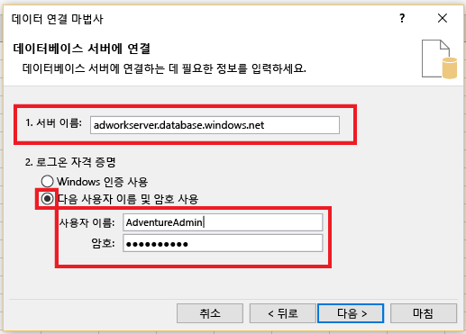
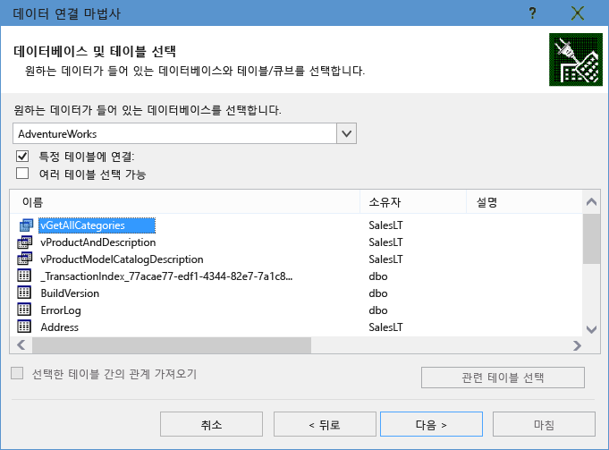
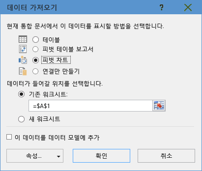
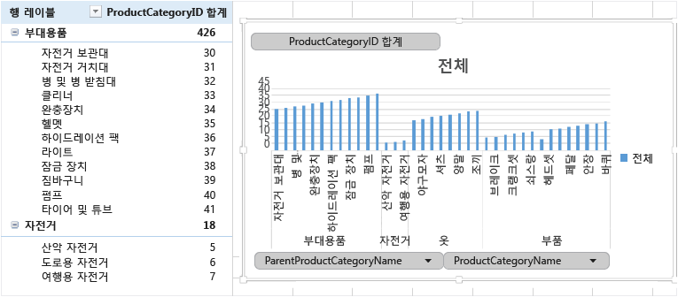

# Azure SQL 데이터베이스의 단일 데이터베이스에 Excel을 연결하고 보고서 만들기

Azure SQL Database의 단일 데이터베이스에 Excel을 연결하여 데이터를 가져오고, 데이터베이스의 값을 기반으로 테이블 및 차트를 만듭니다. 이 자습서에서는 Excel과 데이터베이스 테이블 간의 연결을 설정하고 Excel에 대한 데이터 및 연결 정보가 있는 파일을 저장한 후 데이터베이스 값에서 피벗 차트를 만듭니다.

시작하려면 단일 데이터베이스가 필요합니다. 아직 없으면 [단일 데이터베이스 만들기](sql-database-single-database-get-started.md) 및 [서버 수준 IP 방화벽 만들기](sql-database-server-level-firewall-rule.md)를 참조하여 몇 분 내에 샘플 데이터가 실행 중인 단일 데이터베이스를 가져옵니다.

이 문서에서는 해당 문서에서 샘플 데이터를 Excel에 가져오지만 고유의 데이터에서 비슷한 단계를 따를 수 있습니다.

또한 Excel의 사본이 필요합니다. 이 문서는 [Microsoft Excel 2016](https://products.office.com/)를 사용합니다.

## SQL 데이터베이스에 Excel 연결 및 데이터 로드

1. Excel을 SQL 데이터베이스에 연결하려면 Excel을 연 다음 새 통합 문서를 만들거나 기존 Excel 통합 문서를 엽니다.
2. 페이지 상단의 메뉴 막대에서 **데이터** 탭을 선택하고 **데이터 가져오기**를 선택한 다음, [위치: Azure]와 **위치: Azure SQL Database**를 차례로 선택합니다. 

   

   데이터 연결 마법사가 열립니다.
3. **데이터베이스 서버에 연결** 대화 상자에서 <*servername*>**.database.windows.net** 형식에서 연결하려는 SQL Database **서버 이름**을 입력합니다. 예를 들어, **msftestserver.database.windows.net**입니다. 선택적으로 데이터베이스 이름을 입력합니다. **확인**을 선택하여 자격 증명 창을 엽니다. 

   

4. **SQL Server 데이터베이스** 대화 상자에서 왼쪽의 **데이터베이스**를 선택한 다음, 연결할 SQL Database 서버의 **사용자 이름**과 **암호**를 입력합니다. **연결**을 선택하여 **탐색기**를 엽니다. 

   

   > [!TIP]
   > 네트워크 환경에 따라 SQL Database 서버에서 클라이언트 IP 주소에서 트래픽을 허용하지 않는 경우 연결할 수 없거나 연결이 끊길 수 있습니다. [Azure 포털](https://portal.azure.com/)로 이동하고 SQL Server를 클릭하고 서버를 클릭하며 설정 아래에서 방화벽을 클릭하고 클라이언트 IP 주소를 추가합니다. 자세한 내용은 [방화벽 설정 구성 방법](sql-database-configure-firewall-settings.md) 을 참조하세요.

5. **탐색기**의 목록에서 작업할 데이터베이스를 선택하고, 작업할 테이블 또는 보기를 선택한(여기서는 **vGetAllCategories** 선택) 후에, **로드**를 선택하여 데이터베이스에서 Excel 스프레드시트로 데이터를 이동합니다.

    

## Excel로 데이터 가져오기 및 피벗 차트 만들기

연결을 설정한 후에는 데이터를 로드하는 방법과 관련하여 여러 옵션이 있습니다. 예를 들어, 다음 단계에서는 SQL Database에 있는 데이터를 기반으로 피벗 차트를 만듭니다. 

1. 이전 섹션의 단계를 따릅니다. 단, 이번에는 **로드**를 선택하는 대신 **로드** 드롭다운에서 **Load to**(로드 위치)를 선택합니다.
2. 그런 다음, 현재 통합 문서에서 이 데이터를 표시할 방법을 선택합니다. **PivotChart**를 선택했습니다. 또한 **새 워크시트**를 만들거나 **이 데이터를 데이터 모델에 추가하도록** 선택할 수도 있습니다. 데이터 모델에 대한 자세한 내용은 [Excel에서 데이터 모델 만들기](https://support.office.com/article/Create-a-Data-Model-in-Excel-87E7A54C-87DC-488E-9410-5C75DBCB0F7B)를 참조하세요. 

    

    이제 워크시트에는 빈 피벗 테이블 및 차트가 있습니다.
3. **PivotTable 필드**아래에서 보려는 필드에 대한 모든 확인란을 선택합니다.

    

> [!TIP]
> 다른 Excel 통합 문서 및 워크시트를 데이터베이스에 연결하려면 **데이터** 탭을 선택하고 **최근 원본**을 선택하여 **최근 원본** 대화 상자를 시작합니다. 여기서, 목록에서 만든 연결을 선택한 다음, **열기**를 클릭합니다.
> 

## .odc 파일을 사용하여 영구 연결 만들기

연결 세부 정보를 영구적으로 저장하려면 .odc 파일을 만들고 이 연결을 **기존 연결** 대화 상자에서 선택 가능한 옵션으로 지정하면 됩니다. 

1. 페이지 상단의 메뉴 모음에서 **데이터** 탭을 선택한 다음, **기존 연결**을 선택하여 **기존 연결** 대화 상자를 시작합니다. 
   1. **더 찾아보기**를 선택하여 **데이터 원본 선택** 대화 상자를 엽니다.   
   2. **+NewSqlServerConnection.odc** 파일을 선택한 후 **열기**를 선택하여 **데이터 연결 마법사**를 엽니다.

      

2. **데이터 연결 마법사**에서 서버 이름과 SQL Database 자격 증명을 입력합니다. **다음**을 선택합니다. 
   1. 드롭다운에서 데이터가 포함된 데이터베이스를 선택합니다. 
   2. 원하는 테이블 또는 보기를 선택합니다. 여기서는 vGetAllCategories를 선택했습니다.
   3. **다음**을 선택합니다. 

       

3. 파일의 위치와 **파일 이름**을 선택한 다음, 데이터 연결 마법사의 다음 화면에서 **이름**을 선택합니다. 파일에 암호를 저장하도록 선택할 수도 있지만, 이 경우에는 원치 않는 액세스에 데이터가 노출될 수도 있습니다. 준비가 되면 **마침**을 선택합니다. 

    

4. 데이터를 가져올 방법을 선택합니다. 여기서는 피벗 테이블을 만들도록 선택했습니다. **속성**을 선택하여 연결의 속성을 수정할 수도 있습니다. 준비가 되면 **확인**을 선택합니다. 파일에 암호를 저장하도록 선택하지 않은 경우에는 자격 증명을 입력하라는 메시지가 표시됩니다. 

    

5. **데이터** 탭을 확장하고 **기존 연결**을 선택하여 새 연결이 저장되었는지 확인합니다. 

    

## 다음 단계

* 고급 쿼리 및 분석을 위해 [SQL Server Management Studio를 사용하여 SQL Database에 연결](sql-database-connect-query-ssms.md) 하는 방법에 대해 알아보세요.
* [탄력적 풀](sql-database-elastic-pool.md)의 이점에 대해 알아보세요.
* [백 엔드에서 SQL Database에 연결할 웹 애플리케이션을 만드는](../app-service/app-service-web-tutorial-dotnet-sqldatabase.md)방법에 대해 알아보세요.
