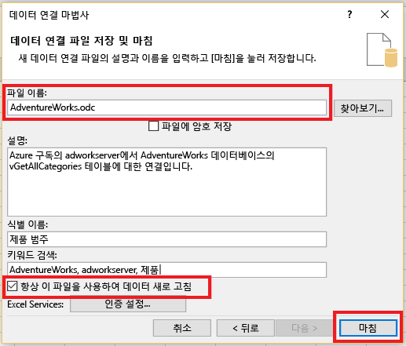
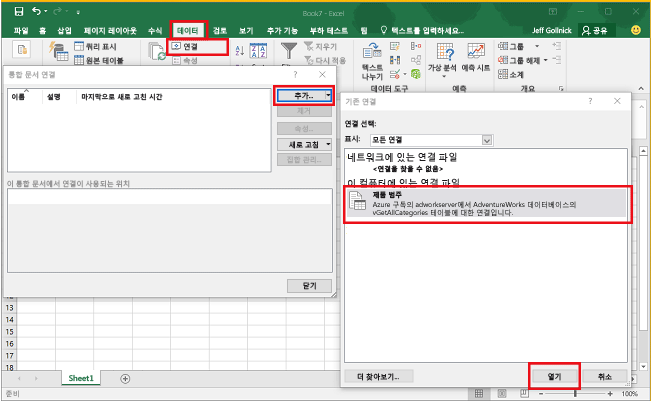

<properties
	pageTitle="SQL 데이터베이스에 Excel 연결 | Microsoft Azure"
	description="Microsoft Excel을 클라우드의 Azure SQL 데이터베이스에 연결하는 방법을 알아봅니다. 보고 및 데이터 탐색을 위해 Excel로 데이터를 가져옵니다."
	services="sql-database"
	keywords="SQL에 Excel 연결, Excel로 데이터 가져오기"
	documentationCenter=""
	authors="joseidz"
	manager="jhubbard"
	editor=""/>

<tags
	ms.service="sql-database"
	ms.workload="data-management"
	ms.tgt_pltfrm="na"
	ms.devlang="na"
	ms.topic="get-started-article"
	ms.date="07/05/2016"
	ms.author="joseidz"/>

# SQL 데이터베이스 자습서: Azure SQL 데이터베이스에 Excel 연결 및 보고서 만들기

> [AZURE.SELECTOR]
- [Visual Studio](sql-database-connect-query.md)
- [SSMS](sql-database-connect-query-ssms.md)
- [Excel](sql-database-connect-excel.md)

클라우드에서 SQL 데이터베이스에 Excel을 연결하여 데이터를 가져오고 데이터베이스의 값을 기반으로 테이블 및 차트를 만드는 방법에 대해 알아봅니다. 이 자습서에서는 Excel과 데이터베이스 테이블 간의 연결을 설정하고 Excel에 대한 데이터 및 연결 정보가 있는 파일을 저장한 후 데이터베이스 값에서 피벗 차트를 만듭니다.

시작하기 전에 Azure에서 SQL 데이터베이스가 필요합니다. SQL 데이터베이스가 없다면 [첫 번째 SQL 데이터베이스 만들기](sql-database-get-started.md)를 참조하여 몇 분 내에 샘플 데이터와 함께 실행되는 데이터베이스를 가져옵니다. 이 문서에서는 해당 문서에서 샘플 데이터를 Excel에 가져오지만 고유의 데이터에서 비슷한 단계를 따를 수 있습니다.

또한 Excel의 사본이 필요합니다. 이 문서는 [Microsoft Excel 2016](https://products.office.com/en-US/)를 사용합니다.

## SQL 데이터베이스에 Excel 연결 및 odc 파일 만들기

1.	Excel을 SQL 데이터베이스에 연결하려면 Excel을 연 다음 새 통합 문서를 만들거나 기존 Excel 통합 문서를 엽니다.

2.	페이지 위쪽에 있는 메뉴 모음에서 **데이터**, **기타 원본에서** 및 **SQL Server에서**를 차례로 클릭합니다.

	

	데이터 연결 마법사가 열립니다.

3.	**데이터베이스 서버에 연결** 대화 상자에서 <*servername*>**.database.windows.net** 형식에서 연결하려는 SQL 데이터베이스 **서버 이름**을 입력합니다. 예를 들어 **adworkserver.database.windows.net**입니다.

4.	**로그온 자격 증명**에서 **다음 사용자 이름 및 암호 사용**을 클릭하고 SQL 데이터베이스 서버를 만들 때 설정한 **사용자 이름** 및 **암호**를 입력한 후 **다음**을 클릭합니다.

    

	> [AZURE.TIP] 네트워크 환경에 따라 SQL 데이터베이스 서버에서 클라이언트 IP 주소에서 트래픽을 허용하지 않는 경우 연결할 수 없거나 연결이 끊길 수 있습니다. [Azure 포털](https://portal.azure.com/)로 이동하고 SQL Server를 클릭하고 서버를 클릭하며 설정 아래에서 방화벽을 클릭하고 클라이언트 IP 주소를 추가합니다. 자세한 내용은 [방화벽 설정 구성 방법](sql-database-configure-firewall-settings.md)을 참조하세요.

5. **데이터베이스 및 테이블 선택** 대화 상자에서 목록에서 작업할 데이터베이스를 선택한 후 작업할 테이블 또는 뷰(**vGetAllCategories** 선택)를 클릭한 후 **다음**을 클릭합니다.

	

    **데이터 연결 파일 저장 및 마침** 대화 상자가 열리고 여기에 Excel에서 사용하는 Office 데이터베이스 연결(*.odc) 파일에 대한 정보를 제공합니다. 기본값을 그대로 두거나 선택 항목을 사용자 지정할 수 있습니다.

6. 기본값을 그대로 두지만 특히 **파일 이름**은 적어둡니다. **설명**, **친숙한 이름** 및 **검색 키워드**를 통해 사용자는 연결할 대상을 기억하고 연결을 찾을 수 있습니다. odc 파일에 저장된 연결 정보를 원하는 경우 **항상 이 파일을 사용하여 데이터 새로 고침**을 클릭하여 연결할 때 업데이트할 수 있도록 한 후 **마침**을 클릭합니다.

    

    **데이터 가져오기** 대화 상자가 나타납니다.

## Excel로 데이터 가져오기 및 피벗 차트 만들기
이제 연결을 설정했고 데이터 및 연결 정보로 파일을 만들었으며 데이터를 가져올 준비가 됩니다.

1. **데이터 가져오기** 대화 상자에서 워크시트의 데이터를 표시하기 위해 원하는 옵션을 클릭한 후 **확인**을 클릭합니다. **PivotChart**를 선택했습니다. 또한 **새 워크시트**를 만들거나 **이 데이터를 데이터 모델에 추가하도록** 선택할 수도 있습니다. 데이터 모델에 대한 자세한 내용은 [Excel에서 데이터 모델 만들기](https://support.office.com/article/Create-a-Data-Model-in-Excel-87E7A54C-87DC-488E-9410-5C75DBCB0F7B)를 참조하세요. **속성**을 클릭하여 이전 단계에서 만든 odc 파일에 대한 정보를 탐색하고 데이터를 새로 고치는 옵션을 선택합니다.

	

    이제 워크시트에는 빈 피벗 테이블 및 차트가 있습니다.

8. **PivotTable 필드** 아래에서 보려는 필드에 대한 모든 확인란을 선택합니다.

	

> [AZURE.TIP] 다른 Excel 통합 문서 및 워크시트를 데이터베이스에 연결하려면 **데이터**, **연결**, **추가**를 차례로 클릭하고 목록에서 만든 연결을 선택한 후 **열기**를 클릭합니다. 

## 다음 단계

- 고급 쿼리 및 분석을 위해 [SQL Server Management Studio를 사용하여 SQL 데이터베이스에 연결](sql-database-connect-query-ssms.md)하는 방법에 대해 알아보세요.
- [탄력적 풀](sql-database-elastic-pool.md)의 이점에 대해 알아보세요.
- [백 엔드에서 SQL 데이터베이스에 연결할 웹 응용 프로그램을 만드는](../app-service-web/web-sites-dotnet-deploy-aspnet-mvc-app-membership-oauth-sql-database.md) 방법에 대해 알아보세요.

<!-----HONumber=AcomDC_0706_2016-->