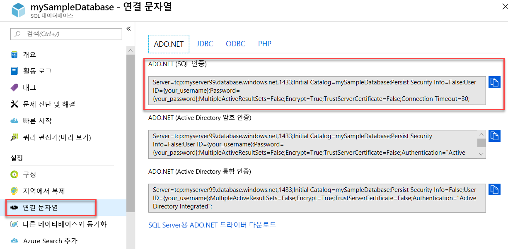

# <a name="quickstart-use-net-core-c-to-query-an-azure-sql-database"></a>빠른 시작: .NET Core(C#)를 사용하여 Azure SQL 데이터베이스 쿼리

이 빠른 시작에서는 [.NET Core](https://www.microsoft.com/net/) 및 C# 코드를 사용하여 Azure SQL 데이터베이스에 연결합니다. 그런 다음, Transact-SQL 문을 실행하여 데이터를 쿼리합니다.

## <a name="prerequisites"></a>필수 조건

이 자습서에서는 다음이 필요합니다.

- Azure SQL 데이터베이스입니다. 다음 빠른 시작 중 하나를 사용하여 Azure SQL Database에서 데이터베이스를 만들고 구성할 수 있습니다.

  || 단일 데이터베이스 | Managed Instance |
  |:--- |:--- |:---|
  | 생성| [포털](sql-database-single-database-get-started.md) | [포털](sql-database-managed-instance-get-started.md) |
  || [CLI](scripts/sql-database-create-and-configure-database-cli.md) | [CLI](https://medium.com/azure-sqldb-managed-instance/working-with-sql-managed-instance-using-azure-cli-611795fe0b44) |
  || [PowerShell](scripts/sql-database-create-and-configure-database-powershell.md) | [PowerShell](https://blogs.msdn.microsoft.com/sqlserverstorageengine/2018/06/27/quick-start-script-create-azure-sql-managed-instance-using-powershell/) |
  | 구성 | [서버 수준 IP 방화벽 규칙](sql-database-server-level-firewall-rule.md)| [VM에서 연결](sql-database-managed-instance-configure-vm.md)|
  |||[사이트에서 연결](sql-database-managed-instance-configure-p2s.md)
  |데이터 로드|Adventure Works(빠른 시작마다 로드됨)|[Wide World Importers 복원](sql-database-managed-instance-get-started-restore.md)
  |||[github](https://github.com/Microsoft/sql-server-samples/tree/master/samples/databases/adventure-works)의 [BACPAC](sql-database-import.md) 파일에서 Adventure Works 복원 또는 가져오기|
  |||

  > [!IMPORTANT]
  > 이 문서의 스크립트는 Adventure Works 데이터베이스를 사용하도록 작성되었습니다. 관리되는 인스턴스의 경우 Adventure Works 데이터베이스를 인스턴스 데이터베이스로 가져오거나 이 문서의 스크립트를 수정하여 Wide World Importors 데이터베이스를 사용해야 합니다.

- [해당 운영 체제용 .NET Core](https://www.microsoft.com/net/core)가 설치됨

> [!NOTE]
> 이 빠른 시작에서는 *mySampleDatabase* 데이터베이스를 사용합니다. 다른 데이터베이스를 사용하려면 데이터베이스 참조를 변경하고 C# 코드에서 `SELECT` 쿼리를 수정해야 합니다.

## <a name="get-sql-server-connection-information"></a>SQL Server 연결 정보 가져오기

Azure SQL 데이터베이스에 연결하는 데 필요한 연결 정보를 가져옵니다. 다음 절차를 수행하려면 정규화된 서버 이름이나 호스트 이름, 데이터베이스 이름 및 로그인 정보가 필요합니다.

1. [Azure Portal](https://portal.azure.com/)에 로그인합니다.

2. **SQL 데이터베이스** 또는 **SQL 관리되는 인스턴스** 페이지로 이동합니다.

3. **개요** 페이지에서 단일 데이터베이스에 대한 **서버 이름** 옆에 있는 정규화된 서버 이름 또는 관리되는 인스턴스에 대한 **호스트** 옆에 있는 정규화된 서버 이름을 검토합니다. 서버 이름이나 호스트 이름을 복사하려면 마우스로 해당 이름 위를 가리키고 **복사** 아이콘을 선택합니다.

## <a name="get-adonet-connection-information-optional"></a>ADO.NET 연결 정보 가져오기(선택 사항)

1. **mySampleDatabase** 페이지로 이동한 다음, **설정** 아래에서 **연결 문자열**을 선택합니다.

2. 전체 **ADO.NET** 연결 문자열을 검토합니다.

    

3. 사용하려는 경우 **ADO.NET** 연결 문자열을 복사합니다.
  
## <a name="create-a-new-net-core-project"></a>새로운 .NET Core 프로젝트 만들기

1. 명령 프롬프트를 열고 **sqltest**라는 폴더를 만듭니다. 이 폴더로 이동하여 이 명령을 실행합니다.

    ```cmd
    dotnet new console
    ```
    이 명령은 초기 C# 코드 파일(**Program.cs**), XML 구성 파일(**sqltest.csproj**) 및 필요한 이진 파일을 포함하여 새로운 앱 프로젝트 파일을 만듭니다.

2. 텍스트 편집기에서 **sqltest.csproj**를 열고 `<Project>` 태그 사이에 다음 XML을 붙여넣습니다. 이 XML은 `System.Data.SqlClient`를 종속성으로 추가합니다.

    ```xml
    <ItemGroup>
        <PackageReference Include="System.Data.SqlClient" Version="4.6.0" />
    </ItemGroup>
    ```

## <a name="insert-code-to-query-sql-database"></a>SQL 데이터베이스 쿼리 코드 삽입

1. 텍스트 편집기에서 **Program.cs**를 엽니다.

2. 내용을 다음 코드로 바꾸고 서버, 데이터베이스, 사용자 이름 및 암호에 대해 적절한 값을 추가합니다.

> [!NOTE]
> ADO.NET 연결 문자열을 사용하려면 서버, 데이터베이스, 사용자 이름 및 암호를 설정하는 코드의 4줄을 아래 줄로 바꿉니다. 문자열에서 사용자 이름과 암호를 설정합니다.
>
>    `builder.ConnectionString="<your_ado_net_connection_string>";`

```csharp
using System;
using System.Data.SqlClient;
using System.Text;

namespace sqltest
{
    class Program
    {
        static void Main(string[] args)
        {
            try 
            { 
                SqlConnectionStringBuilder builder = new SqlConnectionStringBuilder();

                builder.DataSource = "<your_server.database.windows.net>"; 
                builder.UserID = "<your_username>";            
                builder.Password = "<your_password>";     
                builder.InitialCatalog = "<your_database>";
         
                using (SqlConnection connection = new SqlConnection(builder.ConnectionString))
                {
                    Console.WriteLine("\nQuery data example:");
                    Console.WriteLine("=========================================\n");
                    
                    connection.Open();       
                    StringBuilder sb = new StringBuilder();
                    sb.Append("SELECT TOP 20 pc.Name as CategoryName, p.name as ProductName ");
                    sb.Append("FROM [SalesLT].[ProductCategory] pc ");
                    sb.Append("JOIN [SalesLT].[Product] p ");
                    sb.Append("ON pc.productcategoryid = p.productcategoryid;");
                    String sql = sb.ToString();

                    using (SqlCommand command = new SqlCommand(sql, connection))
                    {
                        using (SqlDataReader reader = command.ExecuteReader())
                        {
                            while (reader.Read())
                            {
                                Console.WriteLine("{0} {1}", reader.GetString(0), reader.GetString(1));
                            }
                        }
                    }                    
                }
            }
            catch (SqlException e)
            {
                Console.WriteLine(e.ToString());
            }
            Console.WriteLine("\nDone. Press enter.");
            Console.ReadLine(); 
        }
    }
}
```

## <a name="run-the-code"></a>코드 실행

1. 프롬프트에서 다음 명령을 실행합니다.

   ```cmd
   dotnet restore
   dotnet run
   ```

2. 상위 20개 행이 반환되는지 확인합니다.

   ```text
   Query data example:
   =========================================

   Road Frames HL Road Frame - Black, 58
   Road Frames HL Road Frame - Red, 58
   Helmets Sport-100 Helmet, Red
   Helmets Sport-100 Helmet, Black
   Socks Mountain Bike Socks, M
   Socks Mountain Bike Socks, L
   Helmets Sport-100 Helmet, Blue
   Caps AWC Logo Cap
   Jerseys Long-Sleeve Logo Jersey, S
   Jerseys Long-Sleeve Logo Jersey, M
   Jerseys Long-Sleeve Logo Jersey, L
   Jerseys Long-Sleeve Logo Jersey, XL
   Road Frames HL Road Frame - Red, 62
   Road Frames HL Road Frame - Red, 44
   Road Frames HL Road Frame - Red, 48
   Road Frames HL Road Frame - Red, 52
   Road Frames HL Road Frame - Red, 56
   Road Frames LL Road Frame - Black, 58
   Road Frames LL Road Frame - Black, 60
   Road Frames LL Road Frame - Black, 62

   Done. Press enter.
   ```
3. **Enter**를 선택하여 애플리케이션 창을 닫습니다.

## <a name="next-steps"></a>다음 단계

- [명령줄을 사용하여 Windows/Linux/macOS에서 .NET Core를 시작하는 방법](/dotnet/core/tutorials/using-with-xplat-cli)을 알아봅니다.
- [.NET Framework 및 Visual Studio를 사용하여 Azure SQL 데이터베이스를 연결하고 쿼리하는 방법](sql-database-connect-query-dotnet-visual-studio.md)을 알아봅니다.  
- [SSMS를 사용하여 첫 번째 Azure SQL Database를 디자인](sql-database-design-first-database.md)하거나 [Azure SQL Database를 디자인하고 C# 및 ADO.NET에 연결](sql-database-design-first-database-csharp.md)하는 방법을 알아봅니다.
- .NET에 대한 자세한 내용은 [.NET 설명서](https://docs.microsoft.com/dotnet/)를 참조하세요.
