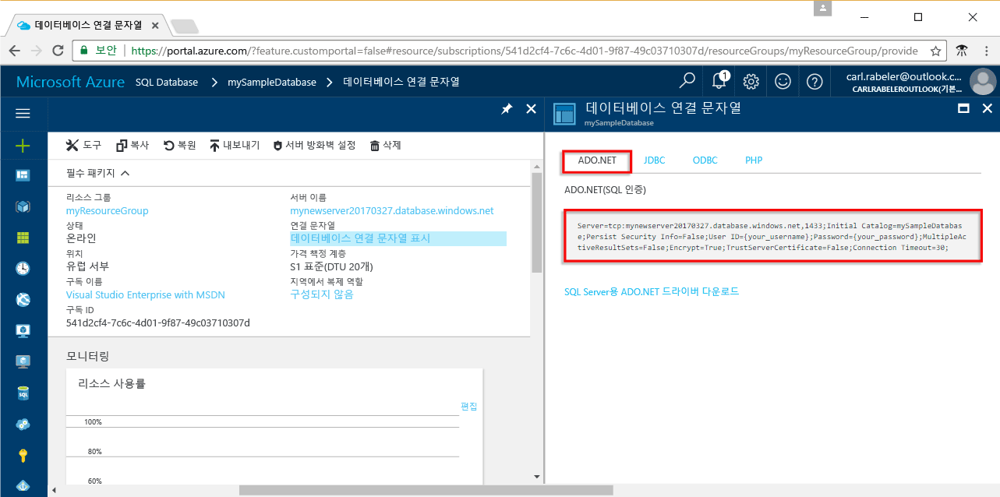

# <a name="use-net-core-c-to-query-an-azure-sql-database"></a>.NET Core(C#)를 사용하여 Azure SQL 데이터베이스 쿼리

이 빠른 시작에서는 Windows/Linux/macOS에서 [.NET Core](https://www.microsoft.com/net/)를 사용하여 Azure SQL Database에 연결하고, TRANSACT-SQL 문을 사용하여 데이터를 쿼리하는 C# 프로그램을 만드는 방법을 보여 줍니다.

## <a name="prerequisites"></a>필수 조건

이 빠른 시작을 완료하려면 다음 항목이 있어야 합니다.

[!INCLUDE [prerequisites-create-db](../../includes/sql-database-connect-query-prerequisites-create-db-includes.md)]

- 이 빠른 시작에서 사용하는 컴퓨터의 공용 IP 주소에 대한 [서버 수준 방화벽 규칙](sql-database-get-started-portal.md#create-a-server-level-firewall-rule)

- 설치된 [해당 운영 체제용 .NET Core](https://www.microsoft.com/net/core) 

## <a name="sql-server-connection-information"></a>SQL 서버 연결 정보

[!INCLUDE [prerequisites-server-connection-info](../../includes/sql-database-connect-query-prerequisites-server-connection-info-includes.md)]

#### <a name="for-adonet"></a>ADO.NET의 경우

1. **데이터베이스 연결 문자열 표시**를 클릭하여 계속합니다.

2. 전체 **ADO.NET** 연결 문자열을 검토합니다.

    

> [!IMPORTANT]
> 이 자습서를 수행하는 컴퓨터의 공용 IP 주소에 대한 방화벽 규칙이 있어야 합니다. 다른 컴퓨터에 있거나 다른 공용 IP 주소가 있으면 [Azure Portal을 사용하여 서버 수준 방화벽 규칙을 만듭니다](sql-database-get-started-portal.md#create-a-server-level-firewall-rule). 
>
  
## <a name="create-a-new-net-project"></a>새 .NET 프로젝트 만들기

1. 명령 프롬프트를 열고 *sqltest*라는 폴더를 만듭니다. 생성한 폴더로 이동하여 다음 명령을 실행합니다.

    ```
    dotnet new console
    ```

2. 원하는 텍스트 편집기에서 ***sqltest.csproj***를 열고 다음 코드를 사용하여 System.Data.SqlClient를 종속성으로 추가합니다.

    ```xml
    <ItemGroup>
        <PackageReference Include="System.Data.SqlClient" Version="4.4.0" />
    </ItemGroup>
    ```

## <a name="insert-code-to-query-sql-database"></a>SQL 데이터베이스 쿼리 코드 삽입

1. 개발 환경 또는 원하는 텍스트 편집기에서 **Program.cs**를 엽니다.

2. 내용을 다음 코드로 바꾸고, 서버, 데이터베이스, 사용자 및 암호에 대해 적절한 값을 추가합니다.

```csharp
using System;
using System.Data.SqlClient;
using System.Text;

namespace sqltest
{
    class Program
    {
        static void Main(string[] args)
        {
            try 
            { 
                SqlConnectionStringBuilder builder = new SqlConnectionStringBuilder();
                builder.DataSource = "your_server.database.windows.net"; 
                builder.UserID = "your_user";            
                builder.Password = "your_password";     
                builder.InitialCatalog = "your_database";

                using (SqlConnection connection = new SqlConnection(builder.ConnectionString))
                {
                    Console.WriteLine("\nQuery data example:");
                    Console.WriteLine("=========================================\n");
                    
                    connection.Open();       
                    StringBuilder sb = new StringBuilder();
                    sb.Append("SELECT TOP 20 pc.Name as CategoryName, p.name as ProductName ");
                    sb.Append("FROM [SalesLT].[ProductCategory] pc ");
                    sb.Append("JOIN [SalesLT].[Product] p ");
                    sb.Append("ON pc.productcategoryid = p.productcategoryid;");
                    String sql = sb.ToString();

                    using (SqlCommand command = new SqlCommand(sql, connection))
                    {
                        using (SqlDataReader reader = command.ExecuteReader())
                        {
                            while (reader.Read())
                            {
                                Console.WriteLine("{0} {1}", reader.GetString(0), reader.GetString(1));
                            }
                        }
                    }                    
                }
            }
            catch (SqlException e)
            {
                Console.WriteLine(e.ToString());
            }
            Console.ReadLine();
        }
    }
}
```

## <a name="run-the-code"></a>코드 실행

1. 명령 프롬프트에서 다음 명령을 실행합니다.

   ```csharp
   dotnet restore
   dotnet run
   ```

2. 상위 20개 행이 반환되는지 확인한 다음 응용 프로그램 창을 닫습니다.


## <a name="next-steps"></a>다음 단계

- [명령줄을 사용하여 Windows/Linux/macOS에서 .NET Core를 시작하는 방법](/dotnet/core/tutorials/using-with-xplat-cli)을 알아봅니다.
- [.NET Framework 및 Visual Studio를 사용하여 Azure SQL Database를 연결 및 쿼리하는 방법](sql-database-connect-query-dotnet-visual-studio.md)을 알아봅니다.  
- [SSMS를 사용하여 첫 번째 Azure SQL Database를 설계하는 방법](sql-database-design-first-database.md) 또는 [.NET을 사용하여 첫 번째 Azure SQL Database를 설계하는 방법](sql-database-design-first-database-csharp.md)을 알아봅니다.
- .NET에 대한 자세한 내용은 [.NET 설명서](https://docs.microsoft.com/dotnet/)를 참조하세요.
