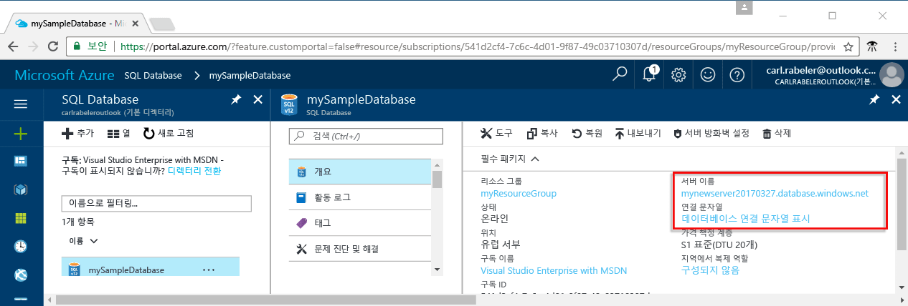

# <a name="azure-sql-database-use-net-c-to-connect-and-query-data"></a>Azure SQL Database: .NET(C#)을 사용하여 데이터에 연결 및 쿼리

[C# 및 ADO.NET](https://msdn.microsoft.com/library/kb9s9ks0.aspx)를 사용하여 Azure SQL Database에 연결하고 쿼리합니다. 이 가이드는 C#을 사용하여 Azure SQL Database에 연결하고 쿼리, 삽입, 업데이트 및 삭제 문을 실행하는 방법을 자세히 설명합니다.

이 빠른 시작은 다음과 같은 빠른 시작 중 하나에서 만들어진 리소스를 시작 지점으로 사용합니다.

- [DB 만들기 - 포털](sql-database-get-started-portal.md)
- [DB 만들기 - CLI](sql-database-get-started-cli.md)

## <a name="configure-development-environment"></a>개발 환경 구성

다음 섹션에서는 Azure SQL Database 작업을 수행하기 위해 기존 Mac OS, Linux(Ubuntu) 및 Windows 개발 환경을 구성하는 방법을 자세히 설명합니다.

### <a name="mac-os"></a>**Mac OS**
터미널을 열고 .NET Core 프로젝트를 만들려는 디렉터리로 이동합니다. 다음 명령을 입력하여 **brew**, **OpenSSL** 및 **.NET Core**를 설치합니다. 

```C#
ruby -e "$(curl -fsSL https://raw.githubusercontent.com/Homebrew/install/master/install)"
brew update
brew install openssl
mkdir -p /usr/local/lib
ln -s /usr/local/opt/openssl/lib/libcrypto.1.0.0.dylib /usr/local/lib/
ln -s /usr/local/opt/openssl/lib/libssl.1.0.0.dylib /usr/local/lib/
```

MacOS에 .NET Core를 설치합니다. [공식 설치 관리자](https://go.microsoft.com/fwlink/?linkid=843444)를 다운로드합니다. 이 설치 관리자는 도구를 설치하고 경로에 저장하여 콘솔에서 dotnet을 실행할 수 있도록 합니다.

### <a name="linux-ubuntu"></a>**Linux(Ubuntu)**
터미널을 열고 .NET Core 프로젝트를 만들려는 디렉터리로 이동합니다. 다음 명령을 입력하여 **.NET Core**를 설치합니다.

```C#
sudo sh -c 'echo "deb [arch=amd64] https://apt-mo.trafficmanager.net/repos/dotnet-release/ xenial main" > /etc/apt/sources.list.d/dotnetdev.list'
sudo apt-key adv --keyserver hkp://keyserver.ubuntu.com:80 --recv-keys 417A0893
sudo apt-get update
sudo apt-get install dotnet-dev-1.0.1
```

### <a name="windows"></a>**Windows**
Visual Studio 2015 Community Edition 및.NET Framework를 설치합니다. 컴퓨터에 이미 Visual Studio가 설치된 경우 다음 몇 단계를 건너뜁니다.

Visual Studio 2015 Community는 Android, iOS, Windows뿐만 아니라 웹 및 데이터베이스 응용 프로그램, 클라우드 서비스를 위한 최신 응용 프로그램을 만들기 위해 완전한 기능을 갖춘 확장 가능한 평가판 IDE입니다.

1. [설치 프로그램](https://go.microsoft.com/fwlink/?LinkId=691978)을 다운로드합니다. 
2. 설치 관리자를 실행하고 설치 메시지에 따라 설치를 완료합니다.

## <a name="get-connection-information"></a>연결 정보 가져오기

Azure Portal에서 연결 문자열을 가져옵니다. 연결 문자열을 사용하여 Azure SQL Database에 연결합니다.

1. [Azure 포털](https://portal.azure.com/)에 로그인합니다.
2. 왼쪽 메뉴에서 **SQL Database**를 선택하고 **SQL Database** 페이지에서 데이터베이스를 클릭합니다. 
3. 데이터베이스의 **Essentials** 창에서 정규화된 서버 이름을 검토합니다. 

    

4. **연결 문자열 표시**를 클릭합니다.

5. 전체 **ADO.NET** 연결 문자열을 검토합니다.

    
    
## <a name="add-systemdatasqlclient"></a>System.Data.SqlClient 추가
.NET Core를 사용하는 경우 System.Data.SqlClient를 프로젝트의 ***csproj*** 파일에 종속 항목으로 추가합니다.

```xml
<ItemGroup>
    <PackageReference Include="System.Data.SqlClient" Version="4.3.0" />
</ItemGroup>
```

## <a name="select-data"></a>데이터를 선택합니다.

1. 개발 환경에서 빈 코드 파일을 엽니다.
2. ```using System.Data.SqlClient```를 코드 파일([System.Data.SqlClient 네임스페이스](https://msdn.microsoft.com/library/system.data.sqlclient.aspx))에 추가합니다. 

3. [SELECT](https://msdn.microsoft.com/library/ms189499.aspx) Transact-SQL 문과 [SqlCommand.ExecuteReader](https://msdn.microsoft.com/library/system.data.sqlclient.sqlcommand.executereader.aspx)를 사용하여 Azure SQL Database에서 데이터를 쿼리합니다. 서버에 대한 적절한 값을 추가합니다.

```csharp
using System;
using System.Data;
using System.Data.SqlClient;

namespace ConsoleApplication1
{
    class Program
    {
        static void Main(string[] args)
        {
            try 
            { 
                SqlConnectionStringBuilder builder = new SqlConnectionStringBuilder();
                builder.DataSource = "your_server.database.windows.net"; 
                builder.UserID = "your_user";            
                builder.Password = "your_password";     
                builder.InitialCatalog = "your_database";

                using (SqlConnection connection = new SqlConnection(builder.ConnectionString))
                {
                    Console.WriteLine("\nQuery data example:");
                    Console.WriteLine("=========================================\n");
                    
                    connection.Open();       
                    StringBuilder sb = new StringBuilder();
                    sb.Append("SELECT TOP 20 pc.Name as CategoryName, p.name as ProductName ");
                    sb.Append("FROM [SalesLT].[ProductCategory] pc ");
                    sb.Append("JOIN [SalesLT].[Product] p ");
                    sb.Append("ON pc.productcategoryid = p.productcategoryid;");
                    String sql = sb.ToString();

                    using (SqlCommand command = new SqlCommand(sql, connection))
                    {
                        using (SqlDataReader reader = command.ExecuteReader())
                        {
                            while (reader.Read())
                            {
                                Console.WriteLine("{0} {1}", reader.GetString(0), reader.GetString(1));
                            }
                        }
                    }                    
                }
            }
            catch (SqlException e)
            {
                Console.WriteLine(e.ToString());
            }
        }
    }
}
```

## <a name="insert-data"></a>데이터 삽입

[INSERT](https://msdn.microsoft.com/library/ms174335.aspx) Transact-SQL 문과 [SqlCommand.ExecuteNonQuery](https://msdn.microsoft.com/library/system.data.sqlclient.sqlcommand.executenonquery.aspx)를 사용하여 Azure SQL Database에 데이터를 삽입합니다.

```csharp
using System;
using System.Data;
using System.Data.SqlClient;

namespace ConsoleApplication1
{
    class Program
    {
        static void Main(string[] args)
        {
            try 
            { 
                SqlConnectionStringBuilder builder = new SqlConnectionStringBuilder();
                builder.DataSource = "your_server.database.windows.net"; 
                builder.UserID = "your_user";            
                builder.Password = "your_password";     
                builder.InitialCatalog = "your_database";

                using (SqlConnection connection = new SqlConnection(builder.ConnectionString))
                {
                    Console.WriteLine("\nInsert data example:");
                    Console.WriteLine("=========================================\n");

                    connection.Open();       
                    StringBuilder sb = new StringBuilder();
                    sb.Append("INSERT INTO [SalesLT].[Product] ([Name], [ProductNumber], [Color], [StandardCost], [ListPrice], [SellStartDate]) ");
                    sb.Append("VALUES (@Name, @ProductNumber, @Color, @StandardCost, @ListPrice, @SellStartDate);");
                    String sql = sb.ToString();
                    using (SqlCommand command = new SqlCommand(sql, connection))
                    {
                        command.Parameters.AddWithValue("@Name", "BrandNewProduct");
                        command.Parameters.AddWithValue("@ProductNumber", "200989");
                        command.Parameters.AddWithValue("@Color", "Blue");
                        command.Parameters.AddWithValue("@StandardCost", 75);
                        command.Parameters.AddWithValue("@ListPrice", 80);
                        command.Parameters.AddWithValue("@SellStartDate", "7/1/2016");
                        int rowsAffected = command.ExecuteNonQuery();
                        Console.WriteLine(rowsAffected + " row(s) inserted");
                    }         
                }
            }
            catch (SqlException e)
            {
                Console.WriteLine(e.ToString());
            }
        }
    }
}
```

## <a name="update-data"></a>데이터 업데이트

[UPDATE](https://msdn.microsoft.com/library/ms177523.aspx) Transact-SQL 문과 [SqlCommand.ExecuteNonQuery](https://msdn.microsoft.com/library/system.data.sqlclient.sqlcommand.executenonquery.aspx)를 사용하여 Azure SQL Database에서 데이터를 업데이트합니다.

```csharp
using System;
using System.Data;
using System.Data.SqlClient;

namespace ConsoleApplication1
{
    class Program
    {
        static void Main(string[] args)
        {
            try 
            { 
                SqlConnectionStringBuilder builder = new SqlConnectionStringBuilder();
                builder.DataSource = "your_server.database.windows.net"; 
                builder.UserID = "your_user";            
                builder.Password = "your_password";     
                builder.InitialCatalog = "your_database";

                using (SqlConnection connection = new SqlConnection(builder.ConnectionString))
                {
                    Console.WriteLine("\nUpdate data example");
                    Console.WriteLine("=========================================\n");

                    connection.Open();       
                    StringBuilder sb = new StringBuilder();
                    sb.Append("UPDATE [SalesLT].[Product] SET ListPrice = @ListPrice WHERE Name = @Name;");
                    String sql = sb.ToString();
                    using (SqlCommand command = new SqlCommand(sql, connection))
                    {
                        command.Parameters.AddWithValue("@Name", "BrandNewProduct");
                        command.Parameters.AddWithValue("@ListPrice", 500);
                        int rowsAffected = command.ExecuteNonQuery();
                        Console.WriteLine(rowsAffected + " row(s) updated");
                    }         
                }
            }
            catch (SqlException e)
            {
                Console.WriteLine(e.ToString());
            }
        }
    }
}
```

## <a name="delete-data"></a>데이터 삭제

[DELETE](https://msdn.microsoft.com/library/ms189835.aspx) Transact-SQL 문과 [SqlCommand.ExecuteNonQuery](https://msdn.microsoft.com/library/system.data.sqlclient.sqlcommand.executenonquery.aspx)를 사용하여 Azure SQL Database에서 데이터를 삭제합니다.

```csharp
using System;
using System.Data;
using System.Data.SqlClient;

namespace ConsoleApplication1
{
    class Program
    {
        static void Main(string[] args)
        {
            try 
            { 
                SqlConnectionStringBuilder builder = new SqlConnectionStringBuilder();
                builder.DataSource = "your_server.database.windows.net"; 
                builder.UserID = "your_user";            
                builder.Password = "your_password";     
                builder.InitialCatalog = "your_database";

                using (SqlConnection connection = new SqlConnection(builder.ConnectionString))
                {
                    Console.WriteLine("\nDelete data example");
                    Console.WriteLine("=========================================\n");

                    connection.Open();       
                    StringBuilder sb = new StringBuilder();
                    sb.Append("DELETE FROM SalesLT.Product WHERE Name = @Name;");
                    String sql = sb.ToString();
                    using (SqlCommand command = new SqlCommand(sql, connection))
                    {
                        command.Parameters.AddWithValue("@Name", "BrandNewProduct");
                        int rowsAffected = command.ExecuteNonQuery();
                        Console.WriteLine(rowsAffected + " row(s) deleted");
                    }         
                }
            }
            catch (SqlException e)
            {
                Console.WriteLine(e.ToString());
            }
        }
    }
}
```

## <a name="next-steps"></a>다음 단계

- .NET 설명서는 [.NET 설명서](https://docs.microsoft.com/dotnet/)를 참조하세요.
- Visual Studio Code를 사용하여 데이터를 쿼리 및 편집하는 방법에 대한 정보는 [Visual Studio Code](https://code.visualstudio.com/docs)를 참조하세요.

