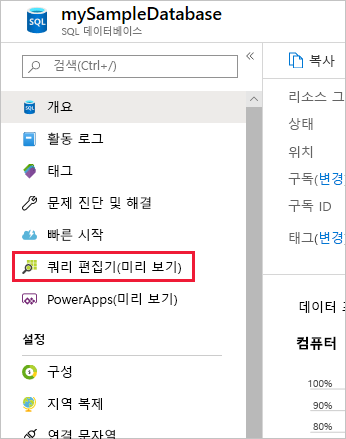
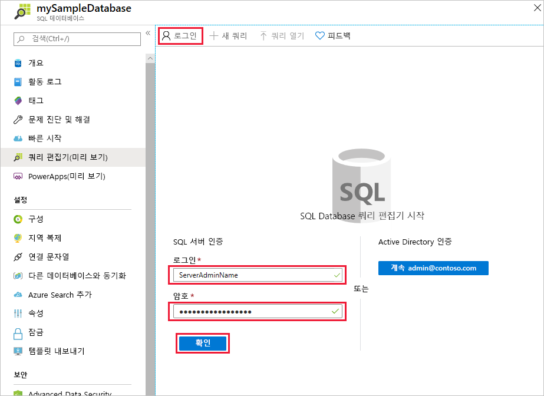
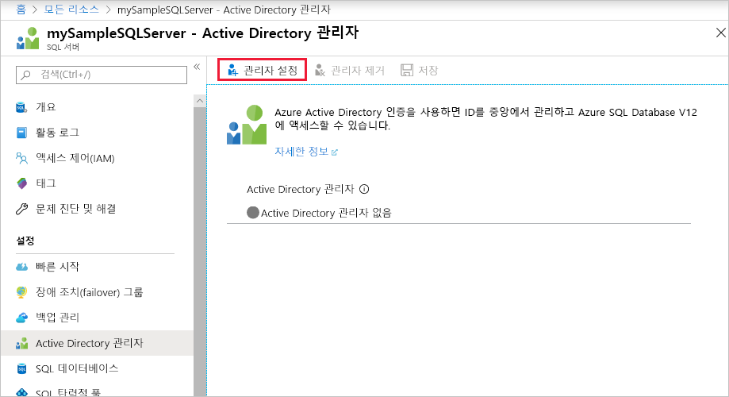
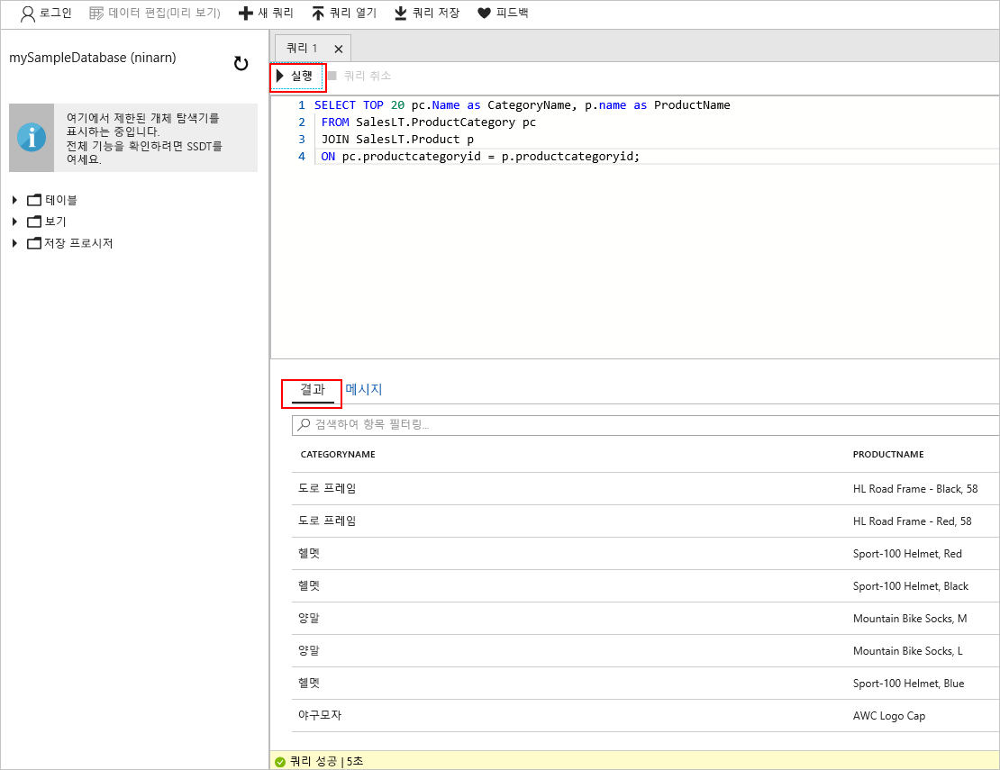

# <a name="azure-portal-use-the-sql-query-editor-to-connect-and-query-data"></a>Azure Portal: SQL 쿼리 편집기를 사용하여 데이터 연결 및 쿼리

SQL 쿼리 편집기는 Azure Portal에서 Azure SQL Database 또는 Azure SQL Data Warehouse에 대한 SQL 쿼리를 실행하는 효율적이고 간단한 방법을 제공하는 브라우저 쿼리 도구입니다. 이 빠른 시작에서는 쿼리 편집기를 사용하여 SQL 데이터베이스에 연결한 다음, Transact-SQL 문을 사용하여 데이터베이스에서 데이터를 쿼리, 삽입, 업데이트 및 삭제하는 방법을 보여 줍니다.

## <a name="prerequisites"></a>필수 조건

이 빠른 시작은 다음과 같은 빠른 시작 중 하나에서 만들어진 리소스를 시작 지점으로 사용합니다.

[!INCLUDE [prerequisites-create-db](../../includes/sql-database-connect-query-prerequisites-create-db-includes.md)]

> [!NOTE]
> SQL Server 방화벽 설정에서 "Azure 서비스 방문 허용" 옵션이 "켜기"로 설정되어 있는지 확인합니다. 이 옵션을 사용하면 SQL 쿼리 편집기에서 데이터베이스 및 데이터 웨어하우스에 액세스할 수 있습니다.

## <a name="log-in-to-the-azure-portal"></a>Azure Portal에 로그인

[Azure Portal](https://portal.azure.com/)에 로그인합니다.


## <a name="connect-using-sql-authentication"></a>SQL 인증을 사용하여 연결

1. 왼쪽 메뉴에서 **SQL 데이터베이스**를 클릭하고 쿼리할 데이터베이스를 클릭합니다.

2. 데이터베이스의 SQL Database 페이지에서 왼쪽 메뉴에 있는 **쿼리 편집기(미리 보기)**를 찾아 클릭합니다.

    

3. **로그인**을 클릭하고 메시지가 표시되면 **SQL Server 인증**을 선택한 다음 데이터베이스를 만들 때 제공한 서버 관리자 로그인 및 암호를 제공합니다.

    

4. **확인**을 클릭하여 로그인합니다.


## <a name="connect-using-azure-ad"></a>Azure AD를 사용하여 연결

Active Directory 관리자를 구성하면 단일 ID를 사용하여 Azure Portal 및 SQL 데이터베이스에 로그인할 수 있습니다. 다음 단계에 따라 만든 SQL Server에 대한 활성 디렉터리 관리자를 구성합니다.

> [!NOTE]
> 전자 메일 계정(예: outlook.com, hotmail.com, live.com, gmail.com, yahoo.com)은 아직 Active Directory 관리자로 지원되지 않습니다. Azure Active Directory에서 기본적으로 만들어졌거나 Azure Active 디렉터리에 페더레이션된 사용자를 선택합니다.

1. 왼쪽 메뉴에서 **SQL Server**를 선택하고 서버 목록에서 SQL Server를 선택합니다.

2. SQL Server의 설정 메뉴에서 **Active Directory 관리자** 설정을 선택합니다.

3. Active Directory 관리 블레이드에서 **관리자 설정** 명령을 클릭하고, Active Directory 관리자가 될 사용자 또는 그룹을 선택합니다.

    

4. Active Directory 관리 블레이드의 위쪽에서 **저장** 명령을 클릭하여 Active Directory 관리자를 설정합니다.

쿼리하려는 SQL Database로 이동하고 왼쪽 메뉴에서 **데이터 탐색기(미리 보기)**를 클릭합니다. 데이터 편집기 페이지가 열리고 해당 데이터베이스에 자동으로 연결됩니다.


## <a name="run-query-using-query-editor"></a>쿼리 편집기를 사용하여 쿼리 실행

인증된 후에 쿼리 편집기 창에서 다음 쿼리를 입력하여 범주별로 상위 20개 제품을 쿼리합니다.

```sql
 SELECT TOP 20 pc.Name as CategoryName, p.name as ProductName
 FROM SalesLT.ProductCategory pc
 JOIN SalesLT.Product p
 ON pc.productcategoryid = p.productcategoryid;
```

**실행**을 클릭한 후 **결과** 창에서 쿼리 결과를 검토합니다.



## <a name="insert-data-using-query-editor"></a>쿼리 편집기를 사용하여 데이터 삽입

[INSERT](https://msdn.microsoft.com/library/ms174335.aspx) Transact-SQL 문을 사용하여 SalesLT.Product 테이블에 새 제품을 삽입하려면 다음 코드를 사용합니다.

1. 쿼리 창에서 이전 쿼리를 다음 쿼리로 바꿉니다.

   ```sql
   INSERT INTO [SalesLT].[Product]
           ( [Name]
           , [ProductNumber]
           , [Color]
           , [ProductCategoryID]
           , [StandardCost]
           , [ListPrice]
           , [SellStartDate]
           )
     VALUES
           ('myNewProduct'
           ,123456789
           ,'NewColor'
           ,1
           ,100
           ,100
           ,GETDATE() );
   ```

2. 도구 모음에서 **실행**을 클릭하여 Product 테이블에 새 행을 삽입합니다.

## <a name="update-data-using-query-editor"></a>쿼리 편집기를 사용하여 데이터 업데이트

이전에 추가한 새 제품을 [UPDATE](https://msdn.microsoft.com/library/ms177523.aspx) Transact-SQL 문을 사용하여 업데이트하려면 다음 코드를 사용합니다.

1. 쿼리 창에서 이전 쿼리를 다음 쿼리로 바꿉니다.

   ```sql
   UPDATE [SalesLT].[Product]
   SET [ListPrice] = 125
   WHERE Name = 'myNewProduct';
   ```

2. 도구 모음에서 **실행**을 클릭하여 지정한 Product 테이블의 행을 업데이트합니다.

## <a name="delete-data-using-query-editor"></a>쿼리 편집기를 사용하여 데이터 삭제

이전에 추가한 새 제품을 [DELETE](https://msdn.microsoft.com/library/ms189835.aspx) Transact-SQL 문을 사용하여 삭제하려면 다음 코드를 사용합니다.

1. 쿼리 창에서 이전 쿼리를 다음 쿼리로 바꿉니다.

   ```sql
   DELETE FROM [SalesLT].[Product]
   WHERE Name = 'myNewProduct';
   ```

2. 도구 모음에서 **실행**을 클릭하여 지정한 Product 테이블의 행을 삭제합니다.


## <a name="query-editor-considerations"></a>쿼리 편집기에 대한 고려 사항

쿼리 편집기를 사용할 때 알아야 할 몇 가지 사항이 있습니다.

1. Azure SQL Server 방화벽 설정에서 "Azure 서비스 방문 허용" 옵션을 "켜기"로 설정했는지 확인합니다. 이 옵션을 사용하면 SQL 쿼리 편집기에서 SQL 데이터베이스 및 데이터 웨어하우스에 액세스할 수 있습니다.

2. SQL Server가 Virtual Network에 있으면 해당 서버에서 데이터베이스를 쿼리하는 데 쿼리 편집기를 사용할 수 없습니다.

3. F5 키를 누르면 쿼리 편집기 페이지를 새로 고치고 처리 중인 쿼리가 손실됩니다. 도구 모음의 [실행] 단추를 사용하여 쿼리를 실행합니다.

4. 쿼리 편집기는 마스터 DB에 대한 연결을 지원하지 않습니다.

5. 쿼리 실행에 대한 제한 시간은 5분입니다.

6. 2단계 인증을 사용하는 계정에서는 Azure Active Directory 관리자 로그인이 작동하지 않습니다.

7. 전자 메일 계정(예: outlook.com, hotmail.com, live.com, gmail.com, yahoo.com)은 아직 Active Directory 관리자로 지원되지 않습니다. Azure Active Directory에서 기본적으로 만들어졌거나 Azure Active 디렉터리에 페더레이션된 사용자를 선택합니다.

8. 쿼리 편집기는 지리 데이터 형식에 대한 원통 도법만 지원합니다.

9. 데이터베이스 테이블 및 뷰에 대한 IntelliSense는 지원되지 않습니다. 그러나 이미 입력된 이름에 대한 자동 완성은 편집기에서 지원합니다.


## <a name="next-steps"></a>다음 단계

- Azure SQL 데이터베이스에서 지원되는 Transact-SQL에 대한 자세한 내용은 [SQL 데이터베이스의 Transact-SQL 차이점](sql-database-transact-sql-information.md)을 참조하세요.
