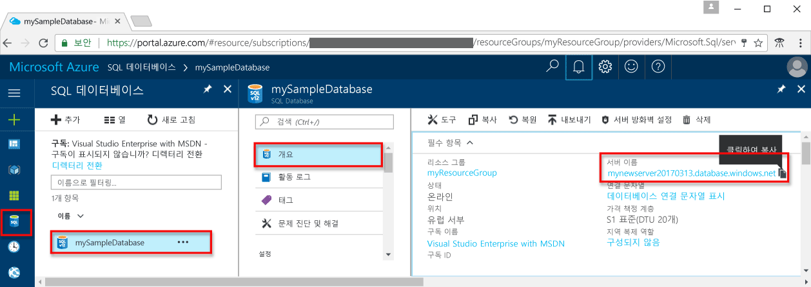

# <a name="azure-sql-database-use-ruby-to-connect-and-query-data"></a>Azure SQL Database: Ruby를 사용하여 데이터에 연결 및 쿼리

[Ruby](https://Ruby.org)를 사용하여 Azure SQL Database에 연결하고 쿼리합니다. 이 가이드는 Ruby를 사용하여 Azure SQL Database에 연결하고 쿼리, 삽입, 업데이트 및 삭제 문을 실행하는 방법을 자세히 설명합니다.

이 빠른 시작은 다음과 같은 빠른 시작 중 하나에서 만들어진 리소스를 시작 지점으로 사용합니다.

- [DB 만들기 - 포털](sql-database-get-started-portal.md)
- [DB 만들기 - CLI](sql-database-get-started-cli.md)

## <a name="configure-development-environment"></a>개발 환경 구성

다음 섹션에서는 Azure SQL Database 작업을 수행하기 위해 기존 Mac OS 및 Linux(Ubuntu) 개발 환경을 구성하는 방법을 자세히 설명합니다.

### <a name="mac-os"></a>**Mac OS**
터미널을 열고 Ruby 스크립트를 만들려는 디렉터리로 이동합니다. 다음 명령을 입력하여 **brew**, **FreeTDS** 및 **TinyTDS**를 설치합니다.

```ruby
ruby -e "$(curl -fsSL https://raw.githubusercontent.com/Homebrew/install/master/install)"
brew tap microsoft/msodbcsql https://github.com/Microsoft/homebrew-msodbcsql-preview
brew update
brew install FreeTDS
gem install tiny_tds
```

### <a name="linux-ubuntu"></a>**Linux(Ubuntu)**
터미널을 열고 Ruby 스크립트를 만들려는 디렉터리로 이동합니다. 다음 명령을 입력하여 **FreeTDS** 및 **TinyTDS**를 설치합니다.

```ruby
wget ftp://ftp.freetds.org/pub/freetds/stable/freetds-1.00.27.tar.gz
tar -xzf freetds-1.00.27.tar.gz
cd freetds-1.00.27
./configure --prefix=/usr/local --with-tdsver=7.3
make
make install
gem install tiny_tds
```

## <a name="get-connection-information"></a>연결 정보 가져오기

Azure Portal에서 연결 문자열을 가져옵니다. 연결 문자열을 사용하여 Azure SQL Database에 연결합니다.

1. [Azure 포털](https://portal.azure.com/)에 로그인합니다.
2. 왼쪽 메뉴에서 **SQL Database**를 선택하고 **SQL Database** 페이지에서 데이터베이스를 클릭합니다. 
3. 데이터베이스의 **Essentials** 창에서 정규화된 서버 이름을 검토합니다.

    
    

## <a name="select-data"></a>데이터 선택
[SELECT](https://msdn.microsoft.com/library/ms189499.aspx) Transact-SQL 문과 [TinyTDS::Client](https://github.com/rails-sqlserver/tiny_tds)를 사용하여 Azure SQL Database에서 데이터를 쿼리합니다. TinyTDS::Client 함수는 쿼리를 허용하고 결과 집합을 반환합니다. 이 결과 집합은 [result.each do |row|](https://github.com/rails-sqlserver/tiny_tds)를 사용하여 반복됩니다.

```ruby
require 'tiny_tds'
server = 'yourserver.database.windows.net'
database = 'yourdatabase'
username = 'yourusername'
password = 'yourpassword'
client = TinyTds::Client.new username: username, password: password, 
    host: server, port: 1433, database: database, azure: true

puts "Reading data from table"
tsql = "SELECT TOP 20 pc.Name as CategoryName, p.name as ProductName
        FROM [SalesLT].[ProductCategory] pc
        JOIN [SalesLT].[Product] p
        ON pc.productcategoryid = p.productcategoryid"
result = client.execute(tsql)
result.each do |row|
    puts row
end
```

## <a name="insert-data"></a>데이터 삽입
[INSERT](https://msdn.microsoft.com/library/ms174335.aspx) Transact-SQL 문과 [TinyTDS::Client](https://github.com/rails-sqlserver/tiny_tds) 함수를 사용하여 Azure SQL Database에 데이터를 삽입합니다.

이 예제에서는 [INSERT](https://msdn.microsoft.com/library/ms174335.aspx) 문을 안전하게 실행하고, [SQL 삽입](https://technet.microsoft.com/library/ms161953(v=sql.105).aspx) 취약성으로부터 응용 프로그램을 보호하는 매개 변수를 전달하며, 자동으로 생성된 [기본 키](https://msdn.microsoft.com/library/ms179610.aspx) 값을 검색하는 방법을 보여 줍니다.    
  
TinyTDS와 Azure를 함께 사용하려면 여러 `SET` 문을 실행하여 현재 세션에서 특정 정보를 처리 하는 방법을 변경하는 것이 좋습니다. 권장되는 `SET` 문이 코드 샘플에 제공됩니다. 예를 들어 `SET ANSI_NULL_DFLT_ON` 에서는 열의 Null 허용 여부 상태가 명시적으로 지정되지 않은 경우에도 Null 값을 허용하도록 새 열을 만들 수 있습니다.  
  
Microsoft SQL Server [datetime](http://msdn.microsoft.com/library/ms187819.aspx) 형식에 맞게 [strftime](http://ruby-doc.org/core-2.2.0/Time.html#method-i-strftime) 함수를 사용하여 해당 날짜/시간 형식으로 캐스팅합니다.

```ruby
require 'tiny_tds'
server = 'yourserver.database.windows.net'
database = 'yourdatabase'
username = 'yourusername'
password = 'yourpassword'
client = TinyTds::Client.new username: username, password: password, 
    host: server, port: 1433, database: database, azure: true

# settings for Azure
result = client.execute("SET ANSI_NULLS ON")
result = client.execute("SET CURSOR_CLOSE_ON_COMMIT OFF")
result = client.execute("SET ANSI_NULL_DFLT_ON ON")
result = client.execute("SET IMPLICIT_TRANSACTIONS OFF")
result = client.execute("SET ANSI_PADDING ON")
result = client.execute("SET QUOTED_IDENTIFIER ON"")
result = client.execute("SET ANSI_WARNINGS ON")
result = client.execute("SET CONCAT_NULL_YIELDS_NULL ON")

def insert(name, productnumber, color, standardcost, listprice, sellstartdate)
    tsql = "INSERT INTO SalesLT.Product (Name, ProductNumber, Color, StandardCost, ListPrice, SellStartDate) 
        VALUES (N'#{name}', N'#{productnumber}',N'#{color}',N'#{standardcost}',N'#{listprice}',N'#{sellstartdate}')"
    result = client.execute(tsql)
    result.each
    puts "#{result.affected_rows} row(s) affected"
end
insert('BrandNewProduct', '200989', 'Blue', 75, 80, '7/1/2016')
```

## <a name="update-data"></a>데이터 업데이트
[UPDATE](https://msdn.microsoft.com/library/ms189835.aspx) Transact-SQL 문과 [TinyTDS::Client](https://github.com/rails-sqlserver/tiny_tds) 함수를 사용하여 Azure SQL Database에서 데이터를 업데이트합니다.

```ruby
require 'tiny_tds'
server = 'yourserver.database.windows.net'
database = 'yourdatabase'
username = 'yourusername'
password = 'yourpassword'
client = TinyTds::Client.new username: username, password: password, 
    host: server, port: 1433, database: database, azure: true
    
def update(name, listPrice, client)
    tsql = "UPDATE SalesLT.Product SET ListPrice = N'#{listPrice}' WHERE Name =N'#{name}'";
    result = client.execute(tsql)
    result.each
    puts "#{result.affected_rows} row(s) affected"
end
update('BrandNewProduct', 500, client)
```

## <a name="delete-data"></a>데이터 삭제
[DELETE](https://msdn.microsoft.com/library/ms189835.aspx) Transact-SQL 문과 [TinyTDS::Client](https://github.com/rails-sqlserver/tiny_tds) 함수를 사용하여 Azure SQL Database에서 데이터를 삭제합니다.

```ruby
require 'tiny_tds'
server = 'yourserver.database.windows.net'
database = 'yourdatabase'
username = 'yourusername'
password = 'yourpassword'
client = TinyTds::Client.new username: username, password: password, 
    host: server, port: 1433, database: database, azure: true

# settings for Azure
result = client.execute("SET ANSI_NULLS ON")
result = client.execute("SET CURSOR_CLOSE_ON_COMMIT OFF")
result = client.execute("SET ANSI_NULL_DFLT_ON ON")
result = client.execute("SET IMPLICIT_TRANSACTIONS OFF")
result = client.execute("SET ANSI_PADDING ON")
result = client.execute("SET QUOTED_IDENTIFIER ON")
result = client.execute("SET ANSI_WARNINGS ON")
result = client.execute("SET CONCAT_NULL_YIELDS_NULL ON")

def delete(name, client)
    tsql = "DELETE FROM SalesLT.Product WHERE Name = N'#{name}'"
    result = client.execute(tsql)
    result.each
    puts "#{result.affected_rows} row(s) affected"
end
delete('BrandNewProduct', client)
```

## <a name="next-steps"></a>다음 단계
* [SQL Database 개발 개요](sql-database-develop-overview.md)를 검토합니다.
* [SQL Server용 Ruby Driver](https://docs.microsoft.com/sql/connect/ruby/ruby-driver-for-sql-server/)에 대한 추가 정보
* 모든 [SQL 데이터베이스의 기능](https://azure.microsoft.com/services/sql-database/)을 탐색합니다.

