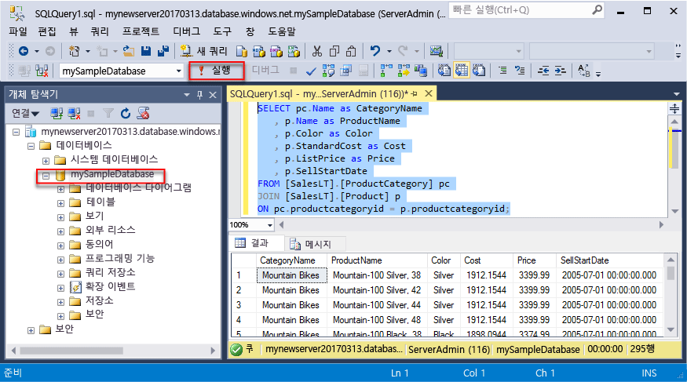
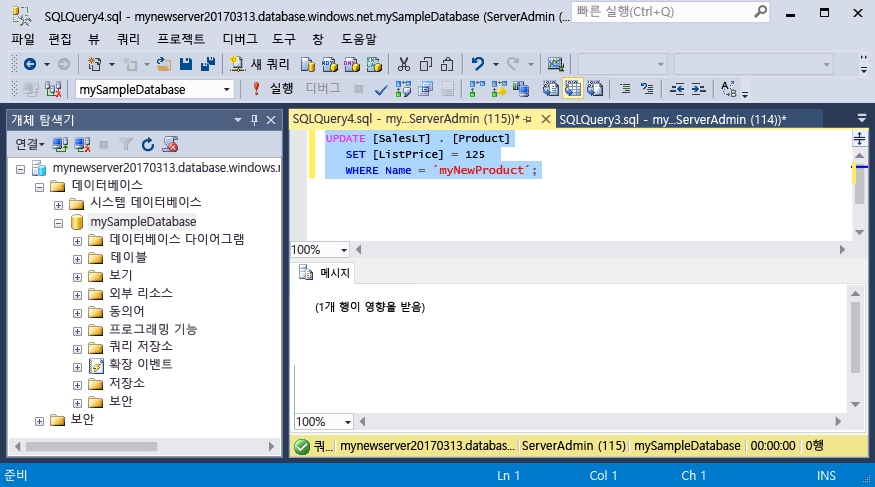
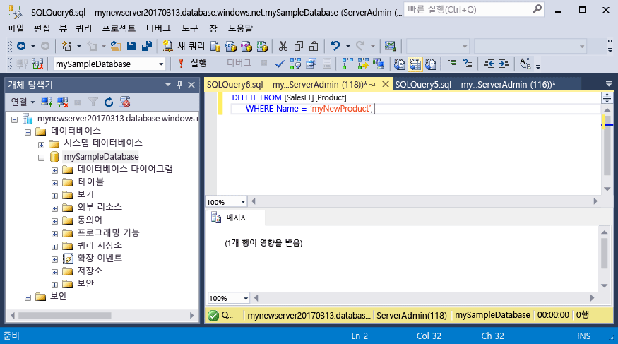

# <a name="azure-sql-database-use-sql-server-management-studio-to-connect-and-query-data"></a>Azure SQL Database: SQL Server Management Studio를 사용하여 데이터에 연결 및 쿼리

SSMS([SQL Server Management Studio][ssms-install-latest-84g])는 Microsoft Windows의 SQL Server에서 SQL Database에 이르는 모든 SQL 인프라를 관리할 수 있는 통합된 환경입니다. SSMS를 사용하여 Azure SQL 데이터베이스에 연결한 다음, Transact-SQL 문을 사용하여 데이터베이스에서 데이터를 쿼리, 삽입, 업데이트 및 삭제하는 방법을 보여 줍니다. 

## <a name="prerequisites"></a>필수 조건

이 빠른 시작은 다음과 같은 빠른 시작 중 하나에서 만들어진 리소스를 시작 지점으로 사용합니다.

[!INCLUDE [prerequisites-create-db](../../includes/sql-database-connect-query-prerequisites-create-db-includes.md)]

#### <a name="install-the-latest-ssms"></a>최신 SSMS 설치

시작하기 전에 최신 버전의 [SSMS][ssms-install-latest-84g]를 설치했는지 확인합니다. 

## <a name="sql-server-connection-information"></a>SQL 서버 연결 정보

[!INCLUDE [prerequisites-server-connection-info](../../includes/sql-database-connect-query-prerequisites-server-connection-info-includes.md)]

## <a name="connect-to-your-database"></a>데이터베이스 연결

SQL Server Management Studio를 사용하여 Azure SQL Database 서버에 연결합니다. 

> [!IMPORTANT]
> Azure SQL Database 논리 서버는 포트 1433에서 수신 대기합니다. 회사 방화벽 내에서 Azure SQL Database 논리 서버로 연결을 시도하면 성공적인 연결을 위해 회사 방화벽에서 이 포트가 열려야 합니다.
>

1. SQL Server Management Studio를 엽니다.

2. **서버에 연결** 대화 상자에서 다음 정보를 입력합니다.

   | 설정      | 제안 값    | 설명 | 
   | ------------ | ------------------ | ----------- | 
   | **서버 유형** | 데이터베이스 엔진 | 이 값은 필수입니다. |
   | **서버 이름** | 정규화된 서버 이름 | 이름은 **mynewserver20170313.database.windows.net**과 같아야 합니다. |
   | **인증** | SQL Server Authentication | SQL 인증은 이 자습서에서 구성한 유일한 인증 유형입니다. |
   | **로그인** | 서버 관리자 계정 | 서버를 만들 때 지정한 계정입니다. |
   | **암호** | 서버 관리자 계정의 암호 | 서버를 만들 때 지정한 암호입니다. |
   ||||

     

3. **서버에 연결** 대화 상자에서 **옵션**을 클릭합니다. **데이터베이스에 연결** 섹션에서 **mySampleDatabase**를 입력하여 이 데이터베이스에 연결합니다.

     

4. **Connect**를 클릭합니다. SSMS에서 개체 탐색기 창이 열립니다. 

     

5. 개체 탐색기에서 **데이터베이스**를 확장한 다음 **mySampleDatabase**를 확장하여 샘플 데이터베이스에 있는 개체를 봅니다.

## <a name="query-data"></a>쿼리 데이터

다음 코드를 사용하여 [SELECT](https://msdn.microsoft.com/library/ms189499.aspx) Transact-SQL 문을 통해 범주별 상위 20개 제품을 쿼리합니다.

1. 개체 탐색기에서 **mySampleDatabase**를 마우스 오른쪽 단추로 클릭하고 **새 쿼리**를 클릭합니다. 데이터베이스에 연결된 비어 있는 쿼리 창이 열립니다.
2. 쿼리 창에서 다음 쿼리를 입력합니다.

   ```sql
   SELECT pc.Name as CategoryName, p.name as ProductName
   FROM [SalesLT].[ProductCategory] pc
   JOIN [SalesLT].[Product] p
   ON pc.productcategoryid = p.productcategoryid;
   ```

3. 도구 모음에서 **실행**을 클릭하여 Product 및 ProductCategory 테이블에서 데이터를 검색합니다.

    

## <a name="insert-data"></a>데이터 삽입

[INSERT](https://msdn.microsoft.com/library/ms174335.aspx) Transact-SQL 문을 사용하여 SalesLT.Product 테이블에 새 제품을 삽입하려면 다음 코드를 사용합니다.

1. 쿼리 창에서 이전 쿼리를 다음 쿼리로 바꿉니다.

   ```sql
   INSERT INTO [SalesLT].[Product]
           ( [Name]
           , [ProductNumber]
           , [Color]
           , [ProductCategoryID]
           , [StandardCost]
           , [ListPrice]
           , [SellStartDate]
           )
     VALUES
           ('myNewProduct'
           ,123456789
           ,'NewColor'
           ,1
           ,100
           ,100
           ,GETDATE() );
   ```

2. 도구 모음에서 **실행**을 클릭하여 Product 테이블에서 새 행을 삽입합니다.

    

## <a name="update-data"></a>데이터 업데이트

이전에 추가한 새 제품을 [UPDATE](https://msdn.microsoft.com/library/ms177523.aspx) Transact-SQL 문을 사용하여 업데이트하려면 다음 코드를 사용합니다.

1. 쿼리 창에서 이전 쿼리를 다음 쿼리로 바꿉니다.

   ```sql
   UPDATE [SalesLT].[Product]
   SET [ListPrice] = 125
   WHERE Name = 'myNewProduct';
   ```

2. 도구 모음에서 **실행**을 클릭하여 Product 테이블에서 지정된 행을 업데이트합니다.

    

## <a name="delete-data"></a>데이터 삭제

이전에 추가한 새 제품을 [DELETE](https://msdn.microsoft.com/library/ms189835.aspx) Transact-SQL 문을 사용하여 삭제하려면 다음 코드를 사용합니다.

1. 쿼리 창에서 이전 쿼리를 다음 쿼리로 바꿉니다.

   ```sql
   DELETE FROM [SalesLT].[Product]
   WHERE Name = 'myNewProduct';
   ```

2. 도구 모음에서 **실행**을 클릭하여 Product 테이블에서 지정된 행을 삭제합니다.

    

## <a name="next-steps"></a>다음 단계

- Transact-SQL를 사용하여 서버와 데이터베이스를 만들어 관리하는 방법에 대한 자세한 내용은 [Azure SQL Database 서버 및 데이터베이스](sql-database-servers-databases.md)를 참조하세요.
- SSMS에 대한 자세한 내용은 [SQL Server Management Studio 사용](https://msdn.microsoft.com/library/ms174173.aspx)을 참조하세요.
- Azure Portal을 사용하여 연결하고 쿼리하려면 [Azure Portal SQL 쿼리 편집기를 사용하여 연결 및 쿼리](sql-database-connect-query-portal.md)를 참조하세요.
- Visual Studio 코드를 사용하여 연결 및 쿼리하려면 [Visual Studio 코드를 사용하여 연결 및 쿼리](sql-database-connect-query-vscode.md)를 참조하세요.
- .NET을 사용하여 연결 및 쿼리하려면 [.NET을 사용하여 연결 및 쿼리](sql-database-connect-query-dotnet.md)를 참조하세요.
- PHP를 사용하여 연결 및 쿼리하려면 [PHP를 사용하여 연결 및 쿼리](sql-database-connect-query-php.md)를 참조하세요.
- Node.js를 사용하여 연결 및 쿼리하려면 [Node.js를 사용하여 연결 및 쿼리](sql-database-connect-query-nodejs.md)를 참조하세요.
- Java를 사용하여 연결 및 쿼리하려면 [Java를 사용하여 연결 및 쿼리](sql-database-connect-query-java.md)를 참조하세요.
- Python을 사용하여 연결 및 쿼리하려면 [Python을 사용하여 연결 및 쿼리](sql-database-connect-query-python.md)를 참조하세요.
- Ruby를 사용하여 연결 및 쿼리하려면 [Ruby를 사용하여 연결 및 쿼리](sql-database-connect-query-ruby.md)를 참조하세요.


<!-- Article link references. -->

[ssms-install-latest-84g]: https://docs.microsoft.com/sql/ssms/sql-server-management-studio-ssms

