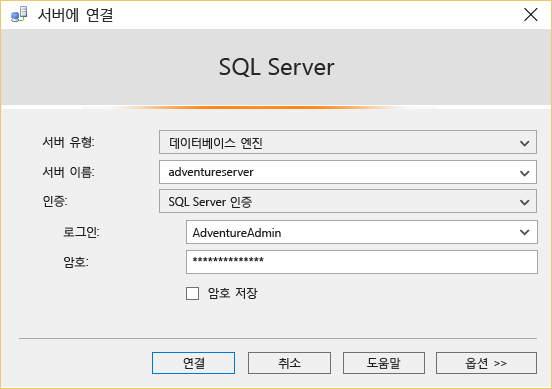

<properties
	pageTitle="SSMS를 사용하여 Azure SQL 데이터베이스에 연결하는 방법 | Microsoft Azure"
	description="SSMS를 사용하여 Azure SQL 데이터베이스에 연결하는 방법을 알아봅니다."
	services="sql-database"
	documentationCenter=""
	authors="stevestein"
	manager="jeffreyg"
	editor=""/>

<tags
	ms.service="sql-database"
	ms.workload="data-management"
	ms.tgt_pltfrm="na"
	ms.devlang="na"
	ms.topic="get-started-article"
	ms.date="08/31/2015"
	ms.author="sstein"/>

# SQL Server Management Studio로 연결
이 문서에서는 SQL Server Management Studio(SSMS)를 설치하고 Azure에서 데이터베이스 서버에 연결한 다음 Transact-SQL 문을 사용하여 간단한 쿼리를 수행하는 방법을 보여 줍니다.

먼저 Azure에서 SQL 데이터베이스가 필요합니다. [Microsoft Azure SQL 데이터베이스 시작](sql-database-get-started.md)의 지침을 사용하여 신속하게 만들 수 있습니다. 여기에 있는 예제는 해당 문서에서 만든 AdventureWorks 샘플 데이터베이스를 기반으로 하지만 쿼리를 수행할 때까지 동일한 단계가 모든 SQL 데이터베이스에 적용됩니다.

## SSMS(SQL Server Management Studio) 설치 및 시작
SQL 데이터베이스를 사용하여 작업할 때 가장 최신 버전의 SSMS을 사용해야 합니다. 최신 버전을 사용하려면 [SQL Server Management Studio 다운로드](https://msdn.microsoft.com/library/mt238290.aspx)를 참조하세요. 가장 최신 버전은 가장 최근의 업데이트를 사용할 수 있는 경우 SSMS에서 자동으로 알려 줍니다.

## SSMS를 시작하고 SQL 데이터베이스 서버에 연결합니다.
1. Windows 검색 상자에 "Microsoft SQL Server Management Studio"를 입력한 다음 데스크톱 응용 프로그램을 클릭하여 SSMS를 시작합니다.
2. **서버에 연결** 대화 상자의 **서버 이름** 상자에 *&lt;servername>*.**database.windows.net** 형식으로 SQL 데이터베이스를 호스팅하는 서버 이름을 입력합니다.
3. **인증** 목록에서 **SQL Server 인증**을 선택합니다.
4. 서버를 만들 때 설정한 **로그인** 및 **암호**를 입력한 다음 **연결**을 클릭합니다.

	

### 연결에 실패하는 경우
연결 실패에 대한 가장 일반적인 이유는 보안상의 이유로 연결을 허용하지 않도록 하는 서버와 서버 이름, 사용자 이름 또는 암호에 대한 실수입니다. 서버의 방화벽 설정이 로컬 컴퓨터의 IP 주소 및 SSMS 클라이언트가 사용하는 IP 주소에서 연결을 허용 하고 있는지 확인합니다. 때때로 다른 경우도 있습니다.

방화벽 규칙으로 인해 연결이 실패하는 경우 IP 주소는 오류 메시지에서 보고됩니다. 서버 방화벽 규칙에 이 IP 주소를 추가합니다. 자세한 내용은 [방법: 방화벽 설정 구성(Azure SQL 데이터베이스)](sql-database-configure-firewall-settings.md)을 참조하세요.

## 예제 쿼리 실행
연결한 후 예제 쿼리를 실행할 수 있습니다. [Microsoft Azure SQL 데이터베이스 시작](sql-database-get-started.md)의 AdventureWorks 샘플을 사용하여 데이터베이스를 만들지 않은 경우 이 쿼리는 작동하지 않습니다. 자세한 내용을 보려면 다음 단계로 건너뜁니다.

1. **개체 탐색기**에서 **AdventureWorks** 데이터베이스로 이동합니다.
2. 데이터베이스를 마우스 오른쪽 단추로 클릭한 다음 **새 쿼리**를 선택합니다.

	

3. 쿼리 창에서 다음 코드를 복사하여 붙여 넣습니다.

		SELECT
		CustomerId
		,Title
		,FirstName
		,LastName
		,CompanyName
		FROM SalesLT.Customer;

4. **실행** 단추를 클릭합니다. 다음 스크린샷에서는 성공적인 쿼리를 보여 줍니다.

	

## 다음 단계
Transact-SQL 문을 사용하여 SQL Server를 통해 할 수 있는 것과 동일한 방식으로 Azure에서 데이터베이스를 만들고 관리할 수 있습니다. SQL server에서 Transact-SQL을 사용하는 것에 익숙하다면 차이점 요약에 대해 [Azure SQL 데이터베이스 Transact-SQL 정보](sql-database-transact-sql-information.md)를 참조하세요.

Transact-SQL을 처음 접하는 경우 [자습서: Transact-SQL 문 쓰기](https://msdn.microsoft.com/library/ms365303.aspx) 및 [Transact-SQL 참조(데이터베이스 엔진)](https://msdn.microsoft.com/library/bb510741.aspx)를 참조하세요.

<!---HONumber=September15_HO1-->