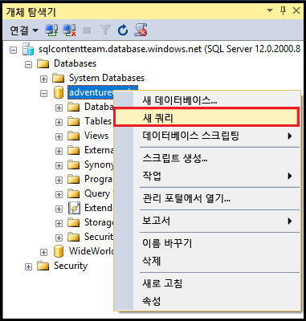
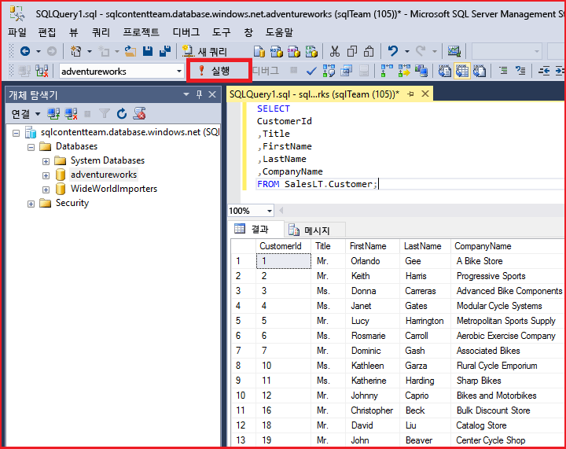

# SQL Server Management Studio를 사용하여 SQL 데이터베이스에 연결하고 샘플 T-SQL 쿼리를 실행합니다.
> [!div class="op_single_selector"]
> * [Visual Studio](sql-database-connect-query.md)
> * [SSMS](sql-database-connect-query-ssms.md)
> * [Excel](sql-database-connect-excel.md)
> 
> 

이 문서에서는 SQL Server Management Studio(SSMS)를 사용하여 Azure SQL 데이터베이스에 연결하는 방법을 보여 줍니다. 성공적으로 연결되면 데이터베이스와의 통신을 확인하는 간단한 T-SQL(Transact-SQL) 쿼리를 실행합니다.

[!INCLUDE [SSMS Install](../../includes/sql-server-management-studio-install.md)]

[!INCLUDE [SSMS Connect](../../includes/sql-database-sql-server-management-studio-connect-server-principal.md)]

## 예제 쿼리 실행
서버에 연결한 후에 데이터베이스에 연결하고 샘플 쿼리를 실행할 수 있습니다. 쿼리를 작성하는 데 익숙하지 않은 경우 [Transact-SQL 문 작성](https://msdn.microsoft.com/library/ms365303.aspx)을 참조하세요.

1. **개체 탐색기**에서 **AdventureWorks** 샘플 데이터베이스와 같은 서버의 데이터베이스로 이동합니다.
2. 데이터베이스를 마우스 오른쪽 단추로 클릭한 다음 **새 쿼리**를 선택합니다.
   
    
3. 쿼리 창에서 다음을 복사하여 붙여넣습니다.
   
        SELECT
        CustomerId
        ,Title
        ,FirstName
        ,LastName
        ,CompanyName
        FROM SalesLT.Customer;
4. **실행** 단추를 클릭합니다.
   
    

## 다음 단계
T-SQL 문을 사용하여 SQL Server를 통해 할 수 있는 것과 동일한 방식으로 Azure에서 데이터베이스를 만들고 관리할 수 있습니다. SQL server에서 T-SQL을 사용하는 것에 익숙하다면 차이점 요약에 대해 [Azure SQL 데이터베이스 Transact-SQL 정보](sql-database-transact-sql-information.md) 를 참조하세요.

T-SQL을 처음 접하는 경우 [자습서: Transact-SQL 문 쓰기](https://msdn.microsoft.com/library/ms365303.aspx) 및 [Transact-SQL 참조(데이터베이스 엔진)](https://msdn.microsoft.com/library/bb510741.aspx)를 참조하세요.

데이터베이스 사용자 및 데이터베이스 사용자 관리자 만들기를 시작하려면 [Azure SQL 데이터베이스 보안 시작](sql-database-get-started-security.md)

SSMS에 대한 자세한 내용은 [SQL Server Management Studio 사용](https://msdn.microsoft.com/library/ms174173.aspx)을 참조하세요.

<!--HONumber=Nov16_HO2-->

