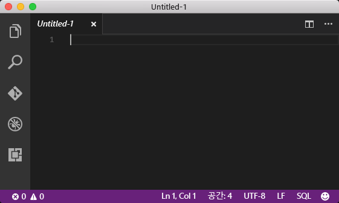
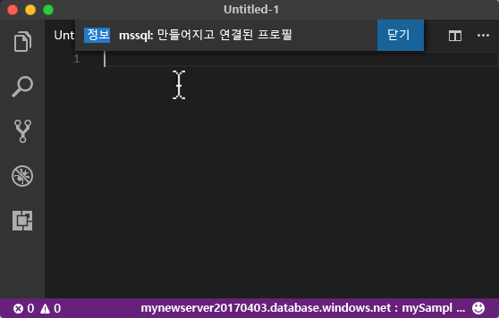
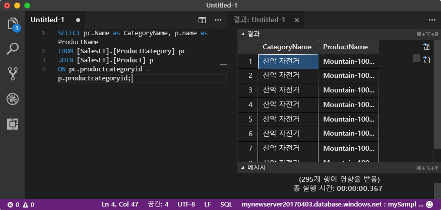

# <a name="azure-sql-database-use-visual-studio-code-to-connect-and-query-data"></a>Azure SQL Database: Visual Studio Code를 사용하여 데이터에 연결 및 쿼리

[Visual Studio Code](https://code.visualstudio.com/docs)는 Microsoft SQL Server, Azure SQL Database 및 SQL Data Warehouse를 쿼리하는 [mssql 확장](https://aka.ms/mssql-marketplace)을 비롯한 여러 확장을 지원하는 Linux, macOS, Windows용 그래픽 코드 편집기입니다. 이 빠른 시작은 Visual Studio 코드를 사용하여 Azure SQL Database에 연결한 후 Transact-SQL 문을 사용하여 데이터베이스에서 데이터를 쿼리, 삽입, 업데이트 및 삭제하는 방법을 보여 줍니다.

## <a name="prerequisites"></a>필수 조건

이 빠른 시작은 다음과 같은 빠른 시작 중 하나에서 만들어진 리소스를 시작 지점으로 사용합니다.

[!INCLUDE [prerequisites-create-db](../../includes/sql-database-connect-query-prerequisites-create-db-includes.md)]

#### <a name="install-vs-code"></a>VS Code 설치

시작하기 전에 최신 버전의 [Visual Studio Code](https://code.visualstudio.com/Download)를 설치하고 했는지 [mssql 확장](https://aka.ms/mssql-marketplace)을 로드했는지 확인합니다. mssql 확장에 대한 설치 지침은 [VS Code 설치](https://docs.microsoft.com/sql/linux/sql-server-linux-develop-use-vscode#install-vs-code) 및 [Visual Studio Code용 mssql](https://marketplace.visualstudio.com/items?itemName=ms-mssql.mssql)을 참조하세요. 

## <a name="configure-vs-code"></a>VS 코드 구성 

### <a name="mac-os"></a>**Mac OS**
macOS의 경우 mssql 확장에서 사용하는 .Net Core의 필수 구성 요소인 OpenSSL을 설치해야 합니다. 터미널을 열고 다음 명령을 입력하여 **brew** 및 **OpenSSL**을 설치합니다. 

```bash
ruby -e "$(curl -fsSL https://raw.githubusercontent.com/Homebrew/install/master/install)"
brew update
brew install openssl
mkdir -p /usr/local/lib
ln -s /usr/local/opt/openssl/lib/libcrypto.1.0.0.dylib /usr/local/lib/
ln -s /usr/local/opt/openssl/lib/libssl.1.0.0.dylib /usr/local/lib/
```

### <a name="linux-ubuntu"></a>**Linux(Ubuntu)**

특별한 구성이 필요 없습니다.

### <a name="windows"></a>**Windows**

특별한 구성이 필요 없습니다.

## <a name="sql-server-connection-information"></a>SQL 서버 연결 정보

Azure SQL Database에 연결하는 데 필요한 연결 정보를 가져옵니다. 다음 절차에는 정규화된 서버 이름, 데이터베이스 이름 및 로그인 정보가 필요합니다.

[!INCLUDE [prerequisites-server-connection-info](../../includes/sql-database-connect-query-prerequisites-server-connection-info-includes.md)]

## <a name="set-language-mode-to-sql"></a>언어 모드를 SQL로 설정

Visual Studio Code에서 언어 모드를 **SQL**로 설정하여 mssql 명령 및 T-SQL IntelliSense를 사용하도록 설정합니다.

1. 새 Visual Studio Code 창을 엽니다. 

2. 상태 표시줄의 오른쪽 아래 모서리에서 **일반 텍스트**를 클릭합니다.
3. 열린 **언어 선택 모드** 드롭 다운 메뉴에서 **SQL**을 입력한 다음 **ENTER** 키를 눌러서 언어 모드를 SQL로 설정합니다. 

   

## <a name="connect-to-your-database"></a>데이터베이스 연결

Visual Studio Code를 사용하여 Azure SQL Database 서버에 연결합니다.

> [!IMPORTANT]
> 계속하기 전에 서버, 데이터베이스 및 로그인 정보를 준비했는지 확인합니다. 연결 프로필 정보를 입력하기 시작하면 Visual Studio Code에서 포커스를 변경하는 경우 연결 프로필 만들기를 다시 시작해야 합니다.
>

1. VS Code에서 **CTRL+SHIFT+P**(또는 **F1** 키)를 눌러서 명령 팔레트를 엽니다.

2. **sqlcon**을 입력하고 **ENTER** 키를 누릅니다.

3. **ENTER** 키를 눌러서 **연결 프로필 만들기**를 선택합니다. 그러면 SQL Server 인스턴스의 연결 프로필을 만듭니다.

4. 프롬프트에 따라 새 연결 프로필의 연결 속성을 지정합니다. 각 값을 지정한 후에 **ENTER** 키를 눌러서 계속합니다. 

   | 설정       | 제안 값 | 설명 |
   | ------------ | ------------------ | ------------------------------------------------- | 
   | **서버 이름 | 정규화된 서버 이름 | 이름은 **mynewserver20170313.database.windows.net**과 같아야 합니다. |
   | **데이터베이스 이름** | mySampleDatabase | 연결할 데이터베이스의 이름입니다. |
   | **인증** | SQL 로그인| SQL 인증은 이 자습서에서 구성한 유일한 인증 유형입니다. |
   | **사용자 이름** | 서버 관리자 계정 | 서버를 만들 때 지정한 계정입니다. |
   | **암호(SQL 로그인)** | 서버 관리자 계정의 암호 | 서버를 만들 때 지정한 암호입니다. |
   | **암호를 저장하시겠습니까?** | 예 또는 아니요 | 매번 암호를 입력하지 않으려면 예를 선택합니다. |
   | **이 프로필의 이름 입력** | **mySampleDatabase**와 같은 프로필 이름 | 프로필 이름을 저장할 경우 후속 로그인의 연결 속도가 빨라집니다. | 

5. **ESC** 키를 누르면 프로필을 만들고 연결하도록 사용자에게 알려 주는 정보 메시지가 닫힙니다.

6. 상태 표시줄에서 연결을 확인합니다.

   

## <a name="query-data"></a>쿼리 데이터

다음 코드를 사용하여 [SELECT](https://msdn.microsoft.com/library/ms189499.aspx) Transact-SQL 문을 통해 범주별 상위 20개 제품을 쿼리합니다.

1. **편집기** 창의 빈 쿼리 창에서 다음 쿼리를 입력합니다.

   ```sql
   SELECT pc.Name as CategoryName, p.name as ProductName
   FROM [SalesLT].[ProductCategory] pc
   JOIN [SalesLT].[Product] p
   ON pc.productcategoryid = p.productcategoryid;
   ```

2. **CTRL+SHIFT+E**를 눌러서 Product 및 ProductCategory 테이블에서 데이터를 검색합니다.

    

## <a name="insert-data"></a>데이터 삽입

[INSERT](https://msdn.microsoft.com/library/ms174335.aspx) Transact-SQL 문을 사용하여 SalesLT.Product 테이블에 새 제품을 삽입하려면 다음 코드를 사용합니다.

1. **편집기** 창에서 이전 쿼리를 삭제하고 다음 쿼리를 입력합니다.

   ```sql
   INSERT INTO [SalesLT].[Product]
           ( [Name]
           , [ProductNumber]
           , [Color]
           , [ProductCategoryID]
           , [StandardCost]
           , [ListPrice]
           , [SellStartDate]
           )
     VALUES
           ('myNewProduct'
           ,123456789
           ,'NewColor'
           ,1
           ,100
           ,100
           ,GETDATE() );
   ```

2. **CTRL+SHIFT+E**를 눌러서 Product 테이블에서 새 행을 삽입합니다.

## <a name="update-data"></a>데이터 업데이트

이전에 추가한 새 제품을 [UPDATE](https://msdn.microsoft.com/library/ms177523.aspx) Transact-SQL 문을 사용하여 업데이트하려면 다음 코드를 사용합니다.

1.  **편집기** 창에서 이전 쿼리를 삭제하고 다음 쿼리를 입력합니다.

   ```sql
   UPDATE [SalesLT].[Product]
   SET [ListPrice] = 125
   WHERE Name = 'myNewProduct';
   ```

2. **CTRL+SHIFT+E**를 눌러서 Product 테이블에서 지정된 행을 업데이트합니다.

## <a name="delete-data"></a>데이터 삭제

이전에 추가한 새 제품을 [DELETE](https://docs.microsoft.com/sql/t-sql/statements/delete-transact-sql) Transact-SQL 문을 사용하여 삭제하려면 다음 코드를 사용합니다.

1. **편집기** 창에서 이전 쿼리를 삭제하고 다음 쿼리를 입력합니다.

   ```sql
   DELETE FROM [SalesLT].[Product]
   WHERE Name = 'myNewProduct';
   ```

2. **CTRL+SHIFT+E**를 눌러서 Product 테이블에서 지정된 행을 삭제합니다.

## <a name="next-steps"></a>다음 단계

- SQL Server Management Studio를 사용하여 연결 및 쿼리하려면 [SSMS를 사용하여 연결 및 쿼리](sql-database-connect-query-ssms.md)를 참조하세요.
- Azure Portal을 사용하여 연결하고 쿼리하려면 [Azure Portal SQL 쿼리 편집기를 사용하여 연결 및 쿼리](sql-database-connect-query-portal.md)를 참조하세요.
- Visual Studio Code를 사용하는 MSDN 잡지 문서는 [MSSQL 확장을 사용하여 데이터베이스 IDE 만들기 블로그 게시물](https://msdn.microsoft.com/magazine/mt809115)을 참조하세요.
