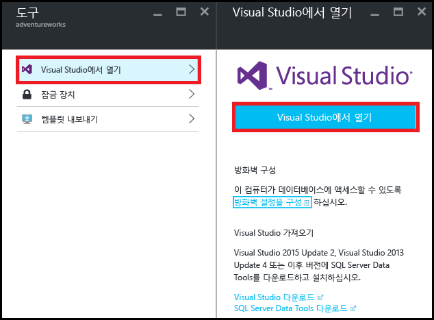
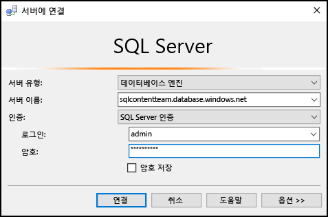
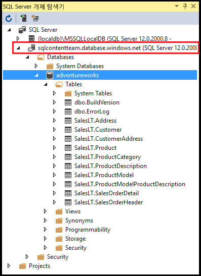
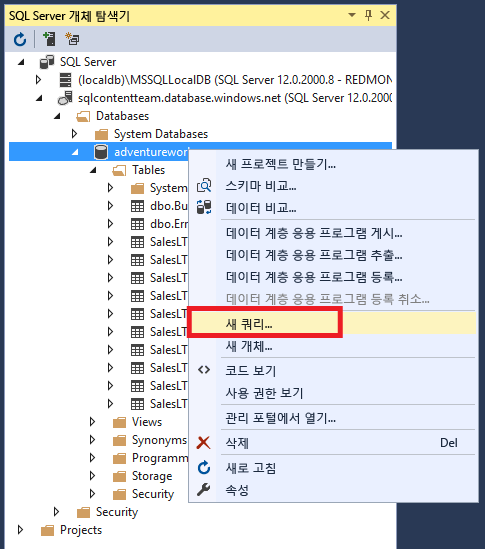
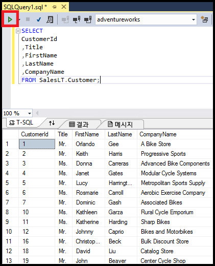

<properties
	pageTitle="C# 쿼리로 SQL 데이터베이스에 연결 | Microsoft Azure"
	description="C#에 프로그램을 작성하여 SQL 데이터베이스에 쿼리하고 연결합니다. IP 주소, 연결 문자열, 보안 로그인 및 무료 Visual Studio에 대한 정보입니다."
	services="sql-database"
	keywords="c# 데이터베이스 쿼리, c# 쿼리, 데이터베이스 연결, SQL C#"
	documentationCenter=""
	authors="stevestein"
	manager="jhubbard"
	editor=""/>

<tags
	ms.service="sql-database"
	ms.workload="data-management"
	ms.tgt_pltfrm="na"
	ms.devlang="dotnet"
	ms.topic="get-started-article"
	ms.date="08/17/2016"
	ms.author="stevestein"/>

# Visual Studio를 사용하여 SQL 데이터베이스에 연결

> [AZURE.SELECTOR]
- [Visual Studio](sql-database-connect-query.md)
- [SSMS](sql-database-connect-query-ssms.md)
- [Excel](sql-database-connect-excel.md)

Visual Studio에서 Azure SQL 데이터베이스에 연결하는 방법을 알아봅니다.

## 필수 조건

Visual Studio를 사용하여 SQL 데이터베이스에 연결하려면 다음이 필요합니다.

- 연결할 SQL 데이터베이스. 이 문서에서는 **AdventureWorks** 샘플 데이터베이스를 사용합니다. AdventureWorks 샘플 데이터베이스를 다운로드하려면 [데모 데이터베이스 만들기](sql-database-get-started.md)를 참조하세요.

- Visual Studio 2013 업데이트 4(이후) Microsoft는 이제 Visual Studio 커뮤니티를 *무료* 로 제공합니다.
 - [Visual Studio Community, 다운로드](http://www.visualstudio.com/products/visual-studio-community-vs)
 - [무료 Visual Studio에 대한 더 많은 옵션](http://www.visualstudio.com/products/free-developer-offers-vs.aspx)

## Azure 포털에서 Visual Studio 열기

1. [Azure 포털](https://portal.azure.com/)에 로그인합니다.

2. **더 많은 서비스** > **SQL 데이터베이스**를 클릭합니다.
3. *AdventureWorks* 데이터베이스를 찾고 클릭하여 **AdventureWorks** 데이터베이스 블레이드를 엽니다.

6. 데이터베이스 블레이드의 위쪽에서 **도구** 단추를 클릭합니다.

	

7. **Visual Studio에서 열기**를 클릭합니다(Visual Studio가 필요한 경우 다운로드 링크를 클릭합니다).

	

8. 포털에서 선택한 서버 및 데이터베이스에 이미 연결하도록 설정된 **서버에 연결** 창과 함께 Visual Studio가 열립니다. (**옵션**을 클릭하여 올바른 데이터베이스에 연결이 설정되어 있는지 확인합니다.) 서버 관리자 암호를 입력하고 **연결**을 클릭합니다.

	

8. 컴퓨터의 IP 주소에 대한 방화벽 규칙을 설정하지 않은 경우 여기에 *연결할 수 없습니다.* 메시지를 받게 됩니다. 방화벽 규칙을 만들려면 [Azure SQL 데이터베이스 서버 수준 방화벽 규칙 구성](sql-database-configure-firewall-settings.md)을 참조하세요.

9. 성공적으로 연결되면 데이터베이스에 연결된 **SQL Server 개체 탐색기** 창이 열립니다.

	

## 샘플 쿼리 실행

데이터베이스에 연결되었으므로 다음 단계에서는 간단한 쿼리를 실행하는 방법을 보여 줍니다.

2. 데이터베이스를 마우스 오른쪽 단추로 클릭한 다음 **새 쿼리**를 선택합니다.

	

3. 쿼리 창에서 다음 코드를 복사하여 붙여넣습니다.

		SELECT
		CustomerId
		,Title
		,FirstName
		,LastName
		,CompanyName
		FROM SalesLT.Customer;

4. 쿼리를 실행하려면 **실행** 단추를 클릭합니다.

	

## 다음 단계

- Visual Studio에서 SQL 데이터베이스를 열고 SQL Server Data Tools를 사용합니다. 자세한 내용은 [SQL Server Data Tools](https://msdn.microsoft.com/library/hh272686.aspx)를 참조하세요.
- 코드를 사용하여 SQL 데이터베이스에 연결하려면 [.NET(C#)을 사용하여 SQL 데이터베이스에 연결](sql-database-develop-dotnet-simple.md)을 참조하세요.

<!-----HONumber=AcomDC_0824_2016-->