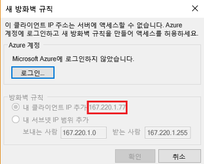
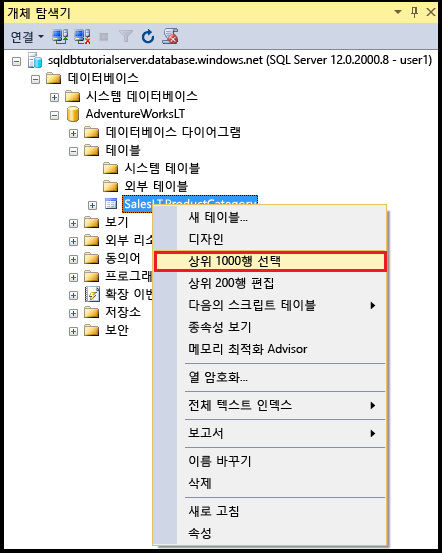
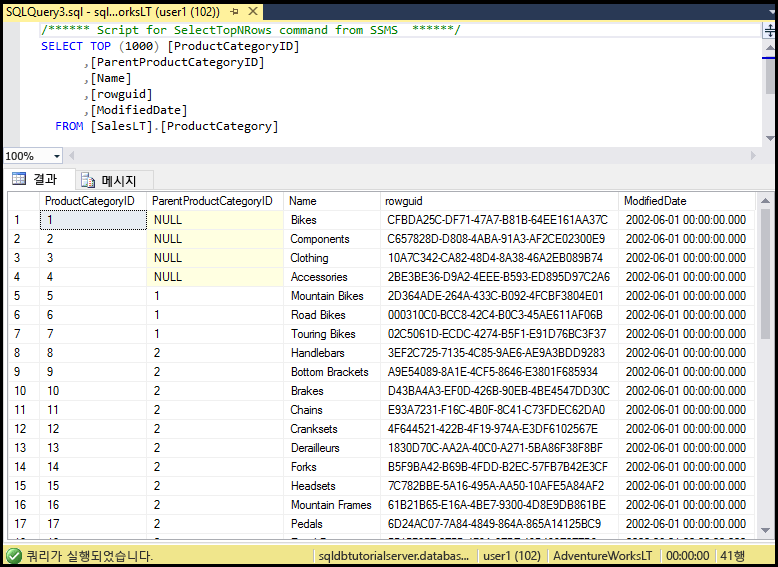

# <a name="sql-database-tutorial-sql-server-authentication-logins-and-user-accounts-database-roles-permissions-server-level-firewall-rules-and-database-level-firewall-rules"></a>SQL Database 자습서: SQL Server 인증, 로그인/사용자 계정, 데이터베이스 역할, 권한, 서버 수준 방화벽 규칙 및 데이터베이스 수준 방화벽 규칙
이 시작 자습서에서는 SQL Server Management Studio를 통해 SQL Server 인증, 로그인, 사용자 및 데이터베이스 역할을 사용하여 Azure SQL Database 서버와 데이터베이스에 대한 액세스 및 권한을 부여하는 방법에 대해 알아봅니다. 이 문서에서 학습할 내용은 다음과 같습니다.

- master 데이터베이스 및 사용자 데이터베이스에서 사용자 권한 보기
- SQL Server 인증에 기반한 로그인 및 사용자 만들기
- 사용자에게 서버 전체 및 데이터베이스별 권한 부여
- 관리자가 아닌 사용자로 사용자 데이터베이스에 로그인
- 데이터베이스 사용자를 위한 데이터베이스 수준 방화벽 규칙 만들기
- 서버 관리자를 위한 서버 수준 방화벽 규칙 만들기

**예상 시간**: 이 자습서를 완료하는 데 약 45분이 걸립니다(이미 필수 조건을 충족했다고 가정).

## <a name="prerequisites"></a>필수 조건

* Azure 계정이 필요합니다. [무료 Azure 계정을 열거나](/pricing/free-trial/?WT.mc_id=A261C142F) 또는 [Visual Studio 구독자 혜택을 활성화](/pricing/member-offers/msdn-benefits-details/?WT.mc_id=A261C142F)할 수 있습니다. 

* 구독 소유자 또는 참가자 역할의 구성원인 계정을 사용하여 Azure Portal에 연결할 수 있어야 합니다. RBAC(역할 기반 액세스 제어)에 대한 자세한 내용은 [Azure Portal에서 액세스 관리 시작](../active-directory/role-based-access-control-what-is.md)을 참조하세요.

* [Azure Portal 및 SQL Server Management Studio를 사용하여 Azure SQL Database 서버, 데이터베이스 및 방화벽 규칙 시작](sql-database-get-started.md) 또는 이 자습서의 [PowerShell 버전](sql-database-get-started-powershell.md)을 완료했습니다. 그렇지 않은 경우 이 필수 자습서를 완료하거나 이 자습서의 [PowerShell 버전](sql-database-get-started-powershell.md) 끝에서 PowerShell 스크립트를 실행하여 계속합니다.

> [!NOTE]
> 이 자습서는 [SQL Database 액세스 및 제어](sql-database-control-access.md), [로그인, 사용자 및 데이터베이스 역할](sql-database-manage-logins.md), [보안 주체](https://msdn.microsoft.com/library/ms181127.aspx), [데이터베이스 역할](https://msdn.microsoft.com/library/ms189121.aspx) 및 [SQL Database 방화벽 규칙](sql-database-firewall-configure.md) 항목의 내용을 학습하는 데 도움을 줍니다.
>  

## <a name="sign-in-to-the-azure-portal-using-your-azure-account"></a>Azure 계정을 사용하여 Azure Portal에 로그인
[기존 구독](https://account.windowsazure.com/Home/Index)을 사용하고 이러한 다음 단계를 수행하여 Azure Portal에 연결합니다.

1. 선택한 브라우저를 열고 [Azure Portal](https://portal.azure.com/)에 연결합니다.
2. [Azure Portal](https://portal.azure.com/)에 로그인합니다.
3. **로그인** 페이지에서 구독에 대한 자격 증명을 제공합니다.
   
   


<a name="create-logical-server-bk"></a>

## <a name="view-information-about-the-security-configuration-for-your-logical-server"></a>논리 서버의 보안 구성에 대한 정보 보기

이 섹션에서는 Azure Portal에서 논리 서버의 보안 구성에 대한 정보를 볼 수 있습니다.

1. 논리 서버의 **SQL Server** 블레이드를 열고 **개요** 페이지에서 정보를 봅니다.

   

2. 논리 서버의 서버 관리자 계정 이름을 기록해 둡니다. 암호를 기억하지 못하는 경우 **암호 다시 설정**을 클릭하여 새 암호를 설정합니다.

> [!NOTE]
> 이 서버의 연결 정보를 검토하려면 [서버 설정 보기 또는 업데이트](sql-database-view-update-server-settings.md)로 이동합니다. 이 자습서 시리즈의 경우 정규화된 서버 이름은 'sqldbtutorialserver.database.windows.net'입니다.
>

## <a name="connect-to-sql-server-using-sql-server-management-studio-ssms"></a>SSMS(SQL Server Management Studio)를 사용하여 SQL 서버 연결

1. 아직 연결하지 않은 경우 [SQL Server Management Studio 다운로드](https://msdn.microsoft.com/library/mt238290.aspx)에서 SSMS 최신 버전을 다운로드하여 설치합니다. 최신 상태로 유지하기 위해 최신 버전의 SSMS에서는 새 버전을 다운로드할 수 있는 경우 메시지를 표시합니다.

2. 설치한 후에 Windows 검색 상자에서 **Microsoft SQL Server Management Studio**를 입력하고 **Enter** 키를 클릭하여 SSMS를 엽니다.

   

3. **서버에 연결** 대화 상자에서 SQL Server 인증 및 서버 관리자 계정을 사용하여 SQL 서버에 연결하는 데 필요한 정보를 입력합니다.

   

4. **Connect**를 클릭합니다.

   

## <a name="view-the-server-admin-account-and-its-permissions"></a>서버 관리자 계정 및 권한 보기 
자습서의 이 섹션에서는 master 데이터베이스와 사용자 데이터베이스에서 서버 관리자 계정 및 해당 권한에 대한 정보를 봅니다.

1. [개체 탐색기]에서 **보안**, **로그인**을 차례로 확장하여 Azure SQL Database 서버에 대한 기존 로그인을 봅니다. 프로비전 중에 지정된 서버 관리자 계정에 대한 로그인이 표시됩니다(이 자습서 시리즈의 경우 sqladmin 로그인).

   

2. [개체 탐색기]에서 **데이터베이스**, **시스템 데이터베이스**, **master**, **보안**, **사용자**를 차례로 확장합니다. 사용자 계정은 서버 관리자 로그인을 위해 master 데이터베이스에 로그인과 동일한 사용자 계정 이름으로 만들어졌습니다. 이름은 일치하지 않아도 되지만 혼동을 피하는 것이 좋습니다.

   

   > [!NOTE]
   > 표시되는 다른 사용자 계정에 대한 자세한 내용은 [보안 주체](https://msdn.microsoft.com/library/ms181127.aspx)를 참조하세요.
   >

3. [개체 탐색기]에서 **master**를 마우스 오른쪽 단추로 클릭한 다음 **새 쿼리**를 클릭하여 master 데이터베이스에 연결된 쿼리 창을 엽니다.
4. 쿼리 창에서 다음 쿼리를 실행하여 쿼리를 실행하는 사용자에 대한 정보를 반환합니다. 이 쿼리를 실행하는 사용자 계정에 대해 sqladmin이 반환됩니다(이 절차의 뒷부분에서 사용자 데이터베이스를 쿼리할 때는 다른 결과가 표시됨).

   ```
   SELECT USER;
   ```

   

5. 쿼리 창에서 다음 쿼리를 실행하여 sqladmin 사용자의 권한에 대한 정보를 반환합니다. sqladmin은 master 데이터베이스에 연결하고, 로그인과 사용자를 만들며, sys.sql_logins 테이블에서 정보를 선택하고, dbmanager와 dbcreator 데이터베이스 역할에 사용자를 추가할 수 있는 권한을 가지고 있습니다. 이러한 권한은 모든 사용자가 권한을 상속하는 public 역할(예: 특정 테이블에서 정보를 선택하는 권한)에 부여된 권한에 추가됩니다. 자세한 내용은 [사용 권한](https://msdn.microsoft.com/library/ms191291.aspx)을 참조하세요.

   ```
   SELECT prm.permission_name
      , prm.class_desc
      , prm.state_desc
      , p2.name as 'Database role'
      , p3.name as 'Additional database role' 
   FROM sys.database_principals p
   JOIN sys.database_permissions prm
      ON p.principal_id = prm.grantee_principal_id
      LEFT JOIN sys.database_principals p2
      ON prm.major_id = p2.principal_id
      LEFT JOIN sys.database_role_members r
      ON p.principal_id = r.member_principal_id
      LEFT JOIN sys.database_principals p3
      ON r.role_principal_id = p3.principal_id
   WHERE p.name = 'sqladmin';
   ```

   

6. [개체 탐색기]에서 **blankdb**, **보안**, **사용자**를 차례로 확장합니다. 이 데이터베이스에는 sqladmin이라는 사용자 계정이 없습니다.

   

7. [개체 탐색기]에서 **blankdb**를 마우스 오른쪽 단추로 클릭한 다음 **새 쿼리**를 클릭합니다.

8. 쿼리 창에서 다음 쿼리를 실행하여 쿼리를 실행하는 사용자에 대한 정보를 반환합니다. 이 쿼리를 실행하는 사용자 계정에 대해 dbo가 반환됩니다(기본적으로 서버 관리자 로그인은 각 사용자 데이터베이스의 dbo 사용자 계정에 매핑됨).

   ```
   SELECT USER;
   ```

   

9. 쿼리 창에서 다음 쿼리를 실행하여 dbo 사용자의 권한에 대한 정보를 반환합니다. dbo는 public 역할의 구성원이자 db_owner 고정 데이터베이스 역할의 구성원이기도 합니다. 자세한 내용은 [데이터베이스 수준 역할](https://msdn.microsoft.com/library/ms189121.aspx)을 참조하세요.

   ```
   SELECT prm.permission_name
      , prm.class_desc
      , prm.state_desc
      , p2.name as 'Database role'
      , p3.name as 'Additional database role' 
   FROM sys.database_principals AS p
   JOIN sys.database_permissions AS prm
      ON p.principal_id = prm.grantee_principal_id
      LEFT JOIN sys.database_principals AS p2
      ON prm.major_id = p2.principal_id
      LEFT JOIN sys.database_role_members r
      ON p.principal_id = r.member_principal_id
      LEFT JOIN sys.database_principals AS p3
      ON r.role_principal_id = p3.principal_id
   WHERE p.name = 'dbo';
   ```

   

10. 필요에 따라 AdventureWorksLT 사용자 데이터베이스에 대해 앞의 세 단계를 반복합니다.

## <a name="create-a-new-user-in-the-adventureworkslt-database-with-select-permissions"></a>SELECT 권한을 사용하여 AdventureWorksLT 데이터베이스에 새 사용자 만들기

자습서의 이 섹션에서는 사용자 계정을 AdventureWorksLT 데이터베이스에 만들고, 해당 사용자의 권한을 public 역할의 구성원으로 테스트하고, 해당 사용자에게 SELECT 권한을 부여한 다음 해당 사용자의 권한을 다시 테스트합니다.

> [!NOTE]
> 데이터베이스 수준 사용자([포함된 사용자](https://msdn.microsoft.com/library/ff929188.aspx))는 나중에 자습서에서 살펴볼 수 있는 기능인 데이터베이스의 이식성을 향상시킵니다.
>

1. [개체 탐색기]에서 **AdventureWorksLT**를 마우스 오른쪽 단추로 클릭한 다음 **새 쿼리**를 클릭하여 AdventureWorksLT 데이터베이스에 연결된 쿼리 창을 엽니다.
2. 다음 문을 실행하여 AdventureWorksLT 데이터베이스에 user1이라는 사용자를 만듭니다.

   ```
   CREATE USER user1
   WITH PASSWORD = 'p@ssw0rd';
   ```
   

3. 쿼리 창에서 다음 쿼리를 실행하여 user1의 권한에 대한 정보를 반환합니다. user1이 가지고 있는 유일한 권한은 public 역할에서 상속된 권한입니다.

   ```
   SELECT prm.permission_name
      , prm.class_desc
      , prm.state_desc
      , p2.name as 'Database role'
      , p3.name as 'Additional database role' 
   FROM sys.database_principals AS p
   JOIN sys.database_permissions AS prm
      ON p.principal_id = prm.grantee_principal_id
      LEFT JOIN sys.database_principals AS p2
      ON prm.major_id = p2.principal_id
      LEFT JOIN sys.database_role_members r
      ON p.principal_id = r.member_principal_id
      LEFT JOIN sys.database_principals AS p3
      ON r.role_principal_id = p3.principal_id
   WHERE p.name = 'user1';
   ```

   

4. 다음 쿼리를 실행하여 AdventureWorksLT 데이터베이스의 테이블을 user1로 쿼리하려고 시도합니다.

   ```
   EXECUTE AS USER = 'user1';  
   SELECT * FROM [SalesLT].[ProductCategory];
   REVERT;
   ```

   

5. 다음 문을 실행하여 SalesLT 스키마의 ProductCategory 테이블에 대한 SELECT 권한을 user1에 부여합니다.

   ```
   GRANT SELECT ON OBJECT::[SalesLT].[ProductCategory] to user1;
   ```

   

6. 다음 쿼리를 실행하여 AdventureWorksLT 데이터베이스의 테이블을 user1로 쿼리하려고 시도합니다.

   ```
   EXECUTE AS USER = 'user1';  
   SELECT * FROM [SalesLT].[ProductCategory];
   REVERT;
   ```

   

## <a name="create-a-database-level-firewall-rule-for-an-adventureworkslt-database-user"></a>AdventureWorksLT 데이터베이스 사용자를 위한 데이터베이스 수준 방화벽 규칙 만들기

자습서의 이 섹션에서는 다른 IP 주소를 가진 컴퓨터에서 로그인하고, 서버 관리자로 데이터베이스 수준 방화벽 규칙을 만든 후 새로운 이 규칙을 사용하여 로그인하려고 시도합니다. 

> [!NOTE]
> [데이터베이스 수준 방화벽 규칙](sql-database-firewall-configure.md)은 나중에 자습서에서 살펴볼 수 있는 기능인 데이터베이스의 이식성을 향상시킵니다.
>

1. 서버 수준 방화벽 규칙을 아직 만들지 않은 다른 컴퓨터에서 SQL Server Management Studio를 엽니다.

   > [!IMPORTANT]
   > 언제든지 [SQL Server Management Studio 다운로드](https://msdn.microsoft.com/library/mt238290.aspx)에 있는 최신 버전의 SSMS를 사용하세요. 
   >

2. **서버에 연결** 창에서 SQL Server 인증을 사용하여 user1 계정에 연결할 서버 이름과 인증 정보를 입력합니다. 
    
   

3. **옵션**을 클릭하여 연결하려는 데이터베이스를 지정한 다음 **연결 속성** 탭의 **데이터베이스에 연결** 드롭다운 상자에서 **AdventureWorksLT**를 입력합니다.
   
   

4. **Connect**를 클릭합니다. SQL Database에 연결하려는 컴퓨터에 데이터베이스 액세스를 허용하는 방화벽 규칙이 없음을 알리는 대화 상자가 표시됩니다. 이전에 방화벽에서 수행한 단계에 따라 두 가지 변형의 대화 상자가 있지만 일반적으로 첫 번째 대화 상자가 표시됩니다.

   

   

   > [!NOTE]
   > SSMS의 최신 버전에는 구독 소유자와 참가자가 Microsoft Azure에 로그인하고 서버 수준의 방화벽 규칙을 만들 수 있는 기능이 포함되어 있습니다.
   > 

4. 7단계에서 사용하기 위해 이 대화 상자에서 클라이언트 IP 주소를 복사합니다.
5. **취소**를 클릭하지만 **서버에 연결** 대화 상자는 닫지 않습니다.
6. 이미 서버 수준 방화벽 규칙을 만든 컴퓨터로 다시 전환하고 서버 관리자 계정을 사용하여 서버에 연결합니다.
7. 서버 관리자로 AdventureWorksLT 데이터베이스에 연결된 새 쿼리 창에서 다음 문을 실행하여 4단계의 IP 주소로 [sp_set_database_firewall_rule](https://msdn.microsoft.com/library/dn270010.aspx)을 실행함으로써 데이터베이스 수준 방화벽을 만듭니다.

   ```
   EXEC sp_set_database_firewall_rule @name = N'AdventureWorksLTFirewallRule', 
     @start_ip_address = 'x.x.x.x', @end_ip_address = 'x.x.x.x';
   ```

   

8. 컴퓨터를 다시 전환하고 **서버에 연결** 대화 상자에서 **연결**을 클릭하여 AdventureWorksLT에 user1로 연결합니다. 

   

9. [개체 탐색기]에서 **데이터베이스**, **AdventureWorksLT**, **테이블**을 차례로 확장합니다. user1은 **SalesLT.ProductCategory** 테이블만 볼 수 있는 권한을 가지고 있습니다. 

   

10. [개체 탐색기]에서 **SalesLT.ProductCategory**를 마우스 오른쪽 단추로 클릭하고 **상위 1,000개 행 선택**을 클릭합니다.   

   

   

## <a name="create-a-new-user-in-the-blankdb-database-with-dbowner-database-role-permissions-and-a-database-level-firewall-rule"></a>db_owner 데이터베이스 역할 권한 및 데이터베이스 수준 방화벽 규칙을 사용하여 blankdb 데이터베이스에 새 사용자 만들기

자습서의 이 섹션에서는 db_owner 데이터베이스 역할 권한으로 blankdb 데이터베이스에 사용자를 만들고, 서버 관리자 계정을 사용하여 이 데이터베이스에 대한 데이터베이스 수준 방화벽을 만듭니다. 

1. 서버 관리자 계정을 사용하여 SQL Database에 연결된 컴퓨터로 전환합니다.
2. blankdb 데이터베이스에 연결된 쿼리 창을 열고 다음 문을 실행하여 blankdb 데이터베이스에 blankdbadmin이라는 사용자를 만듭니다.

   ```
   CREATE USER blankdbadmin
   WITH PASSWORD = 'p@ssw0rd';
   ```

3. 동일한 쿼리 창에서 다음 문을 실행하여 db_owner 데이터베이스 역할에 blankdbadmin 사용자를 추가합니다. 이제 이 사용자는 blankdb 데이터베이스를 관리하는 데 필요한 모든 작업을 수행할 수 있습니다.

   ```
   ALTER ROLE db_owner ADD MEMBER blankdbadmin; 
   ```

4. 동일한 쿼리 창에서 다음 문을 실행하여 이전 절차 중 4단계의 IP 주소(또는 이 데이터베이스 사용자의 IP 주소 범위)로 [sp_set_database_firewall_rule](https://msdn.microsoft.com/library/dn270010.aspx)을 실행함으로써 데이터베이스 수준 방화벽을 만듭니다.

   ```
   EXEC sp_set_database_firewall_rule @name = N'blankdbFirewallRule', 
     @start_ip_address = 'x.x.x.x', @end_ip_address = 'x.x.x.x';
   ```

5. 컴퓨터를 데이터베이스 수준 방화벽 규칙을 만든 컴퓨터로 전환하고 blankdbadmin 사용자 계정을 사용하여 blankdb 데이터베이스에 연결합니다.
6. blankdb 데이터베이스에 대한 쿼리 창을 열고 다음 문을 실행하여 blankdb 데이터베이스에 blankdbuser1이라는 사용자를 만듭니다.

   ```
   CREATE USER blankdbuser1
   WITH PASSWORD = 'p@ssw0rd';
   ```
 
7. 학습 환경에 필요한 경우 이 사용자에 대해 추가 데이터베이스 수준 방화벽 규칙을 만듭니다. 

## <a name="create-a-new-login-and-user-in-the-master-database-with-dbmanager-permissions-and-create-a-server-level-firewall-rule"></a>dbmanager 권한으로 master 데이터베이스에 새 로그인 및 사용자 만들기 및 서버 수준 방화벽 규칙 만들기

자습서의 이 섹션에서는 새 사용자 데이터베이스를 만들고 관리할 수 있는 권한을 사용하여 master 데이터베이스에 로그인 및 사용자를 만듭니다. 또한 [sp_set_firewall_rule](https://msdn.microsoft.com/library/dn270017.aspx)을 사용하는 Transact-SQL을 통해 추가 서버 수준 방화벽 규칙을 만듭니다.

> [!NOTE]
> 서버 관리자 계정 소유자가 데이터베이스 만들기 권한을 다른 사용자에게 위임하려면 master 데이터베이스에 로그인을 만들고 이 로그인에서 사용자 계정을 만들어야 합니다. 그러나 로그인에서 로그인과 사용자를 만들면 환경의 이식성이 떨어지며, 여기에는 재해 복구 계획의 일부로 예상하고 처리하는 방법을 포함하여 나중에 자습서에서 살펴볼 결과가 있습니다.
>

1. 서버 관리자 계정을 사용하여 SQL Database에 연결된 컴퓨터로 전환합니다.
2. master 데이터베이스에 연결된 쿼리 창을 열고 다음 문을 실행하여 master 데이터베이스에 dbcreator라는 로그인을 만듭니다.

   ```
   CREATE LOGIN dbcreator
   WITH PASSWORD = 'p@ssw0rd';
   ```

3. 동일한 쿼리 창에서 다음을 수행합니다. 

   ```
   CREATE USER dbcreator
   FROM LOGIN dbcreator;
   ```

3. 동일한 쿼리 창에서 다음 쿼리를 실행하여 dbmanager 데이터베이스 역할에 dbcreator 사용자를 추가합니다. 이제 이 사용자는 데이터베이스를 만들고 관리할 수 있습니다.

   ```
   ALTER ROLE dbmanager ADD MEMBER dbcreator; 
   ```

4. 동일한 쿼리 창에서 다음 쿼리를 실행하여 환경에 적합한 IP 주소로 [sp_set_database_firewall_rule](https://msdn.microsoft.com/library/dn270010.aspx)을 실행함으로써 서버 수준 방화벽을 만듭니다.

   ```
   EXEC sp_set_firewall_rule @name = N'dbcreatorFirewallRule', 
     @start_ip_address = 'x.x.x.x', @end_ip_address = 'x.x.x.x';
   ```

5. 컴퓨터를 서버 수준 방화벽 규칙을 만든 컴퓨터로 전환하고 dbcreator 사용자 계정을 사용하여 master 데이터베이스에 연결합니다.
6. master 데이터베이스에 대한 쿼리 창을 열고 다음 쿼리를 실행하여 foo라는 데이터베이스를 만듭니다.

   ```
   CREATE DATABASE FOO (EDITION = 'basic');
   ```
 7. 필요에 따라 다음 문으로 이 데이터베이스를 삭제하여 비용을 절약합니다.

   ```
   DROP DATABASE FOO;
   ```

## <a name="complete-script"></a>전체 스크립트

로그인과 사용자를 만들고, 역할에 추가하고, 권한을 부여하며, 데이터베이스 수준 방화벽 규칙을 만들고, 서버 수준 방화벽 규칙을 만들려면 서버의 해당 데이터베이스에서 다음 문을 실행합니다.

### <a name="master-database"></a>master 데이터베이스
서버 관리자 계정을 사용하여 master 데이터베이스에서 다음 문을 실행하여 적절한 IP 주소 또는 범위를 추가합니다.

```
CREATE LOGIN dbcreator WITH PASSWORD = 'p@ssw0rd';
CREATE USER dbcreator FROM LOGIN dbcreator;
ALTER ROLE dbmanager ADD MEMBER dbcreator;
EXEC sp_set_firewall_rule @name = N'dbcreatorFirewallRule', 
     @start_ip_address = 'x.x.x.x', @end_ip_address = 'x.x.x.x';
```

### <a name="adventureworkslt-database"></a>AdventureWorksLT 데이터베이스
서버 관리자 계정을 사용하여 AdventureWorksLT 데이터베이스에서 다음 문을 실행하여 적절한 IP 주소 또는 범위를 추가합니다.

```
CREATE USER user1 WITH PASSWORD = 'p@ssw0rd';
GRANT SELECT ON OBJECT::[SalesLT].[ProductCategory] to user1;
EXEC sp_set_database_firewall_rule @name = N'AdventureWorksLTFirewallRule', 
     @start_ip_address = 'x.x.x.x', @end_ip_address = 'x.x.x.x';
```

### <a name="blankdb-database"></a>blankdb 데이터베이스
서버 관리자 계정을 사용하여 blankdb 데이터베이스에서 다음 문을 실행하여 적절한 IP 주소 또는 범위를 추가합니다.

```
CREATE USER blankdbadmin
   WITH PASSWORD = 'p@ssw0rd';
ALTER ROLE db_owner ADD MEMBER blankdbadmin;
EXEC sp_set_database_firewall_rule @name = N'blankdbFirewallRule', 
     @start_ip_address = 'x.x.x.x', @end_ip_address = 'x.x.x.x';
CREATE USER blankdbuser1
   WITH PASSWORD = 'p@ssw0rd';
```

## <a name="next-steps"></a>다음 단계
- SQL Database의 액세스 및 제어에 대한 개요는 [SQL Database 액세스 및 제어](sql-database-control-access.md)를 참조하세요.
- SQL Database의 로그인, 사용자 및 데이터베이스 역할에 대한 개요는 [로그인, 사용자 및 데이터베이스 역할](sql-database-manage-logins.md)을 참조하세요.
- 데이터베이스 보안 주체에 대한 자세한 내용은 [보안 주체](https://msdn.microsoft.com/library/ms181127.aspx)를 참조하세요.
- 데이터베이스 역할에 대한 자세한 내용은 [데이터베이스 역할](https://msdn.microsoft.com/library/ms189121.aspx)을 참조하세요.
- SQL Database의 방화벽 규칙에 대한 자세한 내용은 [SQL Database 방화벽 규칙](sql-database-firewall-configure.md)을 참조하세요.
- Azure Active Directory 인증을 사용하는 방법을 보여 주는 자습서는 [SQL Database 자습서: AAD 인증, 로그인/사용자 계정, 데이터베이스 역할, 권한, 서버 수준 방화벽 규칙 및 데이터베이스 수준 방화벽 규칙](sql-database-control-access-sql-authentication-get-started.md)을 참조하세요.


<!--HONumber=Jan17_HO3-->


