# <a name="sql-server-authentication-access-and-database-level-firewall-rules"></a>SQL Server 인증, 액세스 및 데이터베이스 수준 방화벽 규칙

이 자습서에서는 SQL Server 인증, 로그인, 사용자, 그리고 Azure SQL Database 서버 및 데이터베이스에 대한 액세스 및 권한을 부여하는 데이터베이스 역할 등으로 SQL Server Management Studio를 사용하는 방법에 대해 알아봅니다. 이 자습서를 완료하면 다음과 같은 작업 수행 방법을 배울 수 있습니다.

- SQL Server 인증에 기반한 로그인 및 사용자 만들기
- 역할에 사용자를 추가하고 역할에 권한 부여
- T-SQL을 사용하여 데이터베이스 수준 및 서버 수준 방화벽 규칙 만들기 
- SSMS를 사용하여 특정 데이터베이스에 사용자로 연결
- master 데이터베이스 및 사용자 데이터베이스에서 사용자 권한 보기

**예상 시간**: 이 자습서를 완료하는 데 약 45분이 걸립니다(이미 필수 조건을 충족했다고 가정).

> [!NOTE]
> 이 자습서는 [SQL Database 액세스 및 제어](sql-database-control-access.md), [로그인, 사용자 및 데이터베이스 역할](sql-database-manage-logins.md), [보안 주체](https://msdn.microsoft.com/library/ms181127.aspx), [데이터베이스 역할](https://msdn.microsoft.com/library/ms189121.aspx) 및 [SQL Database 방화벽 규칙](sql-database-firewall-configure.md) 항목의 내용을 학습하는 데 도움을 줍니다. Azure Active Directory 인증에 대한 자습서는 [Azure AD 인증 시작](sql-database-control-access-aad-authentication-get-started.md)을 참조하세요.
>  

## <a name="prerequisites"></a>필수 조건

* **Azure 계정**. Azure 계정이 필요합니다. [무료 Azure 계정을 열거나](https://azure.microsoft.com/free/) 또는 [Visual Studio 구독자 혜택을 활성화](https://azure.microsoft.com/pricing/member-offers/msdn-benefits/)할 수 있습니다. 

* **Azure는 사용 권한을 만듭니다**. 구독 소유자 또는 참가자 역할의 구성원인 계정을 사용하여 Azure Portal에 연결할 수 있어야 합니다. RBAC(역할 기반 액세스 제어)에 대한 자세한 내용은 [Azure Portal에서 액세스 관리 시작](../active-directory/role-based-access-control-what-is.md)을 참조하세요.

* **SQL Server Management Studio**. [SQL Server Management Studio 다운로드](https://msdn.microsoft.com/library/mt238290.aspx)에서 SSMS(SQL Server Management Studio) 최신 버전을 다운로드하여 설치할 수 있습니다. 새로운 기능이 지속적으로 출시되고 있으므로 Azure SQL Database에 연결할 때에는 항상 최신 버전의 SSMS를 사용하세요.

* **기본 서버 및 데이터베이스** 이 자습서에 사용된 서버와 두 데이터베이스를 설치 및 구성하려면 **Azure에 배포** 단추를 클릭합니다. 단추를 클릭하면 **템플릿에서 배포** 블레이드가 열리고 새 리소스 그룹이 생성되고 생성할 새 서버에 대한 **관리자 로그인 암호**를 제공합니다.

   [](https://portal.azure.com/#create/Microsoft.Template/uri/https%3A%2F%2Fsqldbtutorial.blob.core.windows.net%2Ftemplates%2Fsqldbgetstarted.json)


## <a name="sign-in-to-the-azure-portal-using-your-azure-account"></a>Azure 계정을 사용하여 Azure Portal에 로그인합니다.
이 절차의 단계에서는 Azure 계정을 사용하여 Azure Portal에 연결하는 방법을 보여줍니다(https://account.windowsazure.com/Home/Index).

1. 선택한 브라우저를 열고 [Azure Portal](https://portal.azure.com/)에 연결합니다.
2. [Azure Portal](https://portal.azure.com/)에 로그인합니다.
3. **로그인** 페이지에서 구독에 대한 자격 증명을 제공합니다.

## <a name="view-logical-server-security-information-in-the-azure-portal"></a>Azure Portal에서 논리 서버 보안 정보 보기

이 절차의 단계에서는 Azure Portal에서 논리 서버의 보안 구성 정보를 보는 방법을 보여줍니다.

1. 서버의 **SQL Server** 블레이드를 열고 **개요** 페이지에서 정보를 봅니다.

   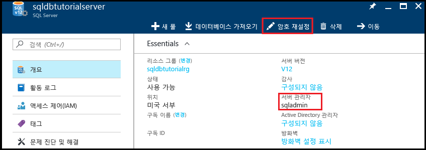

2. 논리 서버의 서버 관리자 이름을 메모해 둡니다. 

3. 암호를 기억하지 못하는 경우 **암호 다시 설정**을 클릭하여 새 암호를 설정합니다.

4. 이 서버에 대한 연결 정보가 필요하면 **속성**을 클릭합니다.

## <a name="view-server-admin-permissions-using-ssms"></a>SSMS를 사용하여 서버 관리자 권한 보기

이 절차의 단계에서는 master 데이터베이스와 사용자 데이터베이스에서 서버 관리자 계정 및 해당 권한에 대한 정보를 살펴보는 방법을 보여줍니다.

1. SQL Server Management Studio를 열고 SQL Server 인증 및 서버 관리자 계정을 사용하여 서버 관리자로 서버에 연결합니다.

   

2. **Connect**를 클릭합니다.

   

3. 개체 탐색기에서 **보안**을 확장하고, **로그인**을 확장하여 서버의 기존 로그인을 살펴봅니다. 새 서버의 유일한 로그인은 서버 관리자 계정에 대한 로그인입니다.

   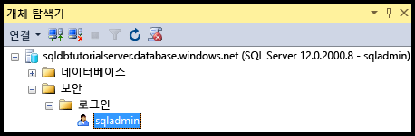

4. 개체 탐색기에서 **데이터베이스**, **시스템 데이터베이스**, **master**, **보안**, **사용자**를 차례로 확장하고 이 데이터베이스의 서버 관리자 로그인에 대해 생성된 사용자 계정을 살펴봅니다.

   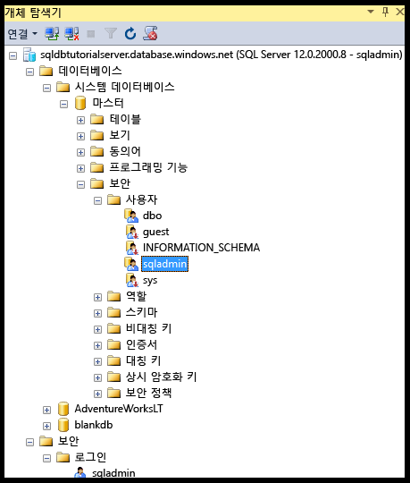

   > [!NOTE]
   > 사용자 노드에 표시되는 다른 사용자 계정에 대한 내용은 [보안 주체](https://msdn.microsoft.com/library/ms181127.aspx)를 참조하세요.
   >

5. [개체 탐색기]에서 **master**를 마우스 오른쪽 단추로 클릭한 다음 **새 쿼리**를 클릭하여 master 데이터베이스에 연결된 쿼리 창을 엽니다.
6. 쿼리 창에서 다음 쿼리를 실행하여 쿼리를 실행하는 사용자에 대한 정보를 반환합니다. 

   ```
   SELECT USER;
   ```

   

7. 쿼리 창에서 다음 쿼리를 실행하여 **master** 데이터베이스의 sqladmin 사용자 권한에 대한 정보를 반환합니다. 

   ```
   SELECT prm.permission_name
      , prm.class_desc
      , prm.state_desc
      , p2.name as 'Database role'
      , p3.name as 'Additional database role' 
   FROM sys.database_principals p
   JOIN sys.database_permissions prm
      ON p.principal_id = prm.grantee_principal_id
      LEFT JOIN sys.database_principals p2
      ON prm.major_id = p2.principal_id
      LEFT JOIN sys.database_role_members r
      ON p.principal_id = r.member_principal_id
      LEFT JOIN sys.database_principals p3
      ON r.role_principal_id = p3.principal_id
   WHERE p.name = 'sqladmin';
   ```

   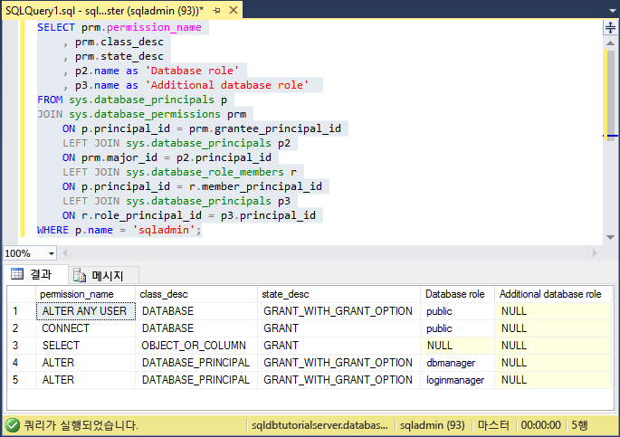

   >[!NOTE]
   > 서버 관리자는 master 데이터베이스에 연결하고, 로그인과 사용자를 만들고, sys.sql_logins 테이블에서 정보를 선택하고, dbmanager와 dbcreator 데이터베이스 역할에 사용자를 추가할 수 있는 권한을 가지고 있습니다. 이러한 권한은 모든 사용자가 권한을 상속하는 public 역할(예: 특정 테이블에서 정보를 선택하는 권한)에 부여된 권한에 추가됩니다. 자세한 내용은 [사용 권한](https://msdn.microsoft.com/library/ms191291.aspx)을 참조하세요.
   >

8. 개체 탐색기에서 **blankdb**, **보안**, **사용자**를 차례로 확장하고 이 데이터베이스(및 각 사용자 데이터베이스)의 서버 관리자 로그인에 대해 생성된 사용자 계정을 살펴봅니다.

   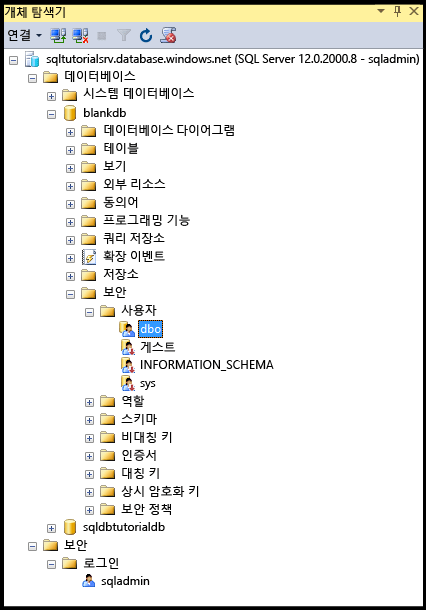

9. [개체 탐색기]에서 **blankdb**를 마우스 오른쪽 단추로 클릭한 다음 **새 쿼리**를 클릭합니다.

10. 쿼리 창에서 다음 쿼리를 실행하여 쿼리를 실행하는 사용자에 대한 정보를 반환합니다.

   ```
   SELECT USER;
   ```

   

11. 쿼리 창에서 다음 쿼리를 실행하여 dbo 사용자의 권한에 대한 정보를 반환합니다. 

   ```
   SELECT prm.permission_name
      , prm.class_desc
      , prm.state_desc
      , p2.name as 'Database role'
      , p3.name as 'Additional database role' 
   FROM sys.database_principals AS p
   JOIN sys.database_permissions AS prm
      ON p.principal_id = prm.grantee_principal_id
      LEFT JOIN sys.database_principals AS p2
      ON prm.major_id = p2.principal_id
      LEFT JOIN sys.database_role_members r
      ON p.principal_id = r.member_principal_id
      LEFT JOIN sys.database_principals AS p3
      ON r.role_principal_id = p3.principal_id
   WHERE p.name = 'dbo';
   ```

   

   > [!NOTE]
   > dbo 사용자는 public 역할의 구성원이자 db_owner 고정 데이터베이스 역할의 구성원이기도 합니다. 자세한 내용은 [데이터베이스 수준 역할](https://msdn.microsoft.com/library/ms189121.aspx)을 참조하세요.
   >

## <a name="create-a-new-user-with-select-permissions"></a>SELECT 권한을 사용하여 새 사용자 만들기

이 절차의 단계에서는 데이터베이스 수준 사용자를 만들고, public 역할을 통해 새 사용자의 기본 사용 권한을 테스트하고, 사용자에게 **SELECT** 권한을 부여하고, 수정된 권한을 확인하는 방법을 보여줍니다.

> [!NOTE]
> 데이터베이스 수준 사용자를 [포함된 사용자](https://msdn.microsoft.com/library/ff929188.aspx)라고도 부르며 데이터베이스의 이식성을 향상합니다. 이식성의 이점에 대한 내용은 [보조 서버로의 지역 복원 또는 장애 조치(Failover)를 위한 Azure SQL Database 보안 구성 및 관리](sql-database-geo-replication-security-config.md)를 참조하세요.
>

1. 개체 탐색기에서 **sqldbtutorialdb**를 마우스 오른쪽 단추로 클릭한 다음 **새 쿼리**를 클릭합니다.
2. 이 쿼리 창에서 다음 문을 실행하여 sqldbtutorialdb 데이터베이스에 **user1**이라는 사용자를 만듭니다.

   ```
   CREATE USER user1
   WITH PASSWORD = 'p@ssw0rd';
   ```
   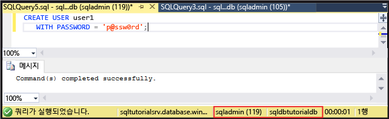

3. 쿼리 창에서 다음 쿼리를 실행하여 user1의 권한에 대한 정보를 반환합니다.

   ```
   SELECT prm.permission_name
      , prm.class_desc
      , prm.state_desc
      , p2.name as 'Database role'
      , p3.name as 'Additional database role' 
   FROM sys.database_principals AS p
   JOIN sys.database_permissions AS prm
      ON p.principal_id = prm.grantee_principal_id
      LEFT JOIN sys.database_principals AS p2
      ON prm.major_id = p2.principal_id
      LEFT JOIN sys.database_role_members r
      ON p.principal_id = r.member_principal_id
      LEFT JOIN sys.database_principals AS p3
      ON r.role_principal_id = p3.principal_id
   WHERE p.name = 'user1';
   ```

   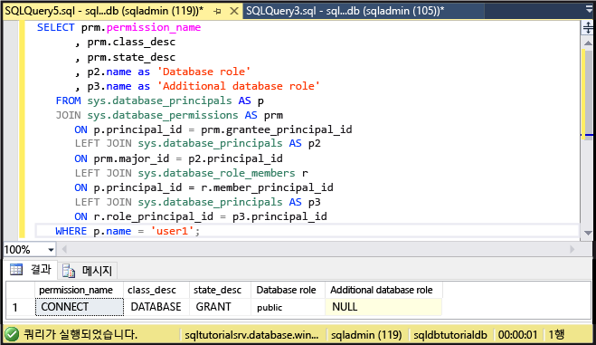

   > [!NOTE]
   > 데이터베이스의 새 사용자는 public 역할에서 상속된 권한만 갖게 됩니다.
   >

4. **EXECUTE AS USER** 문을 통해 다음 쿼리를 실행하여 public 역할에서 상속된 권한만 있는 **user1**로 sqldbtutorialdb 데이터베이스에서 SalesLT.ProductCategory 테이블을 쿼리해 보세요.

   ```
   EXECUTE AS USER = 'user1';  
   SELECT * FROM [SalesLT].[ProductCategory];
   REVERT;
   ```

   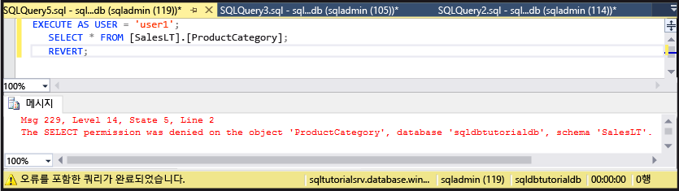

   > [!NOTE]
   > 기본적으로 public 역할은사용자 개체에 **SELECT** 권한을 부여하지 않습니다.
   >

5. 다음 문을 실행하여 SalesLT.ProductCategory 테이블에 대한 **SELECT** 권한을 **user1**에 부여해 보세요.

   ```
   GRANT SELECT ON OBJECT::[SalesLT].[ProductCategory] to user1;
   ```

   

6. 다음 쿼리를 실행하여 **user1**으로 sqldbtutorialdb 데이터베이스의 SalesLT.ProductCategory 테이블을 쿼리해 보세요.

   ```
   EXECUTE AS USER = 'user1';  
   SELECT * FROM [SalesLT].[ProductCategory];
   REVERT;
   ```

   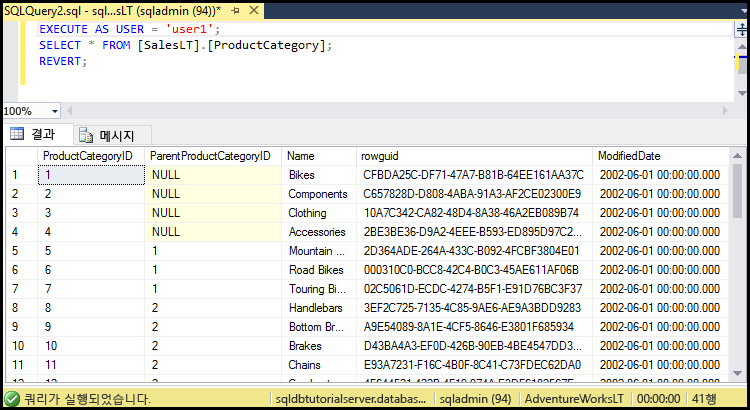

## <a name="create-a-database-level-firewall-rule-using-t-sql"></a>T-SQL을 사용하여 데이터베이스 수준 방화벽 규칙 만들기

이 절차의 단계에서는 [sp_set_database_firewall_rule](https://msdn.microsoft.com/library/dn270010.aspx) 시스템 저장 프로시저를 사용하여 데이터베이스 수준 방화벽 규칙을 만드는 방법을 보여줍니다. 서버 관리자는 데이터베이스 수준 방화벽 규칙을 사용하여 특정 데이터베이스에 대해서만 사용자가 Azure SQL Database 방화벽을 통과할 수 있도록 허용할 수 있습니다.

> [!NOTE]
> [데이터베이스 수준 방화벽 규칙](sql-database-firewall-configure.md)은 데이터베이스의 이식성을 향상합니다. 이식성의 이점에 대한 내용은 [보조 서버로의 지역 복원 또는 장애 조치(Failover)를 위한 Azure SQL Database 보안 구성 및 관리](sql-database-geo-replication-security-config.md)를 참조하세요.
>

> [!IMPORTANT]
> 데이터베이스 수준 방화벽 규칙을 테스트하려면 다른 컴퓨터에서 연결합니다(또는 Azure Portal에서 서버 수준 방화벽 규칙을 삭제).
>

1. 서버 수준 방화벽 규칙이 없는 컴퓨터에서 SQL Server Management Studio를 엽니다.

2. **서버에 연결** 창에서 SQL Server 인증을 사용하여 **user1** 계정에 연결할 서버 이름과 인증 정보를 입력합니다. 
    
   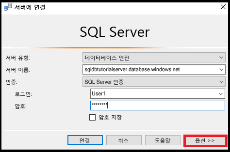

3. **서버에 연결** 대화 상자에서 **옵션**을 클릭하여 연결하려는 데이터베이스를 지정한 다음 **연결 속성** 탭의 **데이터베이스에 연결** 드롭다운 상자에서 **sqldbtutorialdb**를 입력합니다.
   
   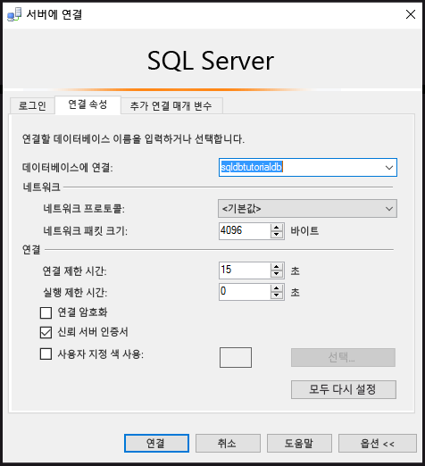

4. **Connect**를 클릭합니다. 

   SQL Database에 연결하려는 컴퓨터에 데이터베이스 액세스를 허용하는 방화벽 규칙이 없음을 알리는 대화 상자가 표시됩니다. 

   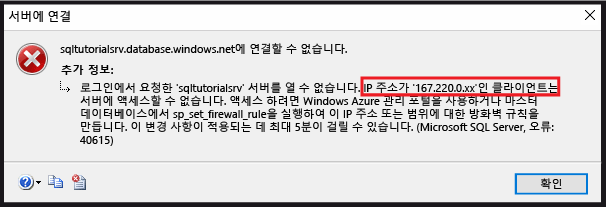


5. 이 대화 상자에서 8단계에 사용할 클라이언트 IP 주소를 복사합니다.
6. **확인**을 클릭하여 오류 대화 상자를 닫습니다. **서버에 연결** 대화 상자는 닫지 마세요.
7. 이미 서버 수준 방화벽 규칙을 만든 컴퓨터로 전환합니다. 
8. SSMS에서 서버 관리자로 sqldbtutorialdb 데이터베이스에 연결하고 다음 문을 실행하여 5단계의 IP 주소(또는 주소 범위)를 사용하는 데이터베이스 수준 방화벽을 만듭니다.  

   ```
   EXEC sp_set_database_firewall_rule @name = N'sqldbtutorialdbFirewallRule', 
     @start_ip_address = 'x.x.x.x', @end_ip_address = 'x.x.x.x';
   ```

   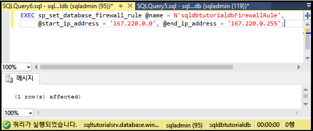

9. 컴퓨터를 다시 전환하고 **서버에 연결** 대화 상자에서 **연결**을 클릭하여 sqldbtutorialdb에 user1로 연결합니다. 

   > [!NOTE]
   > 데이터베이스 수준 방화벽 규칙을 만든 후 활성화될 때까지 최대 5분까지 걸릴 수 있습니다.
   >

10. 성공적으로 연결되면 개체 탐색기에서 **데이터베이스**를 확장합니다. **user1**은 **sqldbtutorialdb** 데이터베이스만 볼 수 있습니다.

   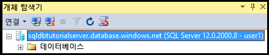

11. **sqldbtutorialdb**를 확장하고 **테이블**을 확장합니다. user1은 **SalesLT.ProductCategory** 테이블만 볼 수 있는 권한을 가지고 있습니다. 

   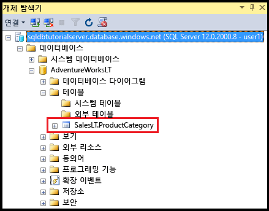

## <a name="create-a-new-user-as-dbowner-and-a-database-level-firewall-rule"></a>새 사용자 db_owner 및 데이터베이스 수준 방화벽 규칙 만들기

이 절차의 단계에서는 db_owner 데이터베이스 역할 권한을 사용하여 다른 데이터베이스에 사용자를 만들고 이 다른 데이터베이스에 대한 데이터베이스 수준 방화벽을 만드는 방법을 보여줍니다. **db_owner** 역할 멤버 자격이 있는 이 새 사용자는 이 단일 데이터베이스에만 연결하고 관리할 수만 있습니다.

1. 서버 관리자 계정을 사용하여 SQL Database에 연결된 컴퓨터로 전환합니다.
2. **blankdb** 데이터베이스에 연결된 쿼리 창을 열고 다음 문을 실행하여 blankdb 데이터베이스에 blankdbadmin이라는 사용자를 만듭니다.

   ```
   CREATE USER blankdbadmin
   WITH PASSWORD = 'p@ssw0rd';
   ```

3. 동일한 쿼리 창에서 다음 문을 실행하여 db_owner 데이터베이스 역할에 blankdbadmin 사용자를 추가합니다. 이제 이 사용자는 blankdb 데이터베이스를 관리하는 데 필요한 모든 작업을 수행할 수 있습니다.

   ```
   ALTER ROLE db_owner ADD MEMBER blankdbadmin; 
   ```

4. 동일한 쿼리 창에서 다음 문을 실행하여 이전 절차 중 4단계의 IP 주소(또는 이 데이터베이스 사용자의 IP 주소 범위)로 [sp_set_database_firewall_rule](https://msdn.microsoft.com/library/dn270010.aspx)을 실행함으로써 데이터베이스 수준 방화벽을 만듭니다.

   ```
   EXEC sp_set_database_firewall_rule @name = N'blankdbFirewallRule', 
     @start_ip_address = 'x.x.x.x', @end_ip_address = 'x.x.x.x';
   ```

5. 컴퓨터를 데이터베이스 수준 방화벽 규칙을 만든 컴퓨터로 전환하고 blankdbadmin 사용자 계정을 사용하여 blankdb 데이터베이스에 연결합니다.
6. blankdb 데이터베이스에 대한 쿼리 창을 열고 다음 문을 실행하여 blankdb 데이터베이스에 blankdbuser1이라는 사용자를 만듭니다.

   ```
   CREATE USER blankdbuser1
   WITH PASSWORD = 'p@ssw0rd';
   ```
 
7. 학습 환경에 필요한 경우 이 사용자에 대해 추가 데이터베이스 수준 방화벽 규칙을 만듭니다. 그러나 IP 주소 범위를 사용하여 데이터베이스 수준 방화벽 규칙을 만든 경우 이 과정이 필요 없을 수도 있습니다.

## <a name="grant-dbmanager-permissions-and-create-a-server-level-firewall-rule"></a>dbmanager 권한을 부여하고 서버 수준 방화벽 규칙 만들기

이 절차의 단계에서는 새 사용자 데이터베이스를 만들고 관리할 수 있는 권한을 사용하여 master 데이터베이스에 로그인 및 사용자를 만드는 방법을 보여줍니다. 또한 [sp_set_firewall_rule](https://msdn.microsoft.com/library/dn270017.aspx)을 사용하는 Transact-SQL을 통해 추가 서버 수준 방화벽 규칙을 만드는 방법을 보여줍니다. 

> [!IMPORTANT]
>첫 번째 서버 수준 방화벽 규칙은 항상 Azure Portal에서 만들어야 합니다(Azure Portal에서 PowerShell 또는 REST API를 사용하여).
>

> [!IMPORTANT]
> master 데이터베이스에 로그인을 만들고 그 로그인에서 사용자 계정을 만들려면 서버 관리자가 데이터베이스 만들기 권한을 다른 사용자에게 위임해야 합니다. 그러나 로그인을 만들고 그 로그인에서 사용자를 만들면 환경의 이식성이 떨어집니다.
>

1. 서버 관리자 계정을 사용하여 SQL Database에 연결된 컴퓨터로 전환합니다.
2. master 데이터베이스에 연결된 쿼리 창을 열고 다음 문을 실행하여 master 데이터베이스에 dbcreator라는 로그인을 만듭니다.

   ```
   CREATE LOGIN dbcreator
   WITH PASSWORD = 'p@ssw0rd';
   ```

3. 동일한 쿼리 창에서 다음을 수행합니다. 

   ```
   CREATE USER dbcreator
   FROM LOGIN dbcreator;
   ```

3. 동일한 쿼리 창에서 다음 쿼리를 실행하여 dbmanager 데이터베이스 역할에 dbcreator 사용자를 추가합니다. 이제 이 사용자는 데이터베이스를 만들고 관리할 수 있습니다.

   ```
   ALTER ROLE dbmanager ADD MEMBER dbcreator; 
   ```

4. 동일한 쿼리 창에서 다음 쿼리를 실행하여 환경에 적합한 IP 주소로 [sp_set_firewall_rule](https://msdn.microsoft.com/library/dn270017.aspx)을 실행함으로써 서버 수준 방화벽을 만듭니다.

   ```
   EXEC sp_set_firewall_rule @name = N'dbcreatorFirewallRule', 
     @start_ip_address = 'x.x.x.x', @end_ip_address = 'x.x.x.x';
   ```

5. 컴퓨터를 서버 수준 방화벽 규칙을 만든 컴퓨터로 전환하고 dbcreator 사용자 계정을 사용하여 master 데이터베이스에 연결합니다.
6. master 데이터베이스에 대한 쿼리 창을 열고 다음 쿼리를 실행하여 foo라는 데이터베이스를 만듭니다.

   ```
   CREATE DATABASE FOO (EDITION = 'basic');
   ```
 7. 필요에 따라 다음 문으로 이 데이터베이스를 삭제하여 비용을 절약합니다.

   ```
   DROP DATABASE FOO;
   ```

## <a name="complete-script"></a>전체 스크립트

로그인과 사용자를 만들고, 역할에 추가하고, 권한을 부여하며, 데이터베이스 수준 방화벽 규칙을 만들고, 서버 수준 방화벽 규칙을 만들려면 서버의 해당 데이터베이스에서 다음 문을 실행합니다.

### <a name="master-database"></a>master 데이터베이스
서버 관리자 계정을 사용하여 master 데이터베이스에서 다음 문을 실행하여 적절한 IP 주소 또는 범위를 추가합니다.

```
CREATE LOGIN dbcreator WITH PASSWORD = 'p@ssw0rd';
CREATE USER dbcreator FROM LOGIN dbcreator;
ALTER ROLE dbmanager ADD MEMBER dbcreator;
EXEC sp_set_firewall_rule @name = N'dbcreatorFirewallRule', 
     @start_ip_address = 'x.x.x.x', @end_ip_address = 'x.x.x.x';
```

### <a name="sqldbtutorialdb-database"></a>sqldbtutorialdb 데이터베이스
서버 관리자 계정을 사용하여 sqldbtutorialdb 데이터베이스에서 다음 문을 실행하여 적절한 IP 주소 또는 범위를 추가합니다.

```
CREATE USER user1 WITH PASSWORD = 'p@ssw0rd';
GRANT SELECT ON OBJECT::[SalesLT].[ProductCategory] to user1;
EXEC sp_set_database_firewall_rule @name = N'sqldbtutorialdbFirewallRule', 
     @start_ip_address = 'x.x.x.x', @end_ip_address = 'x.x.x.x';
```

### <a name="blankdb-database"></a>blankdb 데이터베이스
서버 관리자 계정을 사용하여 blankdb 데이터베이스에서 다음 문을 실행하여 적절한 IP 주소 또는 범위를 추가합니다.

```
CREATE USER blankdbadmin
   WITH PASSWORD = 'p@ssw0rd';
ALTER ROLE db_owner ADD MEMBER blankdbadmin;
EXEC sp_set_database_firewall_rule @name = N'blankdbFirewallRule', 
     @start_ip_address = 'x.x.x.x', @end_ip_address = 'x.x.x.x';
CREATE USER blankdbuser1
   WITH PASSWORD = 'p@ssw0rd';
```

## <a name="next-steps"></a>다음 단계
- SQL Database의 액세스 및 제어에 대한 개요는 [SQL Database 액세스 및 제어](sql-database-control-access.md)를 참조하세요.
- SQL Database의 로그인, 사용자 및 데이터베이스 역할에 대한 개요는 [로그인, 사용자 및 데이터베이스 역할](sql-database-manage-logins.md)을 참조하세요.
- 데이터베이스 보안 주체에 대한 자세한 내용은 [보안 주체](https://msdn.microsoft.com/library/ms181127.aspx)를 참조하세요.
- 데이터베이스 역할에 대한 자세한 내용은 [데이터베이스 역할](https://msdn.microsoft.com/library/ms189121.aspx)을 참조하세요.
- SQL Database의 방화벽 규칙에 대한 자세한 내용은 [SQL Database 방화벽 규칙](sql-database-firewall-configure.md)을 참조하세요.
- Azure Active Directory 인증 사용에 대한 자습서는 [Azure AD 인증 및 권한 부여](sql-database-control-access-aad-authentication-get-started.md)를 참조하세요.


