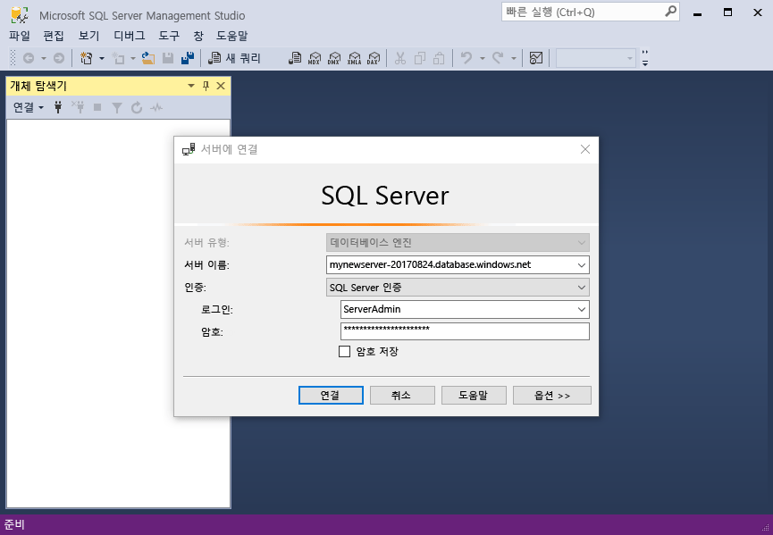
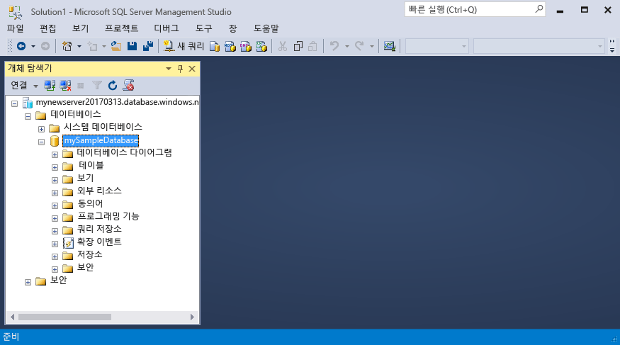

# <a name="design-your-first-azure-sql-database"></a>첫 번째 Azure SQL Database 디자인

이 자습서에서는 Azure Portal을 사용하여 서버 수준 방화벽이 있는 새 서버에서 데이터베이스를 만듭니다. 그런 다음 SQL Server Management Studio를 사용하여 테이블을 만든 후 데이터를 해당 테이블에 로드하고, 테이블을 쿼리하고, 테이블에 인덱스를 추가합니다. 마지막으로 SQL Database 서비스의 자동 백업을 사용하여 이 새 테이블을 추가하기 이전 시점으로 데이터베이스를 복원합니다.

이 자습서를 완료하려면 최신 버전의 SSMS([SQL Server Management Studio](https://msdn.microsoft.com/library/ms174173.aspx))를 설치했는지 확인합니다. 

## <a name="step-1---log-in-to-the-azure-portal"></a>1단계 - Azure Portal에 로그인

[Azure 포털](https://portal.azure.com/)에 로그인합니다.

## <a name="step-2---create-a-sql-database"></a>2단계: SQL Database 만들기

Azure SQL Database는 일련의 정의된 [계산 및 저장소 리소스](sql-database-service-tiers.md)를 사용하여 만들어집니다. 데이터베이스는 [Azure 리소스 그룹](../azure-resource-manager/resource-group-overview.md) 및 [Azure SQL Database 논리 서버](sql-database-features.md)에서 만들어집니다. 

다음 단계에 따라서 Adventure Works LT 샘플 데이터를 포함하는 SQL Database를 만듭니다. 

1. Azure Portal의 왼쪽 위에 있는 **새로 만들기** 단추를 클릭합니다.

2. **새로 만들기** 페이지에서 **데이터베이스**를 선택하고 **데이터베이스** 페이지에서 **SQL Database**를 선택합니다.

3. SQL Database 양식에 필요한 정보를 채웁니다. 
   - 데이터베이스 이름: 데이터베이스 이름을 입력합니다.
   - 구독: 사용자의 구독을 선택합니다.
   - 리소스 그룹: 신규 또는 기존 리소스 그룹을 선택합니다.
   - 원본: **샘플(AdventureWorksLT)**을 선택합니다.
   - 서버: 새 서버를 만듭니다(**서버** 이름은 전역적으로 고유해야 함)
   - 탄력적 풀: 이 빠른 시작에 대해 **나중에**를 선택합니다.
   - 가격 책정 계층: **20DTU** 및 **250**GB의 저장소를 선택합니다.
   - 데이터 정렬: 샘플 데이터베이스를 가져올 때는 이 값을 변경할 수 없습니다. 
   - 대시보드에 고정: 이 확인란을 선택합니다.

      

4. 작업을 완료했으면 **만들기**를 클릭합니다. 프로비전하는 데 몇 분이 걸립니다.
5. SQL Database 배포가 끝났으면 대시보드에서 **SQL Database**를 선택하거나 왼쪽 메뉴에서 **SQL Databases**를 선택하고 **SQL Database** 페이지에서 새 데이터베이스를 클릭합니다. 데이터베이스에 대한 개요 페이지가 열리고 이 페이지에 정규화된 서버 이름(예: **mynewserver20170313.database.windows.net**)이 표시되며 추가 구성을 위한 옵션도 제공됩니다.

       

## <a name="step-3---create-a-server-level-firewall-rule"></a>3단계 - 서버 수준 방화벽 규칙 만들기

SQL Database 서비스는 외부 응용 프로그램 및 도구가 서버 및 데이터베이스로 연결하지 못하도록 하는 방화벽을 만듭니다. 다음 단계에 따라 IP 주소에 대한 [SQL Database 서버 수준 방화벽 규칙](sql-database-firewall-configure.md)을 만들어 SQL Database 방화벽을 통해 외부 연결을 사용하도록 설정합니다. 

1. 데이터베이스에 대한 도구 모음에서 **서버 방화벽 설정**을 클릭합니다. SQL Database 서버에 대한 **방화벽 설정** 페이지가 열립니다. 

       

2. 도구 모음에서 **클라이언트 IP 추가**를 클릭하고 **저장**을 클릭합니다. 현재 IP 주소에 대한 서버 수준 방화벽 규칙이 생성됩니다.

3. **확인**을 클릭한 후 **X**를 클릭하여 방화벽 설정 페이지를 닫습니다.

이제 SQL Server Management Studio 또는 선택한 다른 도구를 사용하여 데이터베이스와 해당 서버에 연결할 수 있습니다.

## <a name="step-4---get-connection-information"></a>4단계: 연결 정보 가져오기

Azure Portal에 있는 Azure SQL Database 서버의 정규화된 서버 이름을 가져옵니다. 정규화된 서버 이름을 사용하여 SQL Server Management Studio를 사용하는 서버에 연결합니다.

1. [Azure 포털](https://portal.azure.com/)에 로그인합니다.
2. 왼쪽 메뉴에서 **SQL Database**를 선택하고 **SQL Database** 페이지에서 데이터베이스를 클릭합니다. 
3. 데이터베이스의 경우 Azure Portal의 **Essentials** 창에서 **서버 이름**을 찾고 복사합니다.

    

## <a name="step-5---connect-to-the-server-using-ssms"></a>5단계 - SSMS를 사용하여 서버에 연결

SQL Server Management Studio를 사용하여 Azure SQL Database 서버에 연결합니다.

1. Windows 검색 상자에서 **SSMS**를 입력하고 **Enter** 키를 클릭하여 SSMS를 엽니다.

2. **서버에 연결** 대화 상자에서 다음 정보를 입력합니다.
   - **서버 유형**: 데이터베이스 엔진을 지정합니다.
   - **서버 이름**: **mynewserver20170313.database.windows.net**과 같은 정규화된 서버 이름을 입력합니다.
   - **인증**: SQL Server 인증을 지정합니다.
   - **로그인**: 서버 관리자 계정을 입력합니다.
   - **암호**: 서버 관리자 계정의 암호를 입력합니다.
 
    

3. **Connect**를 클릭합니다. SSMS에서 개체 탐색기 창이 열립니다. 

    

4. 개체 탐색기에서 **데이터베이스**를 확장한 다음 **mySampleDatabase**를 확장하여 샘플 데이터베이스에 있는 개체를 봅니다.

## <a name="step-6---create-and-query-a-table"></a>6단계 - 테이블 만들기 및 쿼리 
1. 개체 탐색기에서 **mySampleDatabase**를 마우스 오른쪽 단추로 클릭하고 **새 쿼리**를 클릭합니다. 데이터베이스에 연결된 비어 있는 쿼리 창이 열립니다.
2. 쿼리 창에서 다음 쿼리를 실행합니다.

   ```sql 
   CREATE TABLE [dbo].[Students]
   (
     [student_id] int, 
     [name] varchar(100),
     [age] int,
     [email] varchar(100),
     [AddressID] int REFERENCES [SalesLT].[Address] (AddressID)
   );
   ```

   쿼리가 완료되면 데이터베이스에 Students라는 빈 테이블이 만들어졌을 것입니다.

3. SSMS 쿼리 창에서 다음 쿼리를 실행합니다. 

   ```sql
   SELECT name, age, email 
   FROM [dbo].[Students]
   ```

   Students 테이블은 데이터를 반환하지 않습니다.

## <a name="step-7---load-data-into-the-table"></a>7단계 - 테이블에 데이터 로드 
1. 명령 프롬프트 창을 엽니다.

2. 다음 PowerShell 명령을 실행하여 현재 디렉터리에 샘플 텍스트 파일을 다운로드합니다.

   ```powershell
   powershell -command "& { (New-Object Net.WebClient).DownloadFile('https://sqldbtutorial.blob.core.windows.net/tutorials/SampleStudentData.txt', 'SampleStudentData.txt'); echo 'Download complete' }" 
   ``` 

3. 이 작업이 완료되면 다음 명령을 실행하여 Student 테이블에 1000개의 행을 삽입하고, **ServerName**, **DatabaseName**, **UserName** 및 **Password** 값을 사용자 환경에 대한 값으로 바꿉니다.

   ```bcp
   bcp Students in SampleStudentData.txt -S <ServerName> -d <DatabaseName> -U <Username> -P <password> -q -c -t ","
   ```

이제 앞에서 만든 테이블에 샘플 데이터가 로드되었을 것입니다.

## <a name="step-8---add-an-index-to-a-table"></a>8단계 - 테이블에 인덱스 추가
테이블에 있는 특정 값을 보다 효율적으로 검색하려면 Students 테이블에 인덱스를 만듭니다. 인덱스는 이러한 방식으로 데이터를 구성하므로 이제 특정 값을 찾기 위해 모든 데이터를 확인해야 합니다.

1. SSMS 쿼리 창에서 다음 쿼리를 실행합니다.

   ```sql 
   CREATE NONCLUSTERED INDEX IX_Age ON Students (age);
   ```

2. SSMS 쿼리 창에서 다음 쿼리를 실행합니다.

   ```sql
   SELECT name, age, email 
   FROM [dbo].[Students]
   WHERE age > 20
   ```

   이 쿼리는 20살이 넘는 학생의 이름, 연령 및 전자 메일 주소를 반환합니다.

## <a name="step-9---restore-a-database-to-a-point-in-time"></a>9단계 - 특정 시점으로 데이터베이스 복원 
Azure의 데이터베이스는 [연속 백업](sql-database-automated-backups.md)이 5-10분 간격으로 자동으로 생성됩니다. 이러한 백업을 사용하여 데이터베이스를 이전 시점으로 복원할 수 있습니다. 다른 시점으로 데이터베이스를 복원하면 지정한 시점(서버 계층에 대한 보존 기간 이내)에서 원본 데이터베이스가 있는 같은 서버에 중복 데이터베이스가 생성됩니다. 다음 단계를 수행하면 샘플 데이터베이스가 **Students** 테이블이 추가되기 이전 시점으로 복원됩니다. 

1. 데이터베이스에 대한 SQL Database 페이지의 도구 모음에서 **복원**을 클릭합니다. **복원** 페이지가 열립니다.

    

2. 필요한 정보로 **복원** 양식을 채웁니다.
    * 데이터베이스 이름: 데이터베이스 이름을 입력합니다. 
    * 지정 시간: 복원 양식의 **지정 시간** 탭 
    * 복원 지점: 데이터베이스를 변경하기 이전 시간 선택
    * 대상 서버: 데이터베이스를 복원할 때는 이 값을 변경할 수 없습니다. 
    * 탄력적 데이터베이스 풀: **없음** 선택  
    * 가격 책정 계층: **20DTU** 및 **250**GB의 저장소를 선택합니다.

    

3. **확인**을 클릭하여 데이터베이스를 *Students* 테이블이 추가되기 이전 시점으로 복원합니다.

## <a name="next-steps"></a>다음 단계 
일반적인 작업을 위한 PowerShell 샘플을 보려면 [SQL Database PowerShell 샘플](sql-database-powershell-samples.md)을 참조하세요.

