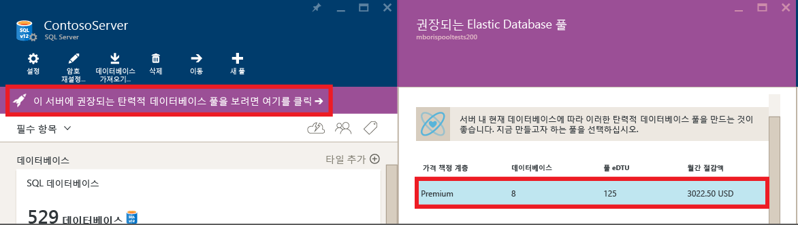
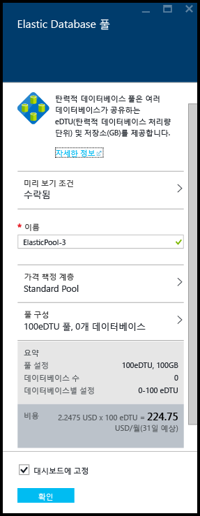
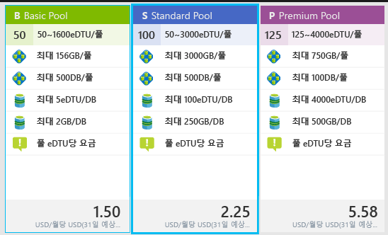
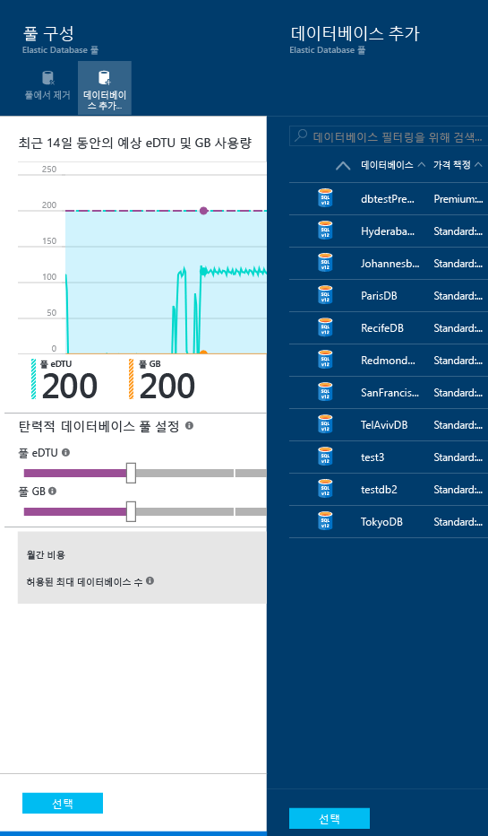
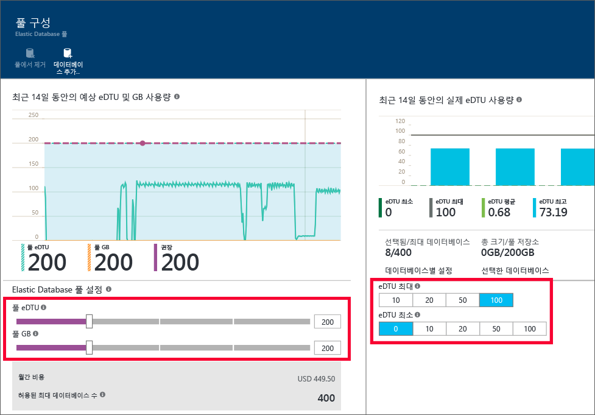

<properties
	pageTitle="Azure 포털로 새 탄력적 풀 만들기 | Microsoft Azure"
	description="여러 데이터베이스 간에 공유되는 관리 및 리소스에 대한 SQL 데이터베이스 구성에 확장성 있는 탄력적 데이터베이스 풀을 추가하는 방법입니다."
	keywords="확장성 있는 데이터베이스, 데이터베이스 구성"
	services="sql-database"
	documentationCenter=""
	authors="ninarn"
	manager="jhubbard"
	editor=""/>

<tags
	ms.service="sql-database"
	ms.devlang="NA"
	ms.date="07/20/2016"
	ms.author="ninarn"
	ms.workload="data-management"
	ms.topic="get-started-article"
	ms.tgt_pltfrm="NA"/>

# Azure 포털로 새 탄력적 데이터베이스 풀 만들기

> [AZURE.SELECTOR]
- [Azure 포털](sql-database-elastic-pool-create-portal.md)
- [PowerShell](sql-database-elastic-pool-create-powershell.md)
- [C#](sql-database-elastic-pool-create-csharp.md)

이 문서에서는 [Azure 포털](https://portal.azure.com/)에서 확장성 있는 [탄력적 데이터베이스 풀](sql-database-elastic-pool.md)을 만드는 방법을 보여줍니다. 두 가지 방법으로 풀을 만들 수 있습니다. 원하는 풀 설정을 알고 있는 경우 처음부터 수행하거나 서비스에서 권장 내용으로 시작할 수 있습니다. SQL 데이터베이스에는 데이터베이스에 대한 과거 사용량 원격 분석을 기반으로 보다 비용 효율적인 경우 풀 설정을 권장하는 기본 제공 인텔리전스가 있습니다.

서버에 풀을 여러 개 추가할 수 있지만 다른 서버에 속하는 데이터베이스를 동일한 풀에 추가할 수 없습니다. 풀을 만들려면 V12 서버에서 하나 이상의 데이터베이스가 필요합니다. 데이터베이스가 없는 경우 [첫 Azure SQL 데이터베이스 만들기](sql-database-get-started.md)를 참조하세요. 하나의 데이터베이스로 그룹을 만들 수 있지만 여러 데이터베이스가 있는 경우 풀이 비용 효율적입니다. [탄력적 데이터베이스 풀의 가격 및 성능 고려 사항](sql-database-elastic-pool-guidance.md)을 참조하세요.

> [AZURE.NOTE] 탄력적 풀은 현재 미리 보기 상태인 인도 서부를 제외한 모든 Azure 지역에서 일반 공급(GA) 상태입니다. 이 영역에서 탄력적 풀의 GA는 가능한 한 빨리 수행됩니다.

## 1단계: 새 풀 만들기

이 문서에서는 포털의 기존 **서버** 블레이드에서 새 풀을 만드는 방법을 보여 줍니다. 이것이 기존 데이터베이스를 풀로 이동하는 가장 쉬운 방법입니다.

> [AZURE.NOTE] 서버가 이미 있는지 여부와 상관없이 **SQL 탄력적 풀** 블레이드에서 새 풀을 만들 수도 있습니다(포털 왼쪽의 목록 아래에서 **찾아보기** **>** **SQL 탄력적 풀**을 클릭). **SQL 탄력적 풀** 블레이드에서 **+추가**를 클릭하면 풀에서 워크플로를 프로비전하는 동안 새 서버를 만드는 단계를 제공합니다.

1. 왼쪽 목록 아래의 [Azure Portal](http://portal.azure.com/)에서 **찾아보기** **>** **SQL Server**를 클릭한 다음 풀에 추가할 데이터베이스를 포함하는 서버를 클릭합니다.
2. **새 풀**을 클릭합니다.

    

    **또는**

    서버에 대해 권장되는 탄력적 데이터베이스 풀이 있다는 메시지를 볼 수도 있습니다(V12에만 해당). 메시지를 클릭하여 기록 데이터베이스 사용량 원격 분석에 따라 권장된 풀을 확인한 다음 계층을 클릭하여 자세한 내용을 보고 풀을 사용자 지정합니다. 권장 사항을 만드는 방법은 이 항목의 뒷부분에서 [풀 권장 사항 이해](#understand-pool-recommendations)를 참조하세요.

    

    **Elastic Database 풀** 블레이드가 나타나면 거기서 풀을 설정할 수 있습니다. 이전 단계에서 **새 풀**을 클릭한 경우 포털은 **가격 책정 계층**에서 **표준 풀**, 풀에 대한 고유한 **이름** 및 풀에 대한 기본 구성을 선택합니다. 권장되는 풀을 선택한 경우 권장된 계층 및 풀의 구성은 이미 선택되었지만 변경할 수 있습니다.

    

3. 탄력적 풀의 이름을 지정하거나 기본값을 그대로 둡니다.

## 2단계: 가격 책정 계층 선택

풀의 가격 책정 계층에 따라 풀에 있는 탄력적 데이터베이스에서 사용 가능한 기능과 각 데이터베이스에서 사용 가능한 최대 eDTU 수(eDTU MAX) 및 저장소(GB)가 결정됩니다. 자세한 내용은 서비스 계층을 참조하세요.

풀에 대한 가격 책정 계층을 변경하려면 **가격 책정 계층**, 원하는 가격 책정 계층, **선택**을 차례로 클릭합니다.

> [AZURE.IMPORTANT] 가격 책정 계층을 선택하고 마지막 단계에서 **확인**을 클릭하여 변경 내용을 적용한 후에는 풀의 가격 책정 계층을 변경할 수 없습니다. 기존 탄력적 풀의 가격 책정 계층을 변경하려면 원하는 가격 책정 계층에서 탄력적 풀을 새로 만들고 탄력적 데이터베이스를 이 새로운 풀로 마이그레이션합니다.

## 3단계: 풀 구성

가격 책정 계층을 설정한 후에, 데이터베이스를 추가할 풀의 구성을 클릭하고, 풀 eDTU 및 저장소(풀 GB), 그리고 풀의 탄력적 데이터베이스에 대한 최대 및 최소 eDTU를 설정할 위치를 설정합니다.

1. **풀 구성**을 클릭합니다.
2. 풀에 추가하려는 데이터베이스를 선택합니다. 이 단계는 풀을 만드는 과정의 선택 사항입니다. 데이터베이스는 풀이 생성된 후에 추가될 수 있습니다. 데이터베이스를 추가하려면 **데이터베이스 추가**, 추가하려는 데이터베이스, **선택** 단추를 차례로 클릭합니다.

    

    사용하고 있는 데이터베이스에 충분한 기록 사용량 원격 분석이 있는 경우 **예상되는 eDTU 및 GB 사용량** 그래프 및 **실제 eDTU 사용량** 막대형 차트는 구성을 결정할 수 있도록 업데이트됩니다. 또한 서비스가 적정 크기의 풀을 만들도록 권장 사항 메시지를 제공할 수 있습니다. [동적 권장 사항](#dynamic-recommendations)을 참조하세요.

3. **풀 구성** 페이지에서 제어를 사용하여 설정을 탐색하고 풀을 구성합니다. 각 서비스 계층의 제한에 대한 자세한 내용은 [탄력적 풀 제한](sql-database-elastic-pool.md#edtu-and-storage-limits-for-elastic-pools-and-elastic-databases)을 참조하고 적정한 풀의 크기에 대한 자세한 지침은 [Elastic Database 풀에 대한 가격 및 성능 고려 사항](sql-database-elastic-pool-guidance.md)을 참조하세요. 풀 설정에 대한 자세한 내용은 [Elastic Database 풀 속성](sql-database-elastic-pool.md#elastic-database-pool-properties)을 참조하세요.

	

4. 설정을 변경한 후 **풀 구성** 블레이드에서 **선택**을 클릭합니다.
5. **확인**을 클릭하여 풀을 만듭니다.

## 풀 권장 사항 이해

SQL 데이터베이스 서비스는 사용 기록을 평가하고 단일 데이터베이스를 사용하는 경우보다 비용 효율적인 경우 하나 이상의 풀을 권장합니다. 각 권장 사항은 풀에 가장 적합한 서버 데이터베이스의 고유한 하위 집합으로 구성됩니다.

풀 권장 사항은 다음으로 구성됩니다.

- 풀에 대한 가격 책정 계층(Basic, Standard 또는 Premium)
- 적절한 **풀 eDTU**(풀당 최대 eDTU)
- 데이터베이스당 **eDTU 최대** 및 **eDTU 최소**
- 풀에 대한 권장 데이터베이스 목록

서비스는 풀을 권장할 때 최근 30일간의 원격 분석을 고려합니다. 데이터베이스가 탄력적 데이터베이스 풀의 후보로 간주되려면 7일 이상 존재해야 합니다. 이미 탄력적 데이터베이스 풀에 있는 데이터베이스는 탄력적 데이터베이스 풀 권장 사항에 대한 후보로 간주되지 않습니다.

서비스는 리소스 요구와 각 서비스 계층에 있는 단일 데이터베이스를 동일한 계층의 풀로 이동하는 경우 비용 효율성을 평가합니다. 예를 들어 서버의 모든 Standard 데이터베이스는 표준 탄력적 풀에 적합한지 평가됩니다. 즉, 서비스는 Standard 데이터베이스를 Premium 풀로 이동하는 경우와 같은 계층 간 권장 사항을 제공하지 않습니다.

### 동적 권장 사항

풀에 데이터베이스를 추가한 후에는, 사용자가 선택한 데이터베이스의 기존 사용 정보를 기반으로 권장 사항이 동적으로 생성됩니다. 권장 사항은 eDTU 및 GB 사용 현황 차트는 물론 **풀 구성** 블레이드 상단의 권장 사항 배너에도 표시됩니다. 권장 사항은 특정 데이터베이스에 최적화된 풀을 만드는 데 도움을 주기 위해 제공됩니다.

## 추가 리소스

- [포털을 사용하여 SQL 데이터베이스 탄력적 풀 관리](sql-database-elastic-pool-manage-portal.md)
- [PowerShell을 통해 SQL 데이터베이스 탄력적 풀 관리](sql-database-elastic-pool-manage-powershell.md)
- [C#을 통해 SQL 데이터베이스 탄력적 풀 관리](sql-database-elastic-pool-manage-csharp.md)
- [Azure SQL 데이터베이스를 사용하여 확장](sql-database-elastic-scale-introduction.md)

<!---HONumber=AcomDC_0928_2016-->