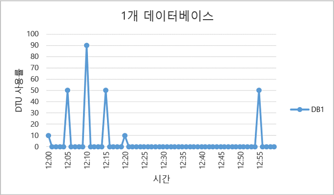
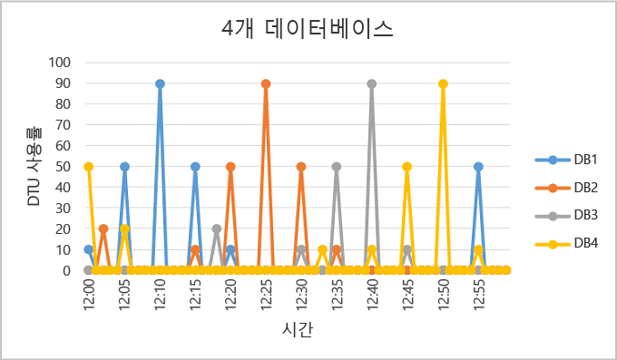
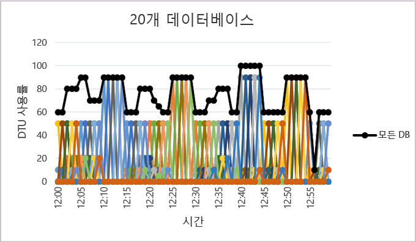

<properties
	pageTitle="탄력적 데이터베이스 풀을 사용해야 하는 경우"
	description="탄력적 데이터베이스 풀은 탄력적 데이터베이스 그룹에서 공유하는 가용 리소스의 컬렉션입니다. 이 문서는 탄력적 데이터베이스 풀을 사용하여 데이터베이스의 그룹에 대한 적합성을 평가하는데 도움이 되는 지침을 제공합니다."
	services="sql-database"
	documentationCenter=""
	authors="stevestein"
	manager="jhubbard"
	editor=""/>

<tags
	ms.service="sql-database"
	ms.devlang="NA"
	ms.date="08/08/2016"
	ms.author="sstein"
	ms.workload="data-management"
	ms.topic="article"
	ms.tgt_pltfrm="NA"/>

# 탄력적 데이터베이스 풀을 사용해야 하는 경우
데이터베이스 사용 패턴 및 탄력적 데이터베이스 풀과 단일 데이터베이스 간의 가격 차이를 기반으로 하여 탄력적 데이터베이스 풀을 사용하는 것이 비용 효율적인지를 평가합니다. 추가 지침은 SQL 데이터베이스의 기존 집합에 필요한 현재 풀 크기를 결정 하는데 도움이 되도록 제공 됩니다.

- 풀의 개요는 [SQL 데이터베이스 탄력적 데이터베이스 풀](sql-database-elastic-pool.md)을 참조하세요.

> [AZURE.NOTE] 탄력적 풀은 현재 미리 보기 상태인 미국 중북부 및 인도 서부를 제외한 모든 Azure 지역에서 일반 공급(GA) 상태입니다. 이 지역에서도 탄력적 풀의 GA를 가능한 한 빨리 제공하겠습니다.

## 탄력적 데이터베이스 풀

SaaS 개발자는 여러 데이터베이스로 구성된 대규모 데이터 계층에 응용 프로그램을 작성합니다. 일반적인 응용 프로그램 패턴은 각 고객에 대해 단일 데이터베이스를 프로비전합니다. 하지만 다양한 고객은 종종 다양하고 예측할 수 없는 사용 패턴이 있으며 각 데이터베이스 사용자의 리소스 요구 사항을 예측하기 어렵습니다. 따라서 개발자는 리소스에 상당한 지출을 초과 공급하여 모든 데이터베이스에 대한 긍정적인 처리량 및 반응 속도를 보장할 수 있습니다. 또는 개발자가 지출을 줄이고 고객에게 성능저하 환경이 발생할 위험이 있습니다. 탄력적 풀을 사용한 SaaS 응용 프로그램의 디자인 패턴에 대해 자세히 알아보려면 [Azure SQL 데이터베이스를 사용한 다중 테넌트 SaaS 응용 프로그램 디자인 패턴](sql-database-design-patterns-multi-tenancy-saas-applications.md)을 참조하세요.

Azure SQL 데이터베이스의 탄력적 풀을 사용하면 SaaS 개발자가 각각의 데이터베이스에 성능 탄력성을 제공하는 동시에 규정된 예산 내의 데이터베이스 그룹에 가격 성능을 최적화할 수 있습니다. 풀을 사용하면 개발자가 예측할 수 없는 개별 데이터베이스의 사용 기간을 수용하기 위해 여러 데이터베이스에서 공유되는 풀에 대한 eDTU(탄력적 데이터베이스 트랜잭션 단위)를 구매할 수 있습니다. 풀에 대한 eDTU 요구 사항은 해당 데이터베이스의 집계 사용률에 의해 결정됩니다. 풀에 사용 가능한 eDTU 양은 개발자 예산에 의해 제어됩니다. 풀을 사용하면 개발자가 성능의 예산에 영향을 주는 원인이 될 수 있고 반대로 해당 풀도 마찬가지입니다. 개발자는 풀에 데이터베이스를 추가하고 데이터베이스에 대한 최소 및 최대 eDTU를 설정하며 예산에 따라 풀의 eDTU를 설정합니다. 개발자는 풀을 사용하여 처음 시작부터 계속 성장하는 성숙한 비즈니스까지 해당 서비스를 원활하게 증가시킬 수 있습니다.
## 풀을 고려하는 경우

풀은 특정 사용 패턴을 사용하여 많은 수의 데이터베이스에 적합합니다. 주어진 데이터 베이스에 대해, 이 패턴은 상대적으로 사용률 급증이 드물고 평균 사용률이 낮음으로 규정됩니다.

풀에 더 많은 데이터베이스를 추가할수록 절감이 커집니다. 응용 프로그램 사용 패턴에 따라 S3 데이터베이스 두 개 만큼 절감이 가능합니다.

다음 섹션은 풀에서 데이터베이스의 특정 컬렉션에 이득이 되는지 평가하는 방법을 이해하는 데 도움이 됩니다. 예제에서는 표준 풀을 사용하지만 기본 및 프리미엄 풀에도 동일한 원칙이 적용됩니다.

### 데이터베이스 사용량 패턴 평가

다음 그림에는 대부분의 시간을 유휴 상태로 있지만 정기적으로 갑작스러운 활동이 증가하는 데이터베이스의 예가 나와있습니다. 다음은 풀에 가장 적합한 사용률 패턴입니다.

   

위에서 설명한 5분 주기에서 DB1은 최대 90 DTU까지 증가하지만 전체 평균 사용량은 5 DTU보다 낮습니다. 단일 데이터베이스에서 이 워크로드를 실행하려면 S3 성능 수준이 필요하지만 활동이 적은 기간 동안 리소스의 대부분을 사용하지 않게 됩니다.

풀을 사용하면 이러한 사용하지 않는 DTU가 여러 데이터베이스에 공유될 수 있으므로 필요한 DTU의 총량 및 전체 비용을 줄입니다.

앞의 예제에 기초하여, DB1같은 유사한 사용률 패턴의 추가 데이터베이스가 있다고 가정합니다. 아래 두 그림에서 4개의 데이터베이스 사용률 및 20개의 데이터베이스는 동일한 그래프에 계층화되어 시간에 따라 해당 사용률의 특성이 겹치지 않는다는 것을 설명합니다.

   

   

20개의 데이터베이스간의 DTU 사용률 집계는 그래프 위에 검은 선으로 표시됐습니다. 이는 DTU 사용률 집계가 100 DTU를 초과하지 않음을 보여 주며, 이 기간 동안 20개 데이터베이스가 100 eDTU를 공유할 수 있음을 나타냅니다. 이러한 결과 20X DTUs의 감소와 13x 가격 감소를 비교합니다. 단일 데이터베이스의 S3 퍼포먼스 수준내의 각각의 데이터베이스를 배치하기위해

이 예는 다음 이유로 이상적입니다.

- 최고사용률과 데이터베이스당 평균 사용률간에 큰차이가 있습니다.
- 각 데이터베이스의 최고사용률이 시간내에 여러 지점에서 발생합니다.
- eDTU는 다수의 데이터베이스에서 공유됩니다.

풀의 가격은 풀 eDTU의 함수입니다. 풀의 eDTU 단가는 단일 데이터베이스에 대한 DTU 단가보다 1.5배지만 **많은 데이터베이스가 풀 eDTU를 공유할 수 있으므로 필요한 총 eDTU가 감소하는 경우가 많습니다**. 가격 책정 및 eDTU 공유에서의 이러한 차이가 풀이 제공할 수 있는 가격 절감 가능성의 기초가 됩니다.

데이터베이스 수 및 데이터베이스 사용에 관련된 다음 규칙은 풀이 단일 데이터베이스에 대한 성능 수준을 사용하는 데 비해 비용 절감을 제공하는 데 도움이 됩니다.

### 데이터베이스의 최소 수

단일 데이터베이스에 대한 성능 수준의 DTU의 합계가 풀에 필요한 eDTU의 1.5배 이상인 경우 탄력적 풀은 더욱 비용 효율적입니다. 사용 가능한 크기에 대해서는 [탄력적 데이터베이스 풀과 탄력적 데이터베이스에 대한 eDTU 및 저장소 제한](sql-database-elastic-pool.md#edtu-and-storage-limits-for-elastic-pools-and-elastic-databases)을 참조하세요.

***예제***  단일 데이터베이스에 성능 수준을 사용하는 것보다 비용 효율을 증가시키려면 100 DTU 풀에 최소 두 개의 S3 데이터베이스 혹은 15개의 S0 데이터베이스가 필요합니다.

### 최대 동시에 최고 데이터베이스

eDTU를 공유하면 풀의 일부 데이터베이스가 단일 데이터베이스에 대한 성능 수준을 사용할 때 사용 가능한 제한까지 eDTU를 동시에 사용할 수 없습니다. 동시에 최대 사용량에 도달하는 데이터베이스 수가 작을수록 더 낮은 풀 eDTU를 설정할 수 있으며 풀도 더 비용 효율적입니다. 일반적으로 eDTU 제한까지 동시에 최대 사용량에 도달하는 풀의 데이터베이스 수가 2/3(또는 67%)를 초과하면 안 됩니다.

***예제***  200 eDTU 풀에서 S3 데이터베이스 3개의 비용을 줄이려면 최대 2개의 데이터베이스가 동시에 최대 사용률에 도달할 수 있습니다. 이러한 S3 데이터베이스 4개 중 2개 이상이 동시에 최대 사용률에 도달하는 경우 200 eDTU 이상으로 풀 크기를 조정해야 합니다. 풀 크기가 200 eDTU 이상으로 조정된 경우 단일 데이터베이스에 대한 성능 수준보다 낮은 비용을 유지하려면 S3 데이터베이스를 풀에 더 추가해야 합니다.

예에서는 풀에 있는 다른 데이터베이스의 사용률을 고려 하지 않습니다. 모든 데이터베이스 시간에 특정된 시점에서 일부 사용률의 경우, 데이터베이스의 2/3(또는 67%) 보다 작은 사용률이 동시에 정점에 달할 수 있습니다.

### 데이터베이스당 DTU 사용률

데이터 베이스 사용률의 최고와 평균 사이의 큰 차이는 장시간 동안 낮은 사용률 그리고 짧은 시간 동안 큰사용률을 나타냅니다. 이 사용률 패턴은 데이터베이스에서 리소스를 공유 하기에 이상적입니다. 최고 사용률이 평균사용률의 1.5배 이상이 될때 풀에 대한 데이터베이스를 고려해야 합니다.

***예제***  S3 데이터베이스의 최고 사용률이 100 DTU이며 평균 사용률이 67 DTU 이하인 경우 풀의 eDTU를 공유하기 적합합니다. 또는 S1 데이터베이스의 최고 사용률이 20 DTU이고 평균 사용률이 13 DTU 이하인 경우 풀에 적합합니다.

## 탄력적 풀 크기 조정

풀의 적절한 크기는 eDTU 집계 및 풀의 모든 데이터베이스에 필요한 저장소 원본의 값에 따라 달라집니다. 이것은 다음 중 큰 값 결정을 포함합니다.

* 풀에 있는 모든 데이터베이스의 최대 DTU 수입니다.
* 풀에 있는 모든 데이터베이스의 최대 저장된 바이트 수입니다.

사용 가능한 크기에 대해서는 [탄력적 데이터베이스 풀과 탄력적 데이터베이스에 대한 eDTU 및 저장소 제한](sql-database-elastic-pool.md#edtu-and-storage-limits-for-elastic-pools-and-elastic-databases)을 참조하세요.

SQL 데이터베이스는 기존 SQL 데이터베이스 서버에서 데이터베이스의 기록 리소스 사용률을 자동으로 평가하고 Azure 포털의 적절한 풀 구성을 권장합니다. 권장 사항 외에도 기본 제공 환경은 서버에서 데이터베이스의 사용자 지정 그룹에 대한 eDTU 사용률을 예측합니다. 그러면 풀에 데이터베이스를 대화형으로 추가하고 제거하여 변경 사항을 커밋하기 전에 리소스 사용률 분석 및 크기 조정 조언을 가져오기 위해 "가정" 분석을 수행할 수 있습니다. 방법은 [탄력적 풀 모니터링, 관리 및 크기 조정](sql-database-elastic-pool-manage-portal.md)을 참조하세요.

다른 서버의 데이터베이스에 대한 예상 크기 조정 뿐만 아니라 V12 이전 서버에 대한 임시 예상 크기 조정을 허용하는 융통성 있는 리소스 사용은 [탄력적 데이터베이스 풀에 적합한 데이터베이스를 식별하기 위한 Powershell 스크립트](sql-database-elastic-pool-database-assessment-powershell.md)를 참조하세요.

| 기능 | 포털 환경|	PowerShell 스크립트|
|:---------------|:----------|:----------|
| 세분성 | 15초 | 15초
| 풀과 단일 데이터 성능 수준 사이의 가격 차이를 고려합니다.| 예| 아니요
| 분석된 데이터베이스 목록을 사용자 지정할 수 있습니다.| 예| 예
| 분석에 사용되는 기간을 사용자 지정할 수 있습니다.| 아니요| 예
| 다른 서버에 걸쳐 분석된 데이터베이스 목록을 사용자 지정할 수 있습니다.| 아니요| 예
| v11 서버에서 분석된 데이터베이스 목록을 사용자 지정할 수 있습니다.| 아니요| 예

도구를 사용할 수 없는 경우 다음 단계는 풀이 단일 데이터베이스보다 비용 효율적인지를 예측하는 데 도움이 될 수 있습니다.

1.	다음 수식에 따라 풀에 필요한 eDTU를 예측합니다.

    최대(<*총 DB 수* X *DB당 평균 DTU 사용률*>,  <*동시에 최대 사용률에 도달한 DB 수* X *DB당 최대 DTU 사용률*)

2.	풀에서 모든 데이터베이스에 필요한 바이트 수를 추가하여 풀에 필요한 저장소 공간을 예측합니다. 그런 다음 이 저장소의 양을 제공하는 eDTU 풀 크기를 결정합니다. eDTU 풀 크기에 기반한 풀 저장소 한도는 [탄력적 데이터베이스 풀과 탄력적 데이터베이스에 대한 eDTU 및 저장소 한도](sql-database-elastic-pool.md#edtu-and-storage-limits-for-elastic-pools-and-elastic-databases)를 참조하세요.
3.	1단계 및 2단계에서 eDTU 예측 중 큰 수를 사용합니다.
4.	[SQL 데이터베이스 가격 책정 페이지](https://azure.microsoft.com/pricing/details/sql-database/)를 확인하고 3단계의 예상보다 큰 경우 가장 작은 eDTU 풀 크기를 찾습니다.
5.	단일 데이터베이스에 대한 적절한 성능 수준을 사용하는 가격에 5단계의 풀 가격을 비교합니다.

## 요약

모든 단일 데이터베이스가 풀에 적합하지는 않습니다. 낮은 평균 사용률과 사용률 급증이 비교적 드문 특징을 가진 사용 패턴이 있는 데이터베이스의 경우 아주 적합합니다. 응용 프로그램 사용 패턴이 동적이므로 풀이 데이터베이스 일부 혹은 전체에 대해 좋은 선택인지를 확인하는 초기 평가를 내리기 위해 이 문서에서 설명한 정보와 도구를 사용하세요. 이 문서는 탄력적 풀이 잘 맞는지 여부에 대한 당신의 결정을 돕기 위한 기점입니다. 지속적으로 기록 리소스 사용량을 모니터링하고 데이터베이스의 성능 수준을 재평가해야 합니다. 탄력적 풀에서 데이터베이스를 쉽게 이동할 수 있고, 매우 많은 수의 데이터베이스를 가지고 있는 경우, 데이터베이스를 나눌 수 있는 다양한 크기의 여러 풀을 가질 수 있다는 것을 염두하십시오.

## 다음 단계

- [탄력적 데이터베이스 풀 생성](sql-database-elastic-pool-create-portal.md)
- [탄력적 데이터베이스 풀 모니터링, 관리 및 크기 조정](sql-database-elastic-pool-manage-portal.md)
- [SQL 데이터베이스 옵션 및 성능: 각 서비스 계층에서 사용할 수 있는 항목 이해](sql-database-service-tiers.md)
- [탄력적 데이터베이스 풀에 적합한 데이터베이스를 식별하기 위한 PowerShell 스크립트](sql-database-elastic-pool-database-assessment-powershell.md)

<!---HONumber=AcomDC_0921_2016-->