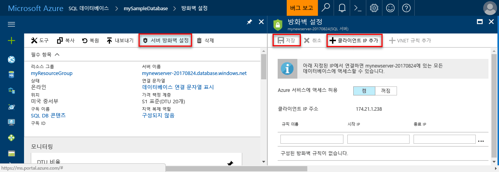

# <a name="azure-sql-database-and-sql-data-warehouse-ip-firewall-rules"></a>Azure SQL Database 및 SQL Data Warehouse IP 방화벽 규칙

Microsoft Azure [SQL Database](sql-database-technical-overview.md) 및 [SQL Data Warehouse](../sql-data-warehouse/sql-data-warehouse-overview-what-is.md)는 Azure 및 다른 인터넷 기반 애플리케이션에 관계형 데이터베이스 서비스를 제공합니다. 데이터를 보호하기 위해 방화벽은 권한이 있는 컴퓨터를 지정할 때까지 데이터베이스 서버에 대한 모든 액세스를 금지합니다. 방화벽은 각 요청이 시작된 IP 주소의 데이터베이스에 대한 액세스를 허용합니다.

> [!NOTE]
> 이 문서는 Azure SQL 서버 및 Azure SQL 서버에서 생성된 SQL Database와 SQL Data Warehouse 데이터베이스에 적용됩니다. 간단히 하기 위해 SQL Database는 SQL Database와 SQL Data Warehouse를 참조할 때 사용됩니다.
> [!IMPORTANT]
> 이 문서는 **Azure SQL Database Managed Instance**에 적용되지 *않습니다*. 필요한 네트워킹 구성에 대한 자세한 내용은 [Managed Instance에 연결](sql-database-managed-instance-connect-app.md)하는 방법에 대한 다음 문서를 참조하세요.

## <a name="virtual-network-rules-as-alternatives-to-ip-rules"></a>IP 규칙 대신 사용되는 가상 네트워크 규칙

IP 규칙 이외에 방화벽도 *가상 네트워크 규칙*을 관리합니다. 가상 네트워크 규칙은 Virtual Network 서비스 엔드포인트를 기반으로 합니다. 경우에 따라 가상 네트워크 규칙이 IP 규칙보다 더 좋을 수 있습니다. 자세한 내용은 [Azure SQL Database에 대한 Virtual Network 서비스 엔드포인트 및 규칙](sql-database-vnet-service-endpoint-rule-overview.md)을 참조하세요.

## <a name="overview"></a>개요

먼저, Azure SQL 서버에 대한 모든 액세스는 SQL Database 방화벽에 의해 차단됩니다. 데이터베이스 서버에 액세스하려면 Azure SQL Server에 액세스를 가능하게 하는 하나 이상의 서버 수준 IP 방화벽 규칙을 지정해야 합니다. IP 방화벽 규칙을 사용하여 인터넷이 허용하는 IP 주소 범위 및 Azure 애플리케이션 Azure SQL 서버의 연결 시도 가능 여부를 지정할 수 있습니다.

선택적으로 Azure SQL Server에 있는 데이터베이스 중 하나에 대해서만 액세스 권한을 부여하려면 필수 데이터베이스에 대해 데이터베이스 수준 규칙을 만들어야 합니다. 서버 수준 IP 방화벽 규칙에 지정된 IP 주소 범위 밖의 데이터베이스 IP 방화벽 규칙의 IP 주소 범위를 지정한 경우, 클라이언트의 IP 주소가 데이터베이스 수준 규칙에 지정된 범위에 속하는지 확인합니다.

> [!IMPORTANT]
> SQL Data Warehouse는 서버 수준 IP 방화벽 규칙만 지원하며, 데이터베이스 수준 IP 방화벽 규칙은 지원하지 않습니다.

인터넷과 Azure로부터의 연결 시도는 다음 다이어그램과 같이 Azure SQL Server 또는 SQL Database에 연결하기 전에 먼저 방화벽을 통과해야 합니다.

   ![방화벽 구성을 설명하는 다이어그램입니다.][1]

- **서버 수준 IP 방화벽 규칙:**

  클라이언트는 이 규칙에 따라 전체 Azure SQL Server, 즉 동일한 SQL Database 서버 내의 모든 데이터베이스에 액세스할 수 있습니다. 이 규칙은 **master** 데이터베이스에 저장됩니다. 포털 또는 Transact-SQL 문을 사용하여 서버 수준 IP 방화벽 규칙을 구성할 수 있습니다. Azure Portal 또는 PowerShell을 사용하여 서버 수준 IP 방화벽 규칙을 만들려면 구독 소유자 또는 구독 참가자여야 합니다. Transact-SQL을 사용하여 서버 수준 IP 방화벽 규칙을 만들려면 서버 수준 주체 로그인 또는 Azure Active Directory 관리자로 SQL Database 인스턴스에 연결해야 합니다. 다시 말하면 Azure 수준 권한을 가진 사용자가 먼저 서버 수준 IP 방화벽 규칙을 만들어야 합니다.

- **데이터베이스 수준 IP 방화벽 규칙:**

  클라이언트는 이 규칙에 따라 동일한 SQL Database 서버 내의 특정(보안) 데이터베이스에 액세스할 수 있습니다. 각 데이터베이스(**master** 데이터베이스 포함)에 대해 이러한 규칙을 만들 수 있으며 규칙은 개별 데이터베이스에 저장됩니다. master 및 user 데이터베이스에 대한 데이터베이스 수준 IP 방화벽 규칙은 Transact-SQL 문을 사용하는 경우에 한해 첫 번째 서버 수준 방화벽을 구성한 후에만 구성할 수 있습니다. 서버 수준 IP 방화벽 규칙 내 지정된 범위 밖의 데이터베이스 수준 IP 방화벽 규칙의 IP 주소 범위를 지정한 경우, 데이터베이스 수준 범위 내에 IP 주소를 가진 클라이언트만이 데이터베이스에 액세스할 수 있습니다. 데이터베이스에 대해 최대 128개의 데이터베이스 수준 IP 방화벽 규칙을 가질 수 있습니다. 데이터베이스 수준 IP 방화벽 규칙을 구성하는 방법에 대한 자세한 내용은 이 문서 뒷부분에 나오는 예제 및 [sp_set_database_firewall_rule(Azure SQL Database)](https://msdn.microsoft.com/library/dn270010.aspx)을 참조하세요.

### <a name="recommendation"></a>권장 사항

보안을 강화하고 데이터베이스의 휴대성을 높이기 위해 되도록이면 데이터베이스 수준 IP 방화벽 규칙을 사용하는 것이 좋습니다. 관리자의 경우 서버 수준 IP 방화벽 규칙을 사용하면 동일한 액세스를 요구하는 데이터베이스가 많을 때 각 데이터베이스를 개별적으로 구성할 필요가 없습니다.

> [!IMPORTANT]
> Windows Azure SQL Database는 최대 128개의 IP 방화벽 규칙을 지원합니다.
> [!NOTE]
> 비즈니스 연속성의 맥락에서 휴대용 데이터베이스에 대한 자세한 내용은 [재해 복구를 위한 인증 요구 사항](sql-database-geo-replication-security-config.md)을 참조하세요.

### <a name="connecting-from-the-internet"></a>인터넷에서 연결하기

컴퓨터가 인터넷의 데이터베이스에 연결을 시도할 때, 방화벽은 먼저 연결을 요청하는 데이터베이스를 위해 데이터베이스 수준 IP 방화벽 규칙에 반하는 요청의 본래 IP 주소를 확인합니다.

- 요청 IP 주소가 데이터베이스 수준 IP 방화벽 규칙의 지정된 범위 안에 있을 경우, 규칙을 포함한 SQL Database 서버 연결이 허용됩니다.
- 요청된 IP 주소가 데이터베이스 수준 IP 방화벽 규칙의 지정된 범위 안에 없을 경우, 서버 수준 IP 방화벽 규칙을 확인합니다. 요청된 IP 주소가 서버 수준 IP 방화벽 규칙의 지정된 범위 안에 있을 경우, 연결이 허용됩니다. 서버 수준 IP 방화벽 규칙은 Azure SQL Server에 있는 모든 SQL Database에 적용됩니다.  
- 요청 IP 주소가 데이터베이스 수준 또는 서버 수준 IP 방화벽 규칙의 지정된 범위 안에 없을 경우, 연결 요청이 실패합니다.

> [!NOTE]
> 로컬 컴퓨터에서 Azure SQL Database로 액세스하려면, 네트워크의 방화벽과 로컬 컴퓨터가 TCP 포트 1433으로 나가는 통신을 허용하는지 확인합니다.

### <a name="connecting-from-azure"></a>Azure에서 연결

Azure에서 애플리케이션을 Azure SQL Server에 연결할 수 있게 하려면 Azure 연결을 사용하도록 설정해야 합니다. Azure의 애플리케이션이 데이터베이스 서버로 연결을 시도할 때, 방화벽은 Azure 연결이 허용되는지 확인합니다. 0.0.0.0으로 된 시작 및 끝 주소가 포함된 방화벽 설정은 Azure 연결이 허용됨을 나타냅니다. 연결 시도가 허용되지 않는 경우, 요청은 Azure SQL Database 서버로 도달되지 않습니다.

> [!IMPORTANT]
> 이 옵션은 다른 고객 구독에서의 연결을 포함하여 Azure에서의 모든 연결을 허용하도록 방화벽을 구성합니다. 이 옵션을 선택할 때 로그인 및 사용자 권한이 부여된 사용자만으로 액세스를 제한하는지 확인합니다.

## <a name="creating-and-managing-ip-firewall-rules"></a>IP 방화벽 규칙 만들기 및 관리

첫 번째 서버 수준 방화벽 설정은 [Azure Portal](https://portal.azure.com/)을 사용하거나 [Azure PowerShell](https://docs.microsoft.com/powershell/module/az.sql), [Azure CLI](/cli/azure/sql/server/firewall-rule#az-sql-server-firewall-rule-create) 또는 [REST API](https://docs.microsoft.com/rest/api/sql/firewallrules/createorupdate)를 사용하여 프로그래밍 방식으로 만들 수 있습니다. 후속 서버 수준 IP 방화벽 규칙은 이러한 방법과 Transact-SQL을 사용하여 만들고 관리 할 수 있습니다.

> [!IMPORTANT]
> 데이터베이스 수준 IP 방화벽 규칙은 Transact-SQL을 사용해야만 만들고 관리할 수 있습니다.

성능 향상을 위해 서버 수준 IP 방화벽 규칙이 데이터베이스 수준에서 일시적으로 캐시됩니다. 캐시를 새로 고치려면 [DBCC FLUSHAUTHCACHE](https://msdn.microsoft.com/library/mt627793.aspx)를 참조하세요.

> [!TIP]
> [SQL Database 감사](sql-database-auditing.md)를 사용하여 서버 수준 및 데이터베이스 수준의 방화벽 변경 내용을 감사할 수 있습니다.

## <a name="manage-server-level-ip-firewall-rules-using-the-azure-portal"></a>Azure Portal을 사용하여 서버 수준 IP 방화벽 규칙 관리

Azure Portal에서 서버 수준 IP 방화벽 규칙을 설정하려면 Azure SQL 데이터베이스의 개요 페이지 또는 SQL Database 서버의 개요 페이지로 이동합니다.

> [!TIP]
> 자습서는 [Azure Portal을 사용하여 DB 만들기](sql-database-single-database-get-started.md)를 참조하세요.

### <a name="from-database-overview-page"></a>데이터베이스 개요 페이지에서

1. 데이터베이스 개요 페이지에서 서버 수준 IP 방화벽 규칙을 설정하려면 아래 이미지와 같이 도구 모음에서 **서버 방화벽 설정**을 클릭합니다. SQL Database 서버에 대한 **방화벽 설정** 페이지가 열립니다.

      

2. 도구 모음에서 **클라이언트 IP 추가**를 클릭하여 현재 사용 중인 컴퓨터의 IP 주소를 추가한 다음 **저장**을 클릭합니다. 현재 IP 주소에 대한 서버 수준 IP 방화벽 규칙이 생성됩니다.

      

### <a name="from-server-overview-page"></a>서버 개요 페이지에서

서버에 대한 개요 페이지가 열리고 이 페이지에 정규화된 서버 이름(예: **mynewserver20170403.database.windows.net**)이 표시되며 추가 구성을 위한 옵션도 제공됩니다.

1. 서버 개요 페이지에서 서버 수준 규칙을 설정하려면 다음과 같이 왼쪽 메뉴에서 설정 아래 **방화벽**을 클릭합니다.

2. 도구 모음에서 **클라이언트 IP 추가**를 클릭하여 현재 사용 중인 컴퓨터의 IP 주소를 추가한 다음 **저장**을 클릭합니다. 현재 IP 주소에 대한 서버 수준 IP 방화벽 규칙이 생성됩니다.

## <a name="manage-ip-firewall-rules-using-transact-sql"></a>Transact-SQL를 사용하여 IP 방화벽 규칙 관리

| 카탈로그 뷰 또는 저장된 프로시저 | Level | 설명 |
| --- | --- | --- |
| [sys.firewall_rules](https://msdn.microsoft.com/library/dn269980.aspx) |서버 |현재 서버 수준 IP 방화벽 규칙을 표시합니다. |
| [sp_set_firewall_rule](https://msdn.microsoft.com/library/dn270017.aspx) |서버 |서버 수준 IP 방화벽 규칙을 생성 및 업데이트합니다. |
| [sp_delete_firewall_rule](https://msdn.microsoft.com/library/dn270024.aspx) |서버 |서버 수준 IP 방화벽 규칙을 제거합니다. |
| [sys.database_firewall_rules](https://msdn.microsoft.com/library/dn269982.aspx) |데이터베이스 |현재 데이터베이스 수준 IP 방화벽 규칙을 표시합니다. |
| [sp_set_database_firewall_rule](https://msdn.microsoft.com/library/dn270010.aspx) |데이터베이스 |데이터베이스 수준 IP 방화벽 규칙을 생성 및 업데이트합니다. |
| [sp_delete_database_firewall_rule](https://msdn.microsoft.com/library/dn270030.aspx) |데이터베이스 |데이터베이스 수준 IP 방화벽 규칙을 제거합니다. |

다음 예제에서는 기존 규칙을 검토하고 Contoso 서버에서 일정 범위의 IP 주소를 사용하도록 설정하고 IP 방화벽 규칙을 삭제합니다.

```sql
SELECT * FROM sys.firewall_rules ORDER BY name;
```

다음으로 서버 수준 IP 방화벽 규칙을 추가합니다.

```sql
EXECUTE sp_set_firewall_rule @name = N'ContosoFirewallRule',
   @start_ip_address = '192.168.1.1', @end_ip_address = '192.168.1.10'
```

서버 수준 IP 방화벽 규칙을 삭제하려면 sp_delete_firewall_rule 저장 프로시저를 실행합니다. 다음 예제에서는 ContosoFirewallRule이라는 규칙을 삭제합니다.

```sql
EXECUTE sp_delete_firewall_rule @name = N'ContosoFirewallRule'
```

## <a name="manage-server-level-ip-firewall-rules-using-azure-powershell"></a>Azure PowerShell을 사용하여 서버 수준 IP 방화벽 규칙 관리

[!INCLUDE [updated-for-az](../../includes/updated-for-az.md)]
> [!IMPORTANT]
> PowerShell Azure Resource Manager 모듈은 Azure SQL 데이터베이스에서 계속 지원되지만 향후 모든 개발은 Az.Sql 모듈에 대해 진행됩니다. 이러한 cmdlet에 대한 내용은 [AzureRM.Sql](https://docs.microsoft.com/powershell/module/AzureRM.Sql/)을 참조합니다. Az 모듈과 AzureRm 모듈에서 명령의 인수는 실질적으로 동일합니다.

| Cmdlet | Level | 설명 |
| --- | --- | --- |
| [Get-AzSqlServerFirewallRule](/powershell/module/az.sql/get-azsqlserverfirewallrule) |서버 |현재 서버 수준 방화벽 규칙 반환 |
| [New-AzSqlServerFirewallRule](/powershell/module/az.sql/new-azsqlserverfirewallrule) |서버 |새 서버 수준 방화벽 규칙 만들기 |
| [Set-AzSqlServerFirewallRule](/powershell/module/az.sql/set-azsqlserverfirewallrule) |서버 |기존 서버 수준 방화벽 규칙 속성 업데이트 |
| [Remove-AzSqlServerFirewallRule](/powershell/module/az.sql/remove-azsqlserverfirewallrule) |서버 |서버 수준 방화벽 규칙 제거 |

다음 예제에서는 PowerShell을 사용하여 서버 수준 IP 방화벽 규칙을 설정합니다.

```powershell
New-AzSqlServerFirewallRule -ResourceGroupName "myResourceGroup" `
    -ServerName $servername `
    -FirewallRuleName "AllowSome" -StartIpAddress "0.0.0.0" -EndIpAddress "0.0.0.0"
```

> [!TIP]
> 빠른 시작의 컨텍스트에서 PowerShell 예제를 보려면 [DB 만들기 - PowerShell](sql-database-powershell-samples.md) 및 [PowerShell을 사용하여 단일 데이터베이스 만들기 및 SQL Database 서버 수준 IP 방화벽 규칙 구성](scripts/sql-database-create-and-configure-database-powershell.md)을 참조하세요.

## <a name="manage-server-level-ip-firewall-rules-using-azure-cli"></a>Azure CLI를 사용하여 서버 수준 IP 방화벽 규칙 관리

| Cmdlet | Level | 설명 |
| --- | --- | --- |
|[az sql server firewall-rule create](/cli/azure/sql/server/firewall-rule#az-sql-server-firewall-rule-create)|서버|서버 IP 방화벽 규칙을 만듭니다.|
|[az sql server firewall-rule list](/cli/azure/sql/server/firewall-rule#az-sql-server-firewall-rule-list)|서버|서버의 IP 방화벽 규칙을 나열합니다.|
|[az sql server firewall-rule show](/cli/azure/sql/server/firewall-rule#az-sql-server-firewall-rule-show)|서버|IP 방화벽 규칙의 세부 정보를 보여 줍니다.|
|[az sql server firewall-rule update](/cli/azure/sql/server/firewall-rule##az-sql-server-firewall-rule-update)|서버|IP 방화벽 규칙을 업데이트합니다.|
|[az sql server firewall-rule delete](/cli/azure/sql/server/firewall-rule#az-sql-server-firewall-rule-delete)|서버|IP 방화벽 규칙을 삭제합니다.|

다음 예제에서는 Azure CLI를 사용하여 서버 수준 IP 방화벽 규칙을 설정합니다.

```azurecli-interactive
az sql server firewall-rule create --resource-group myResourceGroup --server $servername \
-n AllowYourIp --start-ip-address 0.0.0.0 --end-ip-address 0.0.0.0
```

> [!TIP]
> 빠른 시작의 컨텍스트에서 Azure CLI 예제를 보려면 [DB 만들기 - Azure CLI](sql-database-cli-samples.md) 및 [Azure CLI를 사용하여 단일 데이터베이스 만들기 및 SQL Database IP 방화벽 규칙 구성](scripts/sql-database-create-and-configure-database-cli.md)을 참조하세요.

## <a name="manage-server-level-ip-firewall-rules-using-rest-api"></a>REST API를 사용하여 서버 수준 IP 방화벽 규칙 관리

| API | Level | 설명 |
| --- | --- | --- |
| [방화벽 규칙 나열](https://docs.microsoft.com/rest/api/sql/firewallrules/listbyserver) |서버 |현재 서버 수준 IP 방화벽 규칙을 표시합니다. |
| [방화벽 규칙 만들기 또는 업데이트](https://docs.microsoft.com/rest/api/sql/firewallrules/createorupdate) |서버 |서버 수준 IP 방화벽 규칙을 생성 및 업데이트합니다. |
| [방화벽 규칙 삭제](https://docs.microsoft.com/rest/api/sql/firewallrules/delete) |서버 |서버 수준 IP 방화벽 규칙을 제거합니다. |
| [방화벽 규칙 가져오기](https://docs.microsoft.com/rest/api/sql/firewallrules/get) | 서버 | 서버 수준 IP 방화벽 규칙을 가져옵니다. |

## <a name="server-level-versus-database-level-ip-firewall-rules"></a>서버 수준 및 데이터베이스 수준 IP 방화벽 규칙 비교

Q. 한 데이터베이스의 사용자가 다른 데이터베이스에서 완전히 분리되어야 하나요?
그렇다면 데이터베이스 수준 IP 방화벽 규칙을 사용하여 액세스 권한을 부여하세요. 이렇게 하면 서버 수준 IP 방화벽 규칙을 사용할 수 없게 되며, 방화벽을 통과해서 모든 데이터베이스에 액세스하도록 허용되므로 방어 수준이 약해집니다.

Q. 해당 IP 주소의 사용자가 모든 데이터베이스에 액세스할 수 있어야 하나요?
서버 수준 IP 방화벽 규칙을 사용하여 방화벽 규칙을 구성해야 하는 횟수를 줄이세요.

Q. IP 방화벽 규칙을 구성하는 개인이나 팀이 Azure Portal, PowerShell 또는 REST API를 통해서만 액세스하나요?
서버 수준 IP 방화벽 규칙을 사용해야 합니다. 데이터베이스 수준 IP 방화벽 규칙은 Transact-SQL을 사용해야만 구성할 수 있습니다.  

Q. IP 방화벽 규칙을 구성하는 개인이나 팀이 데이터베이스 수준에서 높은 수준의 권한을 가질 수 없도록 금지되나요?
서버 수준 IP 방화벽 규칙을 사용합니다. Transact-SQL을 사용하여 데이터베이스 수준 IP 방화벽 규칙을 구성하려면 적어도 데이터베이스 수준에서 `CONTROL DATABASE` 권한이 있어야 합니다.  

Q. IP 방화벽 규칙을 구성하거나 감사하는 개인이나 팀이 많은(100개 정도) 데이터베이스에 대한 IP 방화벽 규칙을 중앙에서 관리하고 있나요?
이 선택은 사용자의 필요 및 환경에 따라 달라집니다. 서버 수준 IP 방화벽 규칙이 구성하기 더 쉬울 수 있지만 스크립팅은 데이터베이스 수준에서 규칙을 구성할 수 있습니다. 또한 서버 수준 IP 방화벽 규칙을 사용하더라도 데이터베이스에 대해 `CONTROL` 권한이 있는 사용자가 데이터베이스 수준 IP 방화벽 규칙을 만들었는지 확인하기 위해서는 데이터베이스 수준 IP 방화벽 규칙을 감사해야 할 수 있습니다.

Q. 서버 수준 및 데이터베이스 수준 IP 방화벽 규칙을 함께 사용할 수 있나요?
예. 관리자와 같은 일부 사용자는 서버 수준 IP 방화벽 규칙이 필요할 수 있습니다. 데이터베이스 애플리케이션 사용자와 같은 경우는 데이터베이스 수준 IP 방화벽 규칙이 필요할 수 있습니다.

## <a name="troubleshooting-the-database-firewall"></a>데이터베이스 방화벽 문제 해결

Microsoft Azure SQL Database 서비스로의 연결이 예상대로 작동되지 않는 경우 다음 사항을 고려하세요.

- **로컬 방화벽 구성:**

  컴퓨터가 Azure SQL Database에 액세스하려면 먼저 컴퓨터에서 TCP 포트 1433에 대한 방화벽 예외를 만들어야 하는 경우가 있습니다. Azure 클라우드 경계 내에서 연결하는 경우 포트를 추가로 열어야 할 수도 있습니다. 자세한 내용은 **SQL Database: 내부 및 외부** 섹션([ADO.NET 4.5 및 SQL Database에 대한 1433 이외 포트](sql-database-develop-direct-route-ports-adonet-v12.md))를 참조하세요.

- **NAT(Network Address Translation):**

  NAT로 인해 Azure SQL Database로 연결할 때 컴퓨터에서 사용하는 IP 주소가 컴퓨터 IP 구성 설정에서 나타나는 IP 주소와 다를 수도 있습니다. Azure에 연결할 때 컴퓨터에서 사용하는 IP 주소를 보려면 포털에 로그인하고 데이터베이스를 호스트하는 서버의 **구성** 탭을 탐색합니다. **허용된 IP 주소** 섹션에 **현재 클라이언트 IP 주소**가 표시됩니다. **허용된 IP 주소**에 **추가**를 클릭하여 이 컴퓨터가 서버에 액세스할 수 있도록 합니다.

- **허용 목록의 변경 내용이 아직 적용되지 않았습니다.**

  Azure SQL Database 방화벽 구성에 변경 내용이 적용되려면 최대 5분 정도 걸릴 수 있습니다.

- **로그인 권한이 없거나 사용한 암호가 잘못되었습니다.**

  로그인에 Azure SQL Database 서버에 대한 권한이 없거나 사용한 암호가 틀렸을 경우 Azure SQL Database 서버에 대한 연결이 거부됩니다. 방화벽 설정은 클라이언트에게 서버에 연결을 시도할 수 있는 기회를 제공합니다. 각 클라이언트는 꼭 필요한 보안 자격 증명을 제공해야 합니다. 로그인 준비에 대한 자세한 내용은 [Azure SQL Database에서 데이터베이스, 로그인, 사용자 관리](sql-database-manage-logins.md)를 참조하세요.

- **동적 IP 주소:**

  동적 IP 주소를 통해 인터넷에 연결되어 있고 방화벽을 통과하는 데 문제가 있는 경우 다음 해결 방법 중 하나를 시도할 수 있습니다.
  
  - Azure SQL Database 서버에 액세스 하는 클라이언트 컴퓨터에 할당 된 IP 주소 범위에 대 한 인터넷 서비스 공급자 (ISP)을 요청 하 고 IP 방화벽 규칙으로 IP 주소 범위를 추가 합니다.
  - 클라이언트 컴퓨터 대신 고정 IP 주소를 얻고, IP 방화벽 규칙에 따라 IP 주소 범위를 추가합니다.

## <a name="next-steps"></a>다음 단계

- Microsoft Azure 데이터 센터에서 사용 되는 컴퓨팅 IP 주소 범위 (SQL 범위 포함)에서 인바운드 통신을 허용 하는 회사 네트워크 환경 확인 합니다. 허용 목록에 추가 해야 할 수도 있습니다 이러한 IP 주소, 참조 [Microsoft Azure 데이터 센터 IP 범위](https://www.microsoft.com/download/details.aspx?id=41653)  
- 서버 수준 IP 방화벽 규칙 만들기에 대한 빠른 시작은 [Azure SQL 데이터베이스 만들기](sql-database-single-database-get-started.md)를 참조하세요.
- 오픈 소스 또는 타사 애플리케이션에서 Azure SQL 데이터베이스에 연결하는 방법에 대한 도움말은 [SQL Database에 대한 클라이언트 빠른 시작 코드 샘플](https://msdn.microsoft.com/library/azure/ee336282.aspx)을 참조하세요.
- 추가로 열어야 하는 포트에 대한 자세한 내용은 **SQL Database: 내부 및 외부** 섹션([ADO.NET 4.5 및 SQL Database에 대한 1433 이외 포트](sql-database-develop-direct-route-ports-adonet-v12.md))를 참조하세요.
- Azure SQL Database 보안 개요는 [데이터베이스 보안 설정](sql-database-security-overview.md)을 참조하세요.

<!--Image references-->
[1]: ./media/sql-database-firewall-configure/sqldb-firewall-1.png
