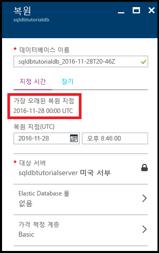
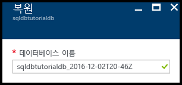
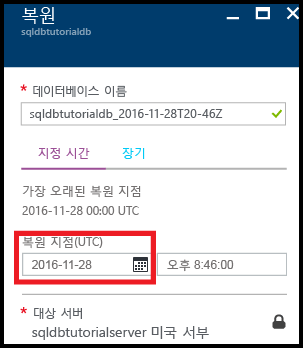
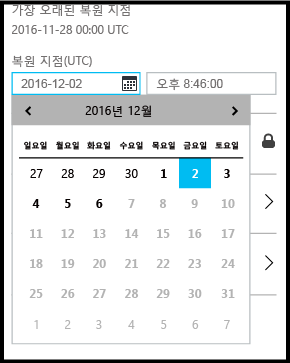
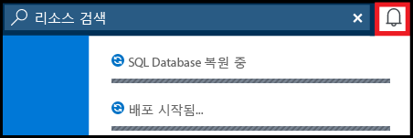
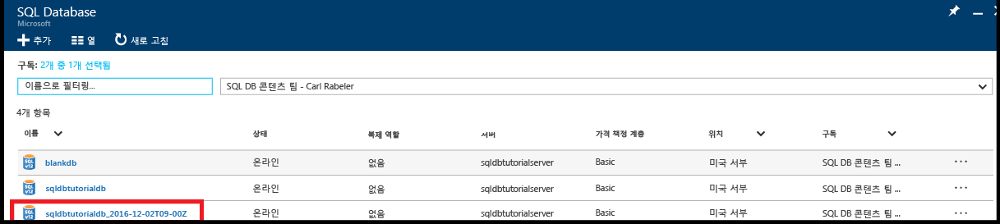

# 자습서: Azure Portal을 사용하여 Azure SQL Database 백업 및 복원
이 자습서에서는 Azure 포털을 다음에 사용하는 방법에 대해 알아봅니다.

- 데이터베이스의 기존 백업 보기
- 이전 시점으로 데이터베이스 복원
- Azure Recovery Services 자격 증명 모음에 데이터베이스 백업 파일의 장기 보존 구성
- Azure Recovery Services 자격 증명 모음에서 데이터베이스 복원

**예상 시간**: 이 자습서의 경우 완료하는 데 약 30분 소요됩니다(이미 필수 조건을 충족한다고 가정).

> [!TIP]
> [PowerShell](sql-database-get-started-backup-recovery-powershell.md)을 사용하여 시작 자습서에서 이와 동일한 작업을 수행할 수 있습니다.
>

## 필수 조건

* Azure 계정이 필요합니다. [무료 Azure 계정을 열거나](https://azure.microsoft.com/free/) 또는 [Visual Studio 구독자 혜택을 활성화](https://azure.microsoft.com/pricing/member-offers/msdn-benefits/)할 수 있습니다. 

* 구독 소유자 또는 참가자 역할의 구성원인 계정을 사용하여 Azure Portal에 연결할 수 있어야 합니다. RBAC(역할 기반 액세스 제어)에 대한 자세한 내용은 [Azure Portal에서 액세스 관리 시작](../active-directory/role-based-access-control-what-is.md)을 참조하세요.

* [Azure Portal 및 SQL Server Management Studio를 사용하여 Azure SQL Database 서버, 데이터베이스 및 방화벽 규칙 시작](sql-database-get-started.md) 또는 이 자습서의 [PowerShell 버전](sql-database-get-started-powershell.md)을 완료했습니다. 계속하기 전에 이 필수 자습서를 완료하거나 이 자습서의 [PowerShell 버전](sql-database-get-started-powershell.md) 끝에서 PowerShell 스크립트를 실행하지 않은 경우

> [!NOTE]
> 이 자습서에서는 [SQL Database 백업](sql-database-automated-backups.md), [장기 백업 보존](sql-database-long-term-retention.md) 및 [자동화된 데이터베이스 백업을 사용한 Azure SQL Database 복구](sql-database-recovery-using-backups.md)와 같은 학습 항목의 콘텐츠를 학습할 수 있습니다.
>  

## Azure 계정을 사용하여 Azure Portal에 로그인합니다.
[기존 구독](https://account.windowsazure.com/Home/Index)을 사용하고 이러한 다음 단계를 수행하여 Azure Portal에 연결합니다.

1. 선택한 브라우저를 열고 [Azure Portal](https://portal.azure.com/)에 연결합니다.
2. [Azure Portal](https://portal.azure.com/)에 로그인합니다.
3. **로그인** 페이지에서 구독에 대한 자격 증명을 제공합니다.
   
   

## 데이터베이스의 서비스에서 생성된 백업에서 가장 오래된 복원 지점 보기

자습서의 이 섹션에서는 데이터베이스의 [서비스에서 생성된 자동화된 백업](sql-database-automated-backups.md)에서 가장 오래된 복원 지점에 대한 정보를 봅니다. 

1. 데이터베이스에 대한 **SQL 데이터베이스** 블레이드, **sqldbtutorialdb**를 엽니다.

   

2. 도구 모음에서 **복원**을 클릭합니다.

   

3. 복원 블레이드에서 가장 오래된 복원 지점을 검토합니다.

   

## 이전 시점으로 데이터베이스 복원

자습서의 이 섹션에서는 특정 시점을 기준으로 새 데이터베이스로 데이터베이스를 복원합니다.

1. 데이터베이스에 대한 **복원** 블레이드에서 이전 시점으로 데이터베이스를 복원할 새 데이터베이스에 대한 기본 이름을 검토합니다(이름은 타임스탬프 뒤에 추가된 기존 데이터베이스 이름임). 이 이름은 다음 일부 단계에서 지정하는 시간을 반영하도록 변경합니다.

   

2. **복원 지점(UTC)** 입력 상자에서 **달력** 아이콘을 클릭합니다.

   

2. 달력에서 보존 기간 내 날짜를 선택합니다.

   

3. **복원 지점(UTC)** 입력 상자에서 자동화된 데이터베이스 백업에서 데이터베이스에 데이터를 복원하려는 선택한 날짜에 시간을 지정합니다.

   

   >[!NOTE]
   >데이터베이스 이름이 선택한 시간과 날짜를 반영하도록 변경되었는지 확인합니다. 특정 시점으로 복원하고 있는 서버를 변경할 수 없습니다. 다른 서버로 복원하려면 [지역 복원](sql-database-disaster-recovery.md#recover-using-geo-restore)을 사용합니다. 마지막으로 [탄력적 풀](sql-database-elastic-jobs-overview.md) 또는 다른 가격 책정 계층으로 복원할 수 있습니다. 
   >

4. **확인**을 클릭하여 새 데이터베이스에 이전 시점으로 데이터베이스를 복원합니다.

5. 도구 모음에서 알림 아이콘을 클릭하여 복원 작업의 상태를 봅니다.

   

6. 복원 작업이 완료되면 **SQL 데이터베이스** 블레이드를 열어 새로 복원된 데이터베이스를 봅니다.

   

> [!NOTE]
> 여기에서 SQL Server Management Studio를 사용하여 복원된 데이터베이스에 연결하여 [복원된 데이터베이스에서 일부 데이터를 추출하여 기존 데이터베이스로 복사 또는 기존 데이터베이스를 삭제하고 복원된 데이터베이스 이름을 기존 데이터베이스 이름으로 변경](sql-database-recovery-using-backups.md#point-in-time-restore)하기와 같은 필요한 작업을 수행할 수 있습니다.
>

## Azure Recovery Services 자격 증명 모음에 자동화된 백업의 장기 보존 구성 

자습서의 이 섹션에서는 서비스 계층에 대한 보존 기간보다 긴 기간 동안 [자동화된 백업을 보존하는 Azure Recovery Services 자격 증명 모음을 구성](sql-database-long-term-retention.md)합니다. 

> [!TIP]
> 장기 백업 보존의 백업을 삭제하려면 [PowerShell을 사용하여 장기 백업 보존 관리](sql-database-manage-long-term-backup-retention-powershell.md)를 참조하세요.
>

1. 서버에 대한 **SQL Server** 블레이드, **sqldbtutorialserver**를 엽니다.

   

2. **장기 백업 보존**을 클릭합니다.

   

3. **sqldbtutorial - 장기 백업 보존** 블레이드에서 미리 보기 약관을 검토하고 동의합니다(이미 실행하지 않은 한 - 또는 이 기능은 미리 보기에 없음).

   

4. sqldbtutorialdb 데이터베이스에 대한 장기 백업 보존을 구성하려면 표에서 해당 데이터베이스를 선택하고 도구 모음에서 **구성**을 클릭합니다.

   

5. **구성** 블레이드에서 **복구 서비스 자격 증명 모음** 아래의 **필요한 설정 구성**을 클릭합니다.

   

6. **Recovery Services 자격 증명 모음** 블레이드에서 있는 경우 기존 자격 증명 모음을 선택합니다. 그렇지 않으면 구독에 대한 복구 서비스 자격 증명 모음을 찾을 수 없는 경우 클릭하여 흐름을 종료하고 복구 서비스 자격 증명 모음을 만듭니다.

   

7. **Recovery Services 자격 증명 모음** 블레이드에서 **추가**를 클릭합니다.

   
   
8. **Recovery Services 자격 증명 모음** 블레이드에서 새 Recovery Services 자격 증명 모음에 대한 유효한 이름을 제공합니다.

   

9. 구독 및 리소스 그룹을 선택한 다음 자격 증명 모음에 대한 위치를 선택합니다. 완료하면 **만들기**를 클릭합니다.

   

   > [!IMPORTANT]
   > 자격 증명 모음은 Azure SQL 논리 서버와 동일한 지역에 있어야 하고 논리 서버와 동일한 리소스 그룹을 사용해야 합니다.
   >

10. 새 자격 증명 모음을 만든 후 필요한 단계를 실행하여 **Recovery Services 자격 증명 모음** 블레이드로 돌아갑니다.

11. **Recovery Services 자격 증명 모음** 블레이드에서 자격 증명 모음을 클릭한 다음 **선택**을 클릭합니다.

   

12. **구성** 블레이드에서 새 보존 정책에 대한 유효한 이름을 제공하고 기본 보존 정책을 적절하게 수정한 다음 **확인**을 클릭합니다.

   

13. **sqldbtutorial - 장기 백업 보존** 블레이드에서 **저장**을 클릭한 다음 **확인**을 클릭하여 선택된 모든 데이터베이스에 장기 백업 보존 정책을 적용합니다.

   

14. **저장**을 클릭하여 구성한 Azure Recovery Services 자격 증명 모음에 이 새 정책을 사용하는 장기 백업 보존을 활성화합니다.

   

15. 장기 백업 보존을 활성화한 후에 **sqldbtutorialvault** 블레이드를 엽니다(**모든 리소스**로 이동하고 구독에 대한 리소스 목록에서 선택).

   

> [!IMPORTANT]
> 구성되면 백업은 다음&7;일 동안 자격 증명 모음에 표시됩니다. 백업이 자격 증명 모음에 표시될 때까지 이 자습서를 계속하지 마십시오.
>

## 장기 보존에서 백업 보기

자습서의 이 섹션에서는 [장기 백업 보존](sql-database-long-term-retention.md)에서 데이터베이스 백업에 대한 정보를 봅니다. 

1. **sqldbtutorialvault** 블레이드를 열어(**모든 리소스**로 이동하고 구독에 대한 리소스 목록에서 선택) 자격 증명 모음의 데이터베이스 백업에서 사용되는 저장소의 양을 봅니다.

   

2. 데이터베이스에 대한 **SQL 데이터베이스** 블레이드, **sqldbtutorialdb**를 엽니다.

   

3. 도구 모음에서 **복원**을 클릭합니다.

   

4. 복원 블레이드에서 **장기**를 클릭합니다.

5. Azure 자격 증명 모음 백업에서 **백업 선택**을 클릭하여 장기 백업 보존에서 사용 가능한 데이터베이스 백업을 봅니다.

   

## 장기 백업 보존의 백업에서 데이터베이스 복원

자습서의 이 섹션에서는 Azure Recovery Services 자격 증명 모음의 백업에서 새 데이터베이스로 데이터베이스를 복원합니다.

1. **Azure 자격 증명 모음 백업** 블레이드에서 백업을 클릭하여 복원한 다음 **선택**을 클릭합니다.

   

2. **데이터베이스 이름** 텍스트 상자에서 복원된 데이터베이스에 대한 이름을 제공합니다.

   

3. **확인**을 클릭하여 자격 증명 모음의 백업에서 새 데이터베이스로 데이터베이스를 복원합니다.

4. 도구 모음에서 알림 아이콘을 클릭하여 복원 작업의 상태를 봅니다.

   

5. 복원 작업이 완료되면 **SQL 데이터베이스** 블레이드를 열어 새로 복원된 데이터베이스를 봅니다.

   

> [!NOTE]
> 여기에서 SQL Server Management Studio를 사용하여 복원된 데이터베이스에 연결하여 [복원된 데이터베이스에서 일부 데이터를 추출하여 기존 데이터베이스로 복사 또는 기존 데이터베이스를 삭제하고 복원된 데이터베이스 이름을 기존 데이터베이스 이름으로 변경](sql-database-recovery-using-backups.md#point-in-time-restore)하기와 같은 필요한 작업을 수행할 수 있습니다.
>

## 다음 단계

- 서비스에서 생성된 자동 백업에 대해 알아보려면 [자동 백업](sql-database-automated-backups.md) 참조
- 장기 백업 보존에 대해 알아보려면 [장기 백업 보존](sql-database-long-term-retention.md) 참조
- 백업에서 복원에 대해 알아보려면 [백업에서 복원](sql-database-recovery-using-backups.md) 참조

