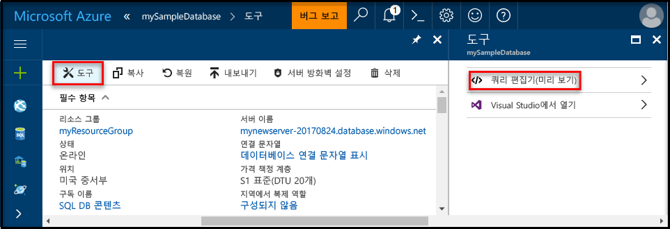
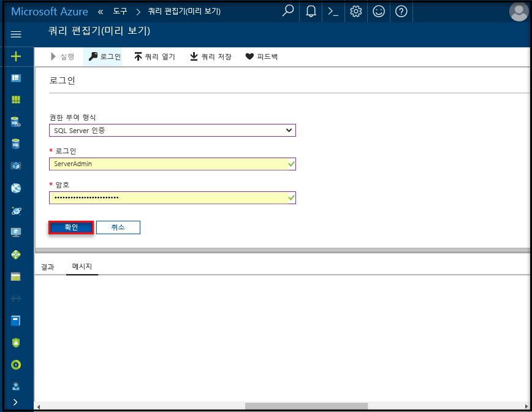

# <a name="create-an-azure-sql-database-in-the-azure-portal"></a>Azure Portal에서 Azure SQL Database 만들기

이 빠른 시작 자습서는 Azure에서 SQL Database를 만드는 방법을 설명합니다. Azure SQL Database는 클라우드에서 항상 사용 가능한 SQL Server Database를 실행하고 크기를 조정할 수 있는 “Database-as-a-Service” 제품입니다. 이 빠른 시작에서는 Azure Portal을 사용하여 SQL Database를 만들어서 시작하는 방법을 보여 줍니다.

Azure 구독이 아직 없는 경우 시작하기 전에 [체험](https://azure.microsoft.com/free/) 계정을 만듭니다.

## <a name="log-in-to-the-azure-portal"></a>Azure 포털에 로그인

[Azure 포털](https://portal.azure.com/)에 로그인합니다.

## <a name="create-a-sql-database"></a>SQL 데이터베이스 만들기

Azure SQL Database는 일련의 정의된 [계산 및 저장소 리소스](sql-database-service-tiers.md)를 사용하여 만들어집니다. 데이터베이스는 [Azure 리소스 그룹](../azure-resource-manager/resource-group-overview.md) 및 [Azure SQL Database 논리 서버](sql-database-features.md)에서 만들어집니다. 

다음 단계에 따라서 Adventure Works LT 샘플 데이터를 포함하는 SQL Database를 만듭니다. 

1. Azure Portal의 왼쪽 위에 있는 **새로 만들기** 단추를 클릭합니다.

2. **새로 만들기** 페이지에서 **데이터베이스**를 선택하고 **데이터베이스** 페이지에서 **SQL Database**를 선택합니다.

    

3. 위의 이미지에 표시된 대로 다음과 같은 정보를 사용하여 SQL Database 형식을 작성합니다.     
   - 데이터베이스 이름: **mySampleDatabase**
   - 리소스 그룹: **myResourceGroup**
   - 원본: **샘플(AdventureWorksLT)**

4. **서버**를 클릭하여 새 데이터베이스에 서버를 만들고 구성합니다. 전역적으로 고유한 서버 이름을 지정하는 **새 서버 형식**을 채우고 서버 관리자 로그인에 이름을 제공한 다음 사용자가 선택한 암호를 지정합니다. 

    
5. **선택**을 클릭합니다.

6. **가격 책정 계층**을 클릭하고 새 데이터베이스의 서비스 계층 및 성능 수준을 지정합니다. 이 빠른 시작의 경우 저장소의 **20 DTU** 및 **250**GB를 선택합니다.

    

7. **Apply**를 클릭합니다.  

8. **만들기**를 클릭하여 데이터베이스를 프로비전합니다. 프로비전하는 데 몇 분이 걸립니다. 

9. 도구 모음에서 **알림**을 클릭하여 배포 프로세스를 모니터링합니다.

    


## <a name="create-a-server-level-firewall-rule"></a>서버 수준 방화벽 규칙 만들기

방화벽 규칙을 만들어서 특정 IP 주소에 대한 방화벽을 열지 않으면 SQL Database 서비스는 외부 응용 프로그램 및 도구가 서버 또는 서버의 데이터베이스에 연결되지 않도록 방지하는 서버 수준에 방화벽을 만듭니다. 다음 단계에 따라 클라이언트의 IP 주소에 대한 [SQL Database 서버 수준 방화벽 규칙](sql-database-firewall-configure.md)을 만들고 IP 주소에만 SQL Database 방화벽을 통해 외부 연결을 사용하도록 설정합니다. 

1. 배포가 완료되면 왼쪽 메뉴에서 **SQL Database**를 클릭하고 **SQL Database** 페이지에서 데이터베이스를 클릭합니다. 데이터베이스에 대한 개요 페이지가 열리고 이 페이지에 정규화된 서버 이름(예: **mynewserver20170327.database.windows.net**)이 표시되며 추가 구성을 위한 옵션도 제공됩니다.

       

2. 이전 이미지에 표시된 대로 도구 모음에서 **서버 방화벽 설정**을 클릭합니다. SQL Database 서버에 대한 **방화벽 설정** 페이지가 열립니다. 

3. 도구 모음에서 **클라이언트 IP 추가**를 클릭하고 **저장**을 클릭합니다. 현재 IP 주소에 대한 서버 수준 방화벽 규칙이 생성됩니다.

       

4. **확인**을 클릭한 후 **방화벽 설정** 페이지를 닫습니다.

이제 SQL Server Management Studio 또는 이전에 만든 서버 관리자 계정을 사용하여 이 IP 주소에서 원하는 다른 도구를 사용하여 SQL Database 서버 및 해당 데이터베이스에 연결할 수 있습니다.

> [!NOTE]
> SQL Database는 포트 1433을 통해 통신합니다. 회사 네트워크 내에서 연결을 시도하는 경우 포트 1433을 통한 아웃바운드 트래픽이 네트워크 방화벽에서 허용되지 않을 수 있습니다. 이 경우 IT 부서에서 포트 1433을 열지 않으면 Azure SQL Database 서버에 연결할 수 없습니다
>

## <a name="query-the-sql-database"></a>SQL Database 쿼리

SQL Database를 만들 경우 **AdventureWorksLT** 샘플 데이터베이스를 사용하여 채웁니다(이 빠른 시작의 앞부분에 있는 UI 만들기에서 선택한 옵션 중 하나임). 이제 데이터를 쿼리하기 위해 Azure Portal 내에서 기본 제공 쿼리 도구를 사용해 보겠습니다. 

1. 데이터베이스에 대한 SQL Database 페이지의 도구 모음에서 **도구**를 클릭합니다. **도구** 페이지가 열립니다.

      

2. **쿼리 편집기(미리 보기)**를 클릭하고 **미리 보기 약관** 확인란을 클릭한 후 **확인**을 클릭합니다. 쿼리 편집기 페이지가 열립니다.

3. **로그인**을 클릭한 후 메시지가 표시되면 **SQL Server 인증**을 선택한 후 앞에서 만든 서버 관리자 로그인 및 암호를 제공합니다.

     

4. **확인**을 클릭하여 로그인합니다.

5. 인증된 후에 쿼리 편집기 창에서 다음 쿼리를 입력합니다.

   ```
   SELECT TOP 20 pc.Name as CategoryName, p.name as ProductName
   FROM SalesLT.ProductCategory pc
   JOIN SalesLT.Product p
   ON pc.productcategoryid = p.productcategoryid;
   ```

6. **실행**을 클릭한 후 **결과** 창에서 쿼리 결과를 검토합니다.

    

7. **쿼리 편집기** 페이지와 **도구** 페이지를 닫습니다.

## <a name="clean-up-resources"></a>리소스 정리

이 컬렉션의 다른 빠른 시작은 이 빠른 시작을 기반으로 합니다. 다음 빠른 시작을 사용하여 계속하려는 경우 이 빠른 시작에서 만든 리소스를 정리하지 않습니다. 계속하지 않으려는 경우 다음 단계에 따라 Azure Portal에서 이 빠른 시작에서 만든 모든 리소스를 삭제합니다.

1. Azure Portal의 왼쪽 메뉴에서 **리소스 그룹**과 **myResourceGroup**을 차례로 클릭합니다. 
2. 리소스 그룹 페이지에서 **삭제**를 클릭하고 텍스트 상자에 **myResourceGroup**을 입력한 후 **삭제**를 클릭합니다.

## <a name="next-steps"></a>다음 단계

- SQL Server Management Studio를 사용하여 연결 및 쿼리하려면 [SSMS를 사용하여 연결 및 쿼리](sql-database-connect-query-ssms.md)를 참조하세요.
- Visual Studio 코드를 사용하여 연결 및 쿼리하려면 [Visual Studio 코드를 사용하여 연결 및 쿼리](sql-database-connect-query-vscode.md)를 참조하세요.
- .NET을 사용하여 연결 및 쿼리하려면 [.NET을 사용하여 연결 및 쿼리](sql-database-connect-query-dotnet.md)를 참조하세요.
- PHP를 사용하여 연결 및 쿼리하려면 [PHP를 사용하여 연결 및 쿼리](sql-database-connect-query-php.md)를 참조하세요.
- Node.js를 사용하여 연결 및 쿼리하려면 [Node.js를 사용하여 연결 및 쿼리](sql-database-connect-query-nodejs.md)를 참조하세요.
- Java를 사용하여 연결 및 쿼리하려면 [Java를 사용하여 연결 및 쿼리](sql-database-connect-query-java.md)를 참조하세요.
- Python을 사용하여 연결 및 쿼리하려면 [Python을 사용하여 연결 및 쿼리](sql-database-connect-query-python.md)를 참조하세요.
- Ruby를 사용하여 연결 및 쿼리하려면 [Ruby를 사용하여 연결 및 쿼리](sql-database-connect-query-ruby.md)를 참조하세요.

