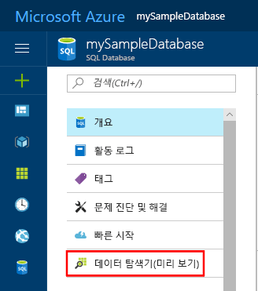

# <a name="create-an-azure-sql-database-in-the-azure-portal"></a>Azure Portal에서 Azure SQL Database 만들기

이 빠른 시작 자습서는 Azure에서 SQL Database를 만드는 방법을 설명합니다. Azure SQL Database는 클라우드에서 항상 사용 가능한 SQL Server Database를 실행하고 크기를 조정할 수 있는 “Database-as-a-Service” 제품입니다. 이 빠른 시작에서는 Azure Portal을 사용하여 SQL Database를 만들어서 시작하는 방법을 보여 줍니다.

Azure 구독이 아직 없는 경우 시작하기 전에 [체험](https://azure.microsoft.com/free/) 계정을 만듭니다.

## <a name="log-in-to-the-azure-portal"></a>Azure Portal에 로그인

[Azure Portal](https://portal.azure.com/)에 로그인합니다.

## <a name="create-a-sql-database"></a>SQL 데이터베이스 만들기

Azure SQL Database는 일련의 정의된 [계산 및 저장소 리소스](sql-database-service-tiers.md)를 사용하여 만들어집니다. 데이터베이스는 [Azure 리소스 그룹](../azure-resource-manager/resource-group-overview.md) 및 [Azure SQL Database 논리 서버](sql-database-features.md)에서 만들어집니다.

다음 단계에 따라서 Adventure Works LT 샘플 데이터를 포함하는 SQL Database를 만듭니다.

1. Azure Portal의 왼쪽 위에 있는 **새로 만들기** 단추를 클릭합니다.

2. **새로 만들기** 페이지에서 **데이터베이스**를 선택하고 **새로 만들기** 페이지의 **SQL Database** 아래에서 **만들기**를 선택합니다.

   

3. 위의 이미지에 표시된 대로 다음과 같은 정보를 사용하여 SQL Database 형식을 작성합니다.   

   | 설정       | 제안 값 | 설명 |
   | ------------ | ------------------ | ------------------------------------------------- |
   | **데이터베이스 이름** | mySampleDatabase | 유효한 데이터베이스 이름은 [데이터베이스 식별자](https://docs.microsoft.com/sql/relational-databases/databases/database-identifiers)를 참조하세요. |
   | **구독** | 사용자의 구독  | 구독에 대한 자세한 내용은 [구독](https://account.windowsazure.com/Subscriptions)을 참조하세요. |
   | **리소스 그룹**  | myResourceGroup | 유효한 리소스 그룹 이름은 [명명 규칙 및 제한 사항](https://docs.microsoft.com/azure/architecture/best-practices/naming-conventions)을 참조하세요. |
   | **원본 선택** | 샘플(AdventureWorksLT) | AdventureWorksLT 스키마 및 데이터를 새 데이터베이스에 로드 |

   > [!IMPORTANT]
   > 이 빠른 시작의 나머지 부분에 사용되기 때문에 이 양식에서 샘플 데이터베이스를 선택해야 합니다.
   >

4. **서버** 아래에서 **필요한 설정 구성**을 클릭하고, 다음 이미지에 표시된 대로 다음과 같은 정보를 사용하여 SQL Server(논리 서버) 양식을 작성합니다.   

   | 설정       | 제안 값 | 설명 |
   | ------------ | ------------------ | ------------------------------------------------- |
   | **서버 이름** | 전역적으로 고유한 이름 | 유효한 서버 이름은 [명명 규칙 및 제한 사항](https://docs.microsoft.com/azure/architecture/best-practices/naming-conventions)을 참조하세요. |
   | **서버 관리자 로그인** | 모든 유효한 이름 | 유효한 로그인 이름은 [데이터베이스 식별자](https://docs.microsoft.com/sql/relational-databases/databases/database-identifiers)를 참조하세요. |
   | **암호** | 유효한 암호 | 암호는 8자 이상이어야 하며 대문자, 소문자, 숫자 및 영숫자가 아닌 문자 범주 중 세 가지 범주의 문자를 포함해야 합니다. |
   | **구독** | 사용자의 구독 | 구독에 대한 자세한 내용은 [구독](https://account.windowsazure.com/Subscriptions)을 참조하세요. |
   | **리소스 그룹** | myResourceGroup | 유효한 리소스 그룹 이름은 [명명 규칙 및 제한 사항](https://docs.microsoft.com/azure/architecture/best-practices/naming-conventions)을 참조하세요. |
   | **위치**: | 모든 유효한 위치 | 지역에 대한 자세한 내용은 [Azure 지역](https://azure.microsoft.com/regions/)을 참조하세요. |

   > [!IMPORTANT]
   > 여기에 지정한 서버 관리자 로그인 및 암호는 이 빠른 시작의 뒷부분에 나오는 서버 및 데이터베이스에 로그인해야 합니다. 나중에 사용하기 위해 이 정보를 기억하거나 기록합니다.
   >  

   

5. 양식을 완료하는 경우 **선택**을 클릭합니다.

6. **가격 책정 계층**을 클릭하여 서비스 계층, DTU 수 및 저장소 크기를 지정합니다. 각 서비스 계층에 대해 사용할 수 있는 DTU 수 및 저장소 크기에 대한 옵션을 살펴봅니다.

   > [!IMPORTANT]
   > \* 포함된 저장소보다 큰 저장소 크기는 미리 보기로 있으며 추가 비용이 적용됩니다. 자세한 내용은 [SQL Database 가격](https://azure.microsoft.com/pricing/details/sql-database/)을 참조하세요.
   >
   >\* 프리미엄 계층의 경우 현재 미국 동부 2, 미국 서부, 미국 버지니아 주 정부, 유럽 서부, 독일 중부, 동남 아시아, 일본 동부, 오스트레일리아 동부, 캐나다 중부 및 캐나다 동부 지역에서 1TB 이상의 저장소를 사용할 수 있습니다. [P11-P15 현재 제한 사항](sql-database-resource-limits.md#single-database-limitations-of-p11-and-p15-when-the-maximum-size-greater-than-1-tb)을 참조하세요.  
   >

7. 이 빠른 시작 자습서에서는 **표준** 서비스 계층을 선택한 다음 슬라이더를 사용하여 **100DTU(S3)** 및 **400**GB 저장소를 선택합니다.

   

8. **추가 기능 저장소** 옵션을 사용하려면 미리 보기 약관에 동의합니다.

   > [!IMPORTANT]
   > \* 포함된 저장소보다 큰 저장소 크기는 미리 보기로 있으며 추가 비용이 적용됩니다. 자세한 내용은 [SQL Database 가격](https://azure.microsoft.com/pricing/details/sql-database/)을 참조하세요.
   >
   >\* 프리미엄 계층의 경우 현재 미국 동부 2, 미국 서부, 미국 버지니아 주 정부, 유럽 서부, 독일 중부, 동남 아시아, 일본 동부, 오스트레일리아 동부, 캐나다 중부 및 캐나다 동부 지역에서 1TB 이상의 저장소를 사용할 수 있습니다. [P11-P15 현재 제한 사항](sql-database-resource-limits.md#single-database-limitations-of-p11-and-p15-when-the-maximum-size-greater-than-1-tb)을 참조하세요.  
   >

9. 서버 계층, DTU 수 및 저장소 크기를 선택한 후에 **적용**을 클릭합니다.  

10. 이제 SQL Database 양식을 완료했으므로 **만들기**를 클릭하여 데이터베이스를 프로비전합니다. 프로비전하는 데 몇 분이 걸립니다.

11. 도구 모음에서 **알림**을 클릭하여 배포 프로세스를 모니터링합니다.

     

## <a name="create-a-server-level-firewall-rule"></a>서버 수준 방화벽 규칙 만들기

방화벽 규칙을 만들어서 특정 IP 주소에 대한 방화벽을 열지 않으면 SQL Database 서비스는 외부 응용 프로그램 및 도구가 서버 또는 서버의 데이터베이스에 연결되지 않도록 방지하는 서버 수준에 방화벽을 만듭니다. 다음 단계에 따라 클라이언트의 IP 주소에 대한 [SQL Database 서버 수준 방화벽 규칙](sql-database-firewall-configure.md)을 만들고 IP 주소에만 SQL Database 방화벽을 통해 외부 연결을 사용하도록 설정합니다.

> [!NOTE]
> SQL Database는 포트 1433을 통해 통신합니다. 회사 네트워크 내에서 연결을 시도하는 경우 포트 1433을 통한 아웃바운드 트래픽이 네트워크 방화벽에서 허용되지 않을 수 있습니다. 이 경우 IT 부서에서 포트 1433을 열지 않으면 Azure SQL Database 서버에 연결할 수 없습니다.
>

1. 배포가 완료되면 왼쪽 메뉴에서 **SQL Database**를 클릭한 다음 **SQL Database** 페이지에서 **mySampleDatabase**를 클릭합니다. 데이터베이스에 대한 개요 페이지가 열려 정규화된 서버 이름(예: **mynewserver-20170824.database.windows.net**)을 표시하고 추가 구성을 위한 옵션을 제공합니다.

2. 후속 빠른 시작에서 서버 및 해당 데이터베이스에 연결하는 데 사용하기 위해 이 정규화된 서버 이름을 복사합니다.

   

3. 이전 이미지에 표시된 대로 도구 모음에서 **서버 방화벽 설정**을 클릭합니다. SQL Database 서버에 대한 **방화벽 설정** 페이지가 열립니다.

   

4. 도구 모음에서 **클라이언트 IP 추가**를 클릭하여 현재 IP 주소를 새 방화벽 규칙에 추가합니다. 방화벽 규칙은 단일 IP 주소 또는 IP 주소의 범위에 1433 포트를 열 수 있습니다.

5. **저장**을 클릭합니다. 논리 서버의 1433 포트를 여는 현재 IP 주소에 서버 수준 방화벽 규칙이 생성됩니다.

6. **확인**을 클릭한 후 **방화벽 설정** 페이지를 닫습니다.

이제 SQL Server Management Studio 또는 이전에 만든 서버 관리자 계정을 사용하여 이 IP 주소에서 원하는 다른 도구를 사용하여 SQL Database 서버 및 해당 데이터베이스에 연결할 수 있습니다.

> [!IMPORTANT]
> SQL Database 방화벽을 통한 액세스는 기본적으로 모든 Azure 서비스에 대해 사용됩니다. 이 페이지에서 **끄기**를 클릭하여 모든 Azure 서비스에 대해 사용하지 않도록 설정합니다.
>

## <a name="query-the-sql-database"></a>SQL Database 쿼리

이제 Azure에서 샘플 데이터베이스를 만들었으므로 Azure Portal 내에서 기본 제공 쿼리 도구를 사용하여 데이터베이스에 연결하고 데이터를 쿼리할 수 있는지 확인해 보겠습니다.

1. 데이터베이스의 SQL Database 페이지에서 왼쪽 메뉴에 있는 **데이터 탐색기(미리 보기)**를 찾아 클릭합니다.

   

2. **로그인**을 클릭하고 로그인 정보를 검토한 다음 **확인**을 클릭하여 이전에 만든 서버 관리자 로그인 및 암호로 SQL 서버 인증을 통해 로그인합니다.

   

3. **확인**을 클릭하여 로그인합니다.

4. **ServerAdmin**으로 인증된 후에 쿼리 편집기 창에서 다음 쿼리를 입력합니다.

   ```sql
   SELECT TOP 20 pc.Name as CategoryName, p.name as ProductName
   FROM SalesLT.ProductCategory pc
   JOIN SalesLT.Product p
   ON pc.productcategoryid = p.productcategoryid;
   ```

5. **실행**을 클릭한 후 **결과** 창에서 쿼리 결과를 검토합니다.

   

6. **데이터 탐색기** 페이지를 닫고 **확인**을 클릭하여 저장하지 않은 편집 내용을 삭제합니다.

## <a name="clean-up-resources"></a>리소스 정리

[다음 단계](#next-steps)로 이동하여 다양한 방법으로 데이터베이스에 연결하고 쿼리하는 방법을 알아보려면 이러한 리소스를 저장합니다. 그러나 이 빠른 시작에서 만든 리소스를 삭제하려면 다음 단계를 사용합니다.


1. Azure Portal의 왼쪽 메뉴에서 **리소스 그룹**과 **myResourceGroup**을 차례로 클릭합니다.
2. 리소스 그룹 페이지에서 **삭제**를 클릭하고 텍스트 상자에 **myResourceGroup**을 입력한 후 **삭제**를 클릭합니다.

## <a name="next-steps"></a>다음 단계

이제 데이터베이스가 생겼으니 자주 사용하는 도구를 사용하여 데이터베이스에 연결하고 쿼리할 수 있습니다. 아래에서 도구를 선택하여 자세한 내용을 알아보세요.

- [SQL Server Management Studio](sql-database-connect-query-ssms.md)
- [Contact.java](sql-database-connect-query-vscode.md)
- [.NET](sql-database-connect-query-dotnet.md)
- [PHP](sql-database-connect-query-php.md)
- [Node.js](sql-database-connect-query-nodejs.md)
- [Java](sql-database-connect-query-java.md)
- [Python](sql-database-connect-query-python.md)
- [Ruby](sql-database-connect-query-ruby.md)
