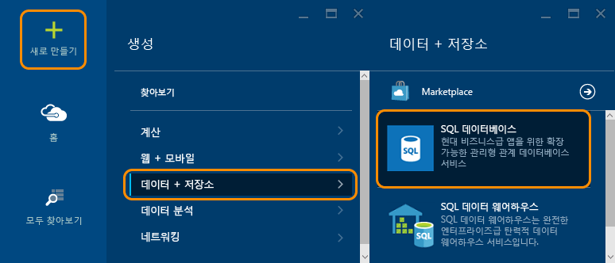
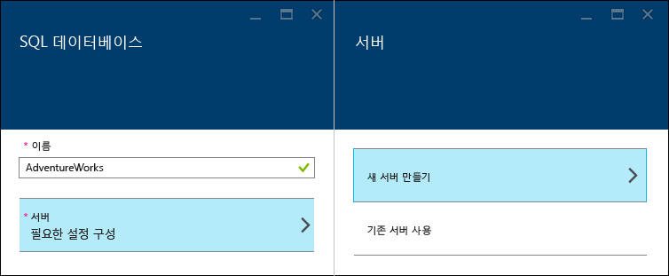
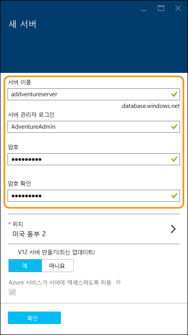
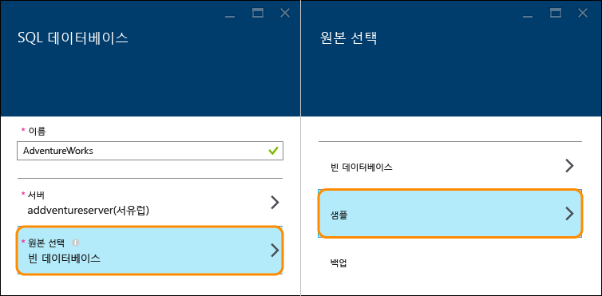
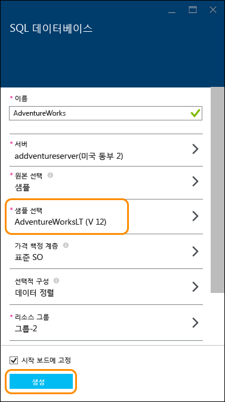
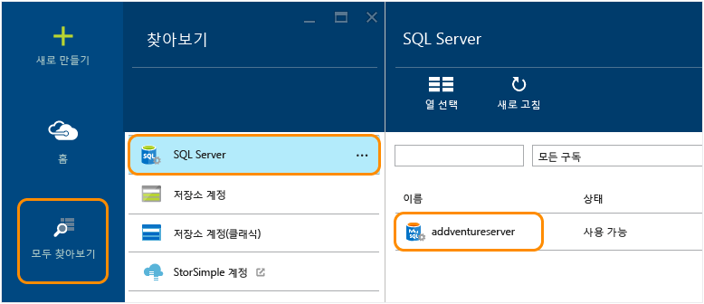
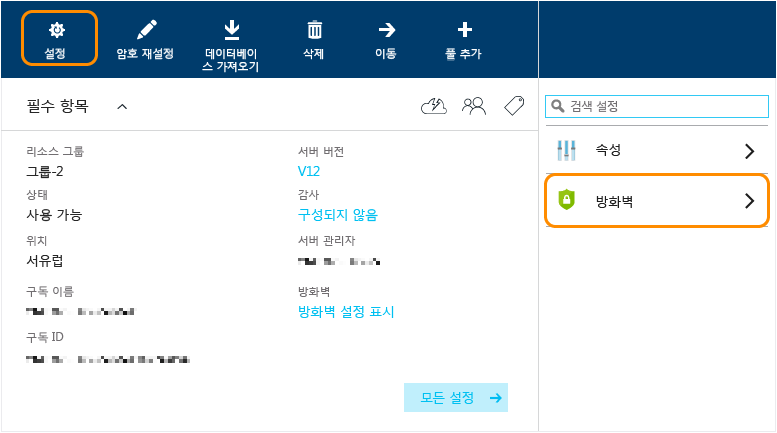
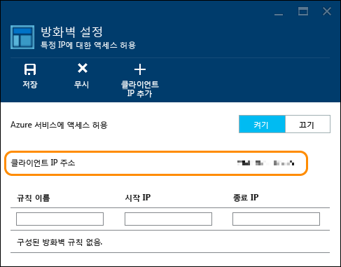
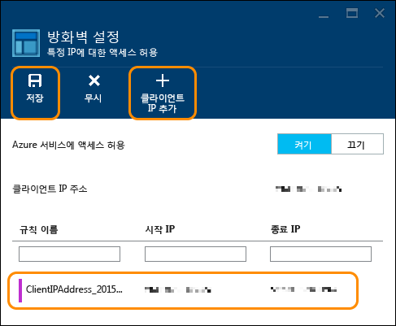

<properties
	pageTitle="SQL 데이터베이스 자습서: SQL 데이터베이스 만들기 | Microsoft Azure"
	description="샘플 데이터 및 Microsoft의 관계형 데이터베이스 관리 시스템(RDBMS)을 사용하여 Azure 포털에서 몇 분 만에 첫 번째 SQL 데이터베이스를 만듭니다."
	keywords="sql 데이터베이스 자습서, sql 데이터베이스 만들기"	
	services="sql-database"
	documentationCenter=""
	authors="jeffgoll"
	manager="jeffreyg"
	editor="cgronlun"/>

<tags
	ms.service="sql-database"
	ms.workload="data-management"
	ms.tgt_pltfrm="na"
	ms.devlang="na"
	ms.topic="hero-article"
	ms.date="10/09/2015"
	ms.author="jeffreyg"/>

# SQL 데이터베이스 자습서: 샘플 데이터 및 Azure 포털을 사용하여 빠르게 SQL 데이터베이스 만들기

**단일 데이터베이스**

> [AZURE.SELECTOR]
- [Azure portal](sql-database-get-started.md)
- [C#](sql-database-get-started-csharp.md)
- [PowerShell](sql-database-get-started-powershell.md)

이 SQL 데이터베이스 자습서에서는 Azure Preview 포털에서 샘플 데이터로 몇 분 만에 첫 번째 SQL 데이터베이스를 만드는 방법을 보여 줍니다. 이 문서에서 배울 내용은 다음과 같습니다.

- 만든 데이터베이스를 호스팅할 서버를 만든 후 방화벽 규칙을 설정합니다.
- 데이터를 재생할 수 있는 AdventureWorks 샘플의 SQL 데이터베이스를 만듭니다.

시작하려면 Azure 계정 및 구독이 필요합니다. 없는 경우 지금 [무료 평가판](http://azure.microsoft.com/pricing/free-trial/)에 등록하세요.

> [AZURE.NOTE]이 SQL 데이터베이스 자습서에서는 클라우드, Azure SQL 데이터베이스에서 Microsoft의 관계형 데이터베이스 관리 서비스를 사용하여 데이터베이스를 설정을 다룹니다. 다른 옵션은 Azure 가상 컴퓨터에서 SQL Server를 실행합니다. 빠른 비교를 위한 [Azure VM에서 Azure SQL 데이터베이스 및 SQL Server 이해](data-management-azure-sql-database-and-sql-server-iaas.md)를 참조하거나 [SQL Server 가상 컴퓨터 프로비전](virtual-machines-provision-sql-server.md)을 참조하여 가상 컴퓨터를 시작합니다.

## 1단계: 로그인 및 SQL 데이터베이스 설정 시작
1. [Azure Preview 포털](http://portal.azure.com/)에 로그인합니다.
2. **새로 만들기** > **데이터 + 저장소** > **SQL 데이터베이스**를 클릭합니다.

	
	
	표시되는 **SQL 데이터베이스** 설정 블레이드에서 서버 및 데이터베이스 세부 정보를 설정합니다.

	

## 2단계: 서버 설정 선택
Azure에서 SQL 데이터베이스는 데이터베이스 서버에 있습니다. 서버는 여러 데이터베이스를 호스팅할 수 있습니다. 데이터베이스를 설정하면 데이터베이스를 호스팅할 서버를 만들고 설정할 수 있으며 이전에 만든 서버를 사용할 수도 있습니다. 새 서버를 설정합니다.

1. 데이터베이스의 **이름**을 입력합니다(여기서는 **AdventureWorks** 사용). 다른 데이터베이스 설정에 대한 내용은 나중에 살펴보겠습니다.
2. **서버** 아래에서 **필요한 설정 구성**을 클릭한 후 **새 서버 만들기**를 클릭합니다.

	

3. **새 서버** 블레이드에 Azure 전체에서 고유하고 기억하기 쉬운 **서버 이름**을 입력합니다. 이 이름은 나중에 데이터베이스에 연결하고 작업할 때 필요합니다.
4. 기억하기 쉬운 **서버 관리자 로그인**을 입력합니다(여기서는 **AdventureAdmin** 사용). 그런 다음 안전한 **암호**를 입력하고 **암호 확인**에 다시 한 번 입력합니다.

	

	 **V12 서버 만들기(최신 업데이트)** 설정을 **예**로 그대로 유지하여 최신 기능을 사용하도록 합니다. **위치**는 서버를 만들 데이터 센터 지역을 결정합니다.

	>[AZURE.TIP]데이터베이스를 사용할 응용 프로그램과 가까운 위치에 데이터베이스 서버를 만듭니다. 위치를 변경하려면 **위치**를 클릭하고 다른 위치를 선택한 후 **확인**을 클릭하면 됩니다.

5. **확인**을 클릭하여 **SQL 데이터베이스** 블레이드로 돌아갑니다.

데이터베이스와 서버가 아직 생성되지 않았습니다. 다음 단계에서 AdventureWorks 샘플에서 데이터베이스를 만들고 설정을 확인하도록 선택한 후에 생성됩니다.

## 3단계: SQL 데이터베이스 설정 및 만들기
1. **SQL 데이터베이스** 블레이드에서 **소스 선택**을 클릭한 후 **샘플**을 클릭합니다. 

	

2. **SQL 데이터베이스** 블레이드로 돌아갑니다. 여기서 **샘플 선택**에 **AdventureWorks LT [V12]**가 표시됩니다. **만들기**를 클릭하여 서버 및 데이터베이스 생성을 시작합니다.

	

	>[AZURE.NOTE]빠른 방법 설명을 위해 **가격 책정 계층**, **데이터 정렬** 및 **리소스 그룹**에 대한 설정을 변경하지 않았습니다. 언제든지 가동 중지 없이, 데이터베이스의 가격 책정 계층을 변경하고 확장 및 축소할 수 있습니다. 자세한 내용은 [SQL 데이터베이스 가격](http://azure.microsoft.com/pricing/details/sql-database/) 및 [SQL 데이터베이스 가격 책정 계층](sql-database-service-tiers.md)을 참조하세요. 여기에서 설정한 후 데이터베이스의 데이터 정렬은 변경할 수 없습니다. 데이터 정렬에 대한 자세한 내용은 [데이터 정렬 및 유니코드 지원](https://msdn.microsoft.com/library/ms143726.aspx)을 참조하세요. Azure 리소스 그룹에 대한 자세한 내용은 [Azure 리소스 관리자 개요](resource-group-overview.md)를 참조하세요.

Azure 시작 보드로 돌아갑니다. 여기에는 데이터베이스가 생성되어 온라인 상태가 될 때까지 진행 상태가 타일로 표시됩니다. **모두 찾아보기**를 클릭한 후 **SQL 데이터베이스**를 클릭하여 데이터베이스가 온라인 상태인 것도 확인할 수 있습니다.
	
축하합니다. 이제 SQL 데이터베이스가 클라우드에서 실행됩니다. 이제 거의 끝났습니다. 한 가지 중요한 단계가 남아 있습니다. 데이터베이스에 연결할 수 있도록 데이터베이스 서버에서 규칙을 만들어야 합니다.

## 4단계: 방화벽 구성

서버에서 클라이언트 컴퓨터의 IP 주소로부터 연결을 허용하는 방화벽 규칙을 설정해야 데이터베이스로 작업할 수 있습니다. 이를 통해 연결이 가능한지 확인할 수 있을 뿐만 아니라 Azure에서 SQL 서버에 대한 기타 세부 정보를 얻을 수 있는 영역을 볼 수 있는 좋은 방법입니다.

1. **모두 찾아보기**를 클릭하고 아래로 스크롤하여 **SQL 서버**를 클릭한 후 **SQL 서버** 목록에서 이전에 만든 서버의 이름을 클릭합니다.

	

	
3. 오른쪽에 표시되는 데이터베이스 속성 블레이드에서 **설정**을 클릭한 후 목록에서 **방화벽**을 클릭합니다.

	

	**방화벽 설정**에 현재 **클라이언트 IP 주소**가 표시됩니다.

	

4. **클라이언트 IP 추가**를 클릭하여 Azure에서 해당 IP 주소에 대한 규칙을 생성하도록 한 후 **저장**을 클릭합니다.

	

	>[AZURE.IMPORTANT]클라이언트 IP 주소가 수시로 변경될 수 있으면 새 방화벽 규칙을 만들 때까지 서버에 액세스하지 못할 수 있습니다. [Bing](http://www.bing.com/search?q=my%20ip%20address)을 사용하여 IP 주소를 확인한 후 단일 IP 주소 또는 IP 주소 범위를 추가할 수 있습니다. 자세한 내용은 [방화벽 설정 구성 방법](sql-database-configure-firewall-settings.md)을 참조하세요.

## 다음 단계
이제 이 SQL 데이터베이스 자습서를 완료하고 일부 샘플 데이터가 포함된 데이터베이스를 만들었으므로 원하는 도구를 사용하여 탐색할 수 있습니다.

- Transact-SQL 및 SQL Server Management Studio가 익숙한 경우 [SSMS으로 SQL 데이터베이스 연결 및 쿼리](sql-database-connect-query-ssms.md) 방법에 대해 알아보세요.

- Excel을 알고 있는 경우 [Excel로 SQL 데이터베이스에 연결](sql-database-connect-excel.md)하는 방법에 대해 알아보세요.

- 코딩을 시작할 준비가 되었으면 [C#으로 SQL 데이터베이스 연결 및 쿼리](sql-database-connect-query.md) 및 [.NET(C#)에서 SQL 데이터베이스 사용](sql-database-develop-dotnet-simple.md)을 참조하세요. C# 외에도 Node.js, Python, Ruby, Java, PHP 및 C++ 샘플 및 방법에 대한 내용은 [SQL 데이터베이스에 대한 빠른 시작 코드 샘플](sql-database-develop-quick-start-client-code-samples.md)을 참조하세요.

- 온-프레미스 SQL 서버 데이터베이스를 Azure로 이동하려면 [Azure SQL 데이터베이스로 데이터베이스 마이그레이션](sql-database-cloud-migrate.md)에서 자세히 알아보세요.

<!---HONumber=Nov15_HO4-->