# SQL Database 자습서: Azure Portal을 사용하여 빠르게 SQL Database 만들기
> [!div class="op_single_selector"]
> * [Azure 포털](sql-database-get-started.md)
> * [C#](sql-database-get-started-csharp.md)
> * [PowerShell](sql-database-get-started-powershell.md)
> 
> 

이 자습서에서는 Azure 포털을 다음에 사용하는 방법에 대해 알아봅니다.

* 샘플 데이터를 사용하여 Azure SQL 데이터베이스를 만듭니다.
* 단일 IP 주소 또는 IP 주소의 범위에 서버 수준 방화벽 규칙을 만듭니다.

[C#](sql-database-get-started-csharp.md) 또는 [PowerShell](sql-database-get-started-powershell.md)을 사용하여 이러한 동일한 태스크를 수행할 수 있습니다.

[!INCLUDE [로그인](../../includes/azure-getting-started-portal-login.md)]

## 첫 Azure SQL 데이터베이스 만들기
1. 연결되어 있지 않은 경우 [Azure Portal](http://portal.azure.com)에 연결합니다.
2. **새로 만들기**를 클릭하고 **데이터 + 저장소**를 클릭한 다음 **SQL Database**를 찾습니다.
   
    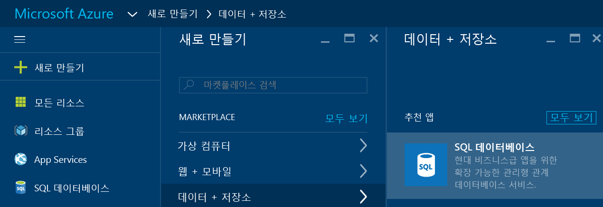
3. **SQL Database**를 클릭하여 SQL Database 블레이드를 엽니다. 이 블레이드의 콘텐츠는 구독 및 기존 개체(예: 기존 서버)의 수에 따라 달라집니다.
   
    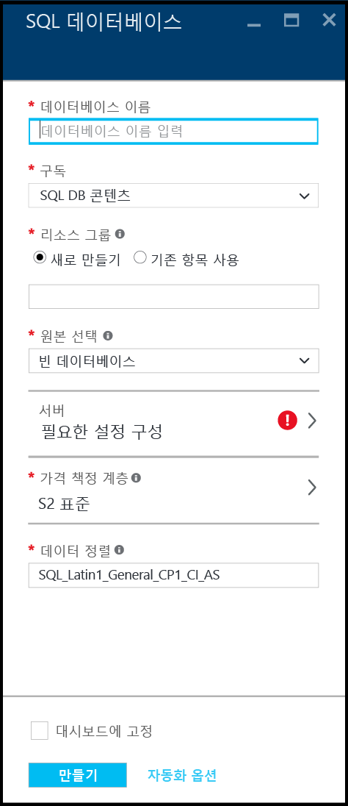
4. **데이터베이스 이름** 텍스트 상자에 첫 번째 데이터베이스에 대한 이름(예: "my-database")을 입력합니다. 녹색 확인 표시가 유효한 이름을 제공한 것을 나타냅니다.
   
    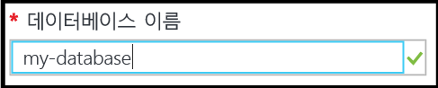
5. 구독이 여러 개 있는 경우 구독을 선택합니다.
6. **리소스 그룹** 아래에서 **새로 만들기**를 클릭하고 첫 번째 리소스 그룹의 이름(예: "my-resource-group")을 제공합니다. 녹색 확인 표시가 유효한 이름을 제공한 것을 나타냅니다.
   
    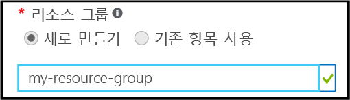
7. **원본 선택** 아래에서 **샘플**을 클릭한 다음 **샘플 선택** 아래에서 **AdventureWorksLT[V12]**를 클릭합니다.
   
    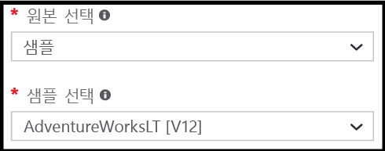
8. **서버** 아래에서 **필요한 설정 구성**을 클릭합니다.
   
    
9. 서버 블레이드에서 **새 서버 만들기**를 클릭합니다. Azure SQL 데이터베이스가 서버 개체 내에 만들어지며, 여기서 서버는 새 서버일 수도 있고 기존 서버일 수도 있습니다.
   
    
10. **새 서버** 블레이드를 검토하여 새 서버에 제공해야 하는 정보를 이해합니다.
    
    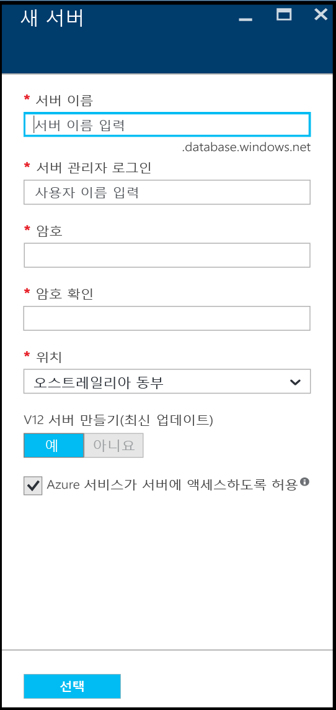
11. **서버 이름** 텍스트 상자에 첫 번째 서버의 이름(예: "my-new-server-object")을 제공합니다. 녹색 확인 표시가 유효한 이름을 제공한 것을 나타냅니다.
    
    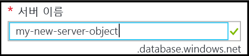
12. **서버 관리자 로그인** 아래에서 이 서버의 관리자 로그인을 위한 사용자 이름(예: "my-admin-account")을 제공합니다. 이 로그인은 서버 보안 주체 로그인으로 알려져 있습니다. 녹색 확인 표시가 유효한 이름을 제공한 것을 나타냅니다.
    
    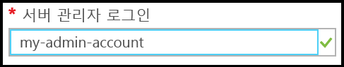
13. **암호** 및 **암호 확인** 아래에서 서버 보안 주체 로그인 계정에 대한 암호(예: "p@ssw0rd1")를 제공합니다. 녹색 확인 표시가 유효한 암호를 제공한 것을 나타냅니다.
    
    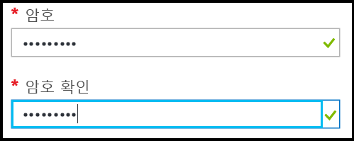
14. **위치** 아래에서 위치에 적합한 데이터 센터(예: "오스트레일리아 동부")를 선택합니다.
    
    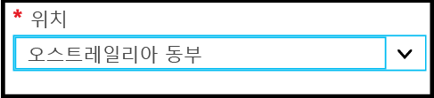
15. **V12 서버 만들기(최신 업데이트) 아래에서 Azure SQL Server의 현재 버전을 만드는 옵션만 있는 것을 확인할 수 있습니다.
    
    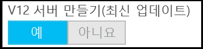
16. 기본적으로 **Azure 서비스가 서버에 액세스할 수 있도록 허용** 확인란이 선택되어 있으며 여기서는 이를 변경할 수 없습니다. 이는 고급 속성입니다. 대부분의 시나리오에서 필요하지는 않지만 이 서버 개체에 대한 서버 방화벽 설정에서 이 설정을 변경할 수 있습니다.
    
    
17. 새 서버 블레이드에서 선택 항목을 검토한 다음 **선택**을 클릭하여 새 데이터베이스에 대해 이 서버를 선택합니다.
    
    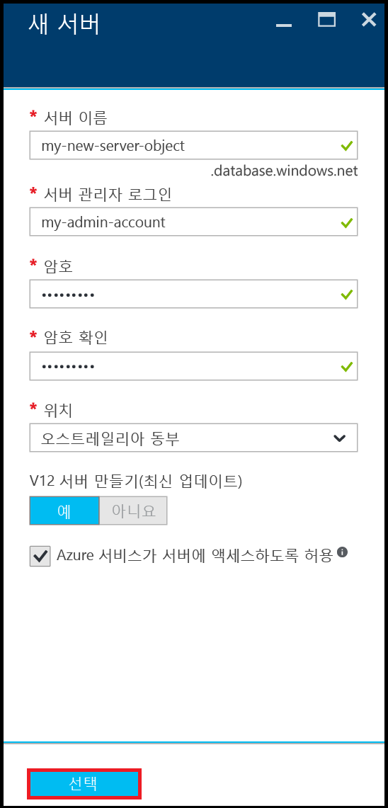
18. SQL Database 블레이드의 **가격 책정 계층** 아래에서 **S2 표준**을 선택한 다음 **기본**을 클릭하여 첫 번째 데이터베이스에 대한 가장 저렴한 가격 책정 계층을 선택합니다. 나중에 언제든지 가격 책정 계층을 변경할 수 있습니다.
    
    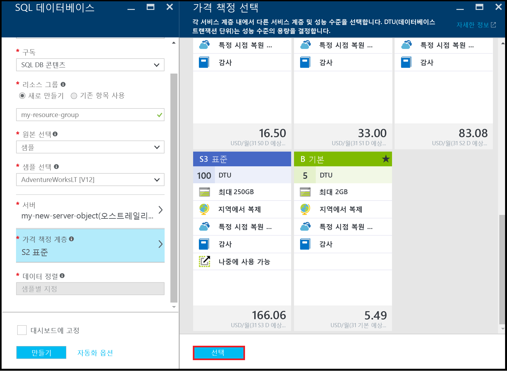
19. SQL Database 블레이드에서 선택 항목을 검토한 다음 **만들기**를 클릭하여 첫 번째 서버 및 데이터베이스르 만듭니다. 사용자가 제공한 값에 대한 유효성이 검사되고 배포가 시작됩니다.
    
    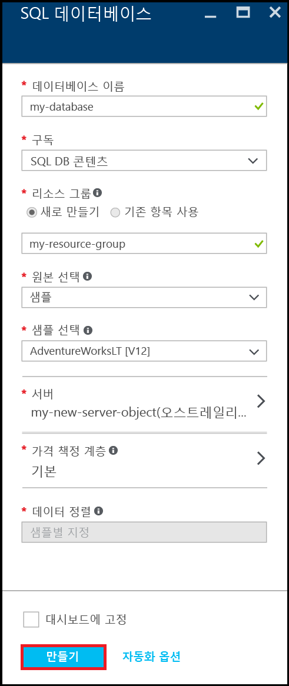
20. 포털 도구 모음에서 **알림** 항목을 클릭하여 배포의 상태를 확인합니다.
    
    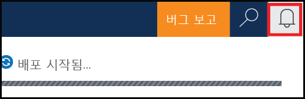

> [!IMPORTANT]
> 배포가 완료되면 Azure에 새 Azure SQL 서버 및 데이터베이스가 만들어집니다. Azure 외부에서 연결에 대한 SQL Database 방화벽을 열기 위한 서버 방화벽 규칙을 만들 때까지 SQL Server 도구를 사용하여 새 서버 또는 데이터베이스에 연결할 수 없습니다.
> 
> 

[!INCLUDE [서버 방화벽 규칙 만들기](../../includes/sql-database-create-new-server-firewall-portal.md)]

## 다음 단계
이제 이 SQL Database 자습서를 완료하고 일부 샘플 데이터가 포함된 데이터베이스를 만들었으므로 원하는 도구를 사용하여 탐색할 수 있습니다.

* Transact-SQL 및 SSMS(SQL Server Management Studio)에 익숙한 경우 [SSMS으로 SQL Database 연결 및 쿼리](sql-database-connect-query-ssms.md)하는 방법에 대해 알아보세요.
* Excel을 알고 있는 경우 [Azure에서 Excel로 SQL Database에 연결](sql-database-connect-excel.md)하는 방법에 대해 알아보세요.
* 코딩을 시작할 준비가 되었다면 [SQL Database 및 SQL Server에 대한 연결 라이브러리](sql-database-libraries.md)에서 프로그래밍 언어를 선택합니다.
* 온-프레미스 SQL Server 데이터베이스를 Azure로 이동하려면 [Azure SQL Database로 데이터베이스 마이그레이션](sql-database-cloud-migrate.md)를 확인하여 자세히 알아보세요.
* BCP 명령줄 도구를 사용하여 CSV 파일에서 새 테이블로 일부 데이터를 로드하려는 경우 [BCP를 사용하여 CSV 파일에서 SQL Database로 데이터 로드](sql-database-load-from-csv-with-bcp.md)를 참조하세요.
* Azure SQL Database 보안에 대해 알아보기 시작하려면 [보안 시작](sql-database-get-started-security.md)을 참조하세요.

## 추가 리소스
[SQL 데이터베이스 정의](sql-database-technical-overview.md)

<!---HONumber=AcomDC_0914_2016-->