# <a name="quick-start-tutorial-your-first-azure-sql-database"></a>빠른 시작 자습서: 첫 번째 Azure SQL Database

이 빠른 시작 자습서에서 다음에 대해 알아봅니다.

* [새로운 논리 서버 만들기](sql-database-get-started.md#create-a-new-logical-sql-server) 
* [논리 서버 속성 보기](sql-database-get-started.md#view-the-logical-server-properties) 
* [서버 수준 방화벽 규칙 만들기](sql-database-get-started.md#create-a-server-level-firewall-rule) 
* [SSMS로 서버에 연결](sql-database-get-started.md#connect-to-the-server-with-ssms) 
* [샘플 데이터로 데이터베이스 만들기](sql-database-get-started.md#create-a-database-with-sample-data) 
* [데이터베이스 속성 보기](sql-database-get-started.md#view-the-database-properties) 
* [Azure Portal에서 데이터베이스 쿼리](sql-database-get-started.md#query-the-database-in-the-azure-portal) 
* [SSMS로 데이터베이스 연결 및 쿼리](sql-database-get-started.md#connect-and-query-the-database-with-ssms) 
* [SSMS로 빈 데이터베이스 만들기](sql-database-get-started.md#create-a-blank-database-with-ssms) 
* [연결 문제 해결](sql-database-get-started.md#troubleshoot-connectivity) 
* [데이터베이스 삭제](sql-database-get-started.md#delete-a-single-database) 


이 빠른 시작 자습서를 완료하면 샘플 데이터베이스와 빈 데이터베이스가 Azure 리소스 그룹에서 실행되며 논리 서버에 연결됩니다. 또한 twp 서버 수준 보안 주체가 지정된 두 개의 IP 주소에서 서버에 로그인할 수 있도록 구성된 서버 수준 방화벽 규칙을 갖게 됩니다. 

**예상 시간**: 이 자습서의 경우 약 30분 소요됩니다(이미 필수 조건을 충족한다고 가정).

> [!TIP]
> [C#](sql-database-get-started-csharp.md) 또는 [PowerShell](sql-database-get-started-powershell.md)을 사용하여 이러한 동일한 태스크를 수행할 수 있습니다.
>

## <a name="prerequisites"></a>필수 조건

* Azure 계정이 필요합니다. [무료 Azure 계정을 열거나](/pricing/free-trial/?WT.mc_id=A261C142F) 또는 [Visual Studio 구독자 혜택을 활성화](/pricing/member-offers/msdn-benefits-details/?WT.mc_id=A261C142F)할 수 있습니다. 

* 구독 소유자 또는 참가자 역할의 구성원인 계정을 사용하여 Azure Portal에 연결할 수 있어야 합니다. RBAC(역할 기반 액세스 제어)에 대한 자세한 내용은 [Azure Portal에서 액세스 관리 시작](../active-directory/role-based-access-control-what-is.md)을 참조하세요.

> [!NOTE]
> 이 빠른 시작 자습서에서는 [SQL Database 서버 개요](sql-database-server-overview.md), [SQL Database 개요](sql-database-overview.md) 및 [Azure SQL Database 방화벽 규칙 개요](sql-database-firewall-configure.md)와 같은 학습 항목의 콘텐츠를 학습할 수 있습니다.
>  


### <a name="sign-in-to-the-azure-portal-with-your-azure-account"></a>Azure 계정을 사용하여 Azure Portal에 로그인합니다.
[Aure 계정](https://account.windowsazure.com/Home/Index)을 사용하여 이러한 단계를 따라 Azure Portal에 연결합니다.

1. 선택한 브라우저를 열고 [Azure Portal](https://portal.azure.com/)에 연결합니다.
2. [Azure Portal](https://portal.azure.com/)에 로그인합니다.
3. **로그인** 페이지에서 구독에 대한 자격 증명을 제공합니다.
   
   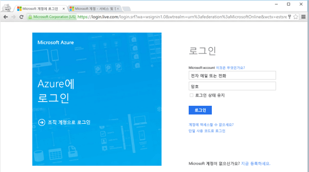


<a name="create-logical-server-bk"></a>

## <a name="create-a-new-logical-sql-server"></a>새로운 SQL 논리 서버 만들기

이 절차의 단계를 따라 사용자가 선택한 지역에서 Azure Portal을 사용하여 새로운 논리 서버를 만듭니다.

1. **새로 만들기**를 클릭하고 **sql server**를 입력한 다음 **Enter** 키를 클릭합니다.

    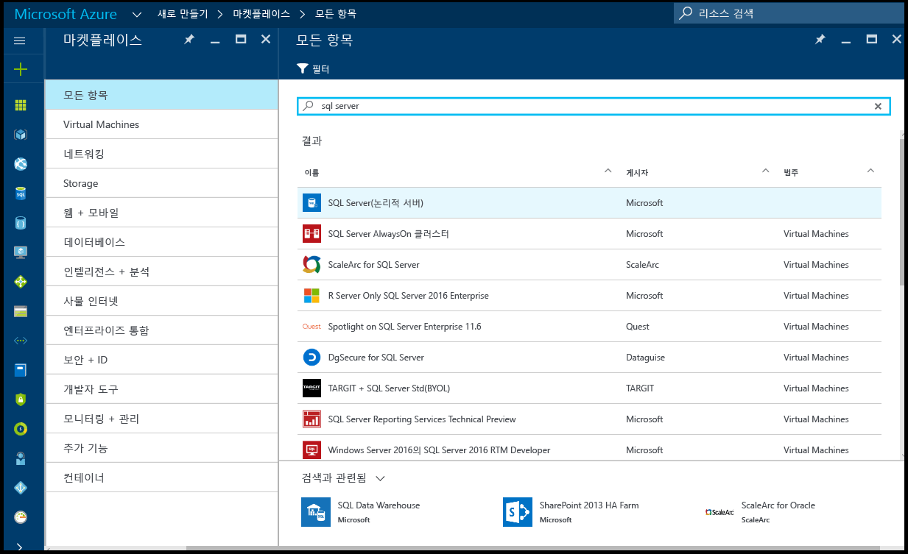
2. **SQL 서버(논리 서버)**를 클릭합니다.
   
    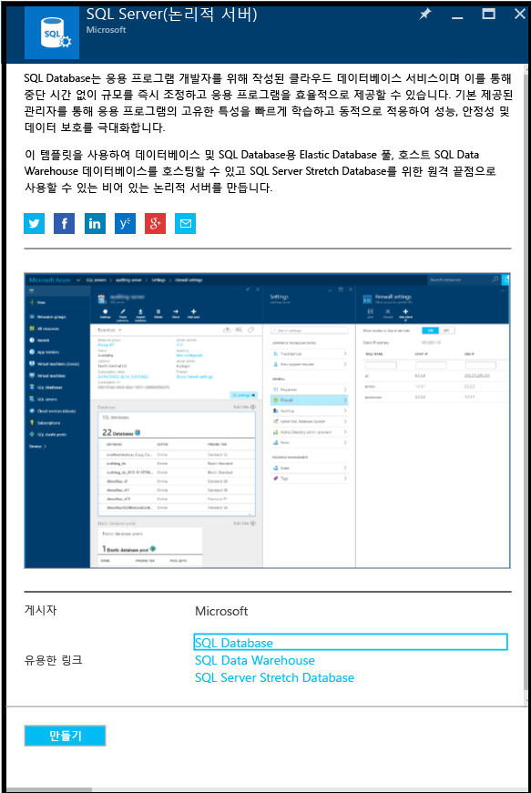
3. **만들기**를 클릭하여 새 SQL Server(논리 서버) 블레이드를 엽니다.

    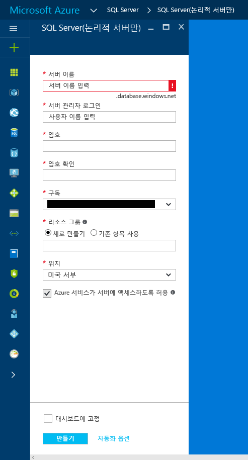
3. [서버 이름] 텍스트 상자에서 새 논리 서버의 유효한 이름을 제공합니다. 녹색 확인 표시가 유효한 이름을 제공한 것을 나타냅니다.
    
    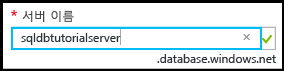

    > [!IMPORTANT]
    > 새 서버의 정규화된 이름은 <your_server_name>.database.windows.net입니다.
    >
    
4. [서버 관리자 로그인] 텍스트 상자에서 이 서버의 SQL 인증 로그인을 위한 사용자 이름을 제공합니다. 이 로그인은 서버 보안 주체 로그인으로 알려져 있습니다. 녹색 확인 표시가 유효한 이름을 제공한 것을 나타냅니다.
    
    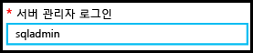
5. **암호** 및 **암호 확인** 텍스트 상자에서 서버 보안 주체 로그인 계정에 대한 암호를 제공합니다. 녹색 확인 표시가 유효한 암호를 제공한 것을 나타냅니다.
    
    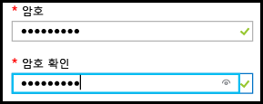
6. 개체를 만들 수 있는 권한이 있는 구독을 선택합니다.

    
7. [리소스 그룹] 텍스트 상자에서 **새로 만들기**를 선택한 다음 [리소스 그룹] 텍스트 상자에서 새 리소스 그룹의 유효한 이름을 제공합니다. 이미 사용자 자신의 리소스 그룹을 만든 경우 기존 리소스 그룹을 사용할 수도 있습니다. 녹색 확인 표시가 유효한 이름을 제공한 것을 나타냅니다.

    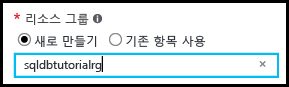

8. **위치** 텍스트 상자에서 위치에 적합한 데이터 센터(예: "오스트레일리아 동부")를 선택합니다.
    
    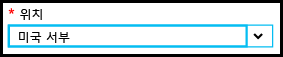
    
    > [!TIP]
    > **Azure 서비스의 서버 액세스 허용** 확인란은 이 블레이드에서 변경할 수 없습니다. [서버 방화벽] 블레이드에서 이 설정을 변경할 수 있습니다. 자세한 내용은 [보안 시작](sql-database-control-access-sql-authentication-get-started.md)을 참조하세요.
    >
    
9. **만들기**를 클릭합니다.

    

## <a name="view-the-logical-server-properties"></a>논리 서버 속성 보기

이 절차의 단계를 수행하여 Azure Portal을 사용하여 서버 속성을 확인합니다. 이후 절차에서 이 서버에 연결하려면 정규화된 서버 이름이 필요합니다. 

1. Azure Portal에서 **추가 서비스**를 클릭합니다.

    
2. [필터] 텍스트 상자에서 **SQL**을 입력한 다음 SQL 서버의 별 표시를 클릭하여 SQL 서버를 Azure 내 즐겨 찾기로 지정합니다. 

    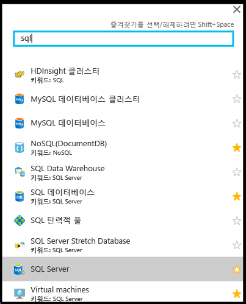
3. 기본 블레이드에서 **SQL 서버**를 클릭하여 Azure 구독에 있는 SQL 서버 목록을 엽니다. 

    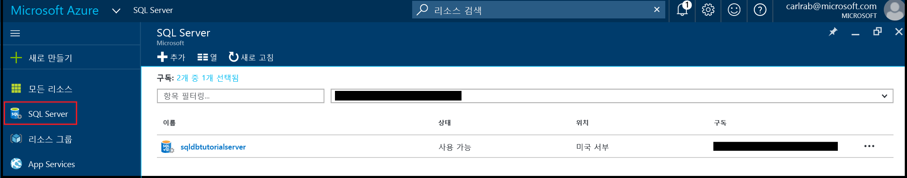

4. 새 SQL 서버를 클릭하여 Azure Portal에서 해당 속성을 봅니다. 이후 자습서에서는 이 블레이드에서 사용할 수 있는 옵션을 이해할 수 있도록 합니다.

    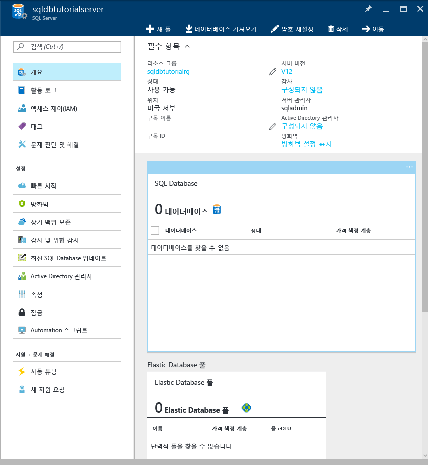
5. [설정]에서 **속성**을 클릭하여 논리 SQL 서버의 다양한 속성을 봅니다.

    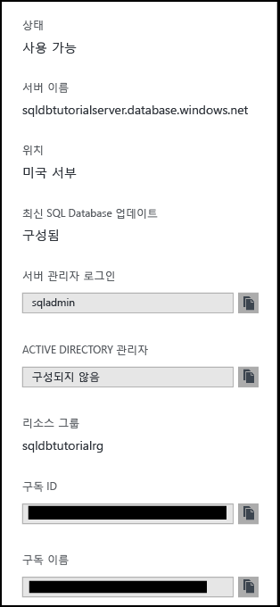
6. 이 자습서의 뒷부분에서 사용할 정규화된 서버 이름을 클립보드에 복사합니다.

    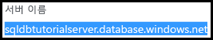

## <a name="create-a-server-level-firewall-rule"></a>서버 수준 방화벽 규칙 만들기

다음 절차의 단계를 따라 다음 단계에서 SQL Server Management Studio를 사용하여 서버에 연결하기 위해 Azure Portal을 사용하여 새 서버 수준 방화벽 규칙을 만듭니다.

1. SQL 서버 블레이드의 [설정]에서 **방화벽**을 클릭하여 SQL 서버를 위한 [방화벽] 블레이드를 엽니다.

    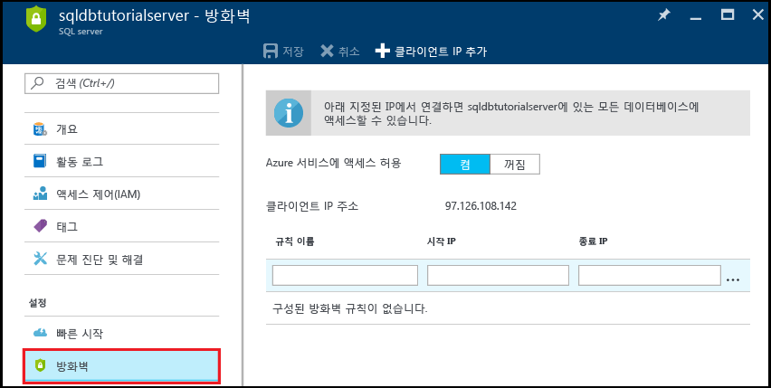

2. 도구 모음에서 **클라이언트 IP 추가**를 클릭합니다.

    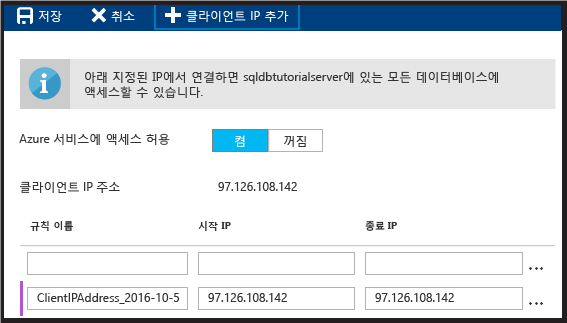

    > [!NOTE]
    > 서버의 SQL Database 방화벽을 단일 IP 주소 또는 전체 주소 범위로 열 수 있습니다. 방화벽을 열면 SQL 관리자와 사용자가 유효한 자격 증명이 있는 서버의 데이터베이스에 로그인할 수 있습니다.
    >

4. 도구 모음에서 **저장**을 클릭하여 해당 서버 수준 방화벽 규칙을 저장한 다음 **확인**을 클릭합니다.

    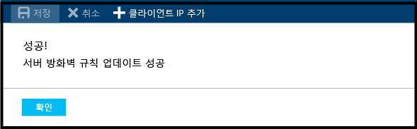

## <a name="connect-to-the-server-with-ssms"></a>SSMS로 서버에 연결

이 절차의 단계를 따라 SQL Server Management Studio를 사용하여 SQL 논리 서버에 연결합니다.

1. 아직 연결하지 않은 경우 [SQL Server Management Studio 다운로드](https://msdn.microsoft.com/library/mt238290.aspx)에서 SSMS 최신 버전을 다운로드하여 설치합니다. 최신 상태로 유지하기 위해 최신 버전의 SSMS에서는 새 버전을 다운로드할 수 있는 경우 메시지를 표시합니다.

2. 설치한 후에 Windows 검색 상자에서 **Microsoft SQL Server Management Studio**를 입력하고 **Enter** 키를 클릭하여 SSMS를 엽니다.

    
3. [서버에 연결] 대화 상자에서 SQL Server 인증을 사용하여 SQL Server에 연결하는 데 필요한 정보를 입력합니다.

    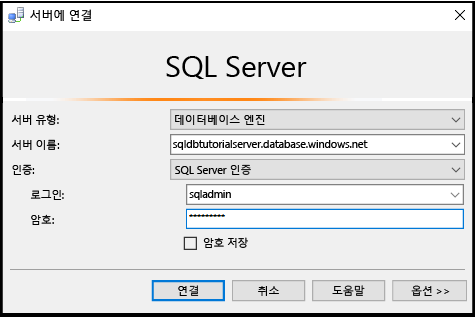
4. **Connect**를 클릭합니다.

    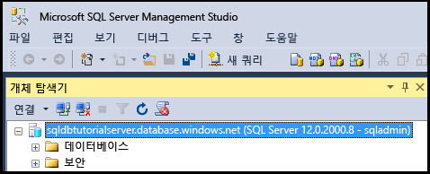
5. [개체 탐색기]에서 **데이터베이스**, **시스템 데이터베이스**, **master**를 차례로 확장하여 master 데이터베이스의 개체를 봅니다.

    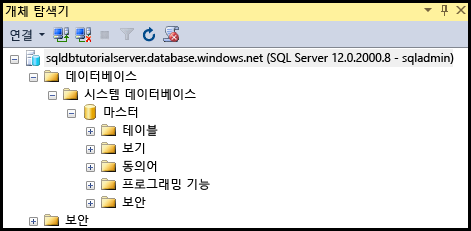
6. **로그인**을 마우스 오른쪽 단추로 클릭한 다음 **새 쿼리**를 클릭합니다.

    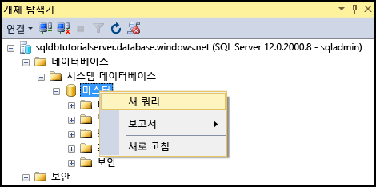

8. 쿼리 창에서 다음 쿼리를 입력합니다.

   ```select * from sys.objects```

9.  도구 모음에서 **실행**을 클릭하여 master 데이터베이스의 모든 시스템 개체 목록을 반환합니다.

    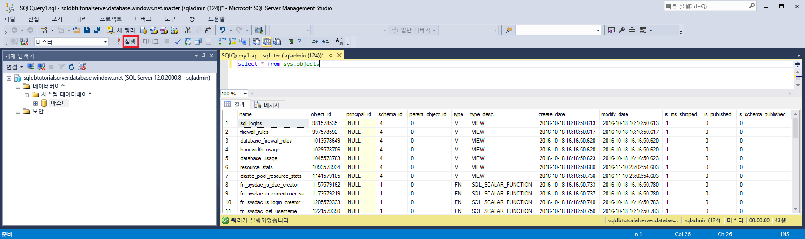

    > [!NOTE]
    > SQL 보안을 탐색하려면 [SQL 보안 시작](sql-database-control-access-sql-authentication-get-started.md)을 참조하세요.
    >

## <a name="create-a-database-with-sample-data"></a>샘플 데이터로 데이터베이스 만들기

이 절차의 단계를 따라 Azure Portal을 사용하여 샘플 데이터로 데이터베이스를 만듭니다. 이 데이터베이스를 이전에 만든 논리 서버에 연결시킵니다. 서버를 만든 지역에서 기본 서비스 계층을 사용할 수 없는 경우 서버를 삭제하고 다른 지역에서 다시 만듭니다. 삭제 단계에서 이 자습서의 마지막 절차를 참조하세요.

1. Azure Portal에서 **SQL 데이터베이스**를 클릭합니다.

    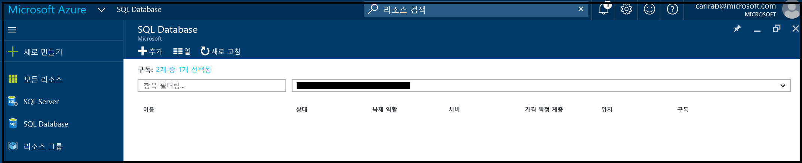
2. SQL 데이터베이스 블레이드에서 **추가**를 클릭합니다.

    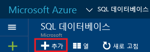
3. SQL Database 블레이드에서 완성된 정보를 검토합니다.

    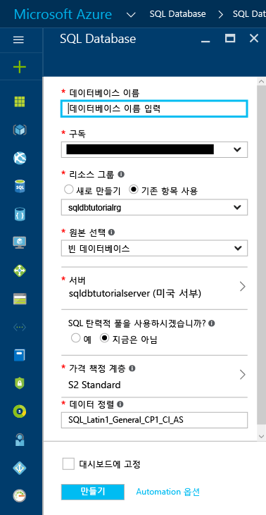
4. 유효한 데이터베이스 이름을 제공합니다.

    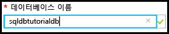
5. [원본 선택] 아래에서 **샘플**을 클릭한 다음 [샘플 선택] 아래에서 **AdventureWorksLT[V12]**를 클릭합니다.
   
    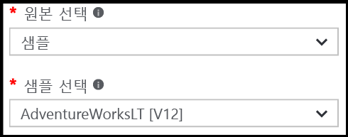
6. [서버]에서 서버 관리자 로그인 사용자 이름과 암호를 제공합니다.

    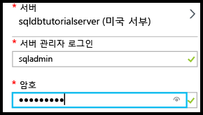

    > [!NOTE]
    > 서버에 데이터베이스를 추가할 때 데이터베이스를 단일 데이터베이스(기본값)로 또는 탄력적 풀에 추가할 수 있습니다. 탄력적 풀에 대한 자세한 내용은 [탄력적 풀](sql-database-elastic-pool.md)을 참조하세요.
    >

7. [가격 책정] 계층에서 가격 책정 계층을 **기본**으로 변경합니다. 나중에 원하는 경우 가격 책정 계층을 높일 수 있지만 여기서는 학습 목적으로 최저 비용 계층을 사용하는 것이 좋습니다.

    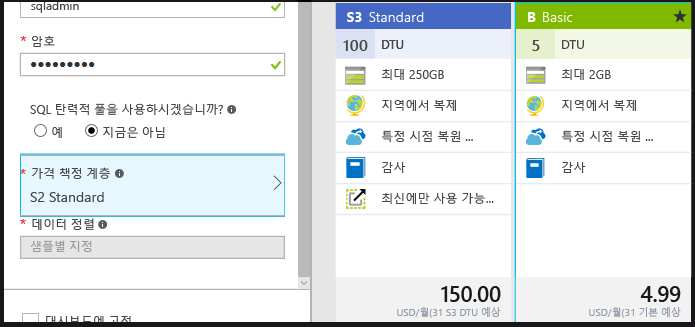
8. **만들기**를 클릭합니다.

    

## <a name="view-the-database-properties"></a>데이터베이스 속성 보기

이 절차의 단계를 따라 Azure Portal을 사용하여 데이터베이스를 쿼리합니다.

1. SQL 데이터베이스 블레이드에서 새 데이터베이스를 클릭하여 Azure Portal에서 해당 속성을 봅니다. 이후 자습서에서는 이 블레이드에서 사용할 수 있는 옵션을 이해할 수 있도록 합니다. 

    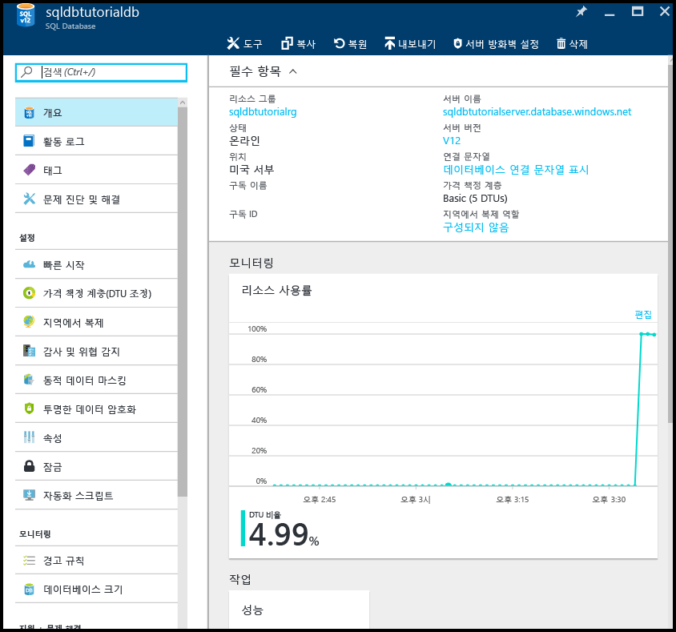
2. **속성**을 클릭하여 데이터베이스에 대한 추가 정보를 봅니다.

    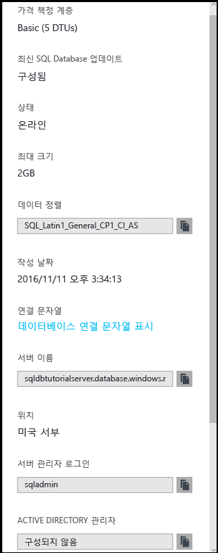

3. **연결 문자열 표시**를 클릭합니다.

    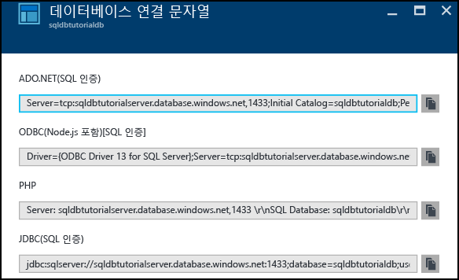
4. **개요**를 클릭한 다음 [필수] 창에서 서버 이름을 클릭합니다.
    
    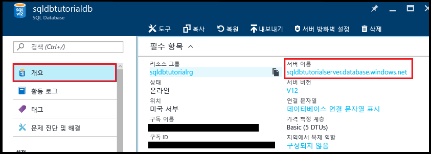
5. 서버의 [필수] 창에서 새로 추가된 데이터베이스를 확인합니다.

    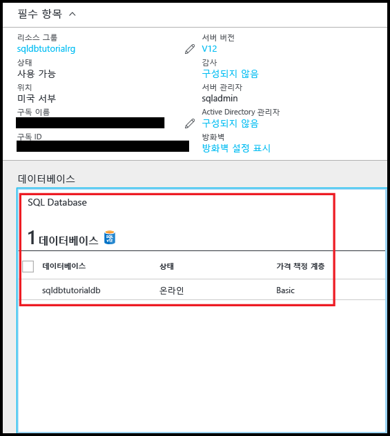

## <a name="query-the-database-in-the-azure-portal"></a>Azure Portal에서 데이터베이스 쿼리

이 절차의 단계를 따라 Azure Portal에서 쿼리 편집기를 사용하여 데이터베이스를 쿼리합니다. 쿼리는 데이터베이스의 개체를 표시합니다.

1. SQL Database 블레이드의 도구 모음에서 **도구**를 클릭합니다.

    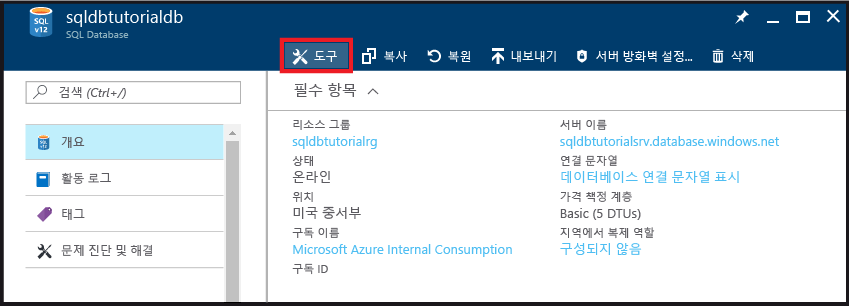
2. 도구 블레이드에서 **쿼리 편집기(미리 보기)**를 클릭합니다.

    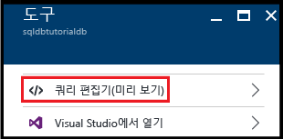
3. 이 확인란을 클릭하여 쿼리 편집기가 미리 보기 기능인지 확인한 다음 **확인**을 클릭합니다.
4. **쿼리 편집기** 블레이드에서 **로그인**을 클릭합니다.

    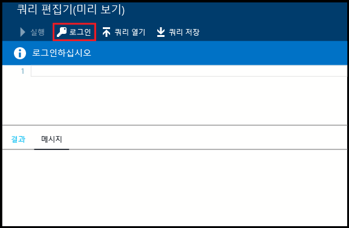
5. 인증 유형 및 로그인을 검토한 다음 이 로그인에 대한 암호를 제공합니다. 

    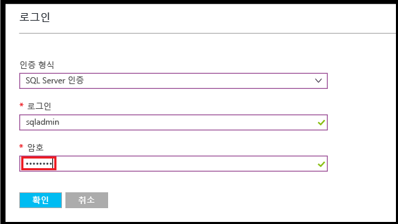
6. **확인**을 클릭하여 로그인하려고 합니다.
7. 클라이언트의 IP 주소에 대한 방화벽 규칙이 없기 때문에 클라이언트가 로그인할 사용 권한이 없음을 알리는 로그인 오류가 표시되는 경우 오류 창에서 클라이언트의 IP 주소를 복사하고 이 데이터베이스에 대한 SQL Server 블레이드에서 서버 수준 방화벽 규칙을 만듭니다.

    
8. 데이터베이스에 로그인하려면 이전 6개의 단계를 반복합니다.
9. 인증된 후에 쿼리 창에서 다음 쿼리를 입력합니다.

   ```select * from sys.objects```

    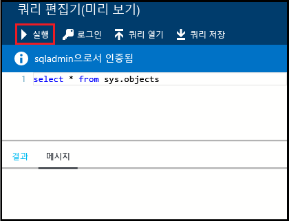 10 **실행**을 클릭합니다.
11. **결과** 창에서 쿼리 결과를 검토합니다.

    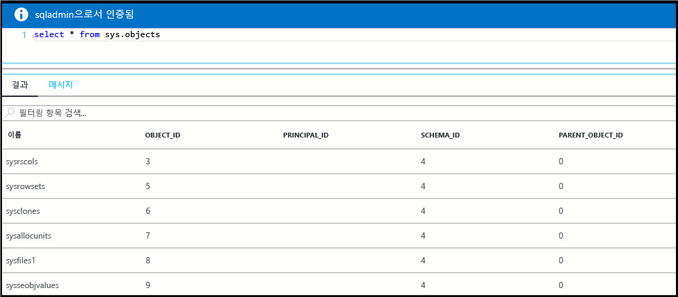

## <a name="connect-and-query-the-database-with-ssms"></a>SSMS로 데이터베이스 연결 및 쿼리

데이터베이스에서 개체를 보기 위해 이 절차의 단계를 수행하여 SQL Server Management Studio를 사용하여 데이터베이스에 연결한 다음 샘플 데이터를 쿼리합니다.

1. SQL Server Management Studio로 전환하고 [개체 탐색기]에서 도구 모음의 **데이터베이스**를 클릭한 다음 **새로 고침**을 클릭하여 샘플 데이터베이스를 봅니다.

    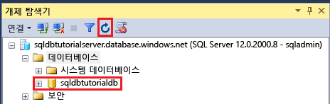
2. [개체 탐색기]에서 새 데이터베이스를 확장하여 해당 개체를 봅니다.

    
3. 샘플 데이터베이스를 마우스 오른쪽 단추로 클릭한 다음 **새 쿼리**를 클릭합니다.

    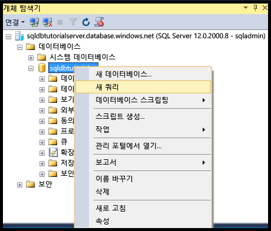
4. 쿼리 창에서 다음 쿼리를 입력합니다.

   ```select * from sys.objects```
   
9.  도구 모음에서 **실행**을 클릭하여 샘플 데이터베이스의 모든 시스템 개체 목록을 반환합니다.

    

## <a name="create-a-blank-database-with-ssms"></a>SSMS로 빈 데이터베이스 만들기

이 절차의 단계를 따라 SQL Server Management Studio를 사용하여 논리 서버에서 새 데이터베이스를 만듭니다.

1. [개체 탐색기]에서 **데이터베이스**를 마우스 오른쪽 단추로 클릭한 다음 **새 데이터베이스**를 클릭합니다.

    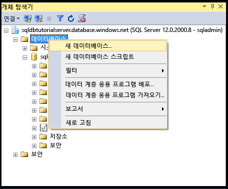

    > [!NOTE]
    > SSMS에서 Transact-SQL을 사용하여 새 데이터베이스를 만들 수 있는 데이터베이스 만들기 스크립트를 작성할 수도 있습니다.
    >

2. [새 데이터베이스] 대화 상자에서 [데이터베이스 이름] 텍스트 상자에 데이터베이스 이름을 제공합니다. 

    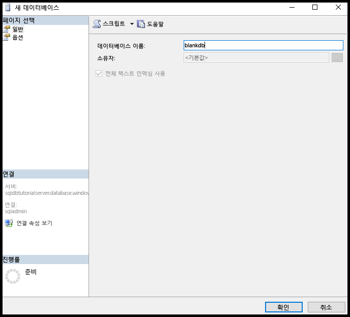

3. [새 데이터베이스] 대화 상자에서 **옵션**을 클릭한 다음 버전을 **기본**으로 변경합니다.

    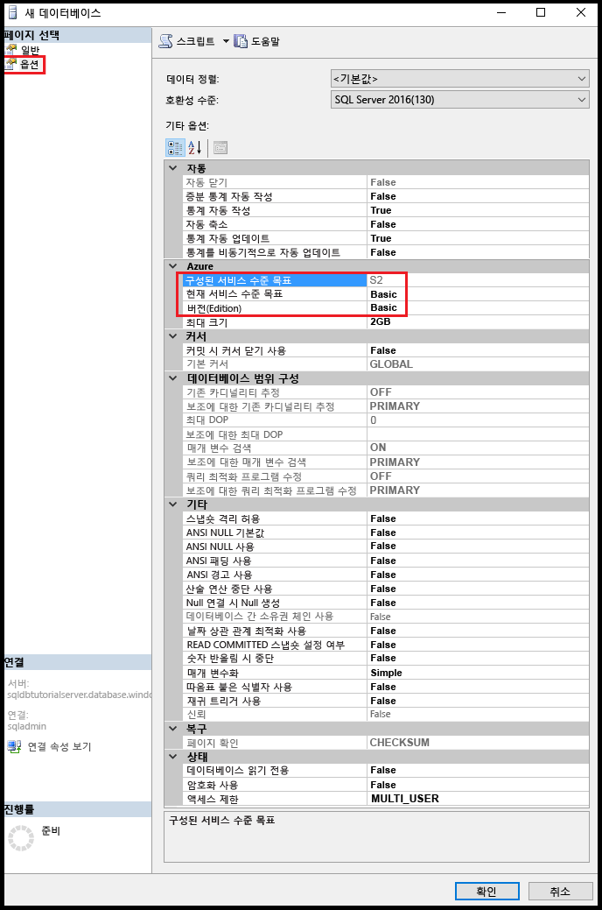

    > [!TIP]
    > Azure SQL Database에 대해 수정할 수 있는 이 대화 상자의 다른 옵션을 검토합니다. 이러한 옵션에 대한 자세한 내용은 [Create Database](https://msdn.microsoft.com/library/dn268335.aspx)를 참조하세요.
    >

4. **확인**을 클릭하여 빈 데이터베이스를 만듭니다.
5. 작업이 완료되면 [개체 탐색기]에서 데이터베이스 노드를 새로 고쳐 새로 만든 빈 데이터베이스를 봅니다. 

    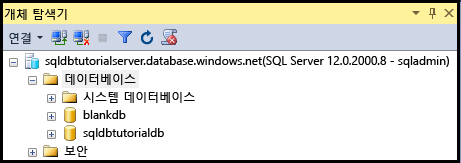

## <a name="troubleshoot-connectivity"></a>연결 문제 해결

> [!IMPORTANT]
> 연결에 문제가 있는 경우 [연결 문제](sql-database-troubleshoot-common-connection-issues.md)를 참조하세요.
> 

## <a name="delete-a-single-database"></a>단일 데이터베이스 삭제

이 절차의 단계를 따라 Azure Portal을 사용하여 단일 데이터베이스를 삭제합니다.

1. Azure Portal에 있는 SQL Database에 대한 블레이드에서 **삭제**를 클릭합니다.

    
2. **예**를 클릭하여 이 데이터베이스를 영구적으로 삭제한다고 확인합니다.

    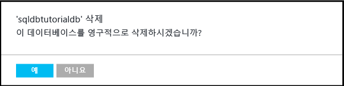

> [!TIP]
> 데이터베이스에 대한 보존 기간 중에 서비스 시작 자동 백업에서 복원할 수 있습니다. 기본 버전의 데이터베이스인 경우&7;일 이내에 복원할 수 있습니다. 그러나 서버는 삭제하지 마세요. 서버를 삭제하면 서버 또는 이 서버의 삭제된 데이터베이스를 복구할 수 없기 때문입니다. 데이터베이스 백업에 대한 자세한 내용은 [SQL Database 백업에 대해 알아보기](sql-database-automated-backups.md)를 참조하고 백업에서 데이터베이스를 복원하는 방법에 대한 정보는 [데이터베이스 복구](sql-database-recovery-using-backups.md)를 참조하세요. 삭제된 데이터베이스를 복원하는 방법에 대한 방법 문서는 [삭제된 Azure SQL Database 복원 - Azure Portal](sql-database-restore-deleted-database-portal.md)을 참조하세요.
>


## <a name="next-steps"></a>다음 단계
이제 이 자습서를 완료했으므로 여기서 학습한 내용을 빌드하기 위해 탐색할 수 있는 추가 자습서가 다음과 같이 다양하게 준비되어 있습니다. 

- SQL Server 인증 자습서를 시작하려면 [SQL 인증 및 권한 부여](sql-database-control-access-sql-authentication-get-started.md)를 참조하세요.
- Azure Active Directory 인증 자습서를 시작하려면 [AAD 인증 및 권한 부여](sql-database-control-access-aad-authentication-get-started.md)를 참조하세요.
* Azure Portal에서 샘플 데이터베이스를 쿼리하려는 경우 [공개 미리 보기: SQL 데이터베이스에 대한 대화형 쿼리 경험](https://azure.microsoft.com/en-us/updates/azure-sql-database-public-preview-t-sql-editor/)을 참조하세요.
* Excel을 알고 있는 경우 [Azure에서 Excel로 SQL Database에 연결](sql-database-connect-excel.md)하는 방법에 대해 알아보세요.
* 코딩을 시작할 준비가 되었다면 [SQL Database 및 SQL Server에 대한 연결 라이브러리](sql-database-libraries.md)에서 프로그래밍 언어를 선택합니다.
* 온-프레미스 SQL Server 데이터베이스를 Azure로 이동하려면 [SQL Database로 데이터베이스 마이그레이션](sql-database-cloud-migrate.md)을 참조하세요.
* BCP 명령줄 도구를 사용하여 CSV 파일에서 새 테이블로 일부 데이터를 로드하려는 경우 [BCP를 사용하여 CSV 파일에서 SQL Database로 데이터 로드](sql-database-load-from-csv-with-bcp.md)를 참조하세요.
* 테이블 및 다른 개체를 만들려면 [테이블 만들기](https://msdn.microsoft.com/library/ms365315.aspx)에서 "테이블을 만들려면" 항목을 참조하세요.

## <a name="additional-resources"></a>추가 리소스

- 기술적 개요는 [SQL Database 정의](sql-database-technical-overview.md)를 참조하세요.
- 가격 정보는 [Azure SQL Database 가격 책정](https://azure.microsoft.com/pricing/details/sql-database/)을 참조하세요.


<!--HONumber=Feb17_HO1-->


