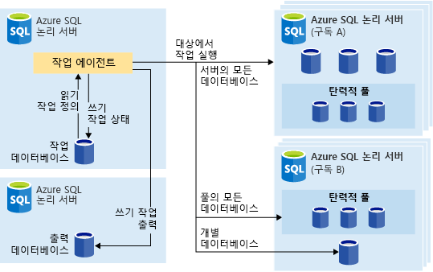
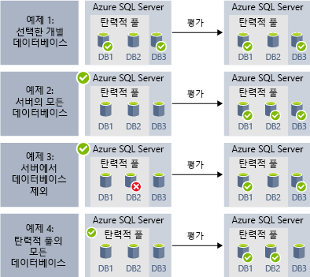
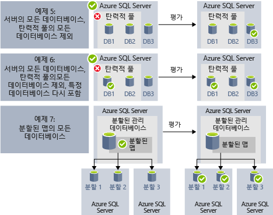

# <a name="automate-management-tasks-using-database-jobs"></a>데이터베이스 작업을 사용하여 관리 작업 자동화

Azure SQL Database를 통해 T-SQL 쿼리를 실행하고 유지 관리 작업을 수행하도록 하나 이상의 데이터베이스에 대해 주기적으로 실행되는 작업을 만들고 예약할 수 있습니다. 모든 작업은 실행의 상태를 기록하고 오류가 발생하는 경우 작업을 자동으로 다시 시도합니다.
대상 데이터베이스 또는 작업이 실행되는 Azure SQL 데이터베이스의 그룹을 정의할 수 있으며, 작업 실행을 위한 일정도 정의할 수 있습니다.
작업은 대상 데이터베이스의 로그인 태스크를 처리합니다. 또한 Azure SQL 데이터베이스 그룹에서 실행할 Transact-SQL 스크립트를 정의, 유지 관리 및 보존합니다.

## <a name="when-to-use-automated-jobs"></a>자동화된 작업을 사용하는 경우

작업 자동화를 사용할 수 있는 몇 가지 시나리오는 다음과 같습니다.

- 관리 작업을 자동화한 다음, 주중 매일, 일정 시간 후 등에 실행되도록 예약합니다.
  - 스키마 변경, 자격 증명 관리, 성능 데이터 수집 또는 테넌트(고객) 원격 분석 수집을 배포합니다.
  - 참조 데이터(모든 데이터베이스에서 공통적인 정보)를 업데이트하고 Azure Blob Storage에서 데이터를 로드합니다.
  - 인덱스를 다시 작성하여 쿼리 성능 향상 사용량이 적은 시간 중과 같이 데이터베이스 컬렉션에 대해 되풀이해서 실행하려면 작업을 구성합니다.
  - 지속적으로 데이터베이스 집합에서 중앙 테이블로 쿼리 결과 수집 지속적으로 성능 쿼리를 실행하고 실행할 추가 작업을 트리거하도록 구성할 수 있습니다.
- 보고에 대한 데이터 수집
  - Azure SQL 데이터베이스의 컬렉션에서 단일 대상 테이블로 데이터를 집계합니다.
  - 큰 데이터베이스 집합에 대해 더 오래 실행되는 데이터 처리 쿼리(예: 고객 원격 분석 수집) 실행. 추가 분석을 위해 결과가 단일 대상 테이블에 수집됩니다.
- 데이터 이동
  - 데이터베이스에서 변경된 내용을 다른 데이터베이스로 복제하거나 원격 데이터베이스에서 만들어진 업데이트를 수집하고 변경된 내용을 데이터베이스에 적용하는 작업을 만듭니다.
  - SSIS(SQL Server Integration Services)를 사용하여 데이터베이스에서 데이터를 로드하는 작업을 만듭니다.

## <a name="overview"></a>개요

다음 작업 예약 기술은 Azure SQL Database에서 사용할 수 있습니다.

- **SQL 에이전트 작업**은 Managed Instance에서 사용할 수 있는 클래식 및 입증된 SQL Server 작업 예약 구성 요소입니다. SQL 에이전트 작업은 단일 데이터베이스에서 사용할 수 없습니다.
- **Elastic Database 작업**은 하나 또는 여러 Azure SQL Database에서 사용자 지정 작업을 실행하는 작업 예약 서비스입니다.

SQL 에이전트(온-프레미스 및 SQL Database Managed Instance의 일부로 사용 가능)와 Database 탄력적 작업 에이전트(Azure SQL 데이터베이스의 단일 데이터베이스 및 SQL Data Warehouse의 데이터베이스에서 사용 가능) 사이의 몇 가지 차이점을 주목할 필요가 있습니다.

|  |탄력적 작업  |SQL 에이전트 |
|---------|---------|---------|
|범위     |  작업 에이전트와 동일한 Azure 클라우드에서 많은 수의 Azure SQL 데이터베이스 및/또는 데이터 웨어하우스입니다. 대상은 다른 SQL Database 서버, 구독 및/또는 지역에 있을 수 있습니다. <br><br>대상 그룹은 개별 데이터베이스나 데이터 웨어하우스 또는 서버, 풀 또는 shardmap(작업 런타임 시 동적으로 열거되는)의 모든 데이터베이스로 구성됩니다. | SQL 에이전트와 동일한 SQL Server 인스턴스의 모든 개별 데이터베이스입니다. |
|지원되는 API 및 도구     |  포털, PowerShell, T-SQL, Azure Resource Manager      |   T-SQL 및 SSMS(SQL Server Management Studio)     |

## <a name="sql-agent-jobs"></a>SQL 에이전트 작업

SQL 에이전트 작업은 데이터베이스에 대한 일련의 T-SQL 스크립트로 지정됩니다. 작업을 사용하여 두 번 이상 실행할 수 있으며 성공 또는 실패를 모니터링하는 관리 작업을 정의합니다.
하나의 로컬 서버 또는 여러 원격 서버에서 작업을 실행할 수 있습니다. SQL 에이전트 작업은 Managed Instance 서비스 내에서 실행되는 내부 데이터베이스 엔진 구성 요소입니다.
SQL 에이전트 작업에는 몇 가지 주요 개념이 있습니다.

- **작업 단계**는 작업 내에서 실행되어야 하는 하나 이상의 단계로 설정됩니다. 모든 작업 단계에서 작업 단계가 성공 또는 실패인 경우에 발생되어야 하는 다시 시도 전략 및 작업을 정의할 수 있습니다.
- **일정**은 작업을 실행해야 하는 시기를 정의합니다.
- **알림**은 작업이 완료되면 운영자에게 이메일을 통해 사용할 규칙을 정의할 수 있습니다.

### <a name="job-steps"></a>작업 단계

SQL 에이전트 작업 단계는 SQL 에이전트가 실행해야 하는 작업의 시퀀스입니다. 모든 단계에는 단계가 성공하거나 실패하는 경우 실행되어야 하는 다음 단계와 함께 실패 시 재시도 횟수가 있습니다.
SQL 에이전트를 사용하면 데이터베이스에 대해 단일 Transact-SQL 일괄 처리를 실행하는 Transact-SQL 작업 단계 또는 사용자 지정 OS 스크립트를 실행할 수 있는 OS 명령/PowerShell 단계와 같은 다양한 유형의 작업 단계를 만들 수 있습니다. 그리고 SSIS 작업 단계를 통해 SSIS 런타임을 사용한 데이터 또는 데이터베이스의 변경 내용을 다른 데이터베이스에 게시할 수 있는 [복제](sql-database-managed-instance-transactional-replication.md) 단계를 로드할 수 있습니다.

[트랜잭션 복제](sql-database-managed-instance-transactional-replication.md)는 사용자가 한 데이터베이스에서 둘 이상의 테이블에 대한 변경 내용을 게시하고, 구독자 데이터베이스 세트에 해당 내용을 게시/배포할 수 있는 데이터베이스 엔진 기능입니다. 변경 내용의 게시는 다음과 같은 SQL 에이전트 작업 단계 유형을 사용하여 구현됩니다.

- 트랜잭션 로그 판독기
- 스냅샷.
- 배포자

다음을 포함한 다른 유형의 작업 단계는 현재 지원되지 않습니다.

- 병합 복제 작업 단계는 지원되지 않습니다.
- 큐 판독기는 지원되지 않습니다.
- Analysis Services는 지원되지 않습니다.

### <a name="job-schedules"></a>작업 일정

일정은 작업이 실행되는 시기를 지정합니다. 동일한 일정에 따라 둘 이상의 작업을 실행할 수 있으며, 둘 이상의 일정을 동일한 작업에 적용할 수 있습니다.
일정은 작업이 실행되는 시기에 대해 다음 조건을 정의할 수 있습니다.

- 인스턴스가 다시 시작될 때마다(또는 SQL Server 에이전트가 시작될 때). 작업은 모든 장애 조치(failover) 후 활성화됩니다.
- 특정 날짜 및 시간에 한 번 - 일부 작업의 지연된 실행에 유용합니다.
- 되풀이 일정.

> [!Note]
> Managed Instance는 현재 인스턴스가 “유휴” 상태일 때 작업을 시작할 수 없습니다.

### <a name="job-notifications"></a>작업 알림

SQL 에이전트 작업을 통해 작업이 성공적으로 완료되거나 실패할 때 알림을 받을 수 있습니다. 이메일을 통해 이메일 알림을 받을 수 있습니다.

먼저 다음 샘플에 나온 것처럼 이메일 알림을 보내는 데 사용될 이메일 계정을 설정하고 `AzureManagedInstance_dbmail_profile`이라는 이메일 프로필에 계정을 할당해야 합니다.

```sql
-- Create a Database Mail account
EXECUTE msdb.dbo.sysmail_add_account_sp
    @account_name = 'SQL Agent Account',
    @description = 'Mail account for Azure SQL Managed Instance SQL Agent system.',
    @email_address = '$(loginEmail)',
    @display_name = 'SQL Agent Account',
    @mailserver_name = '$(mailserver)' ,
    @username = '$(loginEmail)' ,  
    @password = '$(password)' 

-- Create a Database Mail profile
EXECUTE msdb.dbo.sysmail_add_profile_sp
    @profile_name = 'AzureManagedInstance_dbmail_profile',
    @description = 'E-mail profile used for messages sent by Managed Instance SQL Agent.' ;

-- Add the account to the profile
EXECUTE msdb.dbo.sysmail_add_profileaccount_sp
    @profile_name = 'AzureManagedInstance_dbmail_profile',
    @account_name = 'SQL Agent Account',
    @sequence_number = 1;
```

또한 Managed Instance에서 데이터베이스 메일을 사용하도록 설정해야 합니다.

```sql
GO
EXEC sp_configure 'show advanced options', 1;  
GO  
RECONFIGURE;  
GO  
EXEC sp_configure 'Database Mail XPs', 1;  
GO  
RECONFIGURE 
```

SQL 에이전트 작업에 문제가 발생했음을 운영자에게 알릴 수 있습니다. 운영자는 둘 이상의 Managed Instance를 유지 관리하는 개인에 대한 연락처 정보를 정의합니다. 경우에 따라 운영자 책임이 한 개인에게 할당되기도 합니다.
여러 Managed Instance 또는 SQL Server를 사용하는 시스템에서는 여러 개인이 운영자 책임을 공유할 수 있습니다. 운영자는 보안 정보를 포함하지 않으며 보안 주체를 정의하지 않습니다.

다음 예제와 같이 SSMS 또는 Transact-SQL 스크립트를 사용하여 운영자를 만들 수 있습니다.

```sql
EXEC msdb.dbo.sp_add_operator 
    @name=N'Mihajlo Pupun', 
        @enabled=1, 
        @email_address=N'mihajlo.pupin@contoso.com'
```

SSMS 또는 다음 Transact-SQL 스크립트를 사용하여 모든 작업을 수정할 수 있으며, 작업이 완료, 실패 또는 성공하는 경우 이메일을 통해 알림을 받는 운영자를 할당할 수 있습니다.

```sql
EXEC msdb.dbo.sp_update_job @job_name=N'Load data using SSIS', 
        @notify_level_email=3,                        -- Options are: 1 on succeed, 2 on failure, 3 on complete
        @notify_email_operator_name=N'Mihajlo Pupun'
```

### <a name="sql-agent-job-limitations"></a>SQL 에이전트 작업 제한 사항

SQL Server에서 사용할 수 있는 SQL 에이전트 기능 중 일부는 Managed Instance에서 지원되지 않습니다.
- SQL 에이전트 설정은 읽기 전용입니다. `sp_set_agent_properties` 프로시저는 Managed Instance에서 지원되지 않습니다.
- 에이전트 사용 설정/해제는 현재 Managed Instance에서 지원되지 않습니다. SQL 에이전트는 항상 실행되고 있습니다.
- 알림은 부분적으로 지원됩니다.
  - 호출기는 지원되지 않습니다.
  - NetSend는 지원되지 않습니다.
  - 경고는 아직 지원되지 않습니다.
- 프록시는 지원되지 않습니다.
- Eventlog는 지원되지 않습니다.

SQL Server 에이전트에 대한 자세한 내용은 [SQL Server 에이전트](https://docs.microsoft.com/sql/ssms/agent/sql-server-agent)를 참조하세요.

## <a name="elastic-database-jobs"></a>Elastic Database 작업

**Elastic Database 작업**은 스케줄에 따라 또는 요청 시 많은 데이터베이스에서 병렬로 하나 이상의 T-SQL 스크립트를 실행하는 기능을 제공합니다.

**데이터베이스의 모든 조합에 대해 작업 실행**: 특정 데이터베이스를 포함하거나 제외할 유연성이 추가된 하나 이상의 개별 데이터베이스, 서버의 모든 데이터베이스, 탄력적 풀에서 모든 데이터베이스 또는 shardmap입니다. **작업은 여러 서버 및 여러 사람에서 실행될 수 있으며 심지어 다른 구독의 데이터베이스에 대해서도 실행될 수 있습니다.** 서버 및 풀은 런타임 시 동적으로 열거되므로 작업은 실행 시 대상 그룹에 존재하는 모든 데이터베이스에 대해 실행됩니다.

다음 이미지에서는 다른 유형의 대상 그룹에 대해 작업을 실행하는 작업 에이전트를 보여줍니다.



### <a name="elastic-job-components"></a>탄력적 작업 구성 요소

|구성 요소  | 설명(추가 세부 정보는 표 아래에 있음) |
|---------|---------|
|[**탄력적 작업 에이전트**](#elastic-job-agent) |  작업을 실행하고 관리하기 위해 만든 Azure 리소스입니다.   |
|[**작업 데이터베이스**](#job-database)    |    작업 에이전트가 작업 관련 데이터, 작업 정의 등을 저장하는 데 사용하는 Azure SQL 데이터베이스입니다.      |
|[**대상 그룹**](#target-group)      |  서버, 풀, 데이터베이스 및 분할된 데이터베이스의 집합이 작업을 실행하기 위해 매핑됩니다.       |
|[**작업**](#job)  |  작업은 둘 이상의 [작업 단계](#job-step)로 구성된 작업 단위입니다. 작업 단계는 실행할 T-SQL 스크립트 뿐만 아니라 스크립트를 실행하는 데 필요한 기타 세부 정보를 지정합니다.  |


#### <a name="elastic-job-agent"></a>탄력적 작업 에이전트

탄력적 작업 에이전트는 작업을 생성하고 실행하고 관리하기 위한 Azure 리소스입니다. 탄력적 작업 에이전트는 포털에서 만드는 Azure 리소스입니다([PowerShell](elastic-jobs-powershell.md) 및 REST도 지원됩니다). 

**탄력적 작업 에이전트**를 만드는 데는 기존 SQL 데이터베이스가 필요합니다. 에이전트는 [*작업 데이터베이스*](#job-database) 같은 기존 데이터베이스를 구성합니다.

탄력적 작업 에이전트는 무료입니다. 작업 데이터베이스는 모든 SQL 데이터베이스와 동일한 비용이 청구됩니다.

#### <a name="job-database"></a>작업 데이터베이스

*작업 데이터베이스*는 작업을 정의하고 작업 실행의 기록 및 상태를 추적하는 데 사용됩니다. *작업 데이터베이스*는 또한 에이전트 메타데이터, 로그, 결과, 작업 정의를 저장하는 데 사용되며, T-SQL을 사용하여 작업을 생성, 실행 및 관리하기 위해 많은 유용한 저장 프로시저 및 기타 데이터베이스 개체도 포함합니다.

현재 미리 보기의 경우 탄력적 작업 에이전트를 만드는 데 기존 Azure SQL 데이터베이스(S0 이상)가 필요합니다.

*작업 데이터베이스*는 문자 그대로 새 것일 필요는 없지만 깨끗하고 비어있고 S0 이상의 서비스 계층이어야 합니다. 권장된 서비스 계층의 *작업 데이터베이스*는 S1 이상이지만 작업 단계 수, 작업 실행 횟수 및 작업 실행 빈도 같은 사용자 작업의 성능 요구에 따라 달라집니다. 예를 들어 S0 데이터베이스는 한 시간에 거의 작업을 실행하지 않는 작업 에이전트에는 충분할 수 있지만 1분마다 작업을 실행하면 성능이 못 미칠 수 있어 서비스 계층이 더 높을 수록 효과는 더 좋을 수 있습니다.


##### <a name="job-database-permissions"></a>작업 데이터베이스 사용 권한

작업 에이전트 생성 동안 스키마, 테이블 및 *jobs_reader*라는 역할이 *작업 데이터베이스*에서 만들어집니다. 역할은 다음과 같은 사용 권한으로 생성되며, 작업 모니터링을 위해 관리자에게 보다 정교한 액세스 제어를 제공하도록 설계되었습니다.


|역할 이름  |'작업' 스키마 사용 권한  |'jobs_internal' 스키마 사용 권한  |
|---------|---------|---------|
|**jobs_reader**     |    SELECT     |    없음     |

> [!IMPORTANT]
> 데이터베이스 관리자로 *작업 데이터베이스*에 대해 액세스 권한을 부여하기 전에 보안 관련 문제를 고려합니다. 작업을 만들거나 편집할 사용 권한이 있는 악의적인 사용자는 해당 악의적인 사용자의 제어 아래 저장된 자격 증명을 사용하는 작업을 만들거나 편집할 수 있으며, 이는 악의적인 사용자가 자격 증명의 암호를 확인하도록 허용할 수 있습니다.


#### <a name="target-group"></a>대상 그룹

*대상 그룹*은 작업 단계에서 실행될 데이터베이스의 집합을 정의합니다. 대상 그룹은 다음의 모든 번호와 조합을 포함할 수 있습니다.

- **SQL Database 서버** - 서버가 지정되면 작업 실행 시 서버에 존재하는 모든 데이터베이스가 그룹의 일부입니다. 작업 실행에 앞서 그룹을 열거하고 업데이트할 수 있도록 master 데이터베이스 자격 증명이 제공되어야 합니다.
- **탄력적 풀** - 탄력적 풀을 지정하는 경우 작업 실행 시 탄력적인 풀에 있는 모든 데이터베이스는 그룹의 일부가 됩니다. 서버의 경우 작업 실행에 앞서 그룹을 업데이트할 수 있도록 master 데이터베이스 자격 증명이 제공되어야 합니다.
- **단일 데이터베이스** - 하나 이상의 개별 데이터베이스가 그룹의 일부가 되도록 지정합니다.
- **Shardmap** - Shardmap의 데이터베이스입니다.

> [!TIP]
> 작업 실행 시 *동적 열거형*은 서버 또는 풀을 포함하는 대상 그룹에서 데이터베이스의 집합을 다시 평가합니다. 동적 열거형은 **작업 실행 시 서버나 풀에 존재하는 모든 데이터베이스에서 작업이 실행되는지** 확인합니다. 런타임 시 데이터베이스 목록의 재평가는 풀 또는 서버 멤버 자격이 자주 변경되는 시나리오에 특히 유용합니다.

풀 및 단일 데이터베이스는 그룹에서 제외되거나 포함되는 것으로 지정할 수 있습니다. 이렇게 하면 데이터베이스의 모든 조합을 사용하여 대상 그룹을 만들 수 있습니다. 예를 들어 대상 그룹에 서버를 추가할 수 있지만 탄력적 풀에서 특정 데이터베이스를 제외합니다(또는 전체 풀을 제외).

대상 그룹은 여러 지역 및 여러 구독에서 데이터베이스를 포함할 수 있습니다. 지역 간 실행은 동일한 지역 내 실행보다 더 많은 대기 시간이 필요합니다.

다음 예제에서는 작업 실행 시 여러 대상 그룹 정의를 동적으로 열거하여 작업에서 실행할 데이터베이스를 결정하는 원리를 보여줍니다.



**예제 1**은 개별 데이터베이스 목록으로 구성되는 대상 그룹을 보여줍니다. 이 대상 그룹을 사용하여 작업 단계가 실행되면 작업 단계의 동작은 각 데이터베이스에서 실행됩니다.<br>
**예제 2**는 Azure SQL Server를 대상으로 포함하는 대상 그룹을 보여줍니다. 이 대상 그룹을 사용하여 작업 단계가 실행되면 현재 서버에 있는 데이터베이스 목록을 확인하기 위해 서버가 동적으로 열거됩니다. 작업 단계의 동작은 각 데이터베이스에서 실행됩니다.<br>
**예제 3**은 *예제 2*와 비슷한 대상 그룹을 보여주지만, 개별 데이터베이스가 제외됩니다. 제외된 데이터베이스에서 작업 단계의 동작이 실행되지 *않습니다*.<br>
**예제 4**는 탄력적 풀을 대상으로 포함하는 대상 그룹을 보여줍니다. *예제 2*와 비슷하게, 풀에 있는 데이터베이스 목록을 확인하기 위해 런타임에 풀이 동적으로 열거됩니다.
<br><br>




**예제 5** 및 **예제 6**은 포함 및 제외 규칙을 사용하여 Azure SQL Server, 탄력적 풀, 데이터베이스를 결합할 수 있는 고급 시나리오를 보여줍니다.<br>
**예제 7**은 분할된 데이터베이스 맵의 분할된 데이터베이스를 런타임에도 평가할 수 있음을 보여줍니다.

#### <a name="job"></a>작업

*작업*은 일정에 따라 또는 일회성 작업으로 실행되는 작업의 단위입니다. 작업은 하나 이상의 *작업 단계*로 구성됩니다.

##### <a name="job-step"></a>작업 단계

각 작업 단계는 실행할 T-SQL 스크립트, T-SQL 스크립트를 실행하는 하나 이상의 대상 그룹 및 작업 에이전트가 대상 데이터베이스에 연결해야 하는 자격 증명을 지정합니다. 각 작업 단계에는 사용자 지정 가능한 시간 제한 및 재시도 정책이 있으며, 출력 매개 변수를 선택적으로 지정할 수 있습니다.

#### <a name="job-output"></a>작업 출력

각 대상 데이터베이스에서 작업 단계의 결과는 자세히 레코드되며, 스크립트 출력은 지정된 테이블로 캡처될 수 있습니다. 작업에서 반환된 모든 데이터를 저장하려면 데이터베이스를 지정할 수 있습니다.

#### <a name="job-history"></a>작업 기록

작업 실행 기록은 *작업 데이터베이스*에 저장됩니다. 시스템 정리 작업은 45일 이상된 실행 기록을 제거합니다. 45일 이하 기록을 제거하려면 *작업 데이터베이스*에서 **sp_purge_history** 저장 프로시저를 호출합니다.

### <a name="agent-performance-capacity-and-limitations"></a>에이전트 성능, 용량 및 제한 사항

탄력적 작업은 장기 실행 작업이 완료되기를 기다리는 동안 최소한의 계산 리소스를 사용합니다.

작업(동시 작업자 수)에 대한 원하는 실행 시간 및 데이터베이스의 대상 그룹 크기에 따라 에이전트는 *작업 데이터베이스*의 다른 양의 성능 및 계산을 요구합니다(대상 및 작업 수가 많아질수록 필요한 계산 양도 더 많아집니다).

현재 미리 보기의 동시 작업은 100개로 제한됩니다.

#### <a name="prevent-jobs-from-reducing-target-database-performance"></a>작업이 대상 데이터베이스 성능을 감소시키는 것을 방지

SQL 탄력적인 풀에서 데이터베이스에 대해 작업을 실행할 때 리소스에 작업 부하를 주지 않도록 하려면 작업이 동시에 실행될 수 있는 데이터베이스의 수를 제한하도록 작업을 구성할 수 있습니다.

## <a name="next-steps"></a>다음 단계

- [SQL Server 에이전트란](https://docs.microsoft.com/sql/ssms/agent/sql-server-agent) 
- [탄력적 작업을 만들고 관리하는 방법](elastic-jobs-overview.md) 
- [PowerShell을 사용하여 탄력적 작업 만들기 및 관리](elastic-jobs-powershell.md) 
- [T-SQL(Transact-SQL)을 사용하여 탄력적 작업 만들기 및 관리](elastic-jobs-tsql.md) 
