# <a name="configure-and-restore-from-azure-sql-database-long-term-backup-retention-using-azure-recovery-services-vault"></a>Azure Recovery Services 자격 증명 모음을 사용하여 Azure SQL Database 장기 백업 보존을 구성 및 복원

Azure Recovery Services 자격 증명 모음을 구성하여 Azure SQL Database 백업을 저장한 후 Azure Portal 또는 PowerShell을 사용하여 자격 증명 모음에 보존된 백업을 사용하여 데이터베이스를 복구할 수 있습니다.

> [!NOTE]
> 장기 백업 보존의 미리 보기가 2016년 10월에 처음 출시되면서 Azure 서비스 복구 서비스 자격 증명 모음에 백업이 저장되었습니다. 이 업데이트를 종속성을 제거하지만 이전 버전과의 호환성을 위해 2018년 5월 31일까지 원래 API가 지원됩니다. Azure 서비스 복구 자격 증명 모음의 백업과 상호 작용이 필요한 경우 [Azure 서비스 복구 서비스 자격 증명 모음을 사용한 장기 백업 보존](sql-database-long-term-backup-retention-configure-vault.md)을 참조하세요. 


## <a name="azure-portal"></a>Azure portal

다음 섹션에서는 Azure Portal을 사용하여 Azure Recovery Services 자격 증명 모음을 구성하고 자격 증명 모음에서 백업을 보고 자격 증명 모음에서 복원하는 방법을 보여 줍니다.

### <a name="configure-the-vault-register-the-server-and-select-databases"></a>자격 증명 모음 구성, 서버 등록 및 데이터베이스 선택

서비스 계층에 대한 보존 기간보다 긴 기간 동안 [자동화된 백업을 보존](sql-database-long-term-retention.md)하도록 Azure Recovery Services 자격 증명 모음을 구성합니다. 

1. 서버에 대한 **SQL Server** 페이지를 엽니다.

   

2. **장기 백업 보존**을 클릭합니다.

   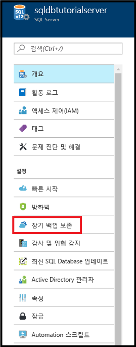

3. 서버에 대한 **장기 백업 보존** 페이지에서 미리 보기 약관을 검토하고 동의합니다(이미 실행하지 않은 한 - 또는 이 기능은 미리 보기에 없음).

   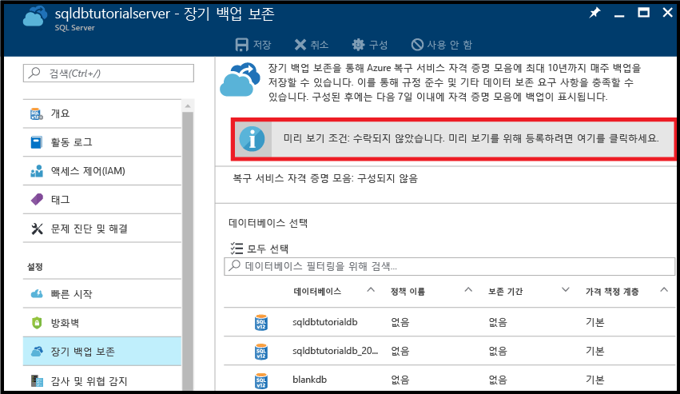

4. 장기 백업 보존을 구성하려면 표에서 해당 데이터베이스를 선택하고 도구 모음에서 **구성**을 클릭합니다.

   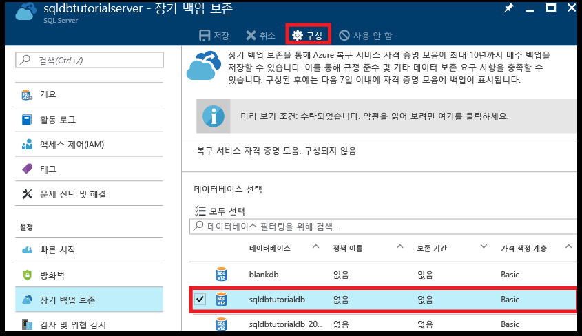

5. **구성** 페이지에서 **복구 서비스 자격 증명 모음** 아래의 **필요한 설정 구성**을 클릭합니다.

   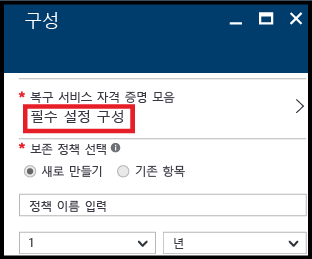

6. **Recovery Services 자격 증명 모음** 페이지에서 있는 경우 기존 자격 증명 모음을 선택합니다. 그렇지 않으면 구독에 대한 복구 서비스 자격 증명 모음을 찾을 수 없는 경우 클릭하여 흐름을 종료하고 복구 서비스 자격 증명 모음을 만듭니다.

   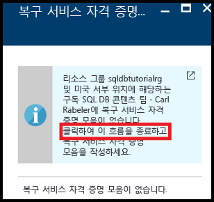

7. **Recovery Services 자격 증명 모음** 페이지에서 **추가**를 클릭합니다.

   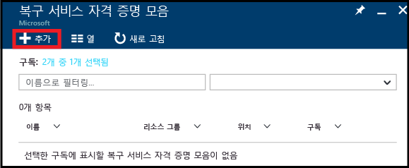
   
8. **Recovery Services 자격 증명 모음** 페이지에서 Recovery Services 자격 증명 모음에 대한 유효한 이름을 제공합니다.

   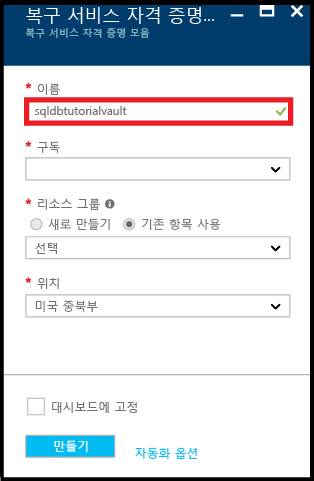

9. 구독 및 리소스 그룹을 선택한 다음 자격 증명 모음에 대한 위치를 선택합니다. 완료하면 **만들기**를 클릭합니다.

   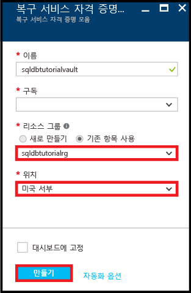

   > [!IMPORTANT]
   > 자격 증명 모음은 Azure SQL 논리 서버와 동일한 지역에 있어야 하고 논리 서버와 동일한 리소스 그룹을 사용해야 합니다.
   >

10. 새 자격 증명 모음을 만든 후 필요한 단계를 실행하여 **Recovery Services 자격 증명 모음** 페이지로 돌아갑니다.

11. **Recovery Services 자격 증명 모음** 페이지에서 자격 증명 모음을 클릭한 다음 **선택**을 클릭합니다.

   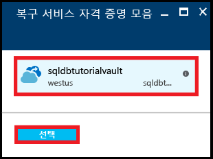

12. **구성** 페이지에서 새 보존 정책에 대한 유효한 이름을 제공하고 기본 보존 정책을 적절하게 수정한 다음 **확인**을 클릭합니다.

   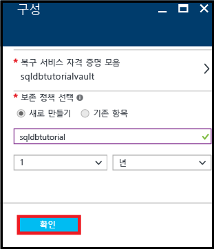
   
   >[!NOTE]
   >보존 정책 이름은 공백을 비롯한 일부 문자를 허용하지 않습니다.

13. 데이터베이스에 대한 **장기 백업 보존** 페이지에서 **저장**을 클릭한 다음 **확인**을 클릭하여 선택된 모든 데이터베이스에 장기 백업 보존 정책을 적용합니다.

   

14. **저장**을 클릭하여 구성한 Azure Recovery Services 자격 증명 모음에 이 새 정책을 사용하는 장기 백업 보존을 활성화합니다.

   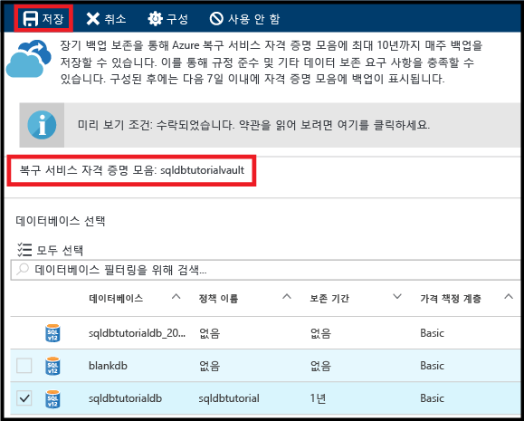

> [!IMPORTANT]
> 구성되면 백업은 다음 7일 동안 자격 증명 모음에 표시됩니다. 백업이 자격 증명 모음에 표시될 때까지 이 자습서를 계속하지 마십시오.
>

### <a name="view-backups-in-long-term-retention-using-azure-portal"></a>Azure Portal을 사용하여 장기 보존에서 백업 보기

[장기 백업 보존](sql-database-long-term-retention.md)에서 데이터베이스 백업에 대한 정보 보기. 

1. Azure Portal에서 데이터베이스 백업에 대한 Azure Recovery Services 자격 증명 모음을 열어(**모든 리소스**로 이동하고 구독에 대한 리소스 목록에서 선택) 자격 증명 모음의 데이터베이스 백업에서 사용되는 저장소의 양을 봅니다.

   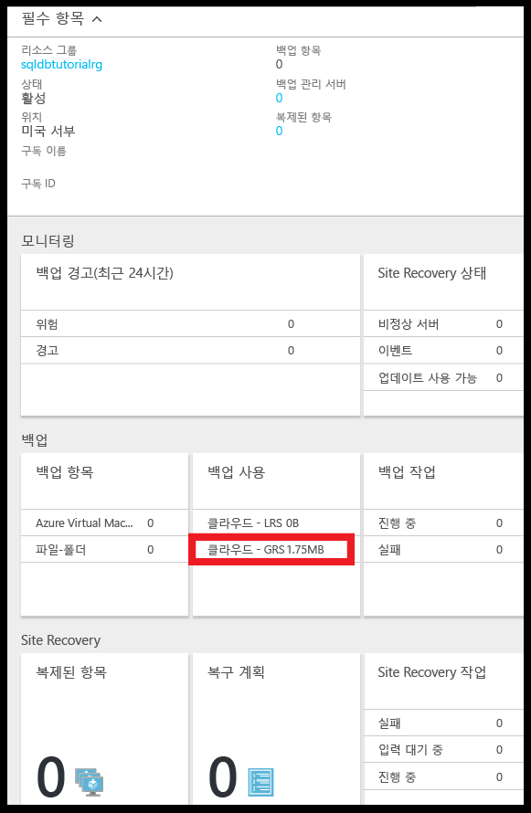

2. 데이터베이스에 대한 **SQL Database** 페이지를 엽니다.

   

3. 도구 모음에서 **복원**을 클릭합니다.

   

4. 복원 페이지에서 **장기**를 클릭합니다.

5. Azure 자격 증명 모음 백업에서 **백업 선택**을 클릭하여 장기 백업 보존에서 사용 가능한 데이터베이스 백업을 봅니다.

   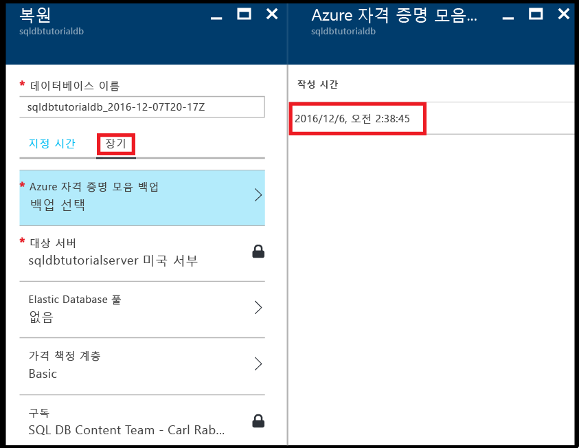

### <a name="restore-a-database-from-a-backup-in-long-term-backup-retention-using-the-azure-portal"></a>Azure Portal을 사용하여 장기 백업 보존의 백업에서 데이터베이스 복원

Azure Recovery Services 자격 증명 모음의 백업에서 새 데이터베이스로 데이터베이스를 복원합니다.

1. **Azure 자격 증명 모음 백업** 페이지에서 백업을 클릭하여 복원한 다음 **선택**을 클릭합니다.

   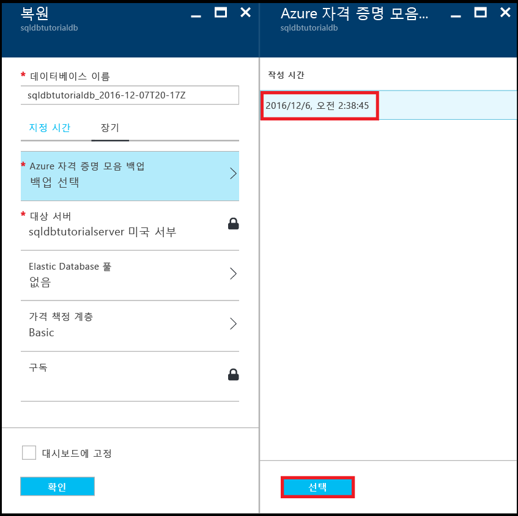

2. **데이터베이스 이름** 텍스트 상자에서 복원된 데이터베이스에 대한 이름을 제공합니다.

   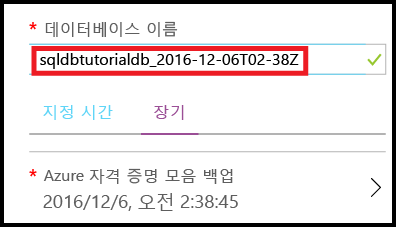

3. **확인**을 클릭하여 자격 증명 모음의 백업에서 새 데이터베이스로 데이터베이스를 복원합니다.

4. 도구 모음에서 알림 아이콘을 클릭하여 복원 작업의 상태를 봅니다.

   

5. 복원 작업이 완료되면 **SQL Database** 페이지를 열어 새로 복원된 데이터베이스를 봅니다.

   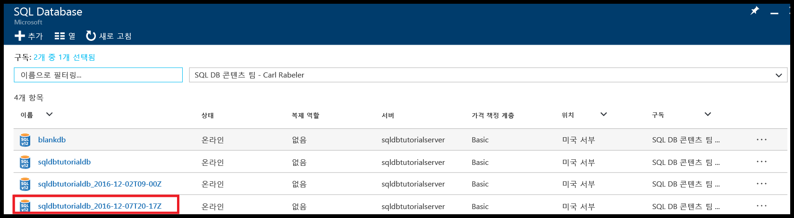

> [!NOTE]
> 여기에서 SQL Server Management Studio를 사용하여 복원된 데이터베이스에 연결하여 [복원된 데이터베이스에서 일부 데이터를 추출하여 기존 데이터베이스로 복사 또는 기존 데이터베이스를 삭제하고 복원된 데이터베이스 이름을 기존 데이터베이스 이름으로 변경](sql-database-recovery-using-backups.md#point-in-time-restore)하기와 같은 필요한 작업을 수행할 수 있습니다.
>

## <a name="powershell"></a>PowerShell

다음 섹션에서는 PowerShell을 사용하여 Azure Recovery Services 자격 증명 모음을 구성하고 자격 증명 모음에서 백업을 보고 자격 증명 모음에서 복원하는 방법을 보여 줍니다.

### <a name="create-a-recovery-services-vault"></a>복구 서비스 자격 증명 모음 만들기

[New-AzureRmRecoveryServicesVault](/powershell/module/azurerm.recoveryservices/new-azurermrecoveryservicesvault)를 사용하여 복구 서비스 자격 증명 모음을 만듭니다.

> [!IMPORTANT]
> 자격 증명 모음은 Azure SQL 논리 서버와 동일한 지역에 있어야 하고 논리 서버와 동일한 리소스 그룹을 사용해야 합니다.

```PowerShell
# Create a recovery services vault

#$resourceGroupName = "{resource-group-name}"
#$serverName = "{server-name}"
$serverLocation = (Get-AzureRmSqlServer -ServerName $serverName -ResourceGroupName $resourceGroupName).Location
$recoveryServiceVaultName = "{new-vault-name}"

$vault = New-AzureRmRecoveryServicesVault -Name $recoveryServiceVaultName -ResourceGroupName $ResourceGroupName -Location $serverLocation 
Set-AzureRmRecoveryServicesBackupProperties -BackupStorageRedundancy LocallyRedundant -Vault $vault
```

### <a name="set-your-server-to-use-the-recovery-vault-for-its-long-term-retention-backups"></a>장기 보존 백업을 위해 복구 자격 증명 모음을 사용하도록 서버 설정

[Set-AzureRmSqlServerBackupLongTermRetentionVault](/powershell/module/azurerm.sql/set-azurermsqlserverbackuplongtermretentionvault) cmdlet을 사용하여 이전에 만든 복구 서비스 자격 증명 모음을 특정 Azure SQL Server와 연결합니다.

```PowerShell
# Set your server to use the vault to for long-term backup retention 

Set-AzureRmSqlServerBackupLongTermRetentionVault -ResourceGroupName $resourceGroupName -ServerName $serverName -ResourceId $vault.Id
```

### <a name="create-a-retention-policy"></a>보존 정책 만들기

보존 정책은 데이터베이스 백업을 보관할 기간을 설정하는 곳입니다. [Get-AzureRmRecoveryServicesBackupRetentionPolicyObject](https://docs.microsoft.com/powershell/module/azurerm.recoveryservices.backup/get-azurermrecoveryservicesbackupretentionpolicyobject) cmdlet을 사용하여 정책을 만들기 위한 템플릿으로 사용할 기본 보존 정책을 가져옵니다. 이 템플릿에서 보존 기간은 2년으로 설정됩니다. 다음으로 [New-AzureRmRecoveryServicesBackupProtectionPolicy](/powershell/module/azurerm.recoveryservices.backup/new-azurermrecoveryservicesbackupprotectionpolicy)를 실행하여 마지막으로 정책을 만듭니다. 

> [!NOTE]
> 일부 cmdlet은 [Set-AzureRmRecoveryServicesVaultContext](/powershell/module/azurerm.recoveryservices/set-azurermrecoveryservicesvaultcontext)를 실행하기 전에 자격 증명 모음 컨텍스트를 설정해야 관련된 몇 가지 코드 조각에서 이 cmdlet을 볼 수 있습니다. 정책이 자격 증명 모음의 일부이기 때문에 컨텍스트를 설정해야 합니다. 각 자격 증명 모음에 대해 여러 보존 정책을 만든 다음 원하는 정책을 특정 데이터베이스에 적용할 수 있습니다. 


```PowerShell
# Retrieve the default retention policy for the AzureSQLDatabase workload type
$retentionPolicy = Get-AzureRmRecoveryServicesBackupRetentionPolicyObject -WorkloadType AzureSQLDatabase

# Set the retention value to two years (you can set to any time between 1 week and 10 years)
$retentionPolicy.RetentionDurationType = "Years"
$retentionPolicy.RetentionCount = 2
$retentionPolicyName = "my2YearRetentionPolicy"

# Set the vault context to the vault you are creating the policy for
Set-AzureRmRecoveryServicesVaultContext -Vault $vault

# Create the new policy
$policy = New-AzureRmRecoveryServicesBackupProtectionPolicy -name $retentionPolicyName -WorkloadType AzureSQLDatabase -retentionPolicy $retentionPolicy
$policy
```

### <a name="configure-a-database-to-use-the-previously-defined-retention-policy"></a>이전에 정의한 보존 정책을 사용하도록 데이터베이스 구성

[Set-AzureRmSqlDatabaseBackupLongTermRetentionPolicy](/powershell/module/azurerm.sql/set-azurermsqldatabasebackuplongtermretentionpolicy) cmdlet을 사용하여 새 정책을 특정 데이터베이스에 적용합니다.

```PowerShell
# Enable long-term retention for a specific SQL database
$policyState = "enabled"
Set-AzureRmSqlDatabaseBackupLongTermRetentionPolicy -ResourceGroupName $resourceGroupName -ServerName $serverName -DatabaseName $databaseName -State $policyState -ResourceId $policy.Id
```

### <a name="view-backup-info-and-backups-in-long-term-retention"></a>백업 정보 및 장기 보존 백업 보기

[장기 백업 보존](sql-database-long-term-retention.md)에서 데이터베이스 백업에 대한 정보 보기. 

다음 cmdlet을 사용하여 백업 정보를 확인합니다.

- [Get-AzureRmRecoveryServicesBackupContainer](/powershell/module/azurerm.recoveryservices.backup/get-azurermrecoveryservicesbackupcontainer)
- [Get-AzureRmRecoveryServicesBackupItem](/powershell/module/azurerm.recoveryservices.backup/get-azurermrecoveryservicesbackupitem)
- [Get-AzureRmRecoveryServicesBackupRecoveryPoint](/powershell/module/azurerm.recoveryservices.backup/get-azurermrecoveryservicesbackuprecoverypoint)

```PowerShell
#$resourceGroupName = "{resource-group-name}"
#$serverName = "{server-name}"
$databaseNeedingRestore = $databaseName

# Set the vault context to the vault we want to restore from
#$vault = Get-AzureRmRecoveryServicesVault -ResourceGroupName $resourceGroupName
Set-AzureRmRecoveryServicesVaultContext -Vault $vault

# the following commands find the container associated with the server 'myserver' under resource group 'myresourcegroup'
$container = Get-AzureRmRecoveryServicesBackupContainer -ContainerType AzureSQL -FriendlyName $vault.Name

# Get the long-term retention metadata associated with a specific database
$item = Get-AzureRmRecoveryServicesBackupItem -Container $container -WorkloadType AzureSQLDatabase -Name $databaseNeedingRestore

# Get all available backups for the previously indicated database
# Optionally, set the -StartDate and -EndDate parameters to return backups within a specific time period
$availableBackups = Get-AzureRmRecoveryServicesBackupRecoveryPoint -Item $item
$availableBackups
```

### <a name="restore-a-database-from-a-backup-in-long-term-backup-retention"></a>장기 백업 보존의 백업에서 데이터베이스 복원

장기 백업 보존에서 복원은 [Restore-AzureRmSqlDatabase](/powershell/module/azurerm.sql/restore-azurermsqldatabase) cmdlet을 사용합니다.

```PowerShell
# Restore the most recent backup: $availableBackups[0]
#$resourceGroupName = "{resource-group-name}"
#$serverName = "{server-name}"
$restoredDatabaseName = "{new-database-name}"
$edition = "Basic"
$performanceLevel = "Basic"

$restoredDb = Restore-AzureRmSqlDatabase -FromLongTermRetentionBackup -ResourceId $availableBackups[0].Id -ResourceGroupName $resourceGroupName `
 -ServerName $serverName -TargetDatabaseName $restoredDatabaseName -Edition $edition -ServiceObjectiveName $performanceLevel
$restoredDb
```


> [!NOTE]
> 여기에서 SQL Server Management Studio를 사용하여 복원된 데이터베이스에 연결하고, 이 데이터베이스에서 약간의 데이터를 추출하여 기존 데이터베이스에 복사하거나 기존 데이터베이스를 삭제하고 복원된 데이터베이스 이름을 기존 데이터베이스 이름으로 변경하는 등 필요한 작업을 수행할 수 있습니다. [특정 시점 복원](sql-database-recovery-using-backups.md#point-in-time-restore)을 참조하세요.

## <a name="how-to-cleanup-backups-in-recovery-services-vault"></a>Recovery Services 자격 증명 모음에서 백업을 정리하는 방법

2018년 7월 1일부터 LTR V1 API가 사용되지 않으며 Recovery Service 자격 증명 모음의 모든 기존 백업은 SQL Database에서 관리되는 LTR 저장소 컨테이너에 마이그레이션됩니다. 원래 백업에 더 이상 요금이 청구되지 않도록 하기 위해 마이그레이션 이후 자격 증명 모음에서 제거됩니다. 그러나 자격 증명 모음에 잠금을 배치하는 경우 백업이 유지됩니다. 불필요한 요금을 방지하려면 다음 스크립트를 사용하여 Recovery Service 자격 증명 모음에서 이전 백업을 수동으로 제거할 수 있습니다. 

```PowerShell
<#
.EXAMPLE
    .\Drop-LtrV1Backup.ps1 -SubscriptionId “{vault_sub_id}” -ResourceGroup “{vault_resource_group}” -VaultName “{vault_name}” 
#>
[CmdletBinding()]
Param (
    [Parameter(Mandatory = $true, HelpMessage="The vault subscription ID")]
    $SubscriptionId,

    [Parameter(Mandatory = $true, HelpMessage="The vault resource group name")]
    $ResourceGroup,

    [Parameter(Mandatory = $true, HelpMessage="The vault name")]
    $VaultName
)

Login-AzureRmAccount

Select-AzureRmSubscription -SubscriptionId $SubscriptionId

$vaults = Get-AzureRmRecoveryServicesVault
$vault = $vaults | where { $_.Name -eq $VaultName }

Set-AzureRmRecoveryServicesVaultContext -Vault $vault

$containers = Get-AzureRmRecoveryServicesBackupContainer -ContainerType AzureSQL

ForEach ($container in $containers)
{
   $canDeleteContainer = $true  
   $ItemCount = 0
   Write-Host "Working on container" $container.Name
   $items = Get-AzureRmRecoveryServicesBackupItem -container $container -WorkloadType AzureSQLDatabase
   ForEach ($item in $items)
   {
          write-host "Deleting item" $item.name
          Disable-AzureRmRecoveryServicesBackupProtection -RemoveRecoveryPoints -item $item -Force
   }

   Write-Host "Deleting container" $container.Name
   Unregister-AzureRmRecoveryServicesBackupContainer -Container $container
}
```

## <a name="next-steps"></a>다음 단계

- 서비스에서 생성된 자동 백업에 대해 알아보려면 [자동 백업](sql-database-automated-backups.md) 참조
- 장기 백업 보존에 대해 알아보려면 [장기 백업 보존](sql-database-long-term-retention.md) 참조
- 백업에서 복원에 대해 알아보려면 [백업에서 복원](sql-database-recovery-using-backups.md) 참조
