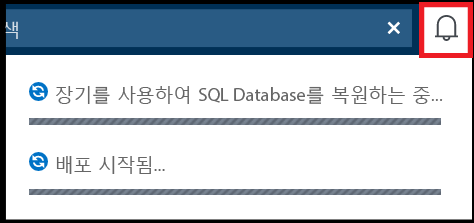

# <a name="manage-azure-sql-database-long-term-backup-retention"></a>Azure SQL Database 장기 백업 보존 관리

Azure SQL Database에서는 최대 10년 동안 Azure Blob Storage에 백업을 자동으로 보관하도록 [장기 백업 보존](sql-database-long-term-retention.md) 정책(LTR)을 사용하여 단일 데이터베이스나 풀링된 데이터베이스를 구성할 수 있습니다. 그런 다음, Azure Portal이나 PowerShell에서 이러한 백업을 사용하여 데이터베이스를 복구할 수 있습니다.

> [!IMPORTANT]
> [Azure SQL Database Managed Instance](sql-database-managed-instance.md)는 현재 장기 백업 보존을 지원하지 않습니다.

## <a name="use-the-azure-portal-to-configure-long-term-retention-policies-and-restore-backups"></a>Azure Portal을 사용하여 장기 보존 정책 구성 및 백업 복원

다음 섹션에서는 Azure Portal을 사용하여 장기 보존을 구성하고, 장기 보존되는 백업을 보고, 장기 보존에서 백업을 복원하는 방법을 보여줍니다.

### <a name="configure-long-term-retention-policies"></a>장기 보존 정책 구성

서비스 계층의 보존 기간보다 긴 기간 동안 [자동화된 백업을 유지](sql-database-long-term-retention.md)하도록 SQL Database를 구성할 수 있습니다. 

1. Azure Portal에서 SQL Server를 선택한 다음, **백업 관리**를 클릭합니다. **정책 구성** 탭에서 *장기 백업 보존 정책을 설정하거나 수정할 데이터베이스에 대한 확인란을 선택합니다*. 데이터베이스 옆의 확인란을 선택하지 않으면 정책에 대한 변경 내용이 해당 데이터베이스에 적용되지 않습니다.  

   

2. **정책 구성** 창에서 매주, 매달 또는 매년 백업을 보존할지 여부를 선택하고 각각에 대해 보존 기간을 지정합니다. 

   

3. 완료되면 **적용**을 클릭합니다.

### <a name="view-backups-and-restore-from-a-backup-using-azure-portal"></a>Azure Portal을 사용하여 백업을 보고 백업에서 복원

LTR 정책으로 특정 데이터베이스에 보존된 백업을 보고 해당 백업에서 복원합니다. 

1. Azure Portal에서 SQL Server를 선택한 다음, **백업 관리**를 클릭합니다. **사용 가능한 백업** 탭에서 사용 가능한 백업을 보려는 데이터베이스를 선택합니다.

   

3. **사용 가능한 백업** 창에서 사용 가능한 백업을 검토합니다. 

   

4. 복원에 사용할 백업을 선택한 다음, 새 데이터베이스 이름을 지정합니다.

   

5. **확인**을 클릭하여 Azure SQL 저장소의 백업에서 새 데이터베이스로 데이터베이스를 복원합니다.

6. 도구 모음에서 알림 아이콘을 클릭하여 복원 작업의 상태를 봅니다.

   

5. 복원 작업이 완료되면 **SQL Database** 페이지를 열어 새로 복원된 데이터베이스를 봅니다.

> [!NOTE]
> 여기에서 SQL Server Management Studio를 사용하여 복원된 데이터베이스에 연결하여 [복원된 데이터베이스에서 일부 데이터를 추출하여 기존 데이터베이스로 복사 또는 기존 데이터베이스를 삭제하고 복원된 데이터베이스 이름을 기존 데이터베이스 이름으로 변경](sql-database-recovery-using-backups.md#point-in-time-restore)하기와 같은 필요한 작업을 수행할 수 있습니다.
>

## <a name="use-powershell-to-configure-long-term-retention-policies-and-restore-backups"></a>PowerShell을 사용하여 장기 보존 정책 구성 및 백업 복원

다음 섹션에서는 PowerShell을 사용하여 장기 백업 보존을 구성하고 Azure SQL 저장소에서 백업을 확인하고 Azure SQL 저장소의 백업에서 복원하는 방법을 보여줍니다.

> [!IMPORTANT]
> LTR V2 API는 다음과 같은 PowerShell 버전에서 지원됩니다.
- [AzureRM.Sql-4.5.0](https://www.powershellgallery.com/packages/AzureRM.Sql/4.5.0) 이상
- [AzureRM-6.1.0](https://www.powershellgallery.com/packages/AzureRM/6.1.0) 이상
> 

### <a name="rbac-roles-to-manage-long-term-retention"></a>장기 보존을 관리하는 RBAC 역할

LTR 백업을 관리하려면 다음 역할에 속해야 합니다. 
- 구독 소유자 또는
- **구독** 범위의 SQL Server 참가자 역할 또는
- **구독** 범위의 SQL Database 참가자 역할

역할을 더 세부적으로 제어해야 하는 경우 사용자 지정 RBAC 역할을 만들어 **구독** 범위에 할당할 수 있습니다. 

**Get-AzureRmSqlDatabaseLongTermRetentionBackup** 및 **Restore-AzureRmSqlDatabase**의 경우 역할에는 다음 권한이 있어야 합니다.

Microsoft.Sql/locations/longTermRetentionBackups/read Microsoft.Sql/locations/longTermRetentionServers/longTermRetentionBackups/read Microsoft.Sql/locations/longTermRetentionServers/longTermRetentionDatabases/longTermRetentionBackups/read
 
**Remove-AzureRmSqlDatabaseLongTermRetentionBackup**의 경우 역할에는 다음 권한이 있어야 합니다.

Microsoft.Sql/locations/longTermRetentionServers/longTermRetentionDatabases/longTermRetentionBackups/delete


### <a name="create-an-ltr-policy"></a>LTR 정책 만들기

```powershell
# Get the SQL server 
# $subId = “{subscription-id}”
# $serverName = “{server-name}”
# $resourceGroup = “{resource-group-name}” 
# $dbName = ”{database-name}”

Connect-AzureRmAccount
Select-AzureRmSubscription -SubscriptionId $subId

# get the server
$server = Get-AzureRmSqlServer -ServerName $serverName -ResourceGroupName $resourceGroup

# create LTR policy with WeeklyRetention = 12 weeks. MonthlyRetention and YearlyRetention = 0 by default.
Set-AzureRmSqlDatabaseBackupLongTermRetentionPolicy -ServerName $serverName -DatabaseName $dbName -ResourceGroupName $resourceGroup -WeeklyRetention P12W 

# create LTR policy with WeeklyRetention = 12 weeks, YearlyRetention = 5 years and WeekOfYear = 16 (week of April 15). MonthlyRetention = 0 by default.
Set-AzureRmSqlDatabaseBackupLongTermRetentionPolicy -ServerName $serverName -DatabaseName $dbName -ResourceGroupName $resourceGroup -WeeklyRetention P12W -YearlyRetention P5Y -WeekOfYear 16
```

### <a name="view-ltr-policies"></a>LTR 정책 보기
이 예제에서는 서버 내의 LTR 정책을 나열하는 방법을 보여줍니다.

```powershell
# Get all LTR policies within a server
$ltrPolicies = Get-AzureRmSqlDatabase -ResourceGroupName Default-SQL-WestCentralUS -ServerName trgrie-ltr-server | Get-AzureRmSqlDatabaseLongTermRetentionPolicy -Current 

# Get the LTR policy of a specific database 
$ltrPolicies = Get-AzureRmSqlDatabaseBackupLongTermRetentionPolicy -ServerName $serverName -DatabaseName $dbName  -ResourceGroupName $resourceGroup -Current
```
### <a name="clear-an-ltr-policy"></a>LTR 정책 지우기
이 예제에서는 데이터베이스에서 LTR 정책을 지우는 방법을 보여줍니다.

```powershell
Set-AzureRmSqlDatabaseBackupLongTermRetentionPolicy -ServerName $serverName -DatabaseName $dbName -ResourceGroupName $resourceGroup -RemovePolicy
```

### <a name="view-ltr-backups"></a>LTR 백업 보기

이 예제에서는 서버 내의 LTR 백업을 나열하는 방법을 보여줍니다. 

```powershell
# Get the list of all LTR backups in a specific Azure region 
# The backups are grouped by the logical database id.
# Within each group they are ordered by the timestamp, the earliest
# backup first.  
$ltrBackups = Get-AzureRmSqlDatabaseLongTermRetentionBackup -Location $server.Location 

# Get the list of LTR backups from the Azure region under 
# the named server. 
$ltrBackups = Get-AzureRmSqlDatabaseLongTermRetentionBackup -Location $server.Location -ServerName $serverName

# Get the LTR backups for a specific database from the Azure region under the named server 
$ltrBackups = Get-AzureRmSqlDatabaseLongTermRetentionBackup -Location $server.Location -ServerName $serverName -DatabaseName $dbName

# List LTR backups only from live databases (you have option to choose All/Live/Deleted)
$ltrBackups = Get-AzureRmSqlDatabaseLongTermRetentionBackup -Location $server.Location -DatabaseState Live

# Only list the latest LTR backup for each database 
$ltrBackups = Get-AzureRmSqlDatabaseLongTermRetentionBackup -Location $server.Location -ServerName $serverName -OnlyLatestPerDatabase
```

### <a name="delete-ltr-backups"></a>LTR 백업 삭제

이 예제에서는 백업 목록에서 LTR 백업을 삭제하는 방법을 보여줍니다.

```powershell
# remove the earliest backup 
$ltrBackup = $ltrBackups[0]
Remove-AzureRmSqlDatabaseLongTermRetentionBackup -ResourceId $ltrBackup.ResourceId
```
> [!IMPORTANT]
> LTR 백업을 삭제하면 되돌릴 수 없습니다. ‘장기 보존 백업 삭제’ 작업으로 필터링하여 Azure Monitor에서 각 삭제에 대한 알림을 설정할 수 있습니다. 활동 로그에는 요청한 사람과 시기에 대한 정보가 포함되어 있습니다. 자세한 지침은 [활동 로그 경고 만들기](../azure-monitor/platform/alerts-activity-log.md)를 참조하세요.
>

### <a name="restore-from-ltr-backups"></a>LTR 백업에서 복원
이 예제에서는 LTR 백업에서 복원하는 방법을 보여줍니다. 이 인터페이스는 변경되지 않았지만 이제 리소스 ID 매개 변수에 LTR 백업 리소스 ID가 필요합니다. 

```powershell
# Restore LTR backup as an S3 database
Restore-AzureRmSqlDatabase -FromLongTermRetentionBackup -ResourceId $ltrBackup.ResourceId -ServerName $serverName -ResourceGroupName $resourceGroup -TargetDatabaseName $dbName -ServiceObjectiveName S3
```

> [!NOTE]
> 여기에서 SQL Server Management Studio를 사용하여 복원된 데이터베이스에 연결하고, 이 데이터베이스에서 약간의 데이터를 추출하여 기존 데이터베이스에 복사하거나 기존 데이터베이스를 삭제하고 복원된 데이터베이스 이름을 기존 데이터베이스 이름으로 변경하는 등 필요한 작업을 수행할 수 있습니다. [특정 시점 복원](sql-database-recovery-using-backups.md#point-in-time-restore)을 참조하세요.

## <a name="next-steps"></a>다음 단계

- 서비스에서 생성된 자동 백업에 대해 알아보려면 [자동 백업](sql-database-automated-backups.md) 참조
- 장기 백업 보존에 대해 알아보려면 [장기 백업 보존](sql-database-long-term-retention.md) 참조
