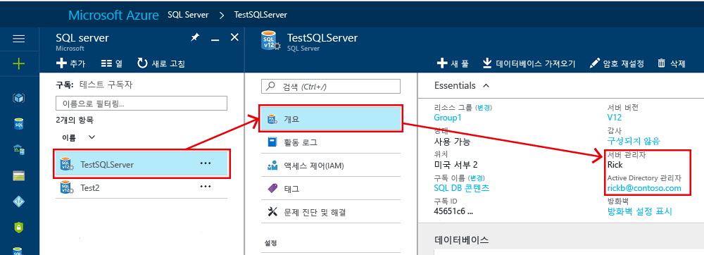
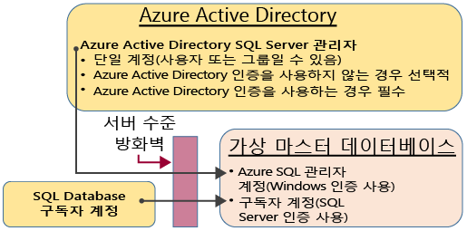
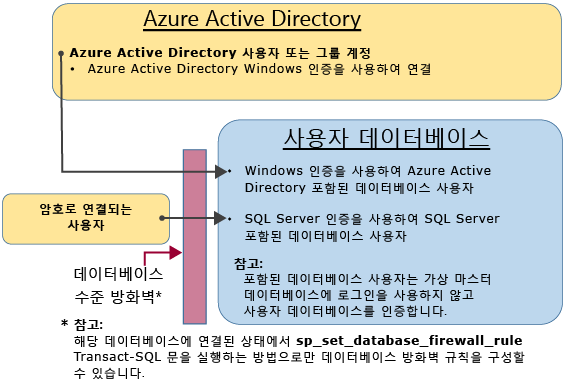

# <a name="controlling-and-granting-database-access-to-sql-database-and-sql-data-warehouse"></a>SQL Database 및 SQL Data Warehouse에 대한 액세스 제어 및 권한 부여

방화벽 규칙이 구성된 후에는 관리자 계정 중 하나로, 데이터베이스 소유자로 또는 데이터베이스의 데이터베이스 사용자로 [SQL Database](sql-database-technical-overview.md) 및 [SQL Data Warehouse](../sql-data-warehouse/sql-data-warehouse-overview-what-is.md)에 연결할 수 있습니다.  

> [!NOTE]  
> 이 항목은 Azure SQL 서버 및 Azure SQL 서버에서 생성된 SQL Database와 SQL Data Warehouse 데이터베이스에 적용됩니다. 간단히 하기 위해 SQL Database는 SQL Database와 SQL Data Warehouse를 참조할 때 사용됩니다. 
> [!TIP]
> 자습서는 [Azure SQL Database 보안](sql-database-security-tutorial.md)을 참조하세요. 이 자습서는 **Azure SQL Database Managed Instance**에 적용되지 않습니다.

## <a name="unrestricted-administrative-accounts"></a>무제한 관리 계정

관리자로 작동하는 두 가지 관리 계정(**서버 관리자** 및 **Active Directory 관리자**)이 있습니다. SQL 서버에 대해 이러한 관리자 계정을 식별하려면 Azure Portal을 열고 SQL Server 또는 SQL Database의 [속성] 탭으로 이동합니다.



- **서버 관리자**

  Azure SQL 서버를 만들 때 **서버 관리자 로그인**을 지정해야 합니다. SQL 서버는 master 데이터베이스에 로그인으로 해당 계정을 만듭니다. 이 계정은 SQL Server 인증(사용자 이름 및 암호)을 사용하여 연결됩니다. 이러한 계정 중 하나만 존재할 수 있습니다.

  > [!NOTE]
  > 서버 관리자에 대한 암호를 다시 설정하려면 [Azure Portal](https://portal.azure.com)로 이동하여 **SQL Server**를 클릭하고 목록에서 서버를 선택한 다음, **암호 재설정**을 클릭합니다.

- **Azure Active Directory 관리자**

  하나의 Azure Active Directory 계정, 개인 또는 보안 그룹 계정을 관리자로 구성할 수도 있습니다. Azure AD 관리자를 구성하는 것은 선택 사항이지만, Azure AD 계정을 사용하여 SQL Database에 연결하려면 Azure AD 관리자를 **반드시** 구성해야 합니다. Azure Active Directory 액세스 구성에 대한 자세한 내용은 [Azure Active Directory 인증을 사용하여 SQL Database 또는 SQL Data Warehouse에 연결](sql-database-aad-authentication.md) 및 [SQL Database 및 SQL Data Warehouse를 사용한 Azure AD MFA에 대한 SSMS 지원](sql-database-ssms-mfa-authentication.md)을 참조하세요.

**서버 관리자** 및 **Azure AD 관리자** 계정에는 다음과 같은 특징이 있습니다.

- 이들은 서버에서 모든 SQL Database에 자동으로 연결할 수 있는 유일한 계정입니다. (사용자 데이터베이스에 연결하려면 다른 계정은 데이터베이스의 소유자이거나 사용자 데이터베이스에 사용자 계정이 있어야 합니다.)
- 이러한 계정은 `dbo` 사용자로 사용자 데이터베이스에 들어가고 사용자 데이터베이스에서 모든 권한을 갖습니다. (사용자 데이터베이스의 소유자는 또한 `dbo` 사용자로 데이터베이스에 들어갑니다.) 
- `master` 데이터베이스에 `dbo` 사용자로 들어가지 마세요. 그리고 master에서는 제한된 사용 권한을 갖습니다. 
- SQL 데이터베이스에서 사용할 수 없는 표준 SQL Server `sysadmin` 고정 서버 역할의 멤버가 **아닙니다**.  
- 데이터베이스, 로그인, master의 사용자 및 서버 수준 IP 방화벽 규칙을 만들고 변경하고 삭제할 수 있습니다.
- `dbmanager` 및 `loginmanager` 역할에 멤버를 추가하고 제거할 수 있습니다.
- `sys.sql_logins` 시스템 테이블을 볼 수 있습니다.

### <a name="configuring-the-firewall"></a>방화벽 구성

서버 수준 방화벽을 개별 IP 주소 또는 범위로 구성하면 **SQL 서버 관리자** 및 **Azure Active Directory 관리자**는 master 데이터베이스와 모든 사용자 데이터베이스에 연결할 수 있습니다. 초기 서버 수준 방화벽은 [Azure Portal](sql-database-single-database-get-started.md)을 통하거나 [PowerShell](sql-database-powershell-samples.md) 또는 [REST API](https://msdn.microsoft.com/library/azure/dn505712.aspx)를 사용하여 구성할 수 있습니다. 연결이 설정되면 [Transact-SQL](sql-database-configure-firewall-settings.md)을 사용하여 추가적인 서버 수준 IP 방화벽 규칙도 구성할 수 있습니다.

### <a name="administrator-access-path"></a>관리자 액세스 경로

서버 수준 방화벽이 제대로 구성되면 **SQL 서버 관리자** 및 **Azure Active Directory 관리자**가 SQL Server Management Studio 또는 SQL Server Data Tools와 같은 클라이언트 도구를 사용하여 연결할 수 있습니다. 최신 도구만 모든 특징 및 기능을 제공합니다. 다음 다이어그램에서는 두 명의 관리자 계정에 대한 일반적인 구성을 보여 줍니다.



서버 수준 방화벽에서 열려 있는 포트를 사용하면 관리자가 모든 SQL Database에 연결할 수 있습니다.

### <a name="connecting-to-a-database-by-using-sql-server-management-studio"></a>SQL Server Management Studio를 사용하여 데이터베이스에 연결

서버, 데이터베이스, 서버 수준 IP 방화벽 규칙을 만들고 SQL Server Management Studio를 사용하여 데이터베이스를 쿼리하는 방법에 대한 연습은 [Azure Portal 및 SQL Server Management Studio를 사용하여 Azure SQL Database 서버, 데이터베이스 및 방화벽 규칙 시작](sql-database-single-database-get-started.md)을 참조하세요.

> [!IMPORTANT]
> Microsoft Azure 및 SQL Database에 대한 업데이트와 동기화 상태를 유지하려면 항상 최신 버전의 Management Studio를 사용하는 것이 좋습니다. [SQL Server Management Studio를 업데이트합니다](https://msdn.microsoft.com/library/mt238290.aspx).

## <a name="additional-server-level-administrative-roles"></a>추가 서버 수준 관리 역할

>[!IMPORTANT]
>이 역할은 **Azure SQL Database**에 관련이 있기 때문에 이 섹션은 **Azure SQL Database Managed Instance**에 적용되지 않습니다.

SQL Database는 앞에서 설명한 서버 수준 관리 역할 외에도 데이터베이스를 만들거나 로그인을 관리하는 권한을 부여하는 사용자 계정을 추가할 수 있도록 제한된 두 가지 관리 역할을 master 데이터베이스에 제공합니다.

### <a name="database-creators"></a>데이터베이스 작성자

이러한 관리 역할 중 하나는 **dbmanager** 역할입니다. 이 역할의 멤버는 새 데이터베이스를 만들 수 있습니다. 이 역할을 사용하려면 `master` 데이터베이스에 사용자를 만든 다음 해당 사용자를 **dbmanager** 데이터베이스 역할에 추가합니다. 데이터베이스를 만들려면 사용자가 `master` 데이터베이스의 SQL Server 로그인을 기반으로 한 사용자이거나 Azure Active Directory 사용자를 기반으로 한 포함된 데이터베이스 사용자여야 합니다.

1. 관리자 계정을 사용하여 `master` 데이터베이스에 연결합니다.
2. 선택적 단계: [CREATE LOGIN](https://msdn.microsoft.com/library/ms189751.aspx) 문을 사용하여 SQL Server 인증 로그인을 만듭니다. 샘플 문:

   ```sql
   CREATE LOGIN Mary WITH PASSWORD = '<strong_password>';
   ```

   > [!NOTE]
   > 로그인 또는 포함된 데이터베이스 사용자를 만들 때는 강력한 암호를 사용합니다. 자세한 내용은 [강력한 암호](https://msdn.microsoft.com/library/ms161962.aspx)를 참조하십시오.

   성능 향상을 위해 로그인(서버 수준 보안 주체)이 데이터베이스 수준에서 일시적으로 캐시됩니다. 인증 캐시를 새로 고치려면 [DBCC FLUSHAUTHCACHE](https://msdn.microsoft.com/library/mt627793.aspx)를 참조하세요.

3. `master` 데이터베이스에서 [CREATE USER](https://msdn.microsoft.com/library/ms173463.aspx) 문을 사용하여 사용자를 만듭니다. 사용자는 Azure Active Directory 인증 포함된 데이터베이스 사용자(Azure AD 인증에 대한 환경을 구성한 경우)이거나, SQL Server 인증 포함된 데이터베이스 사용자 또는 SQL Server 인증 로그인 기반 SQL Server 인증 사용자(이전 단계에서 만든)일 수 있습니다. 샘플 문:

   ```sql
   CREATE USER [mike@contoso.com] FROM EXTERNAL PROVIDER; -- To create a user with Azure Active Directory
   CREATE USER Ann WITH PASSWORD = '<strong_password>'; -- To create a SQL Database contained database user
   CREATE USER Mary FROM LOGIN Mary;  -- To create a SQL Server user based on a SQL Server authentication login
   ```

4. [ALTER ROLE](https://msdn.microsoft.com/library/ms189775.aspx) 문을 사용하여 `master`의 **dbmanager** 데이터베이스 역할에 새 사용자를 추가합니다. 샘플 문:

   ```sql
   ALTER ROLE dbmanager ADD MEMBER Mary; 
   ALTER ROLE dbmanager ADD MEMBER [mike@contoso.com];
   ```

   > [!NOTE]
   > dbmanager는 master 데이터베이스의 데이터베이스 역할이므로 데이터베이스 사용자를 dbmanager 역할에만 추가할 수 있습니다. 서버 수준 로그인을 데이터베이스 수준 역할에 추가할 수 없습니다.

5. 필요한 경우 새 사용자의 연결을 허용하도록 방화벽 규칙을 구성합니다. (새 사용자는 기존 방화벽 규칙에 의해 적용될 수 있습니다.)

이제 사용자가 `master` 데이터베이스에 연결할 수 있으며 새 데이터베이스를 만들 수 있습니다. 데이터베이스를 만드는 계정이 데이터베이스의 소유자가 됩니다.

### <a name="login-managers"></a>로그인 관리자

다른 관리 역할은 로그인 관리자 역할입니다. 이 역할의 멤버는 master 데이터베이스에 새 로그인을 만들 수 있습니다. 원한다면 동일한 단계(로그인 및 사용자 만들기, 사용자를 **loginmanager** 역할에 추가)를 완료하여 사용자가 master에서 새 로그인을 만들 수 있도록 합니다. 일반적으로 Microsoft는 로그인 기반 사용자를 사용하는 대신 데이터베이스 수준에서 인증하는 포함된 데이터베이스 사용자를 사용할 것을 권장하므로 로그인이 필수는 아닙니다. 자세한 내용은 [포함된 데이터베이스 사용자 - 데이터베이스를 이식 가능하게 만들기](https://msdn.microsoft.com/library/ff929188.aspx)를 참조하세요.

## <a name="non-administrator-users"></a>비관리자 사용자

일반적으로 비관리자 계정은 master 데이터베이스에 액세스할 필요가 없습니다. [CREATE USER(Transact-SQL)](https://msdn.microsoft.com/library/ms173463.aspx) 문을 사용하여 데이터베이스 수준에서 포함된 데이터베이스 사용자를 만듭니다. 사용자는 Azure Active Directory 인증 포함된 데이터베이스 사용자(Azure AD 인증에 대한 환경을 구성한 경우)이거나, SQL Server 인증 포함된 데이터베이스 사용자 또는 SQL Server 인증 로그인 기반 SQL Server 인증 사용자(이전 단계에서 만든)일 수 있습니다. 자세한 내용은 [포함된 데이터베이스 사용자 - 데이터베이스를 이식 가능하게 만들기](https://msdn.microsoft.com/library/ff929188.aspx)를 참조하세요. 

사용자를 만들고 데이터베이스에 연결하려면 다음 예제와 유사한 문을 실행합니다.

```sql
CREATE USER Mary FROM LOGIN Mary; 
CREATE USER [mike@contoso.com] FROM EXTERNAL PROVIDER;
```

처음에는 관리자 또는 데이터베이스 소유자 중 하나만 사용자를 만들 수 있습니다. 새 사용자를 만드는 추가 사용자의 권한을 부여하려면 다음과 같은 문을 사용하여 선택한 사용자에게 `ALTER ANY USER` 권한을 부여합니다.

```sql
GRANT ALTER ANY USER TO Mary;
```

추가 사용자에게 데이터베이스의 모든 권한을 부여하려면 **db_owner** 고정 데이터베이스 역할의 멤버로 설정합니다.

Azure SQL Database에서는 `ALTER ROLE` 문을 사용합니다.

```sql
ALTER ROLE db_owner ADD MEMBER Mary;
```

Azure SQL Data Warehouse에서는 [EXEC sp_addrolemember](/sql/relational-databases/system-stored-procedures/sp-addrolemember-transact-sql)를 사용합니다.
```sql
EXEC sp_addrolemember 'db_owner', 'Mary';
```


> [!NOTE]
> SQL Database 서버 로그인을 기반으로 데이터베이스 사용자를 만드는 일반적인 이유 중 하나는 여러 데이터베이스에 액세스해야 하는 사용자입니다. 포함된 데이터베이스 사용자가 개별 엔터티이므로 각 데이터베이스는 자체 사용자 및 암호를 유지합니다. 따라서 사용자가 각 데이터베이스의 암호를 모두 기억해야 하므로 오버헤드가 발생할 수 있으며, 여러 데이터베이스의 여러 암호를 변경해야 할 때 변경이 어려울 수 있습니다. 그러나 SQL Server 로그인 및 고가용성(활성 지역 복제 및 장애 조치(failover) 그룹)을 사용할 때 각 서버에서 SQL Server 로그인을 수동으로 설정해야 합니다. 그렇지 않으면 장애 조치(failover) 발생 후 데이터베이스 사용자가 더 이상 서버 로그인에 매핑되지 않으며, 장애 조치(failover) 후 데이터베이스에 액세스할 수 없게 됩니다. 지역 복제에 대한 로그인을 구성하는 방법에 대한 자세한 내용은 [지역 복원 또는 장애 조치를 위해 Azure SQL Database 보안 구성 및 관리](sql-database-geo-replication-security-config.md)를 참조하세요.

### <a name="configuring-the-database-level-firewall"></a>데이터베이스 수준 방화벽 구성

가장 좋은 방법은 비관리자 사용자가 방화벽을 통해서만 사용하는 데이터베이스에 액세스하는 것입니다. 서버 수준 방화벽을 통해 IP 주소를 권한 부여하고 모든 데이터베이스에 대한 액세스를 부여하는 대신 [sp_set_database_firewall_rule](https://msdn.microsoft.com/library/dn270010.aspx) 문을 사용하여 데이터베이스 수준 방화벽을 구성합니다. 포털을 사용해서는 데이터베이스 수준 방화벽을 구성할 수 없습니다.

### <a name="non-administrator-access-path"></a>비관리자 액세스 경로

데이터베이스 수준 방화벽이 제대로 구성되었으면 데이터베이스 사용자는 SQL Server Management Studio 또는 SQL Server Data Tools와 같은 클라이언트 도구를 사용하여 연결할 수 있습니다. 최신 도구만 모든 특징 및 기능을 제공합니다. 다음 다이어그램에서는 일반적인 비관리자 액세스 경로를 보여 줍니다.



## <a name="groups-and-roles"></a>그룹 및 역할

효율적인 액세스 관리에서는 개별 사용자 대신 그룹 및 역할에 할당된 권한을 사용합니다. 

- Azure Active Directory 인증을 사용하는 경우 Azure Active Directory 사용자를 Azure Active Directory 그룹에 배치합니다. 해당 그룹에 대해 포함된 데이터베이스 사용자를 만듭니다. 하나 이상의 데이터베이스 사용자를 [데이터베이스 역할](https://msdn.microsoft.com/library/ms189121)에 배치한 다음 해당 데이터베이스 역할에 [권한](https://msdn.microsoft.com/library/ms191291.aspx)을 할당합니다.

- SQL Server 인증을 사용하는 경우 포함된 데이터베이스 사용자를 데이터베이스에 만듭니다. 하나 이상의 데이터베이스 사용자를 [데이터베이스 역할](https://msdn.microsoft.com/library/ms189121)에 배치한 다음 해당 데이터베이스 역할에 [권한](https://msdn.microsoft.com/library/ms191291.aspx)을 할당합니다.

데이터베이스 역할은 **db_owner**, **db_ddladmin**, **db_datawriter**, **db_datareader**, **db_denydatawriter**, **db_denydatareader**와 같은 기본 제공된 역할일 수 있습니다. **db_owner**는 일반적으로 일부 사용자에게만 전체 권한을 부여하는 데 사용됩니다. 기타 고정된 데이터베이스 역할은 개발에서 단순한 데이터베이스를 신속하게 가져오는 데 유용하지만 대부분의 프로덕션 데이터베이스에는 권장되지 않습니다. 예를 들어 **db_datareader** 고정된 데이터베이스 역할은 데이터베이스에 있는 모든 테이블에 대한 읽기 액세스 권한을 부여하며 일반적으로 그 이상이 필요합니다. [CREATE ROLE](https://msdn.microsoft.com/library/ms187936.aspx) 문을 사용하여 고유의 사용자 정의된 데이터베이스 역할을 만들고 각 역할에 비즈니스 요구에 필요한 최소한의 권한을 신중하게 부여하는 것이 좋습니다. 사용자가 여러 역할의 멤버인 경우 모두에 대한 권한을 집계합니다.

## <a name="permissions"></a>권한

SQL Database에는 개별적으로 부여하거나 거부할 수 있는 100개가 넘는 사용 권한이 있습니다. 이러한 사용 권한은 대부분 중첩됩니다. 예를 들어 스키마에 대한 `UPDATE` 권한에는 해당 스키마 내에 있는 각 테이블에 대한 `UPDATE` 권한이 포함됩니다. 대부분의 사용 권한 시스템에서와 같이 사용 권한 거부는 권한 부여를 재정의합니다. 중첩된 특성과 사용 권한 수로 인해 데이터베이스를 제대로 보호할 적절한 사용 권한 시스템을 설계하는 데 신중을 기할 수 있습니다. [사용 권한(데이터베이스 엔진)](https://docs.microsoft.com/sql/relational-databases/security/permissions-database-engine)에서 사용 권한 목록부터 시작하여 사용 권한의 [포스터 크기 그래픽](https://docs.microsoft.com/sql/relational-databases/security/media/database-engine-permissions.png)을 검토하세요.


### <a name="considerations-and-restrictions"></a>고려 사항 및 제한 사항

SQL Database에서 로그인 및 사용자를 관리하는 경우 다음 사항을 고려합니다.

- `CREATE/ALTER/DROP DATABASE` 문을 실행할 경우 **master** 데이터베이스에 연결해야 합니다.   
- **Server 관리자** 로그인에 해당하는 데이터베이스 사용자를 변경 또는 삭제할 수 없습니다. 
- **Server 관리자** 로그인의 기본 언어는 미국 영어입니다.
- 관리자(**Server 관리자** 로그인 또는 Azure AD 관리자) 및 **master** 데이터베이스에서 **dbmanager** 데이터베이스 역할의 멤버만 `CREATE DATABASE` 및 `DROP DATABASE` 문을 실행할 사용 권한이 있습니다.
- `CREATE/ALTER/DROP LOGIN` 문을 실행할 경우 master 데이터베이스에 연결해야 합니다. 그러나 로그인 사용은 권장되지 않습니다. 대신에 포함된 데이터베이스 사용자를 사용합니다.
- 사용자 데이터베이스에 연결하려면 연결 문자열에 데이터베이스 이름을 제공해야 합니다.
- **master** 데이터베이스에서 **loginmanager** 데이터베이스 역할의 서버 수준 보안 주체 로그인 및 멤버는 `CREATE LOGIN`, `ALTER LOGIN` 및 `DROP LOGIN` 문을 실행할 권한이 있습니다.
- ADO.NET 애플리케이션에서 `CREATE/ALTER/DROP LOGIN` 및 `CREATE/ALTER/DROP DATABASE` 문을 실행하는 경우 매개 변수화된 명령을 사용할 수 없습니다. 자세한 내용은 [명령 및 매개 변수](https://msdn.microsoft.com/library/ms254953.aspx)를 참조하세요.
- `CREATE/ALTER/DROP DATABASE` 및 `CREATE/ALTER/DROP LOGIN` 문을 실행하는 경우 이러한 각 문은 Transact-SQL 배치에서 유일한 문이어야 합니다. 그렇지 않은 경우 오류가 발생합니다. 예를 들어 다음 Transact-SQL는 데이터베이스가 있는지를 확인합니다. 있는 경우 `DROP DATABASE` 문이 호출되어 데이터베이스를 제거합니다. `DROP DATABASE` 문은 배치에서 유일한 문이 아니기 때문에 다음 Transact-SQL 문을 실행하면 오류가 발생합니다.

  ```sql
  IF EXISTS (SELECT [name]
           FROM   [sys].[databases]
           WHERE  [name] = N'database_name')
  DROP DATABASE [database_name];
  GO
  ```
  
  대신, 다음 TRANSACT-SQL 문을 사용 합니다.
  
  ```sql
  DROP DATABASE IF EXISTS [database_name]
  ```

- `CREATE USER`문을 `FOR/FROM LOGIN` 옵션과 함께 실행하는 경우 Transact-SQL 배치에서 유일한 문이어야 합니다.
- `ALTER USER`문을 `WITH LOGIN` 옵션과 함께 실행하는 경우 Transact-SQL 배치에서 유일한 문이어야 합니다.
- `CREATE/ALTER/DROP`에 사용자가 `ALTER ANY USER` 데이터베이스에 대한 권한을 요청합니다.
- 데이터베이스 역할의 소유자가 해당 데이터베이스 역할에서 다른 데이터베이스 사용자를 추가 또는 제거하려고 하면 다음 오류가 발생할 수 있습니다. **사용자 또는 역할 '이름'이 데이터베이스에 존재하지 않습니다.** 사용자가 소유자에게 표시되지 않기 때문에 이 오류가 발생합니다. 이 문제를 해결하려면 역할 소유자에게 사용자에 대한 `VIEW DEFINITION` 권한을 부여합니다. 


## <a name="next-steps"></a>다음 단계

- 방화벽 규칙에 대해 자세히 알아보려면 [Azure SQL Database 방화벽](sql-database-firewall-configure.md)을 참조하세요.
- 모든 SQL Database 보안 기능에 대한 개요는 [SQL 보안 개요](sql-database-security-overview.md)를 참조하세요.
- 자습서는 [Azure SQL Database 보안](sql-database-security-tutorial.md)을 참조하세요.
- 보기 및 저장 프로시저에 대한 자세한 내용은 [보기 및 저장 프로시저 만들기](https://msdn.microsoft.com/library/ms365311.aspx)를 참조하세요.
- 데이터베이스 개체에 대한 액세스 권한 부여에 대한 자세한 내용은 [데이터베이스 개체에 대한 액세스 권한 부여](https://msdn.microsoft.com/library/ms365327.aspx)를 참조하세요.
