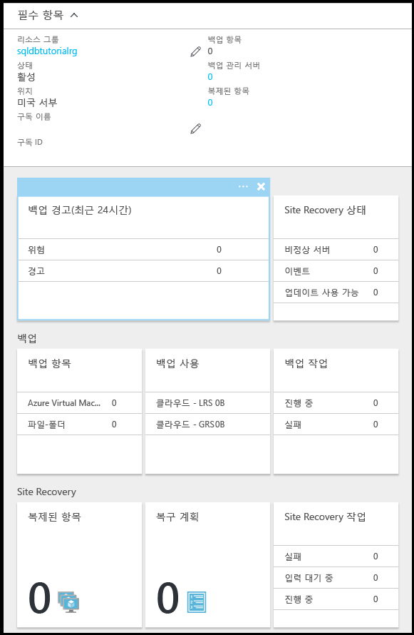

# Azure Portal을 사용하여 Azure Recovery Services에서 데이터베이스 백업을 장기 보존에서 구성, 관리 및 복원

이 항목에서는 Azure Portal을 사용하여 Azure Recovery Services 자격 증명 모음에 자동화된 백업의 장기 보존을 구성, 관리 및 복원하는 방법에 대해 알아봅니다. [PowerShell](sql-database-manage-long-term-backup-retention-powershell.md)을 사용하여 이 작업을 수행할 수도 있습니다.

장기 백업 보존에 대한 자세한 내용은 [장기 백업 보존](sql-database-long-term-retention.md)을 참조하세요.

> [!TIP]
> 자습서는 [Azure Portal을 사용하여 데이터 보호 및 복구를 위한 백업 및 복원 시작](sql-database-get-started-backup-recovery-portal.md)을 참조하세요.
>

## Azure Portal를 사용한 장기 보존 구성

1. 서버에 대한 **SQL Server** 블레이드를 엽니다.

    

2. **장기 백업 보존**을 클릭합니다.

   

3. **장기 백업 보존** 블레이드에서 미리 보기 약관을 검토하고 동의합니다(이미 실행하지 않은 한 - 또는 이 기능은 미리 보기에 없음).

   

4. 데이터베이스에 대한 장기 백업 보존을 구성하려면 표에서 해당 데이터베이스를 선택하고 도구 모음에서 **구성**을 클릭합니다.

   

5. **구성** 블레이드에서 **복구 서비스 자격 증명 모음** 아래의 **필요한 설정 구성**을 클릭합니다.

   

6. **Recovery Services 자격 증명 모음** 블레이드에서 있는 경우 기존 자격 증명 모음을 선택합니다. 그렇지 않으면 구독에 대한 복구 서비스 자격 증명 모음을 찾을 수 없는 경우 클릭하여 흐름을 종료하고 복구 서비스 자격 증명 모음을 만듭니다.

   

7. **Recovery Services 자격 증명 모음** 블레이드에서 **추가**를 클릭합니다.

   
   
8. **Recovery Services 자격 증명 모음** 블레이드에서 새 Recovery Services 자격 증명 모음에 대한 유효한 이름을 제공합니다.

   

9. 구독 및 리소스 그룹을 선택한 다음 자격 증명 모음에 대한 위치를 선택합니다. 완료하면 **만들기**를 클릭합니다.

   

   > [!IMPORTANT]
   > 자격 증명 모음은 Azure SQL 논리 서버와 동일한 지역에 있어야 하고 논리 서버와 동일한 리소스 그룹을 사용해야 합니다.
   >

10. 새 자격 증명 모음을 만든 후 필요한 단계를 실행하여 **Recovery Services 자격 증명 모음** 블레이드로 돌아갑니다.

11. **Recovery Services 자격 증명 모음** 블레이드에서 자격 증명 모음을 클릭한 다음 **선택**을 클릭합니다.

   

12. **구성** 블레이드에서 새 보존 정책에 대한 유효한 이름을 제공하고 기본 보존 정책을 적절하게 수정한 다음 **확인**을 클릭합니다.

   

13. **장기 백업 보존** 블레이드에서 **저장**을 클릭한 다음 **확인**을 클릭하여 선택된 모든 데이터베이스에 장기 백업 보존 정책을 적용합니다.

   

14. **저장**을 클릭하여 구성한 Azure Recovery Services 자격 증명 모음에 이 새 정책을 사용하는 장기 백업 보존을 활성화합니다.

   

14. 장기 백업 보존을 활성화한 후에 **복구 서비스 자격 증명 모음** 블레이드를 엽니다(**모든 리소스**로 이동하고 구독에 대한 리소스 목록에서 선택).

   

## Azure 포털을 사용하여 장기 백업 보존에서 복원

1. **Azure 자격 증명 모음 백업** 블레이드에서 백업을 클릭하여 복원한 다음 **선택**을 클릭합니다.

    

2. **데이터베이스 이름** 텍스트 상자에서 복원된 데이터베이스에 대한 이름을 제공합니다.

    

3. **확인**을 클릭하여 자격 증명 모음의 백업에서 새 데이터베이스로 데이터베이스를 복원합니다.

4. 도구 모음에서 알림 아이콘을 클릭하여 복원 작업의 상태를 봅니다.

    

5. 복원 작업이 완료되면 **SQL 데이터베이스** 블레이드를 열어 새로 복원된 데이터베이스를 봅니다.

    

## Azure 포털을 사용하여 장기 백업 보존 정보 보기 

1. Azure 서비스 자격 증명 모음에 대한 블레이드를 열어(**모든 리소스**로 이동하고 구독에 대한 리소스 목록에서 선택) 자격 증명 모음의 데이터베이스 백업에서 사용되는 저장소의 양을 봅니다.

   

2. 데이터베이스에 대한 **SQL Database** 블레이드를 엽니다.

    

3. 도구 모음에서 **복원**을 클릭합니다.

    

4. 복원 블레이드에서 **장기**를 클릭합니다.

5. Azure 자격 증명 모음 백업에서 **백업 선택**을 클릭하여 장기 백업 보존에서 사용 가능한 데이터베이스 백업을 봅니다.

    

> [!TIP]
> 자습서는 [데이터 보호 및 복구를 위한 백업 및 복원 시작](sql-database-get-started-backup-recovery-portal.md)을 참조하세요.

## 다음 단계

- PowerShell을 사용하여 장기 백업 보존을 관리하려면 [PowerShell을 사용하여 장기 백업 보존 관리](sql-database-manage-long-term-backup-retention-powershell.md)를 참조하세요.
- 서비스에서 생성된 자동 백업에 대해 알아보려면 [자동 백업](sql-database-automated-backups.md) 참조
- 장기 백업 보존에 대해 알아보려면 [장기 백업 보존](sql-database-long-term-retention.md) 참조
- 백업에서 복원에 대해 알아보려면 [백업에서 복원](sql-database-recovery-using-backups.md) 참조
