# Azure Portal을 사용하여 Azure SQL Database 관리
> [!div class="op_single_selector"]
> * [Azure 포털](sql-database-manage-portal.md)
> * [SSMS](sql-database-manage-azure-ssms.md)
> * [PowerShell](sql-database-manage-powershell.md)
> 
> 

[Azure Portal](https://portal.azure.com/) 을 사용하여 Azure SQL Database 및 서버를 만들고, 모니터링하고, 관리할 수 있습니다. 이 문서에서는 더 많은 일반 작업의 간략한 설명과 더 자세한 설명에 대한 링크를 제공합니다.

> [!TIP]
> 서버 만들기, 서버 기반 방화벽 만들기, 서버 속성 보기, SQL Server Management Studio로 연결, master 데이터베이스 쿼리, 샘플 데이터베이스 및 빈 데이터베이스 만들기, 데이터베이스 속성 쿼리, SQL Server Management Studio로 샘플 데이터베이스 연결 및 쿼리를 수행하는 방법을 보여 주는 자습서에 대해서는 [시작 자습서](sql-database-get-started.md)를 참조하세요.

## Azure SQL Database, 서버 및 풀 보기
사용 가능한 SQL Database 서비스를 보려면 **서비스 더 보기**를 클릭하고 검색 상자에 **SQL**을 입력합니다.

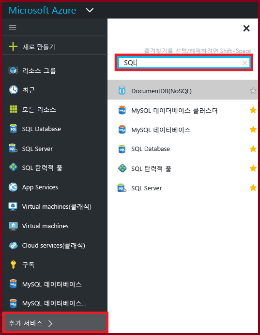

## Azure SQL Database를 만들거나 보는 방법
**SQL 데이터베이스** 블레이드를 열려면 **SQL 데이터베이스**를 클릭한 다음 작업하려는 데이터베이스를 클릭하거나 **+추가**를 클릭하여 SQL 데이터베이스를 만듭니다. 자세한 내용은 [Azure Portal을 사용하여 빠르게 SQL Database 만들기](sql-database-get-started.md)를 참조하세요.

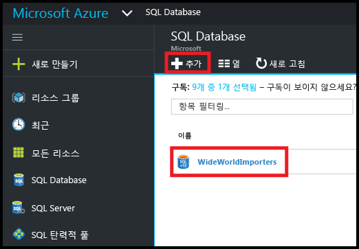

## Azure SQL Server를 만들거나 보는 방법
**SQL 서버** 블레이드를 열려면 **SQL 서버**를 클릭한 다음 작업하려는 서버를 클릭하거나 **+추가**를 클릭하여 SQL Server를 만듭니다. 자세한 내용은 [Azure Portal을 사용하여 빠르게 SQL Database 만들기](sql-database-get-started.md)를 참조하세요.

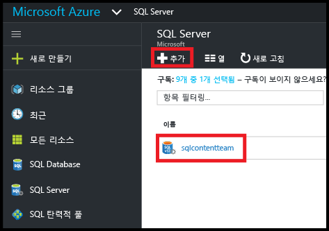

## SQL 탄력적 풀을 만들거나 보는 방법
**SQL 탄력적 풀** 블레이드를 열려면 **SQL 탄력적 풀**을 클릭한 다음 작업하려는 풀을 클릭하거나 **+추가**를 클릭하여 풀을 만듭니다. 자세한 내용은 [Azure Portal로 탄력적 풀 만들기](sql-database-elastic-pool-create-portal.md)를 참조하세요.

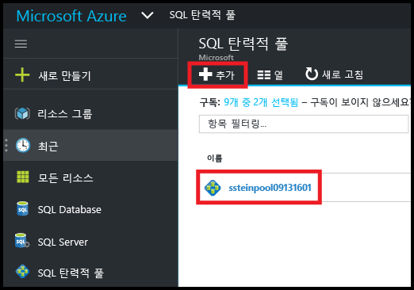

## SQL 데이터베이스 설정을 업데이트하거나 보는 방법
데이터베이스 설정을 보거나 업데이트하려면 SQL 데이터베이스 블레이드에서 원하는 설정을 클릭합니다.

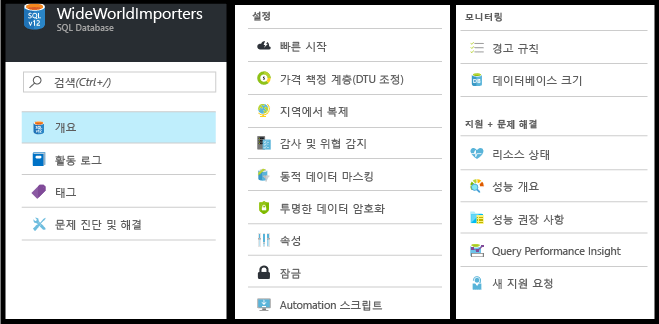

## SQL 데이터베이스 정규화된 서버 이름을 찾는 방법
데이터베이스 서버 이름을 보려면 **SQL 데이터베이스** 블레이드에서 **개요**를 클릭하고 서버 이름을 기록해 둡니다.

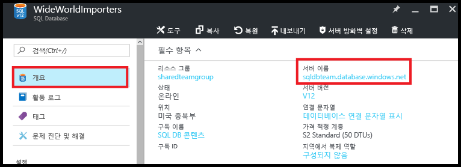

## 내 SQL Server 및 데이터베이스에 대한 액세스를 제어하는 방화벽 규칙을 관리하는 방법
방화벽 규칙을 보거나, 만들거나, 업데이트하려면 **SQL 데이터베이스** 블레이드에서 **Set server firewall**(서버 방화벽 설정)을 클릭합니다. 자세한 내용은 [Azure Portal을 사용하여 Azure SQL Database 서버 수준 방화벽 규칙 구성](sql-database-configure-firewall-settings.md)을 참조하세요.

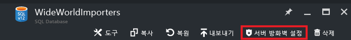

## SQL 데이터베이스 서비스 계층 또는 성능 수준을 변경하는 방법
SQL 데이터베이스의 서비스 계층 또는 성능 수준을 업데이트하려면 **SQL 데이터베이스** 블레이드에서 **가격 책정 계층(DTU 크기 조정)**을 클릭합니다. 자세한 내용은 [SQL Database의 서비스 계층 및 성능 수준(가격 책정 계층) 변경](sql-database-scale-up.md)을 참조하세요.

## SQL 데이터베이스에 대한 감사 및 위협 감지를 구성하는 방법
SQL 데이터베이스에 대한 감사 및 위협 감지를 구성하려면 **SQL 데이터베이스** 블레이드에서 **감사 및 위협 감지**를 클릭합니다. 자세한 내용은 [SQL 데이터베이스 감사 시작](sql-database-auditing-get-started.md) 및 [SQL Database 위협 감지 시작](sql-database-threat-detection-get-started.md)을 참조하세요.

## SQL 데이터베이스에 대한 동적 데이터 마스킹을 구성하는 방법
SQL 데이터베이스에 대한 동적 데이터 마스킹을 구성하려면 **SQL 데이터베이스** 블레이드에서 **동적 데이터 마스킹**을 클릭합니다. 자세한 내용은 [SQL 데이터베이스 동적 데이터 마스킹을 시작하는 방법](sql-database-dynamic-data-masking-get-started.md)을 참조하세요.

## SQL 데이터베이스에 대한 TDE(투명한 데이터 암호화)를 구성하는 방법
SQL 데이터베이스에 대한 투명한 데이터 암호화를 구성하려면 **SQL 데이터베이스** 블레이드에서 **투명한 데이터 암호화**를 클릭합니다. 자세한 내용은 [포털을 사용하여 데이터베이스에 대해 TDE를 사용하도록 설정](https://msdn.microsoft.com/library/dn948096#Anchor_1)을 참조하세요.

## SQL 데이터베이스의 최대 크기를 변경하는 방법
SQL 데이터베이스의 크기를 보거나 변경하려면 **SQL 데이터베이스** 블레이드에서 **데이터베이스 크기**를 클릭합니다. 서비스 계층 또는 성능 수준을 변경하여 데이터베이스의 최대 크기를 업데이트합니다. 자세한 내용은 [SQL Database의 서비스 계층 및 성능 수준(가격 책정 계층) 변경](sql-database-scale-up.md)을 참조하세요.

## SQL 데이터베이스의 성능을 모니터링 및 개선하는 방법
SQL 데이터베이스의 성능 특성을 모니터링 및 개선하려면 **SQL 데이터베이스** 블레이드에서 **성능 개요**를 클릭합니다. 자세한 내용은 [SQL 데이터베이스 성능 Insight](sql-database-performance.md)를 참조하세요.

## 지역에서 복제를 구성하는 방법
SQL 데이터베이스에 대한 지역에서 복제를 설정하려면 **SQL 데이터베이스** 블레이드에서 **지역에서 복제**를 클릭합니다. 자세한 내용은 [Azure Portal로 Azure SQL Database에 대한 지역에서 복제 구성](sql-database-geo-replication-portal.md)을 참조하세요.

## 지리적 복제된 SQL 데이터베이스로 장애 조치하는 방법
지리적 복제된 보조 데이터베이스로 장애 조치하려면 **SQL 데이터베이스** 블레이드에서 **지리적 복제**를 클릭한 다음 **장애 조치(Failover)**를 클릭합니다. 자세한 내용은 [Azure Portal에서 Azure SQL Database에 대해 계획 또는 계획되지 않은 장애 조치(failover) 시작](sql-database-geo-replication-failover-portal.md)을 참조하세요.

## SQL 데이터베이스를 복사하는 방법
SQL 데이터베이스를 복사하려면 **SQL 데이터베이스** 블레이드에서 **복사**를 클릭합니다. 자세한 내용은 [Azure Portal을 사용하여 Azure SQL Database 복사](sql-database-copy-portal.md)를 참조하세요.

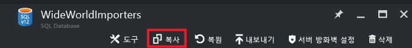

## Azure SQL Database를 BACPAC 파일에 보관하는 방법
SQL 데이터베이스의 BACPAC를 만들려면 **SQL 데이터베이스** 블레이드에서 **내보내기**를 클릭합니다. 자세한 내용은 [Azure Portal을 사용하여 Azure SQL Database를 BACPAC 파일에 보관](sql-database-export.md)을 참조하세요.

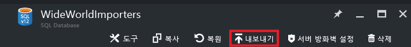

## 이전 시점으로 SQL Database를 복원하는 방법
SQL 데이터베이스를 복원하려면 **SQL 데이터베이스** 블레이드에서 **복원**을 클릭합니다. 자세한 내용은 [Azure Portal을 사용하여 이전 시점으로 Azure SQL Database 복원](sql-database-point-in-time-restore.md)을 참조하세요.

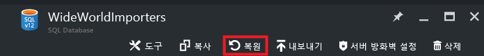

## BACPAC 파일에서 Azure SQL Database를 만드는 방법
BACPAC 파일에서 SQL 데이터베이스를 만들려면 **SQL Server** 블레이드에서 **데이터베이스 가져오기**를 클릭합니다. 자세한 내용은 [BACPAC 파일을 가져와 Azure SQL Database 만들기](sql-database-import.md)를 참조하세요.

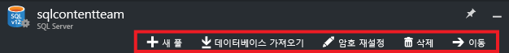

## 삭제된 SQL Database 복원 방법
삭제된 SQL 데이터베이스를 복원하려면 **SQL Server** 블레이드(삭제된 데이터베이스가 포함된 SQL Server)에서 **데이터베이스 삭제**를 클릭합니다. 자세한 내용은 [Azure Portal을 사용하여 삭제된 Azure SQL Database 복원](sql-database-restore-deleted-database-portal.md)을 참조하세요.

## SQL Database 삭제 방법
SQL 데이터베이스를 삭제하려면 **SQL 데이터베이스** 블레이드에서 **삭제**를 클릭합니다. 

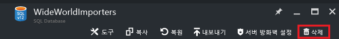

## 추가 리소스
* [SQL 데이터베이스](sql-database-technical-overview.md)
* [Azure Portal을 사용하여 탄력적 풀 모니터링 및 관리](sql-database-elastic-pool-manage-portal.md)

<!--HONumber=Dec16_HO3-->

