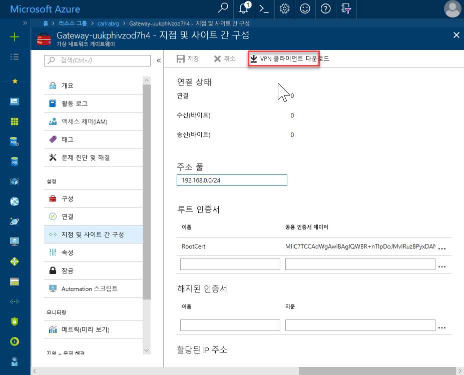
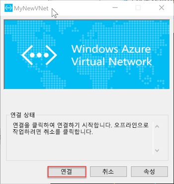

# <a name="quickstart-configure-a-point-to-site-connection-to-an-azure-sql-database-managed-instance-from-on-premises"></a>빠른 시작: 온-프레미스에서 Azure SQL Database Managed Instance로의 지점 및 사이트 간 연결 구성

이 빠른 시작에서는 온-프레미스 클라이언트 컴퓨터에서 [SSMS(SQL Server Management Studio)](https://docs.microsoft.com/sql/ssms/sql-server-management-studio-ssms)를 사용하여 지점 및 사이트 간 연결을 통해 Azure SQL Database Managed Instance에 연결하는 방법을 보여줍니다. 지점 및 사이트 간 연결에 대한 자세한 내용은 [지점 및 사이트 간 VPN 정보](../vpn-gateway/point-to-site-about.md)를 참조하세요.

## <a name="prerequisites"></a>필수 조건

이 빠른 시작의 특징은 다음과 같습니다.

- [Managed Instance 만들기](sql-database-managed-instance-get-started.md)에서 만든 리소스를 시작점으로 사용합니다.
- PowerShell 5.1 및 AZ PowerShell 1.4.0 또는 나중에 온-프레미스 클라이언트 컴퓨터가 필요합니다. 필요한 경우 [Azure PowerShell 모듈 설치](https://docs.microsoft.com/powershell/azure/install-az-ps#install-the-azure-powershell-module) 지침을 참조하세요.
- 온-프레미스 클라이언트 컴퓨터에서 최신 버전의 [SSMS](https://docs.microsoft.com/sql/ssms/sql-server-management-studio-ssms)(SQL Server Management Studio)가 필요합니다.

## <a name="attach-a-vpn-gateway-to-your-managed-instance-virtual-network"></a>VPN 게이트웨이를 Managed Instance 가상 네트워크에 연결

1. 온-프레미스 클라이언트 컴퓨터에서 PowerShell을 엽니다.

2. 이 PowerShell 스크립트를 복사합니다. 이 스크립트는 [Managed Instance 만들기](sql-database-managed-instance-get-started.md) 빠른 시작에서 만든 Managed Instance 가상 네트워크에 VPN 게이트웨이를 연결합니다. 이 스크립트는 다음을 수행합니다.

   - 인증서를 만들어서 클라이언트 머신에 설치
   - 향후 VPN 게이트웨이 서브넷 IP 범위 계산
   - GatewaySubnet 만들기
   - VPN Gateway를 VPN 서브넷에 연결하는 Azure Resource Manager 템플릿 배포

     ```powershell
     $scriptUrlBase = 'https://raw.githubusercontent.com/Microsoft/sql-server-samples/master/samples/manage/azure-sql-db-managed-instance/attach-vpn-gateway'

     $parameters = @{
       subscriptionId = '<subscriptionId>'
       resourceGroupName = '<resourceGroupName>'
       virtualNetworkName = '<virtualNetworkName>'
       certificateNamePrefix  = '<certificateNamePrefix>'
       }

     Invoke-Command -ScriptBlock ([Scriptblock]::Create((iwr ($scriptUrlBase+'/attachVPNGatewayAz.ps1?t='+ [DateTime]::Now.Ticks)).Content)) -ArgumentList $parameters, $scriptUrlBase
     ```

     > [!IMPORTANT]
     > Az 모듈 대신 Azure PowerShell Resource Manager 모듈을 사용 하려면 다음 cmdlet을 사용 합니다. `attachVPNGateway.ps1` 대신 `attachVPNGatewayAz.ps1` cmdlet.

3. 스크립트를 PowerShell 창에 붙여넣고 필요한 매개 변수를 제공합니다. `<subscriptionId>`, `<resourceGroup>` 및 `<virtualNetworkName>` 값이 [Managed Instance 만들기](sql-database-managed-instance-get-started.md) 빠른 시작에서 사용한 값과 일치해야 합니다. `<certificateNamePrefix>` 값으로 원하는 문자열을 사용할 수 있습니다.

4. PowerShell 스크립트를 실행합니다.

> [!IMPORTANT]
> PowerShell 스크립트 완료 될 때까지 계속 하지 마세요.

## <a name="create-a-vpn-connection-to-your-managed-instance"></a>Managed Instance에 대한 VPN 연결 만들기

1. [Azure Portal](https://portal.azure.com/)에 로그인합니다.
2. 가상 네트워크 게이트웨이를 만든 리소스 그룹을 연 다음, 가상 네트워크 게이트웨이 리소스를 엽니다.
3. **지점 및 사이트 간 구성**을 선택하고 **VPN 클라이언트 다운로드**를 선택합니다.

      
4. 온-프레미스 클라이언트 컴퓨터에 zip 파일에서 파일을 추출 하 고 압축 푼된 파일을 사용 하 여 폴더를 엽니다.
5. 엽니다는 '**WindowsAmd64** 폴더를 **VpnClientSetupAmd64.exe** 파일입니다.
6. **Windows의 PC 보호** 메시지가 표시되면 **추가 정보**를 클릭한 다음 **실행**을 클릭합니다.

    \
7. 사용자 계정 컨트롤 대화 상자에서 클릭 **예** 를 계속 합니다.
8. 가상 네트워크를 참조 하는 대화 상자에서 선택 **예** 가상 네트워크에 대 한 VPN 클라이언트를 설치 합니다.

## <a name="connect-to-the-vpn-connection"></a>VPN 연결에 연결

1. 로 이동 **VPN** 에 **네트워크 및 인터넷** 온-프레미스 클라이언트 컴퓨터에서이 VNet에 연결 하려면 관리 되는 인스턴스 가상 네트워크를 선택 합니다. 다음 이미지에서 VNet 이름은 **MyNewVNet**입니다.

      
2. **연결**을 선택합니다.
3. 대화 상자에서 **연결**을 선택합니다.

      
4. 경로 테이블을 업데이트하려면 연결 관리자에 상승된 권한이 필요하다는 메시지가 나타나면 **계속**을 선택합니다.
5. [사용자 계정 컨트롤] 대화 상자에서 **예**를 선택하여 계속 진행합니다.

   Managed Instance VNet에 대한 VPN 연결이 설정되었습니다.

      

## <a name="use-ssms-to-connect-to-the-managed-instance"></a>SSMS를 사용하여 Managed Instance에 연결

1. 온-프레미스 클라이언트 컴퓨터에서 SSMS(SQL Server Management Studio)를 엽니다.
2. **서버에 연결** 대화 상자에서, **서버 이름** 상자에 Managed Instance의 정규화된 **호스트 이름**을 입력합니다.
3. **SQL Server 인증**을 선택하고, 로그인 및 암호를 입력한 다음, **연결**을 선택합니다.

      

연결한 후 데이터베이스 노드에서 시스템 및 사용자 데이터베이스를 볼 수 있습니다. 또한 보안, 서버 개체, 복제, 관리, SQL Server 에이전트 및 XEvent 프로파일러 노드에서 다양한 개체를 볼 수 있습니다.

## <a name="next-steps"></a>다음 단계

- Azure 가상 머신에서 연결하는 방법을 보여 주는 빠른 시작은 [지점 및 사이트 간 연결 구성](sql-database-managed-instance-configure-p2s.md)을 참조하세요.
- 애플리케이션의 연결 옵션 개요는 [애플리케이션을 Managed Instance에 연결](sql-database-managed-instance-connect-app.md)을 참조하세요.
- 온-프레미스의 기존 SQL Server 데이터베이스를 Managed Instance로 복원하려면 [마이그레이션용 Azure DMS(Database Migration Service)](../dms/tutorial-sql-server-to-managed-instance.md) 또는 [T-SQL RESTORE 명령](sql-database-managed-instance-get-started-restore.md)을 사용하여 데이터베이스 백업 파일에서 복원하면 됩니다.
